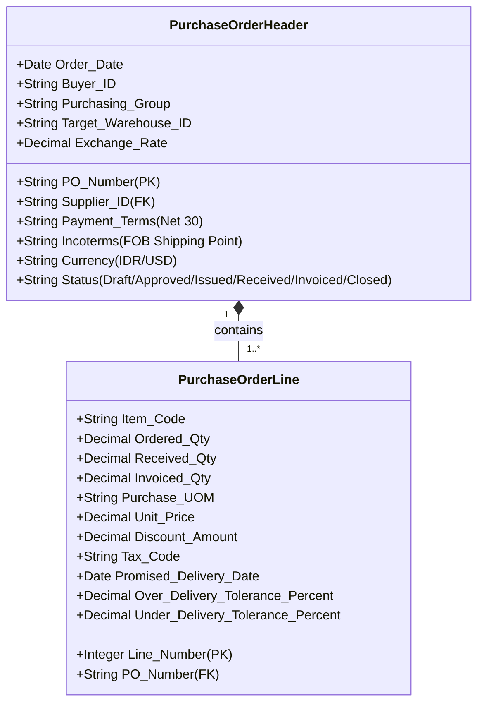
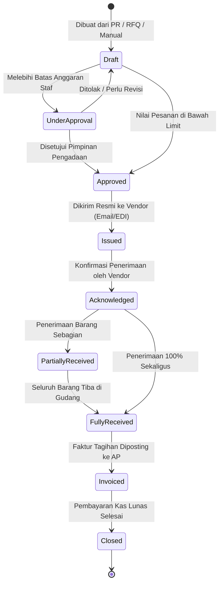

# Purchase Order

## Definition

**Purchase Order (Pesanan Pembelian / PO)** adalah dokumen transaksi komersial dan hukum resmi yang diterbitkan oleh pembeli kepada pemasok untuk memesan barang atau jasa tertentu dengan mencantumkan kuantitas, harga satuan yang disepakati, tanggal pengiriman yang dijanjikan, syarat penyerahan (*Incoterms*), dan ketentuan pembayaran.

Dalam sistem ERP, Purchase Order merupakan **pusat komitmen pengadaan (*procurement commitment hub*)** yang mengikat kedua belah pihak secara hukum: pemasok berkewajiban menyerahkan barang sesuai spesifikasi, dan pembeli berkewajiban membayar tagihan saat barang telah diterima dan diverifikasi.

---

## Business Purpose

Implementasi Purchase Order dalam arsitektur ERP enterprise bertujuan untuk:
1. **Perikatan Hukum yang Mengikat (*Legally Binding Contract*)**: Bertindak sebagai kontrak jual-beli sah yang melindungi entitas dari kenaikan harga sepihak atau perubahan spesifikasi oleh pemasok.
2. **Fondasi Validasi Penerimaan Gudang (*Basis for Receiving*)**: Menjadi rujukan tunggal bagi staf gudang saat menerima kiriman fisik barang untuk mencocokkan kuantitas dan nomor komponen.
3. **Pilar Utama Pencocokan Tagihan (*Anchor of 3-Way Matching*)**: Menyediakan data harga dan syarat pembayaran resmi untuk memvalidasi faktur tagihan yang dikirimkan oleh pemasok (lihat [[04-purchasing/three-way-match|Three-Way Match]]).
4. **Pencatatan Komitmen Anggaran (*Encumbrance / Spend Commitment*)**: Memberikan visibilitas kepada departemen keuangan mengenai kewajiban kas yang akan jatuh tempo di masa depan (*future cash outflow commitments*).

---

## Anatomi Data: Header dan Line Items

Struktur data Purchase Order di dalam basis data relasional ERP dibagi menjadi dua tingkatan:

### Elemen Kunci Header:
* **PO Number & Order Date**: Nomor seri identifikasi unik dan tanggal pengesahan kontrak pemesanan.
* **Supplier Reference**: Identitas hukum pemasok terpilih dari master data vendor.
* **Target Warehouse & Delivery Address**: Alamat gudang spesifik tempat barang fisik harus dibongkar.
* **Payment Terms & Incoterms**: Kesepakatan jatuh tempo penagihan (misal: *Net 30 hari*) dan batas tanggung jawab asuransi logistik.

### Elemen Kunci Line Items:
* **Item Code & Specifications**: Komoditas yang dipesan beserta rujukan nomor katalog pemasok (*Supplier SKU*).
* **Tracking Kuantitas Tiga Lapis**:
  $$\text{Ordered Quantity} \to \text{Received Quantity} \to \text{Invoiced Quantity}$$
* **Unit Price & Discounts**: Harga perolehan bersih yang disepakati dan terkunci permanen (*price freeze*).
* **Delivery Tolerances (Toleransi Pengiriman)**: Persentase kelebihan atau kekurangan kuantitas kirim yang masih dapat ditoleransi sistem (misal: toleransi $\pm 5\%$ untuk barang curah/cair).

---

## The Purchase Order Lifecycle & State Transitions

Dokumen Purchase Order dikendalikan oleh mesin status terintegrasi:

### Penjelasan Status Dokumen:
1. **Draft**: Dokumen sedang disusun; harga dan kuantitas masih dapat diubah.
2. **Approved**: Dokumen telah lolos matriks otorisasi anggaran manajemen.
3. **Issued / Sent**: Dokumen telah dikirimkan secara elektronik (via EDI, portal vendor, atau email PDF) kepada pemasok. Dokumen menjadi *read-only*.
4. **Acknowledged / Confirmed**: Pemasok mengonfirmasi kesanggupan memenuhi pesanan sesuai jadwal tanggal tiba (*Promised Date*).
5. **Partially Received**: Sebagian barang telah tiba dan diproses surat jalannya di gudang.
6. **Fully Received**: Seluruh kuantitas barang fisik telah lengkap diterima di gudang.
7. **Invoiced**: Bagian akuntansi telah mencocokkan tagihan pemasok (*3-Way Match*) dan memposting utang usaha resmi.
8. **Closed**: Seluruh proses fisik dan pembayaran finansial telah rampung sempurna.

---

## Dampak Finansial & Persediaan (Accounting & Inventory Impact)

> [!important] Prinsip Komitmen Operasional
> **Pada transaksi pengadaan standar, pengesahan Purchase Order TIDAK MENGHASILKAN JURNAL AKUNTANSI APAPUN ke General Ledger.**
> Penjual belum menyerahkan barang, hak milik belum berpindah, dan kewajiban pembayaran belum timbul secara hukum (*no liability, no expense, no inventory entry*).

* **Dampak Akuntansi**: **Nihil di Buku Besar Finansial**. Di modul anggaran (*Commitment Accounting*), sistem mencatat *Committed Spend* untuk memotong sisa anggaran operasional agar tidak terpakai oleh pengadaan lain.
* **Dampak Persediaan**: **Stok fisik tidak bertambah**. Kuantitas yang dipesan dicatat sebagai **Kuantitas Dalam Pesanan (*On-Order Quantity / Inbound Pipeline*)** yang diperhitungkan dalam kalkulasi ketersediaan masa depan (*Available-to-Promise*).

#### Pengecualian: Uang Muka Pembelian (*Vendor Down Payment*)
Jika pemasok mensyaratkan uang muka sebelum memproduksi barang, sistem menerbitkan permohonan uang muka yang menghasilkan jurnal aset saat ditransfer (lihat [[04-purchasing/prepayment-and-down-payment|Prepayment and Down Payment]]).

---

## Skenario Acuan Transaksi (Baseline Example)

Melanjutkan kesepakatan dari penawaran `RFQ-2026-09-0032`:
* **Nomor Pesanan**: `PO-2026-09-0081`
* **Pemasok**: PT Sumber Teknologi
* **Tanggal Pesanan**: 15 September 2026
* **Tanggal Janji Kirim**: 20 September 2026 (Waktu tunggu 5 hari)
* **Gudang Tujuan**: Gudang Utama Komponen (*Main Warehouse - WH-01*)
* **Rincian Komoditas**: 10 Unit Komponen *Laptop Pro*
* **Harga Satuan**: Rp700.000 / unit
* **Subtotal Barang (DPP)**: **Rp7.000.000**
* **PPN Masukan (11%)**: **Rp770.000**
* **Total Komitmen PO**: **Rp7.770.000**
* **Syarat Pembayaran**: Net 30 hari kalender sejak faktur diverifikasi.

Saat Purchase Order ini berstatus *Approved & Issued*:
* Jurnal Akuntansi = Rp0.
* Stok fisik gudang = 0 unit bertambah.
* Stok *On-Order* gudang = bertambah 10 unit.
* Dokumen siap menjadi rujukan saat truk ekspedisi tiba di pintu gudang pada tanggal 20 September.

---

## Variasi Model Pesanan Pembelian

1. **Standard Purchase Order**: Pesanan pembelian umum satu kali jalan (*one-off purchase*) dengan harga dan tanggal kirim spesifik.
2. **Blanket Purchase Order / Contract Call-off**: Pesanan pelepasan berkala dari kontrak induk jangka panjang (lihat [[04-purchasing/procurement-contract-and-agreement|Procurement Contract and Agreement]]).
3. **Drop-Ship Purchase Order**: Pesanan pengadaan yang menginstruksikan pemasok untuk mengirimkan barang langsung ke lokasi pelanggan akhir perusahaan tanpa mampir ke gudang internal penjual.
4. **Subcontracting Purchase Order**: Pesanan jasa pabrikasi di mana perusahaan mengirimkan bahan mentah sendiri ke vendor maklon, dan vendor hanya menagih ongkos jasa pengerjaan.

---

## Related Concepts

* [[04-purchasing/purchase-requisition|Purchase Requisition]] — Dokumen permohonan internal asal PO.
* [[04-purchasing/request-for-quotation|Request for Quotation]] — Proses lelang pemilihan vendor sebelum PO terbit.
* [[04-purchasing/goods-receipt-and-service-receipt|Goods Receipt and Service Receipt]] — Pelaksanaan penyerahan fisik barang rujukan PO.
* [[04-purchasing/three-way-match|Three-Way Match]] — Pencocokan data PO dengan dokumen penerimaan dan faktur.

---

## References

1. **Chartered Institute of Procurement & Supply (CIPS)**: *Contract Formation and Purchase Order Terms and Conditions*. URL: https://www.cips.org/
2. **Association for Supply Chain Management (ASCM)**: *APICS Dictionary - Purchase Order Management and Delivery Scheduling*.
3. **Microsoft Learn**: *Purchase order overview and line processing in Dynamics 365 Supply Chain Management*. URL: https://learn.microsoft.com/en-us/dynamics365/supply-chain/procurement/purchase-order-overview
4. **Frappe / ERPNext Documentation**: *Purchase Order Workflow, Item Tolerances, and Drop Shipments*. URL: https://docs.frappe.io/erpnext/user/manual/en/buying/purchase-order
