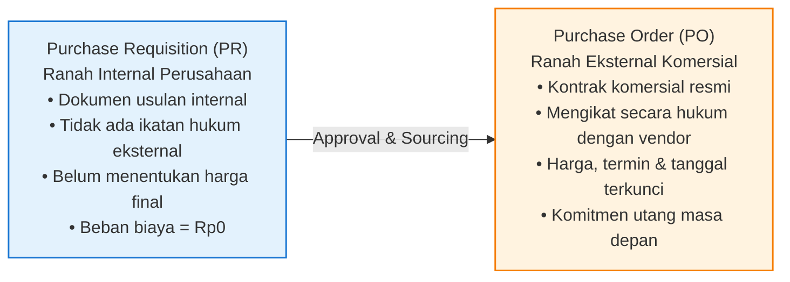
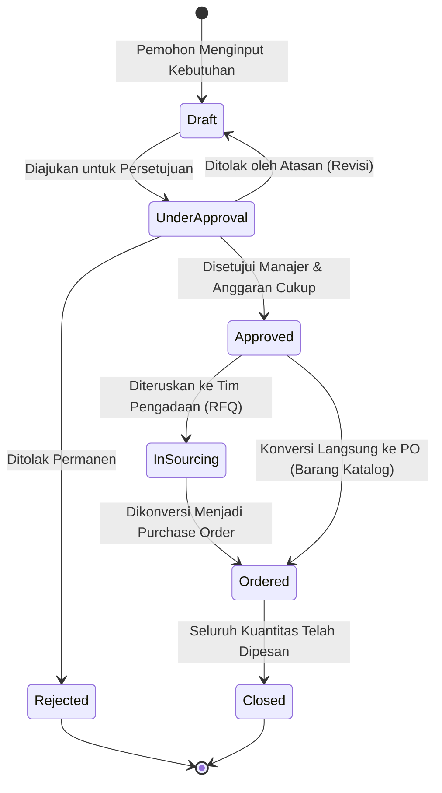

# Purchase Requisition

## Definition

**Purchase Requisition (Permintaan Pembelian / PR)** adalah dokumen internal resmi yang dibuat oleh seorang karyawan atau unit kerja untuk mengajukan permohonan pengadaan barang atau jasa tertentu kepada departemen pengadaan (*Procurement / Purchasing*).

Dalam sistem ERP, Purchase Requisition merupakan **titik awal penangkapan kebutuhan (*demand capture point*)** yang memastikan bahwa tidak ada pengeluaran perusahaan yang terjadi tanpa adanya usulan kebutuhan yang terdokumentasi, disetujui oleh atasan yang berwenang, dan divalidasi terhadap ketersediaan anggaran.

---

## Business Purpose

Penerapan dokumen Purchase Requisition dalam ERP bertujuan untuk:
1. **Pengendalian Pembelian Liar (*Maverick Buying Prevention*)**: Mencegah unit kerja memesan langsung barang ke pihak luar tanpa melalui proses seleksi harga dan negosiasi resmi oleh tim pengadaan.
2. **Pemeriksaan Pagu Anggaran (*Pre-Commitment Budget Checking*)**: Memvalidasi apakah departemen pemohon masih memiliki sisa anggaran pengeluaran (*budget availability*) sebelum pesanan diteruskan ke pemasok.
3. **Konsolidasi Permintaan (*Demand Bundling / Aggregation*)**: Memungkinkan tim pengadaan menggabungkan permohonan barang serupa dari berbagai cabang atau departemen ke dalam satu pesanan besar guna memperoleh potongan harga volume (*economies of scale*).
4. **Pemberlakuan Matriks Wewenang Otorisasi (*Approval Hierarchy*)**: Menegakkan hierarki persetujuan manajemen berdasarkan estimasi nilai nominal pengadaan.

---

## Prinsip Kritis: Purchase Requisition $\neq$ Purchase Order

Salah satu kekeliruan pemula dalam sistem ERP adalah menyamakan Purchase Requisition dengan Purchase Order. Keduanya berada pada ranah hukum dan fungsi yang berbeda secara fundamental:

| Parameter Perbandingan | Purchase Requisition (PR) | Purchase Order (PO) |
|---|---|---|
| **Sifat Dokumen** | Dokumen permohonan internal antar-departemen. | Dokumen kontrak komersial resmi ke pihak ketiga. |
| **Pihak yang Terlibat** | Pemohon internal (*Requester*) $\to$ Tim Pengadaan. | Tim Pengadaan $\to$ Pemasok Luar (*Vendor*). |
| **Kekuatan Hukum** | Non-mengikat secara hukum eksternal. | **Mengikat secara hukum (*Legally Binding*)**. |
| **Harga Barang** | Estimasi harga katalog atau anggaran. | Harga final hasil negosiasi/kesepakatan kontrak. |
| **Dampak Finansial** | Tidak ada komitmen utang yang timbul. | Mencatat komitmen pengadaan (*encumbrance/commitment*). |

---

## The Purchase Requisition Lifecycle

Dokumen Purchase Requisition di dalam ERP dikendalikan oleh mesin status (*state machine*):

### Penjelasan Status Dokumen:

1. **Draft**: Dokumen sedang disusun oleh pemohon; data dapat diubah atau dihapus secara bebas.
2. **Under Approval**: Dokumen masuk ke dalam antrean persetujuan atasan atau pimpinan unit kerja.
3. **Approved**: Dokumen telah disetujui penuh dan divalidasi anggarannya. PR masuk ke antrean kerja (*Purchasing Worklist*) tim pengadaan.
4. **In Sourcing**: Tim pengadaan sedang mencarikan pemasok dan meminta penawaran harga melalui dokumen [[04-purchasing/request-for-quotation|Request for Quotation (RFQ)]].
5. **Partially Ordered**: Sebagian kuantitas pada baris PR telah diterbitkan *Purchase Order*-nya, sementara sisanya masih dalam proses.
6. **Ordered / Closed**: Seluruh kuantitas barang yang diminta telah berhasil diterbitkan dokumen *Purchase Order* resminya. Dokumen PR ditutup secara otomatis.

---

## Data Structure: Header and Line Items

Dokumen Purchase Requisition diorganisasikan dalam struktur dua tingkat:

### 1. Requisition Header
* **PR Number & Date**: Nomor seri identifikasi dokumen dan tanggal pengajuan.
* **Requester & Department**: Identitas karyawan pemohon dan departemen kerja asal (misal: "Budi Santoso - Departemen Perakitan").
* **Cost Center / Project ID**: Pusat biaya atau kode proyek yang akan menanggung beban biaya pembelian tersebut (lihat [[00-fundamentals/organizational-structure|Organizational Structure]]).
* **Business Justification**: Penjelasan alasan urgensi kebutuhan operasional (misal: "Pengadaan komponen laptop untuk memenuhi pesanan pelanggan batch September").

### 2. Requisition Lines
* **Item Code & Description**: Komoditas yang diminta (merujuk ke master item atau deskripsi bebas untuk pengadaan jasa kustom).
* **Requested Quantity & UOM**: Kuantitas yang dibutuhkan dan satuan ukuran pemohon.
* **Estimated Unit Price**: Estimasi harga satuan untuk keperluan validasi pagu anggaran.
* **Required Date**: Tanggal kapan barang atau jasa tersebut mutlak harus sudah tiba di lokasi kerja.
* **Target Warehouse / Delivery Location**: Lokasi gudang atau ruangan kantor penerima barang.

---

## Mekanisme Persetujuan & Pengecekan Anggaran (Approval & Budget Check)

Sistem ERP menerapkan dua lapis pengamanan otomatis saat dokumen diajukan:

1. **Matriks Otorisasi Berjenjang (*Approval Hierarchy*)**:
   Tingkat persetujuan ditentukan oleh estimasi total nominal nilai PR:
   * Nilai $\le$ Rp10.000.000: Persetujuan cukup oleh Supervisor Unit.
   * Nilai Rp10.000.001 – Rp100.000.000: Mewajibkan persetujuan Manajer Departemen.
   * Nilai $>$ Rp100.000.000: Mewajibkan persetujuan Direktur Operasional / Keuangan.
2. **Pemeriksaan Pagu Anggaran Real-Time (*Budget Availability Check*)**:
   Sistem mengevaluasi akun biaya dan pusat biaya (*Cost Center*) yang dituju:
   $$\mathbf{Sisa\ Anggaran = Pagu\ Anggaran\ Tahunan - (Biaya\ Aktual\ Terpakai + Komitmen\ Terbuka)}$$
   Jika estimasi nilai PR melebihi sisa anggaran yang tersedia, sistem memblokir pengajuan (*Budget Exceeded Warning/Block*) hingga dilakukan revisi alokasi anggaran (*budget reallocation*).

---

## Dampak Akuntansi dan Persediaan (Accounting & Inventory Impact)

> [!important] Nol Dampak Finansial & Gudang
> **Purchase Requisition TIDAK MEMILIKI dampak akuntansi dan TIDAK MEMILIKI dampak mutasi persediaan fisik.**
> * **Accounting Impact**: **Nihil**. Tidak ada jurnal debit atau kredit yang diposting ke General Ledger maupun Subledger Utang. Pada beberapa modul anggaran sektor publik, PR dapat mencatat komitmen pra-anggaran (*pre-encumbrance*), namun tidak memengaruhi neraca akuntansi komersial.
> * **Inventory Impact**: **Nihil**. Stok fisik gudang tidak bertambah atau berkurang. PR hanya dicatat sebagai indikator permintaan (*planned demand*) dalam sistem perencanaan persediaan.

---

## Skenario Acuan Transaksi (Baseline Example)

Melanjutkan skenario acuan pengadaan bahan untuk pesanan laptop PT Maju Bersama:
* **Nomor Permintaan**: `PR-2026-09-0041`
* **Pemohon**: Departemen Perakitan (*Assembly Division*)
* **Tanggal Kebutuhan**: 15 September 2026
* **Komoditas**: 10 Unit Komponen *Laptop Pro*
* **Estimasi Harga Satuan**: Rp700.000 / unit
* **Estimasi Total Nilai Pengadaan**: **Rp7.000.000**
* **Pusat Biaya (*Cost Center*)**: `CC-PROD-01 (Produksi Elektronik)`

Setelah PR ini disetujui oleh Manajer Produksi, dokumen diteruskan ke meja staf pengadaan (*Buyer*) untuk dicarikan penawaran harga terbaik dari pemasok melalui alur [[04-purchasing/request-for-quotation|Request for Quotation (RFQ)]].

---

## Related Concepts

* [[01-business-processes/procure-to-pay|Procure to Pay Process]] — Posisi PR dalam siklus pengadaan hulu.
* [[04-purchasing/purchasing-fundamentals|Purchasing Fundamentals in ERP]] — Perbedaan mendasar PR dan PO.
* [[04-purchasing/request-for-quotation|Request for Quotation]] — Tahap lanjutan pencarian penawaran harga pemasok.
* [[04-purchasing/purchase-order|Purchase Order]] — Dokumen konversi hasil persetujuan pengadaan.

---

## References

1. **Chartered Institute of Procurement & Supply (CIPS)**: *Developing Purchase Requisitions and Specifications*. URL: https://www.cips.org/
2. **Microsoft Learn**: *Purchase requisitions overview and workflow in Dynamics 365 Supply Chain Management*. URL: https://learn.microsoft.com/en-us/dynamics365/supply-chain/procurement/purchase-requisitions-overview
3. **Frappe / ERPNext Documentation**: *Material Request (Purchase Requisition) and Auto-Creation via Reorder Levels*. URL: https://docs.frappe.io/erpnext/user/manual/en/stock/material-request
4. **SAP Help Portal**: *Purchase Requisition Processing and Budget Availability Control*.
