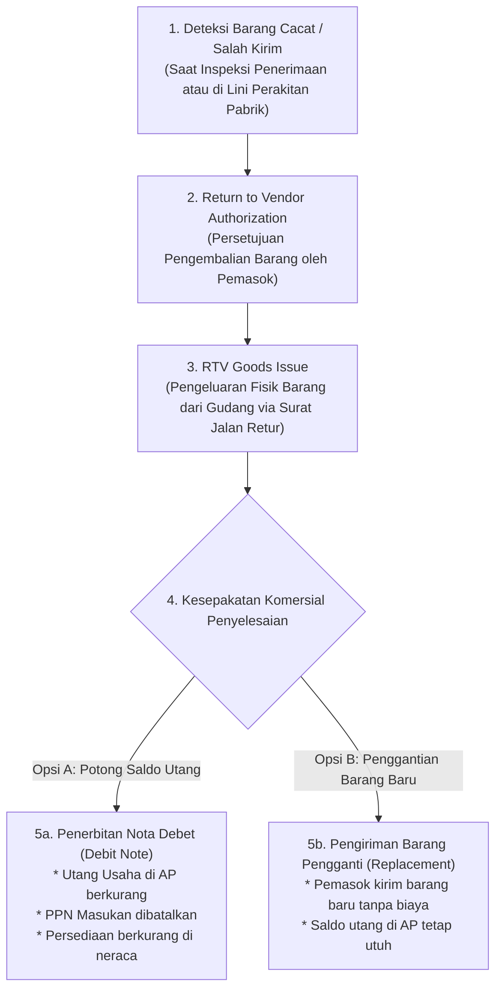

# Purchase Return and Debit Note

## Definition

Dalam sistem ERP, penanganan ketidaksesuaian barang setelah pengadaan dikelola melalui dua instrumen operasional dan finansial:

1. **Purchase Return / Return to Vendor (Retur Pembelian / RTV)**: Proses logistik pergudangan untuk mengembalikan barang fisik yang cacat, rusak, salah spesifikasi, atau kedaluwarsa keluar dari gudang perusahaan kembali ke fasilitas pemasok.
2. **Debit Note / Debit Memo (Nota Debet)**: Dokumen penyesuaian finansial resmi yang diterbitkan oleh pembeli kepada pemasok untuk **mengurangi saldo utang usaha (*Accounts Payable*)** atau menuntut pengembalian dana (*refund*) akibat pengembalian barang atau koreksi kelebihan tagihan.

Prinsip fundamental arsitektur ERP menetapkan:
> **Retur Fisik Pembelian (*Physical RTV*) $\neq$ Nota Debet Finansial (*Financial Debit Note*).**
> Tidak semua retur fisik otomatis menghasilkan nota debet (pemasok dapat langsung mengirimkan barang pengganti tanpa penyesuaian saldo utang), dan tidak semua nota debet melibatkan pengembalian fisik barang (misal: nota debet atas koreksi kelebihan harga faktur atau kompensasi diskon susulan).

---

## Business Purpose

Implementasi alur retur pembelian dan nota debet bertujuan untuk:
1. **Tata Kelola Pengeluaran Barang Cacat (*RTV Governance*)**: Mencegah barang cacat keluar dari gudang tanpa dokumen jalan resmi yang ditandatangani oleh kurir ekspedisi pemasok.
2. **Pemotongan Otomatis Saldo Kewajiban Utang**: Memastikan nilai utang yang tercatat di subledger pemasok segera berkurang secara akurat agar perusahaan tidak membayar tagihan atas barang yang telah dikembalikan.
3. **Penyesuaian Akurat Nilai Aset Persediaan**: Mengeluarkan nilai perolehan barang retur dari kartu stok dan akun persediaan neraca secara *real-time*.
4. **Kepatuhan Faktur Pajak Pembatal (*Tax Note Compliance*)**: Menerbitkan lembar Nota Retur PPN resmi untuk membatalkan klaim pajak masukan yang telah dilaporkan ke otoritas perpajakan.

---

## The Purchase Return Lifecycle & Decision Tree

---

## Retur Pembelian vs Retur Penjualan (P2P vs O2C Mirror)

Konsep penyesuaian purnajual pada modul Purchasing merupakan sisi cermin (*mirror concept*) dari modul Penjualan (lihat [[03-sales/sales-return-and-credit-note|Sales Return and Credit Note]]):

| Parameter | Modul Penjualan (O2C - Sales Return) | Modul Pengadaan (P2P - Purchase Return) |
|---|---|---|
| **Arah Fisik Barang** | Barang masuk kembali ke gudang perusahaan. | Barang keluar dari gudang kembali ke vendor. |
| **Dokumen Penyesuaian** | Penjual menerbitkan **Credit Note (Nota Kredit)**. | Pembeli menerbitkan **Debit Note (Nota Debet)**. |
| **Dampak Finansial** | Mengurangi **Piutang Usaha (*AR*)** di buku besar. | Mengurangi **Utang Usaha (*AP*)** di buku besar. |
| **Dampak Pendapatan/Biaya** | Mengurangi Pendapatan Penjualan (*Contra Revenue*). | Mengurangi Nilai Tercatat Persediaan (*Inventory Asset*). |
| **Perlakuan Pajak** | Membatalkan Utang PPN Keluaran (*VAT Output*). | Membatalkan Piutang PPN Masukan (*VAT Input*). |

---

## Dampak Akuntansi & Jurnal (Accounting Impact)

Perlakuan akuntansi atas retur pembelian bergantung pada **kapan retur terjadi**:

### Kasus 1: Retur Dilakukan SEBELUM Faktur Tagihan Diposting (Pre-Invoicing Return)
Jika barang ditolak langsung saat pembongkaran di gudang atau sebelum tagihan disahkan:
* Dokumen penerimaan (*Goods Receipt*) dikoreksi sebesar kuantitas yang ditolak.
* Sistem membalik jurnal akrual penerimaan barang (*GR/IR Reversal*):
  * **Debit**: Utang Belum Difakturkan (*GR/IR Clearing*) = Rp700.000
  * **Kredit**: Persediaan Barang Dagang = Rp700.000
* *Tidak ada nota debet yang diterbitkan karena utang usaha resmi belum pernah diakui.*

---

### Kasus 2: Retur Dilakukan SETELAH Faktur Tagihan Diposting ke AP (Post-Invoicing Return)
Melanjutkan skenario acuan pembelian 10 unit *Laptop Pro* dari PT Sumber Teknologi (HPP Rp700.000/unit, PPN Masukan 11%):
* **Kasus**: Setelah faktur utang sebesar Rp7.770.000 disahkan di sistem, tim teknisi menemukan **1 unit laptop** mengalami kerusakan komponen internal yang tidak dapat diperbaiki. Pemasok menyetujui pengembalian 1 unit dan menyetujui penerbitan Nota Debet pemotong tagihan.

#### Jurnal Penerbitan Nota Debet (Debit Note Posting):

| Akun | Kategori | Debit (Rp) | Kredit (Rp) |
|---|---|---:|---:|
| Utang Usaha (*Accounts Payable*) | **Liability (AP Subledger)** | **777.000** | - |
| Persediaan Barang Dagang | Asset (Neraca) | - | 700.000 |
| PPN Masukan (*VAT Input Reversal*) | Asset (Neraca) | - | 77.000 |

* **Dampak Buku Besar & Subledger**:
  * Saldo utang kepada PT Sumber Teknologi di **AP Subledger** berkurang seketika sebesar Rp777.000 (sisa utang menjadi Rp6.993.000).
  * Aset persediaan di neraca berkurang Rp700.000 seiring dengan pengeluaran fisik 1 unit barang dari kartu stok gudang.
  * Piutang pajak masukan dibatalkan sebesar Rp77.000 melalui penerbitan lembar Nota Retur Pajak resmi.

---

## Alokasi Nota Debet dalam Penyelesaian Pembayaran

Saat jadwal pembayaran tiba di modul Treasury:
1. Sistem menampilkan daftar faktur terbuka (*Open Invoices*) dan daftar nota debet terbuka (*Open Debit Notes*).
2. Sistem otomatis mengompensasikan (*offset*) nota debet terhadap faktur terkait:
   $$\text{Kas yang Ditransfer ke Vendor} = \text{Tagihan Asal (Rp7.770.000)} - \text{Nota Debet (Rp777.000)} = \mathbf{Rp6.993.000}$$
3. Tidak ada dana perusahaan yang terbuang sia-sia untuk membayar barang yang telah dikembalikan.

---

## Related Concepts

* [[04-purchasing/goods-receipt-and-service-receipt|Goods Receipt and Service Receipt]] — Titik inspeksi penerimaan dan penolakan barang.
* [[04-purchasing/accounts-payable-integration|Accounts Payable Integration]] — Penyesuaian saldo utang di subledger pemasok.
* [[02-accounting/tax-accounting|Tax Accounting]] — Tata kelola nota retur pembatal PPN masukan.
* [[03-sales/sales-return-and-credit-note|Sales Return and Credit Note]] — Konsep cermin retur dari sisi penjualan.

---

## References

1. **Chartered Institute of Procurement & Supply (CIPS)**: *Managing Defective Goods and Supplier Rejections*. URL: https://www.cips.org/
2. **Direktorat Jenderal Pajak (DJP) RI**: *Ketentuan dan Tata Cara Pembuatan Nota Retur Pajak Masukan*.
3. **Microsoft Learn**: *Process purchase returns and credit adjustments in Dynamics 365 Supply Chain Management*. URL: https://learn.microsoft.com/en-us/dynamics365/supply-chain/procurement/purchase-returns
4. **Frappe / ERPNext Documentation**: *Purchase Return and Debit Note Entry*. URL: https://docs.frappe.io/erpnext/user/manual/en/stock/purchase-return
