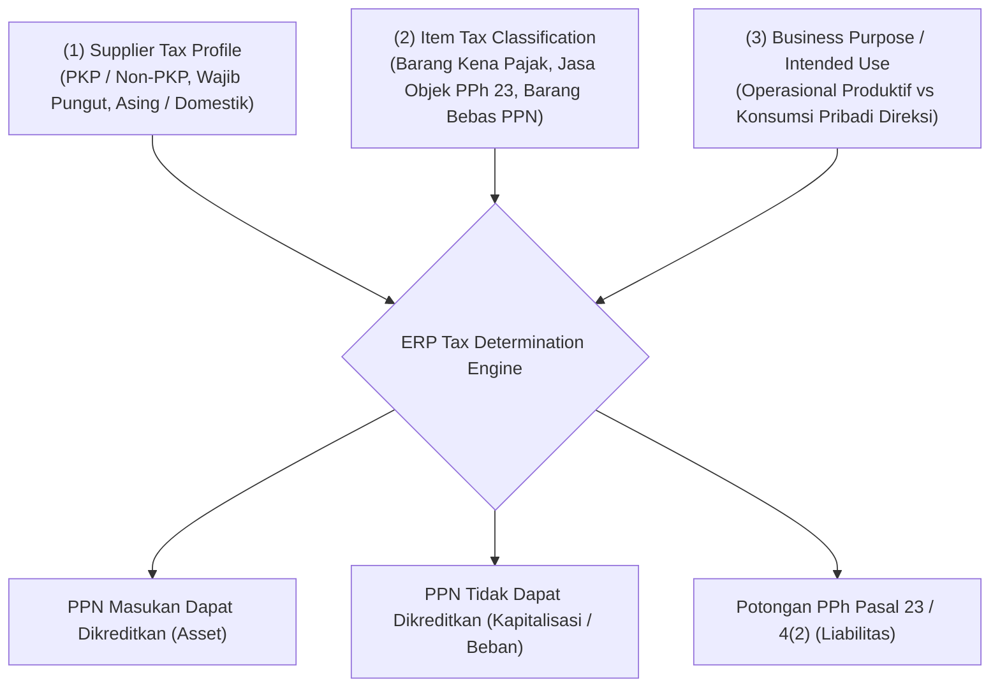

# Purchase Tax in ERP

## Definition

**Purchase Tax (Pajak Pembelian)** dalam sistem ERP adalah modul pemrosesan perpajakan otomatis yang mengatur identifikasi, penghitungan, pencatatan jurnal, dan rekonsiliasi atas pajak-pajak yang timbul saat entitas membeli barang atau jasa dari pihak ketiga.

Dalam transaksi pengadaan korporasi, pajak pembelian terbagi menjadi dua rezim perpajakan utama:
1. **Pajak Masukan (*Input Tax / Recoverable VAT*)**: Pajak tidak langsung atas konsumsi barang/jasa yang dibayarkan kepada pemasok terdaftar dan berfungsi sebagai **hak tagih / piutang pajak (*tax asset*)** yang dapat dikreditkan terhadap pajak keluaran.
2. **Pajak Pemotongan (*Withholding Tax / WHT*)**: Kewajiban hukum yang dibebankan kepada pembeli untuk memotong sebagian pembayaran atas transaksi jasa, royalti, atau sewa, lalu menyetorkannya langsung ke kas negara atas nama pemasok.

Landasan akuntansi perpajakan komprehensif dan penyelesaian masa pajak telah dibangun pada [[02-accounting/tax-accounting|Tax Accounting]]. Modul ini berfokus pada **mekanisme pemungutan dan validasi pada transaksi pengadaan ERP**.

---

## Business Purpose

Integrasi mesin pajak dalam modul Purchasing bertujuan untuk:
1. **Pencegahan Kehilangan Hak Kredit Pajak (*Tax Asset Recovery*)**: Memastikan seluruh PPN Masukan yang sah tervalidasi dan diklaim dalam Surat Pemberitahuan (SPT) Masa untuk mengurangi kewajiban setor PPN ke negara.
2. **Kepatuhan Pemotongan PPh Pihak Ketiga (*Withholding Tax Compliance*)**: Menghitung dan memotong pajak penghasilan jasa secara otomatis saat tagihan diproses guna mencegah sanksi kelalaian pemotongan pajak dari fiskus.
3. **Pemisahan Pajak yang Dapat Dikreditkan vs Dibiayakan**: Mengidentifikasi faktur pajak cacat atau pengeluaran yang tidak berhubungan langsung dengan kegiatan usaha untuk dikapitalisasi ke nilai persediaan atau dibiayakan langsung ke laba rugi.
4. **Validasi Faktur Pajak Elektronik (*e-Faktur Integration*)**: Memverifikasi nomor seri dan kode QR faktur pajak masukan pemasok terhadap basis data resmi otoritas perpajakan.

---

## The Purchase Tax Determination Engine

Sistem ERP mengevaluasi perlakuan pajak pembelian melalui matriks aturan otomatis:

---

## Pajak Masukan: Dapat Dikreditkan vs Tidak Dapat Dikreditkan

Tidak semua pajak yang dibayarkan kepada pemasok boleh diperlakukan sebagai pengurang utang pajak di neraca:

### 1. Recoverable Input Tax (Pajak Masukan Dapat Dikreditkan)
* Memenuhi syarat formal (faktur pajak lengkap dan valid) dan syarat material (berkaitan langsung dengan kegiatan produksi, distribusi, atau manajemen usaha).
* **Perlakuan Akuntansi**: Dicatat sebagai **Aset Lancar / Piutang Pajak (*Tax Receivable*)** di neraca. Tidak menambah harga pokok perolehan persediaan.

### 2. Non-Recoverable Input Tax (Pajak Masukan Tidak Dapat Dikreditkan)
* Terjadi jika faktur pajak pemasok cacat, pengeluaran tidak berkaitan dengan kegiatan usaha (misal: pembelian kendaraan dinas mewah tertentu), atau entitas berstatus non-PKP.
* **Perlakuan Akuntansi (IAS 2)**:
  * Jika terkait pembelian persediaan/aset tetap: **Pajak wajib dikapitalisasi langsung menambah nilai perolehan barang** (*Cost of Inventory / Asset*).
  * Jika terkait beban operasional: Pajak digabungkan langsung ke dalam akun beban operasional terkait (*Non-Deductible Tax Expense*).

---

## Withholding Tax (Pajak Pemotongan PPh Pembelian)

Saat perusahaan membeli jasa profesional atau menyewa gedung, regulasi perpajakan mewajibkan pembeli untuk **menahan sebagian dana pembayaran** dan menerbitkan Bukti Potong resmi kepada vendor:

$$\mathbf{Kas\ yang\ Ditransfer\ ke\ Vendor = Total\ Tagihan\ (DPP + PPN) - Nilai\ Potongan\ PPh}$$

---

## Konteks Yurisdiksi Indonesia (UU HPP No. 7 Tahun 2021)

> [!important] Catatan Regulasi Lokal Indonesia
> Penjelasan berikut merupakan contoh ilustratif perlakuan perpajakan pengadaan di **Republik Indonesia**:
> 1. **PPN Masukan Standar**: Dikenakan sebesar **11%** atas Barang Kena Pajak (BKP) dan Jasa Kena Pajak (JKP).
> 2. **Validasi e-Faktur Masukan**: ERP enterprise menyediakan pemindai kode QR (*QR Code Scanner*) yang otomatis mencocokkan data faktur pajak elektronik pemasok ke server Direktorat Jenderal Pajak (DJP) sebelum tagihan disetujui.
> 3. **PPh Pasal 23 (Tarif 2%)**: Dipotong atas pembayaran jasa teknik, jasa manajemen, jasa konsultan, atau sewa harta selain tanah/bangunan kepada wajib pajak badan dalam negeri yang memiliki NPWP (tarif 4% jika tidak ber-NPWP).

---

## Dampak Akuntansi & Jurnal (Accounting Impact)

### Skenario 1: Pembelian Persediaan Standar (Baseline Acuan)
Membeli 10 unit komponen *Laptop Pro* dari PT Sumber Teknologi seharga Rp7.000.000 (PPN Masukan 11% = Rp770.000, dapat dikreditkan):

| Akun | Kategori | Debit (Rp) | Kredit (Rp) |
|---|---|---:|---:|
| Persediaan Barang Dagang | Asset (Neraca) | 7.000.000 | - |
| PPN Masukan (*VAT Input Receivable*) | **Asset (Neraca)** | **770.000** | - |
| Utang Usaha (*Accounts Payable*) | Liability (Neraca) | - | 7.770.000 |

*PPN Masukan dicatat di sisi Debit kelompok Aset karena merupakan klaim hak tagih kepada negara yang akan diperhitungkan saat tutup masa pajak bulanan (lihat [[02-accounting/tax-accounting|Tax Accounting]]).*

---

### Skenario 2: Pembelian Jasa Konsultan IT dengan Pemotongan PPh 23
Perusahaan menyewa jasa konsultan sistem senilai Rp10.000.000 (PPN 11% = Rp1.100.000, pemotongan PPh Pasal 23 tarif 2% = Rp200.000):

| Akun | Kategori | Debit (Rp) | Kredit (Rp) |
|---|---|---:|---:|
| Beban Jasa Konsultasi IT | Expense (P&L) | 10.000.000 | - |
| PPN Masukan (*VAT Input*) | Asset (Neraca) | 1.100.000 | - |
| Utang PPh Pasal 23 Pemotongan | **Liability (Neraca)** | - | **200.000** |
| Utang Usaha ke Konsultan (*Net Payable*) | Liability (Neraca) | - | 10.900.000 |

* **Penyelesaian Transaksi**:
  1. Perusahaan mentransfer kas bersih sebesar **Rp10.900.000** kepada konsultan.
  2. Perusahaan menyetorkan potongan **Rp200.000** ke kas negara via bank persepsi dan menerbitkan lembar Bukti Potong PPh 23 resmi kepada konsultan.

---

## Related Concepts

* [[02-accounting/tax-accounting|Tax Accounting]] — Tata kelola pelaporan PPN dan rekonsiliasi fiskal.
* [[04-purchasing/purchasing-pricing-and-terms.md|Purchasing Pricing and Commercial Terms]] — Komponen pajak dalam struktur biaya perolehan total.
* [[04-purchasing/accounts-payable-integration|Accounts Payable Integration]] — Penagihan utang usaha bersih setelah potongan pajak.
* [[03-sales/sales-tax|Sales Tax in ERP]] — Sisi cermin pajak keluaran pada transaksi penjualan.

---

## References

1. **Direktorat Jenderal Pajak (DJP) RI**: *Undang-Undang Harmonisasi Peraturan Perpajakan (UU HPP No. 7 Tahun 2021) dan Peraturan Dirjen Pajak terkait Faktur Pajak Elektronik*. URL: https://pajak.go.id/
2. **IFRS Foundation**: *IAS 12 Income Taxes - Withholding Taxes and Deductibility*. URL: https://www.ifrs.org/issued-standards/list-of-standards/ias-12-income-taxes/
3. **OECD**: *International VAT/GST Guidelines - The Input Tax Credit Mechanism*.
4. **Microsoft Learn**: *Withholding tax and sales tax integration in Dynamics 365 Supply Chain Management*. URL: https://learn.microsoft.com/en-us/dynamics365/finance/general-ledger/withholding-tax
