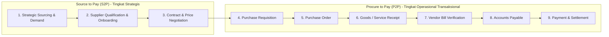
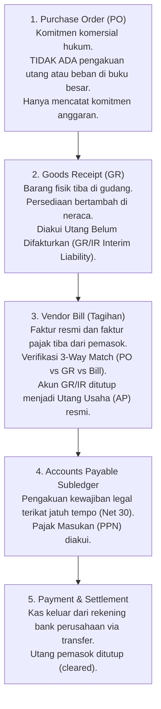

# Purchasing Fundamentals in ERP

## Definition

Dalam sistem Enterprise Resource Planning (ERP), fungsi pengadaan dibedakan ke dalam dua tingkatan konsep:

1. **Procurement (Pengadaan Strategis)**: Proses bisnis menyeluruh berskala luas yang mencakup identifikasi kebutuhan organisasi, pencarian sumber pasokan (*strategic sourcing*), negosiasi kontrak jangka panjang, evaluasi risiko pemasok, hingga pembinaan hubungan mitra (*Supplier Relationship Management / SRM*).
2. **Purchasing (Pembelian Operasional)**: Bagian transaksional dari procurement yang berfokus pada eksekusi penerbitan pesanan pembelian (*Purchase Order*), pemantauan jadwal pengiriman, penerimaan fisik barang/jasa di gudang, hingga verifikasi faktur tagihan pemasok.

Modul Purchasing dalam ERP beroperasi sebagai **gerbang hulu rantai pasok (*inbound supply chain gateway*)** yang mengubah kebutuhan internal unit kerja menjadi barang dan jasa nyata yang dibutuhkan perusahaan untuk beroperasi.

---

## Business Purpose

Implementasi modul Purchasing yang terintegrasi dalam ERP bertujuan untuk:
1. **Pengendalian Pengeluaran Organisasi (*Spend Control & Governance*)**: Mencegah pembelian liar tanpa izin (*maverick buying*) melalui penegakan alur persetujuan bertingkat (*Approval Workflow*) dan pemeriksaan pagu anggaran (*Budget Checking*).
2. **Kepastian Pasokan Operasional (*Supply Assurance*)**: Menjamin ketersediaan bahan baku pabrik dan barang dagang tepat waktu (*On-Time In-Full*) guna mencegah terhentinya lini produksi atau kekosongan stok penjualan.
3. **Efisiensi Biaya Total Perolehan (*Total Cost of Ownership Optimization*)**: Memanfaatkan skala ekonomis melalui pengelompokan permintaan (*requisition bundling*), kontrak harga terpusat (*blanket agreements*), dan evaluasi kinerja pemasok.
4. **Otomatisasi Aliran Finansial Tanpa Redudansi Data**: Mengalirkan data penerimaan barang langsung ke modul buku pembantu utang (*Accounts Payable*) dan persediaan tanpa memerlukan pencatatan ulang secara manual.

---

## Direct vs Indirect Procurement

Sistem ERP membedakan dua kategori besar pengadaan yang memiliki karakteristik logistik dan perlakuan akuntansi yang sangat berbeda:

| Parameter | Direct Procurement (Pengadaan Langsung) | Indirect Procurement (Pengadaan Tidak Langsung) |
|---|---|---|
| **Definisi** | Pembelian bahan baku, komponen, atau barang dagang yang **langsung masuk ke dalam struktur produk atau dijual kembali**. | Pembelian barang atau jasa untuk **mendukung operasional harian perusahaan**, bukan untuk dijual kembali. |
| **Pemicu Kebutuhan** | Rencana Produksi (*MRP*), Pesanan Penjualan (*Make-to-Order*), atau batas minimum stok (*Min-Max Reorder Point*). | Permintaan manual karyawan (*Internal Purchase Requisition*), pemeliharaan gedung, atau operasional kantor. |
| **Contoh Komoditas** | Biji plastik, prosesor laptop, kain tekstil, kemasan kaleng produk. | Kertas printer, jasa katering karyawan, laptop staf akuntansi, sewa kantor, jasa konsultan hukum. |
| **Dampak Akuntansi** | Dikapitalisasi ke akun **Persediaan di Neraca** (*Inventory Asset*) dan membentuk HPP (*COGS*) saat dijual. | Langsung dibebankan sebagai **Beban Operasional di Laba Rugi** (*OpEx*) atau diakui sebagai **Aset Tetap** (*CapEx*). |
| **Keterlibatan Gudang** | Wajib melalui penerimaan gudang fisik (*Goods Receipt*) dan pencatatan kartu stok. | Sering kali langsung diterima oleh pemohon (*service entry / direct delivery*) tanpa kartu stok fisik. |

---

## The Procurement Value Streams: S2P vs P2P

Dalam arsitektur ERP enterprise, fungsi pengadaan diorganisasikan ke dalam dua aliran proses utama:

1. **Source to Pay (S2P)**: Meliputi siklus hidup hulu: penentuan strategi pasokan, kualifikasi vendor, tender penawaran, dan penandatanganan kontrak jangka panjang.
2. **Procure to Pay (P2P)**: Meliputi eksekusi transaksi harian: dimulai dari permohonan pembelian (*Purchase Requisition*), penerbitan pesanan (*Purchase Order*), penerimaan barang fisik (*Goods Receipt*), pencocokan tagihan (*3-Way Matching*), hingga pelunasan kas bank (lihat [[01-business-processes/procure-to-pay|Procure to Pay Process]]).

---

## Cross-Module Integration Matrix

Modul Purchasing berinteraksi secara erat dengan seluruh modul operasional dan finansial dalam sistem ERP:

| Modul Terkait | Arah Aliran Data | Objek Data & Peristiwa Integrasi | Referensi Terkait |
|---|:---:|---|---|
| **Inventory & Warehouse** | Dua Arah $\leftrightarrow$ | Minimum stok memicu usulan pembelian; dokumen penerimaan barang (*Goods Receipt*) menambah kartu stok fisik dan nilai aset persediaan. | [[01-business-processes/inventory-process|Inventory Process]] |
| **Manufacturing (MRP)** | Masuk $\to$ | Rencana kebutuhan material (*MRP Run*) otomatis menerbitkan draf *Purchase Requisition* untuk bahan baku yang kurang. | [[01-business-processes/manufacturing-process|Manufacturing Process]] |
| **Sales (O2C)** | Masuk $\to$ | Pesanan penjualan model *Drop-shipping* atau *Back-to-back* otomatis menerbitkan *Purchase Order* ke pemasok pihak ketiga. | [[03-sales/sales-order|Sales Order]] |
| **Tax Engine** | Masuk $\to$ | Penentuan kode pajak, pemisahan PPN Masukan yang dapat dikreditkan, dan penghitungan bukti potong *Withholding Tax* (PPh 23). | [[02-accounting/tax-accounting|Tax Accounting]] |
| **Accounts Payable (AP)** | Keluar $\to$ | Faktur pemasok (*Vendor Bill*) mencatat utang usaha resmi di subledger pemasok dan memperbarui jadwal jatuh tempo pembayaran. | [[02-accounting/accounts-payable|Accounts Payable]] |
| **General Ledger (GL)** | Keluar $\to$ | Penerimaan fisik barang memicu akun penampung (*GR/IR Clearing*); verifikasi tagihan memindahkan saldo ke Utang Usaha. | [[02-accounting/journal-entry|Journal Entry]] |
| **Treasury & Banking** | Keluar $\to$ | Usulan pembayaran (*Payment Proposal*) disetujui untuk transfer perbankan dan rekonsiliasi mutasi kas keluar. | [[02-accounting/bank-reconciliation|Bank Reconciliation]] |

---

## Prinsip Kritis: PO $\neq$ Goods Receipt $\neq$ Vendor Bill $\neq$ AP $\neq$ Payment

Sama halnya dengan modul Penjualan, sistem ERP memisahkan secara ketat batas antara komitmen operasional, penyerahan fisik barang, dan kewajiban hukum finansial:

$$\mathbf{Purchase\ Order \neq Goods\ Receipt \neq Vendor\ Bill \neq Accounts\ Payable \neq Cash\ Payment}$$

1. **Purchase Order Disahkan**: Perusahaan memesan 10 unit bahan baku seharga Rp7.000.000. Dokumen ini adalah **komitmen komersial**, bukan transaksi akuntansi. Tidak ada debit atau kredit di buku besar.
2. **Barang Tiba di Gudang (Goods Receipt)**: Barang fisik masuk ke rak penyimpanan. Dalam sistem perpetual, aset persediaan bertambah Rp7.000.000 di neraca, diimbangi dengan akun kewajiban akrual penerimaan (*GR/IR Clearing*). Pemasok belum berhak menagih sebelum mengirimkan faktur resmi.
3. **Faktur Tiba & Diverifikasi (Vendor Bill & 3-Way Match)**: Tagihan resmi pemasok tiba senilai Rp7.770.000 (termasuk PPN 11%). Sistem memvalidasi kesesuaian harga dan kuantitas antara PO, GR, dan Bill.
4. **Utang Usaha Diakui (AP Recognition)**: Akun kliring *GR/IR* ditutup, PPN Masukan diakui sebesar Rp770.000, dan Utang Usaha resmi tercatat di subledger pemasok sebesar Rp7.770.000.
5. **Pembayaran Kas (Payment Disbursement)**: Kas keluar dari bank saat jatuh tempo; utang usaha terhapus dari daftar kewajiban terbuka (*open item*).

---

## ERP Architecture & Data Entity Model

Dalam basis data relasional ERP, modul Purchasing dibangun di atas struktur entitas terpadu:
* **Purchasing Requisition Entity (`pr_header` & `pr_lines`)**: Menyimpan permintaan kebutuhan dari departemen internal sebelum dicarikan pemasok.
* **Purchase Order Entity (`po_header` & `po_lines`)**: Menyimpan kontrak pesanan pembelian, ID pemasok, mata uang, alamat pengiriman gudang, syarat pembayaran (*Payment Terms*), dan syarat penyerahan (*Incoterms*).
* **Receiving Entity (`receipt_header` & `receipt_lines`)**: Mencatat nomor surat jalan pemasok, tanggal tiba fisik, kuantitas diterima, nomor lot/batch, dan lokasi rak gudang.
* **Document Flow & Cross-Reference Key**: Setiap baris faktur pemasok menautkan kunci referensi unik ke baris PO dan baris GR terkait guna menegakkan validasi pencocokan 3-arah (*3-Way Matching Invariant*).

---

## Related Concepts

* [[00-fundamentals/cross-module-integration|Cross-Module Integration]] — Prinsip keterpaduan antar-modul dan akun kliring GR/IR.
* [[01-business-processes/procure-to-pay|Procure to Pay Process]] — Alur proses bisnis pengadaan dari hulu ke hilir.
* [[02-accounting/accounts-payable|Accounts Payable Accounting]] — Standar akuntansi liabilitas keuangan IFRS 9.
* [[03-sales/sales-fundamentals|Sales Fundamentals in ERP]] — Perbandingan dengan siklus hilir Order-to-Cash.

---

## References

1. **Chartered Institute of Procurement & Supply (CIPS)**: *Procurement and Supply Cycle - Principles and Practice*. URL: https://www.cips.org/
2. **Association for Supply Chain Management (ASCM)**: *APICS Dictionary - Procurement, Sourcing, and Total Cost of Ownership*.
3. **Microsoft Learn**: *Procurement and sourcing overview in Dynamics 365 Supply Chain Management*. URL: https://learn.microsoft.com/en-us/dynamics365/supply-chain/procurement/procurement-sourcing-overview
4. **Frappe / ERPNext Documentation**: *Buying Module and Procure-to-Pay Workflow*. URL: https://docs.frappe.io/erpnext/user/manual/en/buying
