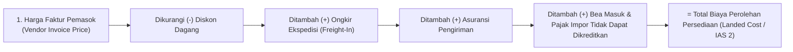

# Purchasing Pricing and Commercial Terms

## Definition

**Purchasing Pricing and Commercial Terms (Penetapan Harga Beli dan Ketentuan Komersial)** dalam sistem ERP adalah modul aturan pengadaan yang mengelola kesepakatan harga dengan pemasok, struktur diskon pembelian, syarat pembayaran (*Payment Terms*), pembagian risiko logistik (*Incoterms*), serta akumulasi seluruh biaya pengangkutan dan kepabeanan untuk membentuk **Biaya Perolehan Total (*Landed Cost / Total Acquisition Cost*)**.

Prinsip fundamental akuntansi dan manajemen persediaan menetapkan:
> **Harga Beli Faktur Pemasok (*Invoice Price*) $\neq$ Nilai Perolehan Persediaan (*Inventory Valuation Cost*).**
> Nilai suatu aset persediaan yang dicatat di neraca tidak hanya mencakup harga yang dibayarkan ke vendor barang, melainkan seluruh biaya langsung yang dikeluarkan hingga barang tersebut tiba di gudang dan siap digunakan (sesuai standar internasional **IAS 2**).

---

## Business Purpose

Pengelolaan harga dan ketentuan komersial yang terstruktur bertujuan untuk:
1. **Akurasi Perhitungan Laba dan HPP (*True Cost of Goods Sold*)**: Memastikan seluruh ongkos angkut dan bea impor diatribusikan secara adil ke dalam harga pokok per unit barang, sehingga laba kotor tidak terdistorsi.
2. **Penegakan Kesepakatan Kontrak Harga**: Mengunci harga beli agar faktur tagihan pemasok yang melebihi kesepakatan PO dapat ditahan otomatis oleh mesin pencocokan (*Price Variance Hold*).
3. **Pemanfaatan Potongan Pembayaran Dini (*Early Payment Discounts*)**: Mengoptimalkan arus kas melalui pemanfaatan diskon pelunasan lebih awal (*Cash Discounts*) dari pemasok.
4. **Kepastian Tanggung Jawab Hukum Logistik (*Incoterms Compliance*)**: Menentukan titik fisik perpindahan risiko kepemilikan dan pihak yang wajib membayar biaya asuransi pengiriman.

---

## Anatomi Biaya Perolehan Total (The Landed Cost Formula)

Di bawah standar **IAS 2 (*Inventories*)**, biaya perolehan persediaan dihitung dengan rumus:

$$\mathbf{Landed\ Cost = Harga\ Beli\ Faktur - Diskon\ Dagang + Ongkos\ Angkut + Asuransi + Bea\ Masuk + Biaya\ Bongkar}$$

### Komponen yang Boleh vs Dilarang Dikapitalisasi (IAS 2):
* **Wajib Dikapitalisasi ke Aset Persediaan**:
  * Bea masuk impor dan retribusi pelabuhan.
  * Ongkos angkut dari pabrik vendor ke gudang perusahaan (*freight-in*).
  * Biaya penanganan bongkar muat dan asuransi selama perjalanan.
* **Dilarang Dikapitalisasi (Wajib Langsung Dibebankan ke Biaya Operasional / OpEx)**:
  * Biaya penyimpanan barang setelah tiba di gudang (*storage costs*).
  * Biaya administrasi umum kantor pembelian.
  * Biaya pembongkaran akibat keterlambatan kontainer di pelabuhan (*demurrage penalty*).

---

## Ketentuan Penyerahan Internasional (Incoterms 2020)

Dalam *Purchase Order*, ketentuan penyerahan (*Incoterms*) menentukan kapan hak kepemilikan berpindah dan siapa yang menanggung ongkos kirim:

| Klausul Incoterms | Titik Perpindahan Risiko & Kendali | Pihak Penanggung Ongkos Kirim & Asuransi |
|---|---|---|
| **EXW (Ex-Works)** | Di pintu pabrik/gudang pemasok. | **Pembeli** menanggung 100% biaya angkut, bea ekspor, dan asuransi dari titik awal. |
| **FOB (Free On Board)** | Di atas kapal di pelabuhan muat negara asal. | Pemasok menanggung hingga barang naik ke kapal; **Pembeli** menanggung biaya kapal laut dan asuransi internasional. |
| **CIF (Cost, Insurance & Freight)** | Di atas kapal di pelabuhan muat (risiko), namun biaya ditanggung hingga pelabuhan tujuan. | **Pemasok** menanggung ongkos kapal laut dan premi asuransi hingga pelabuhan tujuan pembeli. |
| **DDP (Delivered Duty Paid)** | Di pintu gudang pembeli. | **Pemasok** menanggung seluruh biaya pengiriman, asuransi, dan pembayaran bea masuk hingga barang tiba di gudang pembeli. |

---

## Syarat Pembayaran Komersial (Payment Terms)

ERP mendukung konfigurasi termin pembayaran yang memengaruhi jadwal pengeluaran kas di modul Utang Usaha:
1. **Net Payment (Pembayaran Jatuh Tempo Penuh)**:
   * *Net 30*: Pembayaran wajib dilunasi penuh dalam 30 hari kalender sejak tanggal faktur.
   * *Net 60*: Pembayaran dilunasi dalam 60 hari kalender.
2. **Cash in Advance (CIA) / Prepayment**:
   * Pembeli wajib mentransfer dana sebelum barang diproduksi atau dikirimkan (lihat [[04-purchasing/prepayment-and-down-payment|Prepayment and Down Payment]]).
3. **Cash on Delivery (COD)**:
   * Pembayaran diserahkan seketika saat kurir membongkar barang fisik di dermaga gudang.
4. **Early Settlement Discount (Potongan Pelunasan Dini)**:
   * Termin *2/10, Net 30*: Pembeli berhak memotong diskon 2% dari harga barang jika melunasi tagihan dalam kurun waktu 10 hari pertama; jika tidak, pembayaran jatuh tempo normal pada hari ke-30.

---

## Skenario Acuan Transaksi: Penerapan Landed Cost

Melanjutkan pesanan acuan pembelian 10 unit komponen *Laptop Pro* dari PT Sumber Teknologi:
* **Harga Beli Faktur Pemasok**: 10 unit @ Rp700.000 = **Rp7.000.000** (+ PPN 11% Rp770.000 = Rp7.770.000).
* **Ongkos Angkut Ekspedisi (*Freight-In*)**: Perusahaan menggunakan jasa kurir pihak ketiga (*CV Logistik Cepat*) untuk mengangkut barang dari pelabuhan ke gudang dengan biaya sebesar **Rp500.000** (non-PPN).

### 1. Perhitungan Landed Cost Persediaan:
$$\text{Total Nilai Perolehan} = \text{Rp7.000.000 (Barang)} + \text{Rp500.000 (Ongkir)} = \mathbf{Rp7.500.000}$$
$$\text{Harga Pokok Satuan Baru} = \frac{\text{Rp7.500.000}}{10\text{ unit}} = \mathbf{Rp750.000\ /\ unit}$$

### 2. Alur Jurnal Akuntansi Kapitalisasi Biaya Angkut:
Saat barang tiba dan dokumen *Landed Cost Voucher* dialokasikan ke persediaan (lihat [[02-accounting/inventory-accounting|Inventory Accounting]]):

| Akun | Kategori | Debit (Rp) | Kredit (Rp) |
|---|---|---:|---:|
| Persediaan Barang Dagang (Kapitalisasi Ongkir) | Asset (Neraca) | 500.000 | - |
| Utang Biaya Ekspedisi / Kas Bank | Liability / Asset | - | 500.000 |

* **Hasil Akhir di Buku Besar**:
  * Nilai tercatat persediaan di neraca menjadi **Rp7.500.000** (@ Rp750.000/unit).
  * Saat barang tersebut nantinya dijual pada siklus penjualan (lihat [[03-sales/delivery-and-shipping|Delivery and Shipping]]), Beban Pokok Penjualan (COGS) yang diakui adalah sebesar Rp7.500.000, **mencerminkan beban riil perolehan secara sempurna**.

---

## Metode Alokasi Biaya Angkut (*Cost Apportionment Methods*)

Jika satu tagihan ekspedisi sebesar Rp500.000 mengangkut beberapa jenis barang yang berbeda dalam satu kontainer, ERP enterprise membagi biaya angkut tersebut menggunakan salah satu metode proporsional:
1. **By Value (Berdasarkan Nilai Moneter)**: Barang yang harganya lebih mahal menyerap porsi ongkos kirim lebih besar.
2. **By Weight (Berdasarkan Berat Fisik)**: Barang yang bobot kilogramnya lebih berat menanggung biaya angkut lebih besar (paling umum untuk ekspedisi darat/udara).
3. **By Volume / CBM (Berdasarkan Kubikasi Ruang)**: Barang yang memakan volume ruang kontainer lebih besar menanggung biaya lebih tinggi (paling umum untuk ekspedisi laut).
4. **By Quantity (Berdasarkan Jumlah Unit)**: Biaya dibagi rata per unit fisik secara sederhana.

---

## Related Concepts

* [[02-accounting/inventory-accounting|Inventory Accounting]] — Pengukuran biaya perolehan di bawah standar IAS 2.
* [[04-purchasing/purchase-order|Purchase Order]] — Penguncian harga beli dan ketentuan komersial.
* [[04-purchasing/goods-receipt-and-service-receipt|Goods Receipt and Service Receipt]] — Titik penggabungan nilai landed cost ke kartu stok.
* [[03-sales/pricing-and-discount|Pricing and Discount Architecture]] — Sisi cermin penetapan harga dari perspektif penjualan.

---

## References

1. **IFRS Foundation**: *IAS 2 Inventories - Costs of Purchase and Other Costs Incurred*. URL: https://www.ifrs.org/issued-standards/list-of-standards/ias-2-inventories/
2. **International Chamber of Commerce (ICC)**: *Incoterms 2020 Rules and Obligations of Buyer and Seller*.
3. **Microsoft Learn**: *Landed cost module overview, cost categories, and allocation rules in Dynamics 365 Supply Chain Management*. URL: https://learn.microsoft.com/en-us/dynamics365/supply-chain/landed-cost/landed-cost-overview
4. **Frappe / ERPNext Documentation**: *Landed Cost Voucher and Item Valuation Updates*. URL: https://docs.frappe.io/erpnext/user/manual/en/stock/landed-cost-voucher
