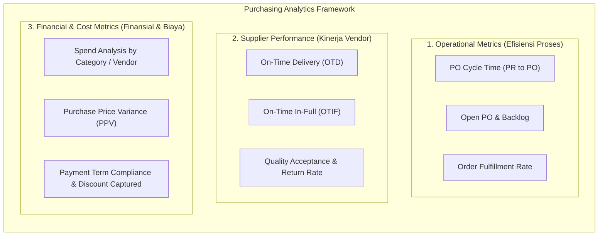
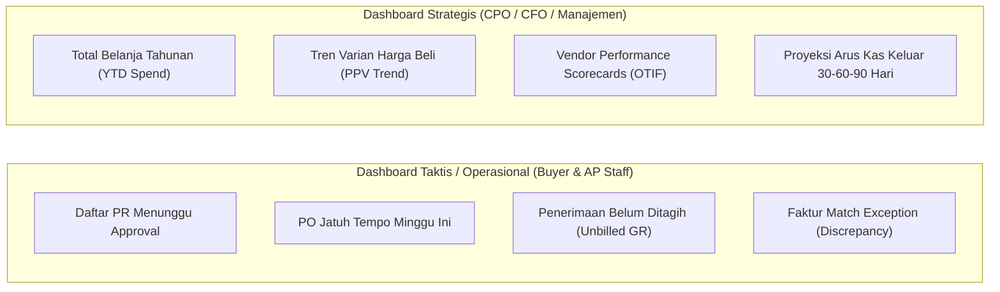

# Purchasing Reporting and Analytics

## Definition

**Purchasing Reporting and Analytics** adalah kumpulan laporan operasional, metrik kinerja (*Key Performance Indicators* / KPI), dan analisis data strategis dalam sistem ERP yang menyediakan visibilitas menyeluruh terhadap seluruh aktivitas siklus *Procure-to-Pay* (P2P)—mulai dari pengajuan kebutuhan (*Requisition*), penerbitan pesanan (*Purchase Order*), penerimaan logistik (*Receipt*), hingga penyelesaian kewajiban finansial (*Accounts Payable*).

Dalam arsitektur ERP terpadu, data pengadaan bertindak sebagai **Single Source of Truth (SSOT)** yang mengintegrasikan transaksi operasional pengadaan dengan modul persediaan (*inventory*), buku besar (*general ledger*), dan arus kas (*cash flow*).

---

## Purpose

1. **Visibilitas Operasional Real-Time**: Mengidentifikasi hambatan proses (*bottlenecks*), seperti keterlambatan persetujuan PR/PO atau tumpukan barang yang belum diinspeksi.
2. **Evaluasi dan Manajemen Risiko Vendor**: Menyediakan data berbasis fakta (*fact-based data*) mengenai keandalan pengiriman, mutu barang, dan kepatuhan harga pemasok ([[04-purchasing/supplier-selection-and-evaluation|Supplier Evaluation]]).
3. **Pengendalian Pengeluaran (*Spend Control & Cost Reduction*)**: Menganalisis pola belanja organisasi guna mendeteksi *maverick spend* (pembelian liar di luar kontrak/katalog) dan memaksimalkan diskon kuantitas.
4. **Perencanaan Likuiditas Finansial**: Memberikan estimasi arus kas keluar (*projected cash outflows*) yang akurat kepada tim *Treasury* berdasarkan jatuh tempo faktur vendor dan pesanan terbuka (*open PO commitments*).
5. **Kepatuhan Tata Kelola dan Audit**: Memastikan seluruh pembelian sesuai dengan batas kewenangan (*Delegation of Authority*) dan ketentuan perpajakan.

---

## Taksonomi Metrik Pengadaan ERP

Metrik dalam modul Purchasing diklasifikasikan ke dalam tiga domain utama:

---

### 1. Operational Metrics (Efisiensi Proses Pengadaan)

Metrik ini memantau kelancaran alur kerja internal organisasi:

| Metrik | Rumus / Definisi | Tujuan & Ambang Batas Ideal |
| :--- | :--- | :--- |
| **PR-to-PO Cycle Time** | $\text{Waktu PO Approved} - \text{Waktu PR Submitted}$ | Mengukur kecepatan departemen procurement mengubah kebutuhan unit bisnis menjadi pesanan resmi. Semakin pendek siklus, semakin lincah operasional. |
| **Open PO Backlog** | $\sum \text{Kuantitas Dipesan} - \sum \text{Kuantitas Diterima}$ | Mengidentifikasi pesanan yang masih terbuka (*pending receipt*). Berguna untuk mencegah penumpukan pesanan menggantung yang kadaluwarsa. |
| **PO Line First-Time-Right** | $\frac{\text{Jumlah PO Tanpa Revisi}}{\text{Total PO Diterbitkan}} \times 100\%$ | Mengukur akurasi pembuatan dokumen PO agar tidak perlu melalui proses amandemen berulang-ulang. |
| **Touchless Invoicing Rate** | $\frac{\text{Jumlah Vendor Bill Lolos 3-Way Match Otomatis}}{\text{Total Vendor Bill Diterima}} \times 100\%$ | Mengukur tingkat otomatisasi proses verifikasi tagihan tanpa intervensi manual tim Accounts Payable. |

---

### 2. Supplier Performance Metrics (Evaluasi Vendor)

Metrik berbasis bukti transaksi aktual yang dihasilkan oleh modul gudang dan mutu:

| Metrik | Rumus / Definisi | Signifikansi Bisnis |
| :--- | :--- | :--- |
| **On-Time Delivery (OTD)** | $\frac{\text{Jumlah Pengiriman Tepat Tanggal Janji Vendor}}{\text{Total Pengiriman}} \times 100\%$ | Mengukur kepatuhan vendor terhadap tanggal janji kirim (*promised delivery date*). |
| **On-Time In-Full (OTIF)** | $\frac{\text{Penerimaan Tepat Waktu DAN Tepat Kuantitas}}{\text{Total Penerimaan}} \times 100\%$ | Standar emas logistik rantai pasok: pengiriman yang tepat waktu sekaligus lengkap tanpa *backorder*. |
| **Defect / Return Rate** | $\frac{\text{Kuantitas Ditolak / Diretur}}{\text{Total Kuantitas Diterima}} \times 100\%$ | Menilai konsistensi mutu produk pemasok. Memicu evaluasi atau audit pabrik jika melampaui toleransi (misal: $> 1\%$). |
| **Lead Time Adherence** | $\text{Lead Time Aktual} - \text{Lead Time Kontrak}$ | Deviasi waktu pengiriman aktual terhadap SLA perjanjian master. |

---

### 3. Financial and Cost Metrics (Analisis Biaya dan Pengeluaran)

Metrik yang menghubungkan transaksi pengadaan dengan neraca dan laba rugi perusahaan:

#### A. Spend Analysis (Analisis Belanja)
Klasifikasi belanja organisasi berdasarkan berbagai dimensi:
* **Spend by Category / Commodity**: Mengidentifikasi kategori belanja terbesar (misal: komponen elektronik, jasa konsultasi, logistik) untuk strategi negosiasi terpusat.
* **Spend by Supplier (Vendor Concentration)**: Mengukur konsentrasi risiko pasokan; jika 80% belanja bergantung pada satu vendor, perusahaan berada pada posisi tawar yang rentan.
* **Maverick Spend**: Pembelian yang dilakukan di luar kontrak resmi atau katalog yang telah disetujui.

#### B. Purchase Price Variance (PPV)
Mengukur deviasi antara harga beli aktual (*actual purchase price*) dengan harga standar yang ditetapkan (*standard cost*):

$$\text{PPV} = (\text{Actual Price} - \text{Standard Cost}) \times \text{Actual Quantity Purchased}$$

* **Favorable PPV**: Pengadaan berhasil membeli dengan harga lebih murah dari standar (menambah margin laba).
* **Unfavorable PPV**: Pengadaan membeli dengan harga lebih mahal dari standar (mengurangi margin laba). Selisih ini langsung tercatat ke akun beban varian harga pada buku besar saat menggunakan metode *Standard Costing*.

#### C. Cash and Working Capital Metrics
* **Early Payment Discount Captured vs. Missed**: Persentase diskon pelunasan cepat (misal: term *2/10, Net 30*) yang berhasil dimanfaatkan vs yang hangus karena keterlambatan proses tagihan.
* **Days Payable Outstanding (DPO)**: Rata-rata hari yang dibutuhkan perusahaan untuk melunasi utang ke vendor:
  $$\text{DPO} = \frac{\text{Rata-rata Utang Usaha (AP)}}{\text{COGS}} \times 365$$

---

## Tingkatan Dashboard Pengadaan (Dashboard Hierarchy)

ERP modern memisahkan visualisasi analitik menjadi dua tingkatan utama:

---

## ERP Implementation Comparison

| Fitur Analitik | Odoo Enterprise | ERPNext | Microsoft Dynamics 365 SCM |
| :--- | :--- | :--- | :--- |
| **Pivot & Graphical Reporting** | Fitur built-in *Pivot View* dan *Graph View* di modul Purchase; memungkinkan drill-down instan berdasarkan vendor, produk, dan bulan. | Built-in report builder dan *Purchase Analytics* (grid tabular dinamis berdasarkan rentang waktu). | Modul analitik bawaan dengan kapabilitas drill-through hingga ke baris jurnal akuntansi terkait. |
| **Vendor Scorecard** | Otomatis menghitung *On-Time Rate* pada profil vendor berdasarkan tanggal janji kirim vs receipt. | Memiliki fitur penilaian pemasok (*Supplier Scorecard*) berbasis kriteria tertimbang. | Fitur komprehensif *Vendor Performance Evaluation* mencakup OTD, kualitas, dan *Price Variance*. |
| **Integrasi BI Eksternal** | Mendukung ekspor spreadsheet dan integrasi dashboard Odoo Spreadsheet. | Integrasi bawaan dengan dashboard kustom atau ekspor ke Grafana/Metabase. | Integrasi native yang sangat kuat dengan **Power BI** (*Procurement and Spend Analysis Content Pack*). |
| **Pelacakan PPV** | Terintegrasi otomatis dalam journal entry jika produk menggunakan metode valuasi *Standard Price*. | Varian harga dialokasikan via *Purchase Invoice* ke akun selisih biaya khusus. | Pelacakan otomatis ke GL akun *Purchase Price Variance* dengan analitik Power BI khusus varian biaya. |

---

## Naventra Consideration

Untuk perancangan modul Purchasing Reporting pada sistem ERP seperti **Naventra**:

1. **Denormalisasi untuk Kecepatan Query (Read-Model / Reporting Views)**: Transaksi P2P melibatkan relasi kompleks lintas tabel (`requisitions` $\to$ `po` $\to$ `gr` $\to$ `bills` $\to$ `payments`). Buat *materialized view* atau tabel analitik khusus (misal: `analytics_p2p_lifecycle_summary`) yang diperbarui secara asinkron (via event-driven worker) agar dashboard analitik tidak membebani transaksi OLTP.
2. **Kalkulasi Metrik Otomatis pada Database Events**:
   * Saat Goods Receipt diposting: Hitung deviasi tanggal janji vendor secara otomatis dan simpan ke `gr.delivery_variance_days`.
   * Saat 3-Way Match divalidasi: Catat status `is_touchless = true/false` pada baris tagihan.
3. **Pre-built Dashboard Widgets**: Sediakan widget bawaan out-of-the-box pada halaman beranda staf procurement:
   * Widget *Actionable Alerts*: "5 PO membutuhkan konfirmasi pengiriman vendor hari ini", "3 Bill tertahan karena perbedaan harga".
   * Widget *Spend Breakdown*: Diagram lingkaran (*donut chart*) belanja berdasarkan kategori 30 hari terakhir.
4. **Ekspor Data Terstandarisasi**: Sediakan kapabilitas ekspor laporan dengan format terstruktur (Excel, CSV, PDF) yang menyertakan nomor dokumen relasional secara lengkap untuk memudahkan proses rekonsiliasi tim audit internal.

---

## References

- APQC (American Productivity & Quality Center). *Procurement Performance Metrics and Benchmarks*.
- Microsoft Learn. *Procurement and Sourcing Power BI Content in Dynamics 365*.
- Frappe ERPNext Documentation. *Purchasing Reports and Analytics*.
- Odoo 17 Documentation. *Purchase Analysis and Reporting Dashboards*.
- CIPS (Chartered Institute of Procurement & Supply). *Measuring Procurement Performance and KPIs*.
