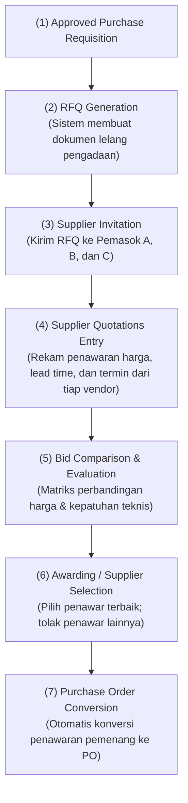

# Request for Quotation (RFQ)

## Definition

**Request for Quotation (Permintaan Penawaran Harga / RFQ)** dalam sistem ERP adalah dokumen operasional pengadaan yang diterbitkan oleh pembeli kepada beberapa calon pemasok (*prospective suppliers*) untuk mengundang penawaran harga, spesifikasi teknis, waktu tunggu pengiriman (*lead time*), syarat penyerahan (*Incoterms*), dan ketentuan pembayaran atas barang atau jasa yang dibutuhkan.

RFQ merupakan **instrumen utama proses penentuan sumber pasokan bersaing (*competitive sourcing*)** yang memastikan perusahaan memperoleh nilai terbaik (*Best Value for Money*) secara transparan sebelum menerbitkan kontrak pesanan resmi.

---

## Business Purpose

Implementasi proses RFQ di dalam ERP bertujuan untuk:
1. **Penemuan Harga Pasar Terkini (*Price Discovery*)**: Mendapatkan gambaran harga pasar riil dan struktur diskon volume dari berbagai penyedia barang/jasa.
2. **Mitigasi Praktik Kolusi & Monopoli Pemasok**: Mencegah ketergantungan sepihak pada satu pemasok tertentu dengan membiasakan proses lelang penawaran tandingan (*competitive bidding*).
3. **Penyelarasan Syarat Pembayaran dan Waktu Tunggu**: Mengevaluasi penawaran secara menyeluruh—tidak hanya harga murah, tetapi juga fleksibilitas tempo pembayaran (*credit terms*) dan kecepatan pengiriman.
4. **Kepatuhan Audit Pengadaan (*Procurement Governance*)**: Menyediakan jejak rekam perbandingan harga (*quotation comparison sheet*) yang sah untuk keperluan audit internal maupun eksternal.

---

## The Sourcing & RFQ Lifecycle

Alur operasional RFQ menghubungkan permohonan internal dengan penawaran pasar eksternal:



---

## Kapan RFQ Wajib Digunakan vs Kapan Boleh Dilewati?

Dalam arsitektur ERP, alur RFQ tidak selalu wajib dijalankan pada setiap transaksi pembelian:

| Situasi Pengadaan | Perlakuan Alur RFQ di ERP | Alasan Kebijakan Bisnis |
|---|:---:|---|
| **Pengadaan Rutin Berkontrak (*Blanket / Contract*)** | **Dilewati (*Bypass RFQ*)** | Harga dan syarat pengadaan sudah terkunci dalam kontrak jangka panjang (langsung PR $\to$ PO). |
| **Pembelian Katalog Terstandarisasi** | **Dilewati (*Bypass RFQ*)** | Barang operasional berulang dengan daftar harga master yang telah disetujui manajemen. |
| **Pengadaan Barang Baru / Nilai Tinggi** | **Wajib RFQ (Minimal 3 Vendor)** | Menjamin transparansi tender dan memperoleh harga kompetitif di pasar. |
| **Pengadaan Darurat (*Emergency Buying*)** | **Dilewati dengan Izin Khusus** | Mesin pabrik rusak mendadak; prioritas utama adalah kecepatan perbaikan, bukan tender harga. |
| **Pemasok Tunggal (*Single / Sole Source*)** | **Negosiasi Langsung (Direct RFQ)** | Komoditas berpaten atau suku cadang orisinal yang hanya diproduksi oleh satu pabrikan di dunia. |

---

## Anatomi Dokumen RFQ dan Matriks Komparasi

Sistem ERP membandingkan penawaran pemasok melalui matriks komparasi otomatis (*Quotation Comparison Matrix*):

```text
MATRIKS PERBANDINGAN PENAWARAN PEMASOK (RFQ-2026-09-0032)
Komoditas: 10 Unit Komponen Laptop Pro | Tanggal Kebutuhan: 15 September 2026
-----------------------------------------------------------------------------------------
Kriteria Evaluasi         PT Sumber Teknologi       CV Mandiri Komponen     PT Indo Prima
-----------------------------------------------------------------------------------------
Harga Satuan (IDR)        Rp 700.000                Rp 720.000              Rp 690.000
Total Nilai (DPP)         Rp 7.000.000              Rp 7.200.000            Rp 6.900.000
PPN (11%)                 Rp   770.000              Rp   792.000            Rp   759.000
Total Penawaran           Rp 7.770.000              Rp 7.992.000            Rp 7.659.000
Waktu Tunggu (Lead Time)  5 Hari                    3 Hari                  14 Hari (Terlambat)
Termin Pembayaran         Net 30 Hari               Net 14 Hari             Cash in Advance
Status Kualitas Historis  Grade A (98% Lolos)       Grade B (90% Lolos)     Vendor Baru
-----------------------------------------------------------------------------------------
KEPUTUSAN SISTEM          PEMENANG (AWARDED)        DITOLAK (REJECTED)      DITOLAK (REJECTED)
Alasan Keputusan          Kombinasi harga wajar,    Harga lebih mahal,      Waktu tunggu 14 hari
                          termin kredit aman (30d), termin kredit pendek.   melebihi batas waktu
                          dan lead time tepat.                              produksi perakitan.
-----------------------------------------------------------------------------------------
```

Dari matriks di atas, meskipun *PT Indo Prima* menawarkan harga termurah (Rp690.000), penawarannya ditolak karena waktu pengiriman 14 hari akan membuat pabrik berhenti beroperasi, serta mensyaratkan pembayaran tunai di muka yang membebani arus kas. Sistem memilih **PT Sumber Teknologi** sebagai penawar paling optimal.

---

## Dampak Akuntansi dan Persediaan (Accounting & Inventory Impact)

> [!important] Dokumen Pra-Kontraktual Murni
> **Request for Quotation dan Supplier Quotation TIDAK MEMILIKI dampak akuntansi dan TIDAK MEMILIKI dampak mutasi persediaan fisik.**
> * **Accounting Impact**: **Nihil**. Tidak ada jurnal debit/kredit yang diposting ke General Ledger maupun buku pembantu utang.
> * **Inventory Impact**: **Nihil**. Stok fisik gudang tidak bertambah atau berkurang.

---

## Skenario Acuan Transaksi (Baseline Example)

Melanjutkan permohonan pembelian `PR-2026-09-0041`:
1. Staf pengadaan menerbitkan dokumen lelang `RFQ-2026-09-0032`.
2. Tiga pemasok komponen elektronik diundang melalui portal pengadaan (*Supplier Portal*) atau email terotomasi sistem.
3. Pemasok terpilih, **PT Sumber Teknologi**, menyetujui pasokan 10 unit komponen *Laptop Pro* dengan rincian:
   * **Harga Satuan**: Rp700.000 / unit.
   * **Total Nilai Barang (DPP)**: Rp7.000.000.
   * **PPN Masukan (11%)**: Rp770.000.
   * **Total Kesepakatan**: **Rp7.770.000**.
   * **Termin Pembayaran**: Net 30 hari kalender.
   * **Waktu Pengiriman**: 5 hari kalender (tiba tanggal 20 September 2026).
4. Staf menekan tombol *Award & Convert to Purchase Order*, yang secara otomatis menerbitkan dokumen komersial resmi [[04-purchasing/purchase-order|Purchase Order]] kepada PT Sumber Teknologi.

---

## Related Concepts

* [[04-purchasing/purchase-requisition|Purchase Requisition]] — Dokumen hulu penangkap kebutuhan bisnis.
* [[04-purchasing/supplier-selection-and-evaluation|Supplier Selection and Evaluation]] — Metodologi evaluasi skor pemasok.
* [[04-purchasing/purchase-order|Purchase Order]] — Dokumen hilir hasil pengesahan penawaran pemenang.
* [[03-sales/sales-quotation|Sales Quotation]] — Sisi cermin (*mirror side*) penawaran harga dari perspektif penjual.

---

## References

1. **Chartered Institute of Procurement & Supply (CIPS)**: *Sourcing and Competitive Bidding Methods (RFQ vs RFP vs ITT)*. URL: https://www.cips.org/
2. **Association for Supply Chain Management (ASCM)**: *APICS Dictionary - Request for Quotation and Competitive Bidding*.
3. **Microsoft Learn**: *Create and manage requests for quotations in Dynamics 365 Supply Chain Management*. URL: https://learn.microsoft.com/en-us/dynamics365/supply-chain/procurement/request-quotations
4. **Frappe / ERPNext Documentation**: *Request for Quotation and Supplier Quotation Comparison*. URL: https://docs.frappe.io/erpnext/user/manual/en/buying/request-for-quotation
