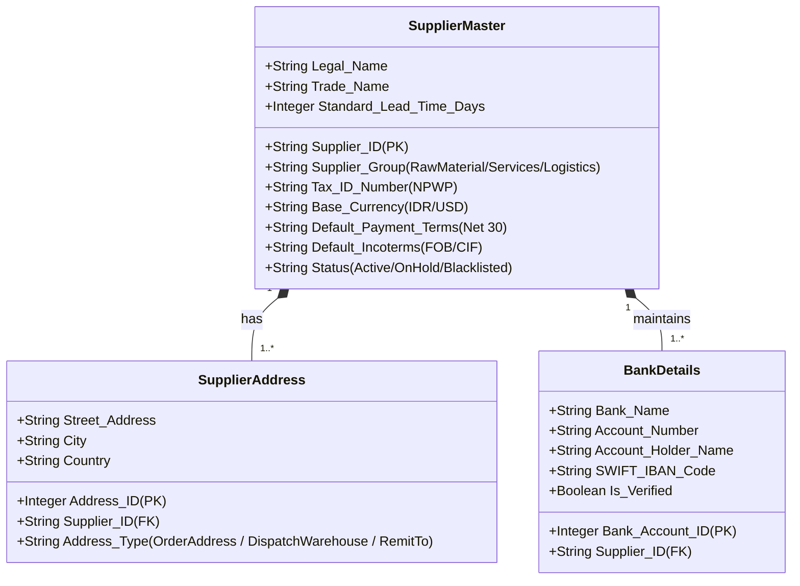
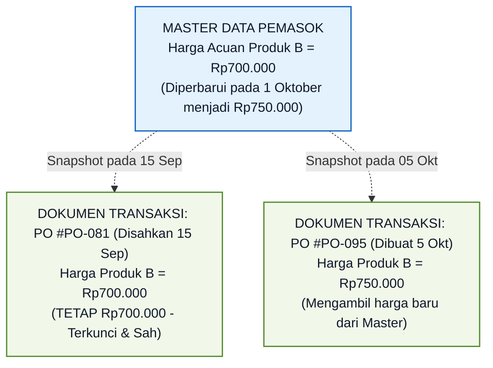

# Supplier and Purchasing Master Data

## Definition

**Purchasing Master Data (Data Induk Pengadaan)** dalam sistem ERP adalah kumpulan entitas data fundamental yang bersifat jangka panjang, relatif statis, dan menjadi fondasi rujukan bagi seluruh transaksi dalam siklus *Procure-to-Pay (P2P)*.

Dua pilar master data paling esensial dalam modul pengadaan adalah:
1. **Supplier / Vendor Master Data (Data Induk Pemasok)**: Catatan terpusat mengenai identitas hukum, keuangan, perpajakan, logistik, dan nomor rekening perbankan dari pihak ketiga yang memasok barang atau jasa kepada entitas.
2. **Product & Service Purchasing Master Data (Data Induk Pembelian Produk/Jasa)**: Atribut spesifik pada master item yang mengatur parameter pengadaan barang fisik maupun jasa non-fisik (seperti satuan pembelian, waktu tunggu pengiriman, harga acuan, dan pemasok utama).

Prinsip pemisahan entitas statis dan dinamis ini dibangun di atas fondasi [[00-fundamentals/master-data-vs-transaction-data|Master Data vs Transaction Data]].

---

## Business Purpose

Pengelolaan Master Data Pengadaan yang terpusat dan terstandarisasi bertujuan untuk:
1. **Pencegahan Penipuan Perbankan & Vendor Fiktif (*Fraud Prevention*)**: Memastikan pembayaran kas hanya dapat ditransfer ke rekening bank resmi yang telah melalui uji kelayakan legalitas (*due diligence*) dan disahkan oleh otoritas keuangan.
2. **Otomatisasi Input Dokumen Pesanan (*Zero Redundancy*)**: Saat staf memilih nama pemasok pada *Purchase Order*, sistem otomatis mengisi alamat pengiriman, termin pembayaran, mata uang, dan akun utang tanpa perlu penginputan manual berulang.
3. **Pemberlakuan Pemisahan Tugas (*Segregation of Duties / SoD*)**: Memastikan pengguna yang mendaftarkan master data pemasok baru tidak memiliki wewenang untuk menyetujui *Purchase Order* atau memproses transfer pembayaran kas ke pemasok tersebut.
4. **Optimalisasi Waktu Tunggu Pasokan (*Lead Time Accuracy*)**: Menyediakan estimasi waktu kedatangan barang yang presisi bagi modul perencanaan manufaktur (*MRP*) dan manajemen persediaan.

---

## Anatomi Supplier Master Data (Data Induk Pemasok)

Dalam arsitektur ERP enterprise, data induk pemasok disusun ke dalam beberapa kelompok fungsional:

### Elemen Kunci Supplier Master:

1. **Identitas Hukum & Kategori**:
   * *Supplier ID & Legal Name*: Nama badan hukum resmi (misal: "PT Sumber Komponen" atau "PT Sumber Teknologi").
   * *Supplier Category*: Klasifikasi untuk analisis belanja (misal: Vendor Bahan Baku, Vendor Suku Cadang, Vendor Jasa Outsourcing).
2. **Struktur Multi-Alamat (Ordering vs Remit-To)**:
   * **Ordering Address**: Lokasi kantor bagian penjualan pemasok tempat lembar *Purchase Order* dikirimkan.
   * **Dispatch / Pickup Address**: Alamat gudang fisik pemasok tempat barang diambil (jika menggunakan syarat penyerahan *Ex-Works*).
   * **Remit-To Address**: Kantor bagian keuangan pemasok tempat faktur tagihan dan konfirmasi pembayaran ditujukan.
3. **Parameter Perbankan & Pembayaran (*Banking Details*)**:
   * *Nomor Rekening & Nama Pemilik Rekening*: Wajib diverifikasi ketat. ERP enterprise memblokir pembuatan proposal pembayaran jika nomor rekening diubah tanpa persetujuan Manajer Keuangan.
   * *Payment Terms*: Syarat pembayaran baku (misal: *Net 30*, *Net 60*, *Cash in Advance / CIA*).
4. **Profil Perpajakan (Tax Information)**:
   * *Tax Identification Number (NPWP/TIN)*: Nomor pokok wajib pajak untuk validasi faktur pajak masukan elektronik (lihat [[02-accounting/tax-accounting|Tax Accounting]]).
   * *Withholding Tax Code*: Klasifikasi pemotongan pajak penghasilan pihak ketiga (misal: objek PPh Pasal 23 dengan tarif 2% untuk jasa teknik).

---

## Anatomi Product & Service Purchasing Data (Sisi Pengadaan)

Atribut pembelian pada master produk (*Purchasing View*) mengatur bagaimana sistem memperlakukan barang tersebut saat pengadaan:

| Atribut Master Pembelian | Penjelasan & Fungsi Bisnis | Implikasi Logistik / Finansial |
|---|---|---|
| **Purchase UOM** | Satuan ukuran saat membeli barang dari pemasok (misal: *Drum, Pallet, Box*). | Sistem mengonversi ke *Inventory Base UOM* (1 Drum = 200 Liter) via rasio konversi satuan. |
| **Supplier Item Code / SKU** | Nomor katalog barang menurut sistem milik pemasok. | Dicetak pada lembar PO agar pemasok tidak salah mengenali pesanan. |
| **Minimum Order Quantity (MOQ)** | Jumlah kuantitas pemesanan terendah yang disyaratkan pemasok (misal: minimal order 10 unit). | Sistem ERP menolak atau otomatis menaikkan kuantitas PO jika di bawah batas MOQ. |
| **Order Multiples** | Kuantitas pemesanan dalam kelipatan kardus/palet (misal: kelipatan 5 unit). | Sistem membulatkan kuantitas pesanan ke atas sesuai kelipatan fisik kemasan. |
| **Purchase Lead Time** | Waktu yang dibutuhkan pemasok sejak PO dikirim hingga barang tiba di dermaga gudang. | Menjadi dasar perhitungan titik pemesanan ulang (*Reorder Point*) pada modul persediaan. |
| **Standard Purchase Price** | Harga patokan pembelian estimasi. | Menjadi baseline saat menghitung varians harga pembelian (*Purchase Price Variance / PPV*). |
| **Preferred Supplier** | Pemasok utama yang diprioritaskan sistem saat pesanan otomatis dibuat oleh mesin MRP. | Mengurangi waktu pemilihan vendor harian. |
| **Expense / Asset Account Mapping** | Pemetaan akun buku besar (*Account Determination*). | Menentukan apakah pengadaan dicatat ke akun Persediaan (`1130`) atau akun Beban Operasional (`6100`). |

---

## Snapshotting: Pembekuan Nilai Historis Transaksi Pembelian

Sama halnya dengan prinsip pada modul Penjualan (lihat [[03-sales/customer-and-sales-master-data|Customer and Sales Master Data]]), modul Purchasing menerapkan **Prinsip Pembekuan Data Transaksi (*Transaction Snapshotting*)**:

> **Dokumen transaksi (Purchase Order, Goods Receipt, Vendor Bill) harus membekukan (*snapshot*) harga beli, termin pembayaran, dan alamat pemasok pada saat dokumen tersebut disahkan.**

Jika pemasok menaikkan harga katalognya bulan depan, seluruh dokumen *Purchase Order* masa lalu yang masih berjalan **tetap mempertahankan harga Rp700.000 yang telah disepakati sebelumnya**.

---

## Tata Kelola Kepatuhan Master Data (Governance & Controls)

1. **Pencegahan Pemasok Ganda (*Duplicate Vendor Prevention*)**:
   ERP mengecek kesamaan nomor identitas pajak (NPWP), nomor rekening bank, dan nomor telepon saat registrasi pemasok baru guna mencegah duplikasi data yang dapat merusak analisis belanja (*spend analytics*).
2. **Pemisahan Tugas (*Segregation of Duties / SoD*)**:
   * Tim Pengadaan bertugas mendaftarkan data komersial pemasok.
   * Tim Keuangan bertugas memverifikasi dan menyetujui nomor rekening bank.
   * Pengguna tidak diizinkan membuat dokumen pembayaran kas langsung ke pemasok yang baru didaftarkannya sendiri tanpa verifikasi pihak kedua (*Four-Eyes Principle*).
3. **Status Pemasok (*Vendor Lifecycle Status*)**:
   * *Active*: Pemasok terverifikasi penuh dan dapat menerima pesanan.
   * *On Hold*: Pemasok dibekukan sementara karena masalah sengketa mutu barang atau pemeriksaan audit legal.
   * *Blacklisted*: Pemasok diblokir permanen; sistem menolak pembuatan PR atau PO ke entitas ini.

---

## Related Concepts

* [[00-fundamentals/master-data-vs-transaction-data|Master Data vs Transaction Data]] — Konsep dasar pemisahan data statis dan dinamis.
* [[02-accounting/accounts-payable|Accounts Payable Accounting]] — Subledger utang usaha dan verifikasi rekening bank.
* [[04-purchasing/purchase-requisition|Purchase Requisition]] — Pemilihan item master pada permohonan pembelian.
* [[04-purchasing/supplier-selection-and-evaluation|Supplier Selection and Evaluation]] — Parameter evaluasi kinerja pemasok.

---

## References

1. **Chartered Institute of Procurement & Supply (CIPS)**: *Supplier Master Data Management and Onboarding Governance*.
2. **Microsoft Learn**: *Vendor master data overview and posting profiles in Dynamics 365 Supply Chain Management*. URL: https://learn.microsoft.com/en-us/dynamics365/supply-chain/procurement/vendors-overview
3. **Frappe / ERPNext Documentation**: *Supplier Master and Item Default Settings*. URL: https://docs.frappe.io/erpnext/user/manual/en/buying/supplier
4. **SAP Help Portal**: *Business Partner (Supplier) Data Model and Purchasing View*.
