# Supplier Selection and Evaluation

## Definition

**Supplier Selection and Evaluation (Seleksi dan Evaluasi Pemasok)** dalam sistem ERP adalah modul tata kelola pengadaan strategis yang menetapkan kriteria penilaian objektif, menyaring kelayakan calon mitra (*vendor qualification*), memantau kinerja berkelanjutan (*performance scorecard*), dan mengelola daftar pemasok resmi yang disetujui (*Approved Supplier List / ASL*).

Prinsip utama evaluasi pemasok dalam ERP enterprise:
> **Evaluasi berbasis kriteria terdokumentasi (*criteria-based & auditable*), bukan penilaian subjektif perseorangan.**
> Keputusan pemilihan pemasok didasarkan pada perpaduan metrik komersial, kualitas teknis, keandalan logistik, dan rekam jejak kepatuhan hukum yang terekam secara otomatis dalam basis data transaksi.

---

## Business Purpose

Penerapan seleksi dan evaluasi pemasok yang terstruktur bertujuan untuk:
1. **Mitigasi Risiko Rantai Pasok (*Supply Chain Risk Mitigation*)**: Mengidentifikasi pemasok yang rentan mengalami gangguan finansial, kegagalan produksi, atau pelanggaran hukum sebelum menimbulkan kerugian bagi perusahaan.
2. **Standardisasi Mutu Masukan (*Quality Assurance*)**: Memastikan bahan baku dan komponen yang masuk ke pabrik selalu memenuhi standar toleransi teknis yang ditetapkan (*Defect-Free Materials*).
3. **Peningkatan Daya Tawar Negosiasi (*Vendor Performance Leverage*)**: Menggunakan data historis keterlambatan atau klaim retur barang saat negosiasi perpanjangan kontrak harga tahunan.
4. **Kepatuhan Sertifikasi Industri (*Regulatory & ESG Compliance*)**: Memenuhi standar audit internasional (seperti ISO 9001, ISO 14001, atau kepatuhan anti-penyuapan) yang mewajibkan perusahaan memiliki prosedur seleksi vendor yang terdokumentasi.

---

## Siklus Hidup Pemasok dalam ERP (Supplier Lifecycle)

```mermaid
flowchart TD
    Onboard["1. Vendor Onboarding & Due Diligence<br/>(Pemeriksaan legalitas, NPWP, rekening bank, sertifikasi)"]
    --> Qual["2. Qualification & Audit<br/>(Pengujian sampel barang & audit kelayakan pabrik)"]
    --> ASL["3. Approved Supplier List (ASL)<br/>(Vendor resmi yang berhak menerima Purchase Order)"]
    --> Perf["4. Ongoing Performance Tracking<br/>(Sistem otomatis menghitung skor ketepatan kirim & mutu)"]
    --> Review{"5. Periodic Review & Classification"}
    
    Review -->|Skor Tinggi (Grade A)| Strat["Strategic / Preferred Partner<br/>(Prioritas tender & kontrak jangka panjang)"]
    Review -->|Skor Rendah (Di Bawah Standar)| Hold["Vendor Warning / On-Hold<br/>(Koreksi kualitas atau audit ulang)"]
    Review -->|Pelanggaran Fatal / Pailit| Blacklist["Blacklisted / Offboarded<br/>(Diblokir permanen dari sistem ERP)"]
```

---

## Matriks Kriteria Seleksi Pemasok Komprehensif

Sistem ERP mengevaluasi penawaran calon mitra berdasarkan empat pilar utama:

| Pilar Evaluasi | Indikator Kunci yang Diukur | Sumber Data di ERP |
|---|---|---|
| **1. Komersial & Harga** | * Harga penawaran satuan (*Net Price*).<br/>* Fleksibilitas syarat pembayaran (misal: *Net 60* vs *Cash in Advance*).<br/>* Skema potongan volume (*Volume Rebates*).<br/>* Mata uang transaksi (risiko fluktuasi kurs). | Dokumen [[04-purchasing/request-for-quotation|RFQ / Supplier Quotation]] dan master harga. |
| **2. Kualitas Teknis (*Quality*)** | * Tingkat cacat barang (*Defect Rate / Parts Per Million - PPM*).<br/>* Sertifikasi standar mutu (ISO 9001, Halal, CE, RoHS).<br/>* Tingkat lolos uji inspeksi gudang (*Acceptance Rate*). | Modul Kualitas (*Quality Inspection*) saat penerimaan barang. |
| **3. Keandalan Pengiriman (*Delivery*)** | * Ketepatan waktu pengiriman (*On-Time Delivery / OTD*).<br/>* Kelengkapan kuantitas pesanan (*Order Fill Rate*).<br/>* Waktu tunggu pemesanan (*Purchase Lead Time*). | Dokumen [[04-purchasing/goods-receipt-and-service-receipt|Goods Receipt]] vs tanggal janji PO. |
| **4. Legalitas & Kepatuhan (*Compliance*)** | * Keabsahan Nomor Pokok Wajib Pajak (NPWP / PKP).<br/>* Stabilitas solvabilitas dan kesehatan keuangan vendor.<br/>* Kepatuhan sosial dan lingkungan (*ESG / Green Procurement*). | Dokumen verifikasi master data vendor. |

---

## The Automated Supplier Scorecard Engine

ERP enterprise menghitung skor kinerja pemasok (*Supplier Scorecard*) secara otomatis berdasarkan data transaksi aktual:

$$\mathbf{Total\ Vendor\ Score = (W_Q \times Quality\ Score) + (W_D \times Delivery\ Score) + (W_P \times Price\ Score)}$$

Di mana $W_Q, W_D, W_P$ adalah bobot kepentingan perusahaan (misal: Kualitas 40%, Pengiriman 35%, Harga 25%).

```mermaid
flowchart LR
    subgraph DataInputs["Input Transaksi Otomatis ERP"]
        D1["Ketepatan Tanggal Kirim:<br/>PO Due Date vs Goods Receipt Date"]
        D2["Tingkat Mutu Barang:<br/>Kuantitas Diterima vs Kuantitas Ditolak (Scrap/RMA)"]
        D3["Stabilitas Harga:<br/>Harga PO vs Harga Anggaran Standar (PPV)"]
    end

    subgraph ScorecardHub["Mesin Kalkulasi Skor Pemasok"]
        Calc["Perhitungan Skor Tertimbang<br/>(Skala 0 - 100 Poin)"]
    end

    subgraph StatusOutput["Klasifikasi Tingkat Kinerja (Rating)"]
        G_A["Grade A (Skor 90 - 100): Preferred Supplier"]
        G_B["Grade B (Skor 75 - 89): Approved Standard"]
        G_C["Grade C (Skor 60 - 74): Conditional / Warning"]
        G_D["Grade D (Skor < 60): Disqualified / Blocked"]
    end

    DataInputs --> ScorecardHub --> StatusOutput
```



### Simulasi Skor Pemasok:
Pemasok **PT Sumber Teknologi** selama 1 tahun terakhir:
* **Delivery Performance (OTD)**: Dari 20 kali pengiriman, 19 kali tiba tepat waktu $\implies \frac{19}{20} \times 100 = \mathbf{95\%}$.
* **Quality Performance**: Dari 200 unit komponen yang dikirim, 198 unit lolos inspeksi (2 unit cacat) $\implies \frac{198}{200} \times 100 = \mathbf{99\%}$.
* **Price Performance**: Harga konsisten sesuai kesepakatan kontrak $\implies \mathbf{90\%}$.
* **Total Skor Tertimbang** ($40\% \text{ Mutu} + 35\% \text{ Kirim} + 25\% \text{ Harga}$):
  $$\text{Skor Akhir} = (0.40 \times 99) + (0.35 \times 95) + (0.25 \times 90) = 39.6 + 33.25 + 22.5 = \mathbf{95.35\ (Grade\ A)}$$

Dengan predikat *Grade A*, sistem secara otomatis menandai PT Sumber Teknologi sebagai **Preferred Supplier** pada modul perencanaan pengadaan.

---

## Approved Supplier List (ASL) & Kontrol Transaksi

Daftar Pemasok Resmi (*Approved Supplier List / ASL*) berfungsi sebagai pagar pembatas transaksi di modul Purchasing:
1. **Aturan Validasi Pembuatan PO (*PO Creation Invariant*)**:
   Jika staf pengadaan mencoba membuat *Purchase Order* untuk barang kritis (misal bahan kimia berbahaya atau komponen elektronik presisi) kepada vendor yang belum terdaftar di ASL, **sistem otomatis memblokir pembuatan dokumen** (*Blocked: Vendor Not Certified for this Item Category*).
2. **Karantina Vendor Bermasalah (*Temporary Suspension*)**:
   Jika dalam 3 transaksi berturut-turut pemasok mengirimkan barang cacat melebihi ambang batas toleransi, sistem otomatis mengubah status vendor menjadi `Suspended/On-Hold`, memicu audit ulang oleh tim penjamin mutu (*Quality Assurance*).

---

## Related Concepts

* [[04-purchasing/supplier-and-purchasing-master-data|Supplier and Purchasing Master Data]] — Pengaturan profil dan status vendor.
* [[04-purchasing/request-for-quotation|Request for Quotation]] — Evaluasi penawaran calon pemasok.
* [[04-purchasing/purchase-order|Purchase Order]] — Penegakan aturan ASL saat pemesanan resmi.
* [[04-purchasing/purchase-return-and-debit-note|Purchase Return and Debit Note]] — Pencatatan data retur sebagai pengurang skor kualitas.

---

## References

1. **Chartered Institute of Procurement & Supply (CIPS)**: *Supplier Appraisal, Performance Evaluation, and Scorecards*. URL: https://www.cips.org/
2. **International Organization for Standardization (ISO)**: *ISO 9001:2015 Clause 8.4 - Control of Externally Provided Processes, Products and Services*.
3. **Microsoft Learn**: *Vendor evaluation criteria, scorecards, and approved vendor lists in Dynamics 365 Supply Chain Management*. URL: https://learn.microsoft.com/en-us/dynamics365/supply-chain/procurement/approved-vendors-overview
4. **Frappe / ERPNext Documentation**: *Supplier Scorecard and Performance Evaluation Setup*. URL: https://docs.frappe.io/erpnext/user/manual/en/buying/supplier-scorecard
