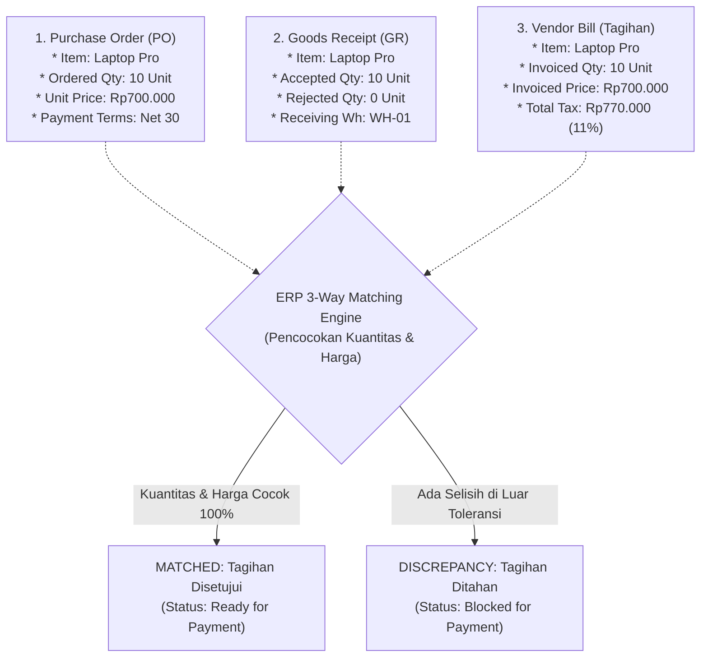
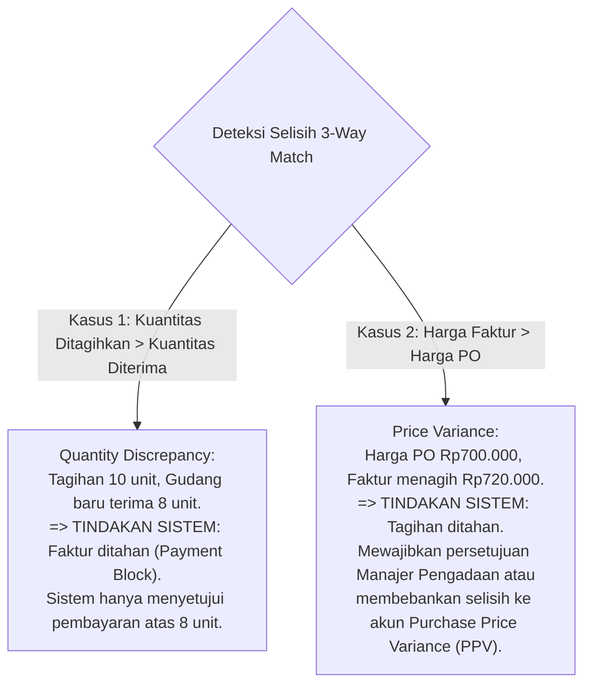

# Three-Way Match

## Definition

**Three-Way Match (Pencocokan Tiga Arah)** adalah mekanisme pengendalian internal (*internal control*) otomatis dalam sistem ERP yang membandingkan dan memvalidasi kesesuaian data antara tiga dokumen kunci pengadaan sebelum faktur tagihan pemasok disetujui untuk dibayar:

1. **Purchase Order (PO)**: Apa yang resmi **dipesan** dan berapa harga yang **disepakati**.
2. **Goods Receipt (GR)**: Berapa kuantitas yang benar-benar **diterima dan lolos uji mutu** di gudang.
3. **Vendor Bill (Faktur Pemasok)**: Berapa kuantitas dan harga yang **ditagihkan** oleh pemasok.

Tujuan mutlak dari aturan ini adalah menegakkan prinsip: **Perusahaan hanya boleh membayar barang yang telah dipesan secara sah dan telah diterima fisiknya secara benar.**

---

## Business Purpose

Penerapan kontrol 3-Way Match dalam ERP bertujuan untuk:
1. **Pencegahan Kelebihan Pembayaran (*Overpayment Prevention*)**: Mencegah pembayaran faktur atas barang yang belum tiba, barang yang hilang di perjalanan, atau barang yang ditolak saat inspeksi mutu gudang.
2. **Perlindungan Terhadap Kenaikan Harga Sepihak (*Price Manipulation Shield*)**: Menghentikan pembayaran jika pemasok menagih dengan harga satuan yang lebih tinggi dari kesepakatan resmi pada *Purchase Order*.
3. **Otomatisasi Persetujuan Tagihan Lurus (*Straight-Through Processing / STP*)**: Memungkinkan tagihan yang cocok 100% (*100% matched*) langsung diposting dan dijadwalkan pembayarannya secara otomatis tanpa perlu persetujuan manual staf akuntansi.
4. **Kepatuhan Audit & Pengendalian Internal (*SOX & COSO Compliance*)**: Memenuhi standar tata kelola keuangan yang mewajibkan adanya bukti penyerahan barang yang dapat ditelusuri sebelum pengeluaran kas disahkan.

---

## The 3-Way Match Architecture

---

## Taksonomi Pencocokan Tagihan: 2-Way vs 3-Way vs 4-Way Match

Sistem ERP mendukung berbagai tingkat ketatnya pencocokan (*Matching Policy*) tergantung pada komoditas yang dibeli:

| Model Pencocokan | Dokumen yang Dibandingkan | Penggunaan Umum dalam Bisnis |
|---|---|---|
| **2-Way Match** | **Purchase Order $\leftrightarrow$ Vendor Bill** | Digunakan untuk pengadaan **Jasa, Sewa, atau Langganan Software** di mana tanda terima fisik gudang tidak ada. Memvalidasi bahwa harga tagihan tidak melebihi komitmen PO. |
| **3-Way Match** | **Purchase Order $\leftrightarrow$ Goods Receipt $\leftrightarrow$ Vendor Bill** | **Standar industri pengadaan barang fisik berwujud (*Inventory*)**. Memvalidasi bahwa $\text{Invoiced Qty} \le \text{Accepted Qty}$ dan $\text{Invoiced Price} \le \text{PO Price}$. |
| **4-Way Match** | **Purchase Order $\leftrightarrow$ Goods Receipt $\leftrightarrow$ Formal Inspection Acceptance $\leftrightarrow$ Vendor Bill** | Digunakan pada industri dengan regulasi ketat (**Farmasi, Kimia, Aviasi, Makanan**). Tagihan baru boleh disahkan jika telah melampirkan sertifikat hasil laboratorium (*Certificate of Analysis / Quality Release*). |

---

## Mesin Toleransi dan Penanganan Selisih (Tolerance Limits & Discrepancies)

Dalam transaksi riil, selisih kecil sering terjadi (misal perbedaan pembulatan desimal atau susut berat cairan curah). ERP enterprise menyediakan aturan batas toleransi (*Tolerance Rules*):

1. **Price Tolerance (Toleransi Selisih Harga)**:
   * *Toleransi Persentase*: Misal selisih harga hingga $\pm 1\%$ diizinkan lolos otomatis.
   * *Toleransi Nominal*: Misal selisih maksimal Rp10.000 diizinkan lolos otomatis tanpa menahan tagihan.
2. **Quantity Tolerance (Toleransi Selisih Kuantitas)**:
   * Untuk barang bernomor seri (*serialized goods*), toleransi kuantitas adalah **0% mutlak**.
   * Untuk komoditas curah (seperti pasir, biji gandum, atau semen), ditetapkan toleransi susut timbangan sebesar $\pm 2\%$.

---

## 2 Jenis Selisih Utama & Perlakuan Sistem

### Resolusi Sengketa Tagihan (*Exception Resolution*):
1. **Pemasok Menerbitkan Nota Kredit (*Credit Note*)**: Vendor mengakui kelebihan tagihan dan menerbitkan nota kredit pembatal selisih.
2. **Revisi Faktur Pemasok**: Pemasok membatalkan faktur lama dan mengirimkan lembar tagihan baru yang sesuai dengan kuantitas fisik yang diterima gudang.
3. **Persetujuan Khusus Manajemen (*Managerial Price Override*)**: Manajer Pengadaan menyetujui kenaikan harga karena adanya kenaikan tarif impor resmi, dan sistem mengalokasikan selisih harga tersebut ke akun varians biaya (*PPV Expense*).

---

## Skenario Acuan Transaksi (Baseline Execution)

Melanjutkan proses pengadaan komponen laptop PT Sumber Teknologi:
1. **Data Purchase Order (`PO-2026-09-0081`)**:
   * Komoditas: 10 Unit *Laptop Pro*.
   * Harga Satuan PO: Rp700.000.
   * Total DPP Dipesan: Rp7.000.000.
2. **Data Goods Receipt (`GR-2026-09-0062`)**:
   * Kuantitas Diterima & Lolos Inspeksi: **10 Unit**.
3. **Data Vendor Bill (`BILL-2026-09-0094`)**:
   * Kuantitas Ditagihkan: **10 Unit**.
   * Harga Satuan Ditagihkan: **Rp700.000**.
   * DPP: Rp7.000.000 (+ PPN 11% Rp770.000 = **Rp7.770.000**).

### Hasil Evaluasi Mesin 3-Way Match ERP:
* *Validasi Kuantitas*: $\text{Invoiced (10)} \equiv \text{Received (10)} \implies \mathbf{MATCHED}$.
* *Validasi Harga*: $\text{Invoiced Price (Rp700.000)} \equiv \text{PO Price (Rp700.000)} \implies \mathbf{MATCHED}$.
* *Validasi Pemasok & Termin*: Identik 100%.
* **Keputusan Sistem**: **MATCHED 100%**. Status tagihan otomatis berubah menjadi `Approved for Payment`. Dokumen diteruskan ke antrean pembayaran perbankan modul Treasury tanpa perlu paraf manual tambahan.

---

## Related Concepts

* [[04-purchasing/purchase-order|Purchase Order]] — Dokumen pilar pertama komitmen harga.
* [[04-purchasing/goods-receipt-and-service-receipt|Goods Receipt and Service Receipt]] — Dokumen pilar kedua bukti fisik penerimaan.
* [[04-purchasing/accounts-payable-integration|Accounts Payable Integration]] — Dokumen pilar ketiga pengesahan kewajiban utang.
* [[02-accounting/accounts-payable|Accounts Payable Accounting]] — Manajemen jadwal pembayaran utang yang telah lolos verifikasi.

---

## References

1. **Committee of Sponsoring Organizations of the Treadway Commission (COSO)**: *Internal Control - Integrated Framework (Control Activities in Procure-to-Pay)*.
2. **Institute of Management Accountants (IMA)**: *Accounts Payable Best Practices and Automated Invoice Matching Controls*.
3. **Microsoft Learn**: *Accounts payable invoice matching overview and 2-way, 3-way matching in Dynamics 365 Finance*. URL: https://learn.microsoft.com/en-us/dynamics365/finance/accounts-payable/accounts-payable-invoice-matching
4. **Frappe / ERPNext Documentation**: *Purchase Invoice 3-Way Matching and Tolerance Validation*. URL: https://docs.frappe.io/erpnext/user/manual/en/accounts/purchase-invoice#3-way-matching
