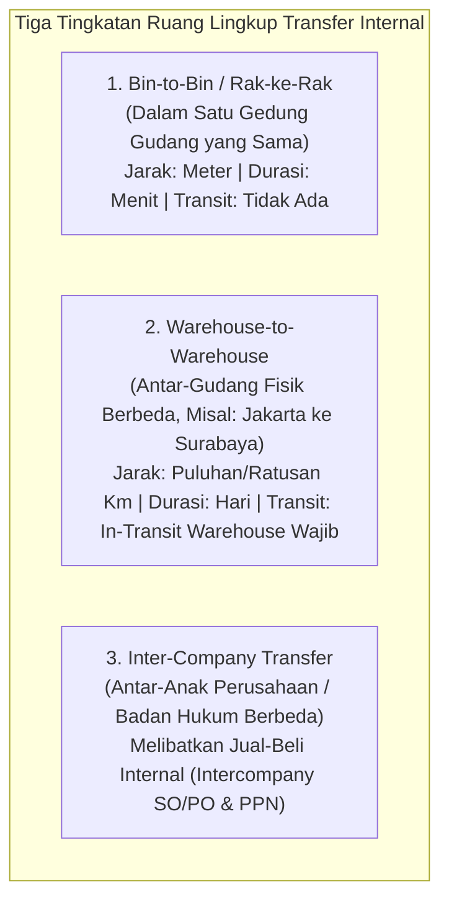
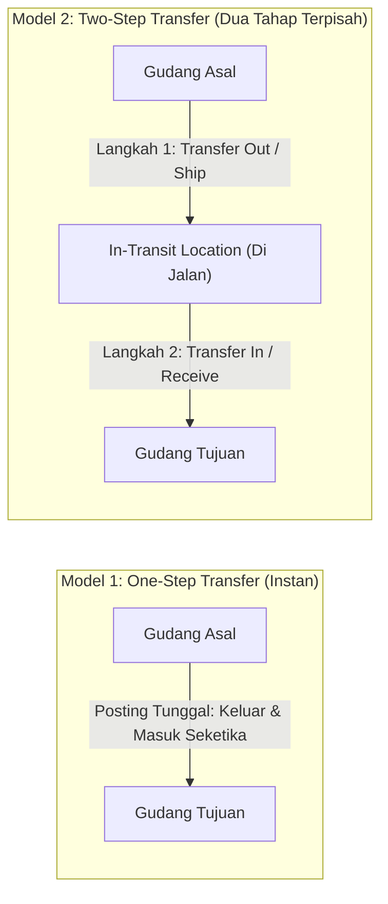
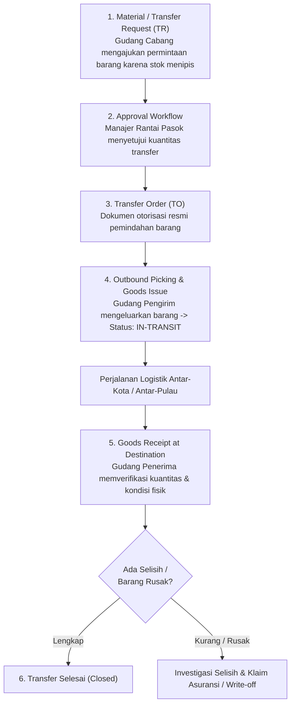

# Internal Stock Transfer

## Definition

**Internal Stock Transfer** (Perpindahan Persediaan Internal) adalah transaksi logistik dalam sistem ERP yang memindahkan kepemilikan fisik barang dari satu koordinat penyimpanan (*Source Location*) ke koordinat penyimpanan lain (*Destination Location*) di dalam entitas organisasi yang sama.

Berbeda dengan transaksi pengadaan atau penjualan yang melibatkan pertukaran hak kepemilikan hukum dengan pihak ketiga (pemasok atau pelanggan), transfer internal **tidak mengubah total kepemilikan aset perusahaan secara keseluruhan**, melainkan mengubah lokasi fisik, penanggung jawab operasional, atau status fungsional dari persediaan tersebut.

---

## Spektrum Ruang Lingkup Perpindahan (Transfer Scopes)

Sistem ERP enterprise mengklasifikasikan perpindahan internal berdasarkan jarak dan kompleksitas logistiknya:

### Karakteristik Masing-Masing Lingkup:

| Ruang Lingkup Transfer | Dokumen Pemicu | Kebutuhan Lokasi In-Transit | Dampak Finansial / Akuntansi |
| :--- | :--- | :--- | :--- |
| **Bin-to-Bin (Internal Relocation)** | *Stock Movement / Relocation Task* | **Tidak**: Pemindahan instan secara fisik di dalam satu ruangan. | **Nihil**: Nilai persediaan di buku besar tetap sama; hanya koordinat bin di *Stock Ledger* yang diperbarui. |
| **Warehouse-to-Warehouse (Intra-Company)** | *Transfer Request $\to$ Transfer Order* | **Wajib jika ada jeda waktu transportasi**: Menghindari hilangnya saldo persediaan di jalan dari neraca perusahaan. | **Perpindahan Subledger / Cabang**: Memindahkan saldo per rincian gudang. Jika gudang memiliki cost center berbeda, jurnal antar-cabang terbentuk. |
| **Inter-Company (Lintas Entitas Hukum)** | *Intercompany Sales Order & Purchase Order* | Mengikuti aturan pengiriman pihak ketiga (FOB Shipping Point / Destination). | **Dampak Penuh**: Diakui sebagai penjualan oleh entitas pengirim dan pembelian oleh entitas penerima; menimbulkan utang-piutang antar-perusahaan (*intercompany AP/AR*) dan kewajiban faktur pajak PPN. |

---

## Model Eksekusi: One-Step vs. Two-Step Transfer

Perbedaan mendasar antara sistem ERP sederhana dan kelas enterprise terletak pada bagaimana sistem menangani faktor waktu selama proses pengiriman:

### 1. One-Step Transfer (Pemindahan Satu Langkah)
* **Mekanisme**: Satu dokumen transaksi tunggal yang saat diposting langsung mengurangi stok di gudang asal dan menambah stok di gudang tujuan pada detik yang sama.
* **Asumsi**: Barang berpindah seketika tanpa jeda waktu perjalanan.
* **Kelemahan**: Jika truk pengangkut dari Jakarta baru tiba di Surabaya 3 hari kemudian, sistem sudah mencatat barang berada di Surabaya sejak hari pertama. Jika staf Surabaya melakukan *cycle count* sebelum truk tiba, akan terjadi ketidaksesuaian fisik (*phantom stock*).

### 2. Two-Step Transfer (Pemindahan Dua Langkah Berbasis In-Transit)
* **Mekanisme**: Proses dibagi secara terpisah antara pengirim dan penerima:
  1. **Transfer Out (Shipment)**: Staf gudang asal memuat barang ke truk dan memposting pengeluaran. Stok di gudang asal berkurang, dan kuantitas berpindah ke **Gudang Virtual Dalam Perjalanan (*In-Transit Warehouse*)**.
  2. **In-Transit State**: Selama perjalanan di jalan tol/laut, saldo persediaan tetap diakui di neraca perusahaan sebagai aset (*Asset In-Transit*), namun tidak dapat dijanjikan kepada pesanan lokal (*Non-ATP*).
  3. **Transfer In (Receipt)**: Setelah truk tiba di gudang tujuan, staf penerima memeriksa fisik barang dan memposting penerimaan. Stok keluar dari lokasi *In-Transit* dan resmi masuk ke saldo *On-Hand* gudang tujuan.
* **Keunggulan**: Memberikan visibilitas penuh terhadap barang yang sedang melintas di jalan dan mengisolasi tanggung jawab kehilangan barang selama perjalanan logistik.

---

## Alur Dokumen Tata Kelola Transfer Internal

Pada organisasi terstruktur, proses mutasi antar-gudang diatur melalui pemisahan fungsi perencanaan dan eksekusi:

---

## Penanganan Selisih Transfer (In-Transit Discrepancies)

Sering kali kuantitas yang tiba di gudang tujuan berbeda dengan kuantitas yang dikirim dari gudang asal (misal: dikirim 10 unit Laptop Pro, namun saat dibongkar di tujuan hanya ada 9 unit, 1 unit hilang/rusak saat transportasi):

> [!warning]
> **Larangan Menolak Seluruh Pengiriman**: Gudang penerima dilarang membatalkan transaksi transfer secara sepihak jika 9 unit lainnya berada dalam kondisi baik.
> 
> Prosedur ERP yang benar:
> 1. Penerima memposting penerimaan parsial (*Partial Receipt*) untuk 9 unit yang diterima secara fisik.
> 2. Sisa 1 unit yang menggantung di *In-Transit Location* diselidiki melalui berita acara selisih transfer.
> 3. Jika unit tersebut terbukti hilang saat pengiriman ekspedisi, diterbitkan dokumen penyesuaian (*Inventory Adjustment / Scrap*) untuk mengalokasikan kerugian ke akun beban kehilangan logistik (*Loss in Transit Expense*).

---

## ERP Implementation Comparison

| Aspek | Odoo Enterprise | ERPNext | Microsoft Dynamics 365 SCM |
| :--- | :--- | :--- | :--- |
| **Model Dokumen** | Menggunakan dokumen `Internal Transfer` (*Stock Picking* bertipe internal). Untuk dua langkah digunakan transit location tipe `Transit Location`. | Menggunakan dokumen `Stock Entry` dengan tipe tujuan *Material Transfer* (1 langkah) atau *Material Transfer for Manufacture*. | Menggunakan dokumen formal tingkat enterprise: **Transfer Order** yang memiliki siklus *Shipment* dan *Receive* terpisah. |
| **Dukungan Lokasi Transit** | Disediakan lokasi virtual sistem berjenis `Transit Location` pada konfigurasi multi-warehouse. | Mendukung *In-Transit Warehouse* khusus yang dipilih pada form Stock Entry. | Memiliki fitur *Transit Warehouse* khusus yang ditautkan langsung ke relasi pasangan gudang asal dan tujuan. |
| **Dampak Biaya Angkut Internal** | Memerlukan modul tambahan atau jurnal penyesuaian biaya persediaan. | Dapat menambahkan elemen biaya tambahan (*Additional Costs*) pada baris Stock Entry untuk menaikkan nilai perolehan di gudang tujuan. | Mendukung fitur *Transfer Order Freight / Miscellaneous Charges* yang dapat dikapitalisasi ke nilai persediaan gudang tujuan. |

---

## Naventra Consideration

Untuk perancangan modul Transfer Internal pada sistem ERP enterprise seperti **Naventra**:

1. **Struktur Data Transfer Order Berpasangan**:
   * Tabel header: `internal_transfer_orders` (`transfer_number`, `source_warehouse_id`, `destination_warehouse_id`, `transit_warehouse_id`, `status: DRAFT, SHIPPED, PARTIALLY_RECEIVED, COMPLETED, CANCELLED`).
   * Tabel baris: `internal_transfer_order_lines` (`item_id`, `requested_qty`, `shipped_qty`, `received_qty`, `lost_qty`).
2. **Otomasi Mutasi Dua Langkah pada Database Engine**:
   * Saat aksi *Shipment* dieksekusi: Sistem memotong kuantitas dari `source_warehouse_id` dan mendebit `transit_warehouse_id`.
   * Saat aksi *Receipt* dieksekusi: Sistem memotong kuantitas dari `transit_warehouse_id` dan mendebit `destination_warehouse_id`.
3. **Pemberlakuan Validasi Status In-Transit**:
   Kuantitas pada gudang bertipe `is_in_transit = TRUE` wajib diblokir secara mutlak dari pemilihan pada form pesanan penjualan (*Sales Order selection*) atau proses produksi (*Work Order consumption*), sehingga barang yang masih di atas truk tidak dapat dijanjikan secara keliru.

---

## References

- ASCM / APICS. *Distribution and Logistics Management: Inter-Facility Material Transfers and Transit Inventory Control*.
- Microsoft Learn. *Transfer Orders and Transit Warehouses in Dynamics 365 Supply Chain Management*.
- Frappe ERPNext Documentation. *Material Transfer and In-Transit Stock Management*.
- Odoo 17 Documentation. *Internal Transfers: Moving Stock Between Locations and Warehouses*.
- Bowersox, D. J., et al. *Supply Chain Logistics Management: Network Facilities and Transfer Operations*.
