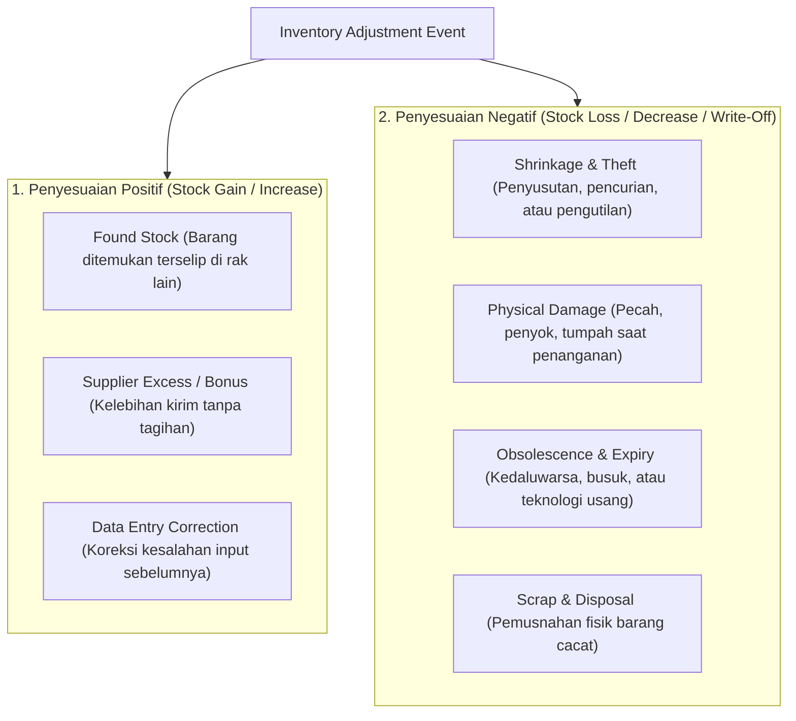
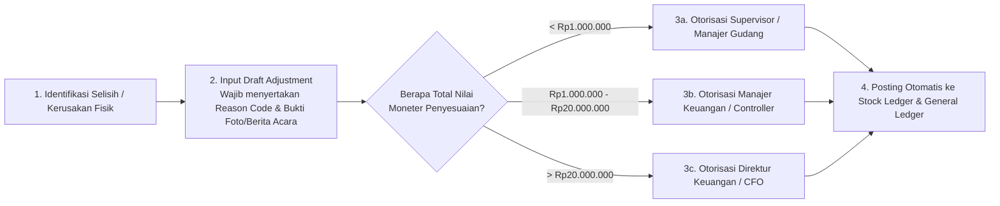

# Inventory Adjustment and Write-Off

## Definition

**Inventory Adjustment and Write-Off** adalah transaksi koreksi luar biasa (*extraordinary corrective transaction*) dalam sistem ERP yang digunakan untuk menyelaraskan ketidaksesuaian (*discrepancy*) antara saldo persediaan yang tercatat di sistem dengan kondisi fisik nyata di lantai gudang, atau untuk menghapus nilai buku barang yang telah rusak, usang, atau hilang.

Berbeda dengan transaksi pergerakan persediaan normal ([[05-inventory/inventory-receiving|Receiving]], [[05-inventory/inventory-picking-and-delivery|Picking]], [[05-inventory/internal-stock-transfer|Transfer]]) yang selalu memiliki dokumen bisnis pembenaran (*supporting business document*) seperti Purchase Order atau Sales Order, penyesuaian persediaan mencerminkan **peristiwa non-transaksional atau kegagalan operasional** (seperti pencurian, penyusutan alami, kerusakan penanganan, atau kesalahan input data historis).

---

## Prinsip Tata Kelola: Penyesuaian Bukan Jalan Pintas Operasional

Salah satu pilar pengendalian internal terpenting dalam tata kelola pergudangan ERP adalah:

> [!caution]
> **Strict Internal Control Warning**: Fitur *Inventory Adjustment* **bukanlah tombol bebas untuk "merapikan" angka sistem tanpa investigasi!**
> 
> Menggunakan penyesuaian persediaan untuk menutupi kesalahan proses (misal: menyesuaikan stok berkurang karena staf lupa memposting dokumen surat jalan) adalah pelanggaran berat tata kelola. Di mata auditor internal dan eksternal, frekuensi dan nilai penyesuaian persediaan yang tinggi merupakan indikator utama adanya kelemahan pengawasan, manipulasi pembukuan, atau potensi penggelapan barang (*theft and fraud*).

---

## Tipologi Penyesuaian Persediaan (Adjustment Typology)

Sistem ERP mengklasifikasikan penyesuaian persediaan ke dalam dua arah mutasi dengan alasan bisnis terstruktur (*Mandatory Reason Codes*):



### Karakteristik Masing-Masing Alasan Penyesuaian:

| Kode Alasan (*Reason Code*) | Dampak Kuantitas | Penyebab Umum | Perlakuan Akuntansi |
| :--- | :--- | :--- | :--- |
| **DAMAGED_IN_WH** | Negatif (-) | Kelalaian penanganan forklift, tertimpa palet lain, atau banjir di area gudang. | Dihapus dari neraca; dibebankan ke akun *Beban Kerusakan Persediaan*. |
| **SHRINKAGE_THEFT** | Negatif (-) | Selisih fisik yang tidak dapat dijelaskan saat penghitungan fisik berkala (*stock opname*). | Dibebankan ke akun *Beban Kehilangan / Selisih Persediaan*. |
| **EXPIRED_SCRAP** | Negatif (-) | Barang melewati batas masa kedaluwarsa dan tidak layak jual secara regulasi. | Pemusnahan fisik resmi (*disposal*); dibebankan ke akun *Beban Barang Usang/Kedaluwarsa*. |
| **FOUND_STOCK** | Positif (+) | Barang terselip di koordinat bin yang salah atau dokumen pembatalan retur belum tercatat. | Diakui penambahan aset persediaan; dikreditkan ke akun *Pendapatan / Selisih Lebih Persediaan*. |
| **REVALUATION_NRV** | Kuantitas Tetap (0), Nilai Berubah | Nilai pasar barang turun di bawah biaya perolehannya sesuai prinsip IAS 2 (*Lower of Cost and NRV*). | Penurunan nilai persediaan (*Inventory Write-Down*); mendebit akun *Beban Penurunan Nilai Persediaan*. |

---

## Alur Tata Kelola dan Otorisasi (Approval Workflow)

Untuk mencegah penyalahgunaan, setiap penyesuaian persediaan wajib melalui alur persetujuan berbasis ambang batas kewenangan (*Delegation of Authority / DOA*):



### Syarat Administrasi Dokumen Penyesuaian:
1. **Mandatory Reason Code**: Pengguna tidak dapat memposting penyesuaian tanpa memilih kode alasan dari daftar terstandarisasi.
2. **Supporting Attachment**: Wajib melampirkan Berita Acara Kerusakan Barang (BAKB), hasil investigasi selisih fisik, atau bukti foto fisik barang yang rusak.
3. **Pemisahan Tugas (*Segregation of Duties*)**: Operator yang menghitung selisih fisik **dilarang** memiliki hak akses untuk menyetujui (*approve*) dokumen penyesuaian di sistem ERP.

---

## Dampak Akuntansi Finansial (Financial Impact)

Penyesuaian persediaan dalam sistem *Perpetual Inventory* secara langsung mengubah nilai aset di neraca dan menghasilkan pengakuan beban/pendapatan di laporan laba rugi:

### Skenario Transaksi Kanonikal:
Misalkan saat inspeksi gudang ditemukan bahwa **1 unit Komponen Utama Laptop Pro** (dengan biaya perolehan Rp750.000, inklusif landed cost) mengalami kerusakan fatal terlindas forklift dan tidak dapat diperbaiki (*Scrap / Write-Off*):

#### Jurnal Akuntansi Penghapusan Barang Rusak (Inventory Write-Off):
* *(Dr)* Beban Kerusakan Persediaan (*Inventory Scrap/Damage Expense*): **Rp750.000**
* *(Cr)* Persediaan Barang Dagang: **Rp750.000**

#### Skenario Sebaliknya: Ditemukan Kelebihan 1 Unit (Inventory Gain):
Jika ditemukan 1 unit berlebih yang sah secara fisik tanpa adanya kewajiban utang pemasok:
* *(Dr)* Persediaan Barang Dagang: **Rp750.000**
* *(Cr)* Pendapatan / Keuntungan Selisih Persediaan (*Inventory Gain*): **Rp750.000**

---

## ERP Implementation Comparison

| Aspek | Odoo Enterprise | ERPNext | Microsoft Dynamics 365 SCM |
| :--- | :--- | :--- | :--- |
| **Model Dokumen** | Menggunakan mekanisme mutasi ke/dari lokasi virtual khusus: `Virtual Locations / Inventory adjustment` atau `Virtual Locations / Scrap`. | Menggunakan dokumen formal `Stock Entry` dengan tipe *Material Issue* (penyesuaian keluar) atau *Material Receipt* (penyesuaian masuk). | Menggunakan jurnal formal: **Inventory Adjustment Journal**, **Counting Journal**, dan **Movement Journal**. |
| **Enforcement Reason Code** | Tersedia melalui field *Reason* (dapat dikonfigurasi wajib pada modul tingkat lanjut). | Kolom *Difference Account* dan field deskripsi/alasan pada tabel baris Stock Entry. | Sangat ketat: Mewajibkan pemilihan *Reason Code* terstruktur yang terintegrasi dengan pemetaan akun GL otomatis. |
| **Pemisahan Scrap vs Adjustment** | Memiliki tombol dan wizard khusus *Scrap* yang langsung memindahkan barang ke lokasi pemusnahan permanen. | Memiliki fitur *Scrap Item* yang mengeluarkan barang dari gudang operasional ke gudang sisa (*Scrap Warehouse*). | Memiliki jurnal khusus *Scrap Journal* atau integrasi dengan modul *Quality Order* dan penanganan limbah. |

---

## Naventra Consideration

Untuk perancangan modul Penyesuaian Persediaan pada sistem ERP enterprise seperti **Naventra**:

1. **Skema Database Dokumen Penyesuaian Terkontrol**:
   ```sql
   CREATE TABLE inventory_adjustments (
       id UUID PRIMARY KEY DEFAULT gen_random_uuid(),
       adjustment_number VARCHAR(50) NOT NULL UNIQUE,
       warehouse_id UUID NOT NULL REFERENCES warehouses(id),
       posting_date DATE NOT NULL,
       reason_code VARCHAR(50) NOT NULL, -- 'DAMAGED_IN_WH', 'SHRINKAGE', 'EXPIRED_SCRAP', 'FOUND'
       supporting_document_ref VARCHAR(100),
       status VARCHAR(30) NOT NULL DEFAULT 'DRAFT', -- 'DRAFT', 'PENDING_APPROVAL', 'APPROVED', 'REJECTED'
       approved_by UUID REFERENCES users(id),
       approved_at TIMESTAMP WITH TIME ZONE,
       total_loss_value NUMERIC(18, 4) NOT NULL DEFAULT 0,
       created_at TIMESTAMP WITH TIME ZONE DEFAULT NOW()
   );

   CREATE TABLE inventory_adjustment_lines (
       id UUID PRIMARY KEY DEFAULT gen_random_uuid(),
       adjustment_id UUID NOT NULL REFERENCES inventory_adjustments(id),
       item_id UUID NOT NULL REFERENCES items(id),
       storage_location_id UUID REFERENCES storage_locations(id),
       batch_number VARCHAR(100),
       serial_number VARCHAR(100),
       quantity_delta NUMERIC(15, 4) NOT NULL, -- Positif untuk gain, Negatif untuk loss
       unit_cost NUMERIC(18, 4) NOT NULL,
       total_amount NUMERIC(18, 4) NOT NULL,
       expense_account_id UUID REFERENCES chart_of_accounts(id)
   );
   ```
2. **Validasi Ambang Batas Otorisasi Otomatis (DOA Validation Hook)**:
   Backend wajib memeriksa `total_loss_value`. Jika nilai penyesuaian melampaui limit wewenang pengguna yang sedang login, sistem menolak posting langsung dan secara otomatis mengubah status transaksi menjadi `PENDING_APPROVAL` dengan meneruskan tiket persetujuan ke atasan terkait.
3. **Audit Trail Mutasi Stok Tidak Terhapus**: Setiap baris penyesuaian yang disetujui wajib menciptakan baris mutasi resmi pada `stock_ledger_entries` dan baris jurnal di `gl_entries` dengan referensi nomor dokumen penyesuaian.

---

## References

- IFRS Foundation. *IAS 2: Inventories (Write-downs to Net Realizable Value and Losses of Inventories)*.
- APICS / ASCM. *Inventory Control and Auditing: Inventory Adjustments, Discrepancies, and Reason Codes*.
- Microsoft Learn. *Inventory Adjustment Journals and Reason Codes in Dynamics 365 Supply Chain Management*.
- Frappe ERPNext Documentation. *Stock Reconciliation and Material Issue/Receipt for Adjustments*.
- Odoo 17 Documentation. *Inventory Adjustments and Scrap Locations Management*.
