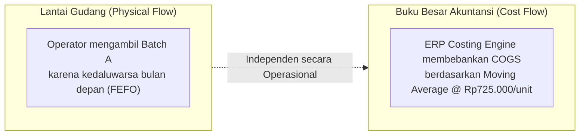
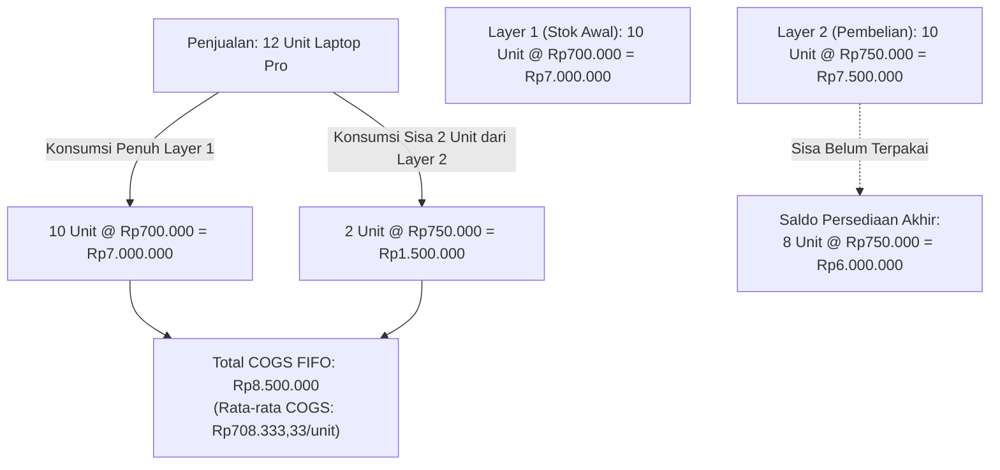

# Inventory Costing and Valuation Methods

## Definition

**Inventory Costing and Valuation Methods** adalah metode matematis dan aturan akuntansi dalam sistem ERP yang digunakan untuk menentukan nilai moneter perolehan dari persediaan barang yang ada di gudang (*Inventory Asset on Balance Sheet*) serta menghitung Beban Pokok Penjualan (*Cost of Goods Sold / COGS on Income Statement*) saat barang tersebut dikeluarkan untuk dijual atau dipakai dalam produksi.

Standar akuntansi internasional **IAS 2 (*Inventories*)** mewajibkan persediaan diukur pada nilai terendah antara Biaya Perolehan (*Cost*) dan Nilai Realisasi Bersih (*Net Realizable Value / NRV*). Dalam sistem ERP, penentuan biaya perolehan unit ini diotomasi melalui algoritma *Costing Engine*.

---

## Perbedaan Fundamental: Physical Flow vs. Cost Flow

Salah satu kesalahpahaman paling umum dalam pengelolaan persediaan adalah menyamakan antara pergerakan fisik barang di gudang dengan aliran biaya di sistem pembukuan:

> [!important]
> **Physical Flow $\neq$ Cost Flow**:
> * **Physical Flow (Aliran Fisik Logistik)**: Urutan fisik bagaimana barang dipindahkan oleh operator gudang dari rak penyimpanan (misal: mengambil barang berdasarkan batch terdekat kedaluwarsa / **FEFO** agar barang tidak basi di rak).
> * **Cost Flow (Aliran Biaya Finansial)**: Rumus matematis akuntansi yang digunakan oleh sistem ERP untuk membebankan nilai moneter ke COGS (misal: menggunakan **Weighted Average Cost** atau **FIFO Costing**).
> 
> Perusahaan dapat secara legal dan operasional menerapkan aliran fisik berbasis FEFO di lantai gudang, sementara pembukuan buku besar (GL) mencatat mutasi menggunakan rumus rata-rata tertimbang (*Moving Average*). Keduanya beroperasi pada lapisan sistem yang berbeda.



---

## Spektrum Metode Biaya Persediaan (Costing Methods)

Sistem ERP enterprise mendukung berbagai metode rumus biaya:

| Metode Biaya | Mekanisme Kalkulasi | Dampak Saat Inflasi Harga | Kepatuhan IFRS (IAS 2) & PSAK |
| :--- | :--- | :--- | :--- |
| **FIFO (First-In, First-Out)** | Barang yang masuk lebih awal diasumsikan berbiaya keluar lebih awal. Menggunakan *Cost Layers*. | Laba kotor lebih tinggi (COGS mencatat harga lama yang lebih murah); nilai persediaan akhir di neraca mencerminkan harga pasar terkini. | **Diizinkan penuh**. |
| **Moving Average (Weighted Average Perpetual)** | Setiap kali ada penerimaan barang baru (*Goods Receipt*), sistem menghitung ulang rata-rata tertimbang biaya per unit secara real-time. | Menghaluskan fluktuasi harga ekstrem (*smoothing effect*); laba kotor stabil. | **Diizinkan penuh**. |
| **Standard Costing** | Nilai barang ditetapkan di awal tahun berdasarkan estimasi biaya standar; selisih antara harga riil faktur dan biaya standar dialokasikan ke akun selisih biaya (*Purchase Price Variance / PPV*). | Menghilangkan variasi biaya perolehan harian; memudahkan analisis varians biaya pabrik. | **Diizinkan bersyarat**: Hanya jika hasilnya mendekati biaya aktual historis. |
| **Specific Identification** | Setiap unit barang secara eksplisit dilacak dengan biaya pembelian aktual individualnya menggunakan nomor seri unik (*Serial Number Tracking*). | Mencerminkan biaya riil 100% tanpa asumsi aliran. | **Wajib** untuk barang berharga tinggi yang tidak dapat saling menggantikan (mobil, perhiasan, karya seni, proyek pesanan khusus). |
| **LIFO (Last-In, First-Out)** | Barang yang terakhir masuk diasumsikan keluar lebih awal. | Menghasilkan laba lebih rendah dan nilai neraca yang usang. | **DILARANG KERAS** oleh IFRS (IAS 2 Paragraf 25) dan PSAK karena tidak rasional terhadap aliran fisik yang wajar. |

---

## Analisis Komparasi Numerik Kanonikal: FIFO vs. Moving Average

Untuk membuktikan secara matematis perbedaan antara metode FIFO dan Moving Average, perhatikan skenario transaksi kanonikal persediaan Laptop Pro berikut:

### Data Transaksi Masuk (Inbound Receipts):
1. **Saldo Awal (Opening Balance)**:
   * Kuantitas: 10 unit @ Rp700.000 = **Rp7.000.000**.
2. **Penerimaan Pembelian Baru + Landed Cost (Inbound Purchase)**:
   * Kuantitas: 10 unit dibeli @ Rp700.000 = Rp7.000.000.
   * Ditambah alokasi ongkos angkut freight masuk (*Landed Cost*): Rp500.000.
   * Total nilai perolehan perolehan baru: Rp7.500.000 (atau setara **Rp750.000/unit**).
   * Total kuantitas tersedia di gudang: $10 + 10 = \mathbf{20 \text{ unit}}$.
   * Total nilai kumulatif persediaan: $\text{Rp}7.000.000 + \text{Rp}7.500.000 = \mathbf{\text{Rp}14.500.000}$.
3. **Transaksi Pengeluaran / Penjualan (Goods Issue / Sales)**:
   * Diterbitkan Delivery Order untuk penjualan sebanyak **12 unit**.

---

### Skenario A: Metode FIFO (First-In, First-Out)

Metode FIFO mengonsumsi lapisan biaya (*cost layers*) tertua terlebih dahulu:



#### Rekonsiliasi Matematis FIFO:
* $\text{Saldo Awal Persediaan} = \text{Rp}7.000.000$
* $\text{Total Pembelian} = \text{Rp}7.500.000$
* $\text{Beban Pokok Penjualan (COGS)} = \text{Rp}8.500.000$
* $\text{Saldo Akhir Persediaan} = \text{Rp}6.000.000$
$$\text{Rekonsiliasi:} \quad \text{Rp}7.000.000 + \text{Rp}7.500.000 - \text{Rp}8.500.000 = \mathbf{\text{Rp}6.000.000} \quad \text{(Cocok 100\%)}$$

---

### Skenario B: Metode Moving Average (Weighted Average Perpetual)

Metode Moving Average menghitung ulang rata-rata tertimbang setiap kali ada barang masuk sebelum barang dikeluarkan:

#### 1. Perhitungan Biaya Rata-Rata Baru (Saat Pembelian Masuk):
$$\text{Moving Average Unit Cost} = \frac{\text{Total Nilai Persediaan}}{\text{Total Kuantitas Tersedia}}$$
$$\text{Moving Average Unit Cost} = \frac{\text{Rp}7.000.000 + \text{Rp}7.500.000}{10 + 10} = \frac{\text{Rp}14.500.000}{20} = \mathbf{\text{Rp}725.000/\text{unit}}$$

#### 2. Perhitungan COGS Saat Pengeluaran (12 Unit Dijual):
$$\text{COGS Moving Average} = 12 \text{ unit} \times \text{Rp}725.000 = \mathbf{\text{Rp}8.700.000}$$

#### 3. Sisa Persediaan Akhir:
* Sisa kuantitas: $20 - 12 = \mathbf{8 \text{ unit}}$.
* Nilai persediaan akhir: $8 \text{ unit} \times \text{Rp}725.000 = \mathbf{\text{Rp}5.800.000}$.

#### Rekonsiliasi Matematis Moving Average:
$$\text{Rekonsiliasi:} \quad \text{Rp}7.000.000 + \text{Rp}7.500.000 - \text{Rp}8.700.000 = \mathbf{\text{Rp}5.800.000} \quad \text{(Cocok 100\%)}$$

---

### Tabel Perbandingan Hasil (FIFO vs. Moving Average):

| Parameter Finansial | Metode FIFO | Metode Moving Average | Selisih Dampak |
| :--- | :--- | :--- | :--- |
| **Kuantitas Dikeluarkan** | 12 unit | 12 unit | Sama (12 unit) |
| **Beban Pokok Penjualan (COGS)** | **Rp8.500.000** | **Rp8.700.000** | FIFO lebih rendah Rp200.000 (Laba kotor lebih tinggi) |
| **Sisa Kuantitas Akhir** | 8 unit | 8 unit | Sama (8 unit) |
| **Nilai Persediaan Akhir di Neraca** | **Rp6.000.000** | **Rp5.800.000** | FIFO lebih tinggi Rp200.000 (Aset lebih mencerminkan harga pasar) |
| **Keseimbangan Neraca** | Terpenuhi seimbang | Terpenuhi seimbang | Keduanya valid dan taat asas |

---

## Standard Costing dan Purchase Price Variance (PPV)

Jika perusahaan menerapkan **Standard Costing** (misal untuk perakitan laptop di pabrik):
* Manajemen menetapkan Biaya Standar komponen Laptop Pro di awal tahun: $\text{Standard Cost} = \text{Rp}700.000/\text{unit}$.
* Saat pembelian baru tiba dengan biaya perolehan riil Rp750.000/unit (inklusif freight):
  * Persediaan tetap dicatat pada nilai standar: $10 \text{ unit} \times \text{Rp}700.000 = \text{Rp}7.000.000$.
  * Selisih biaya sebesar $\text{Rp}50.000/\text{unit} \times 10 = \text{Rp}500.000$ langsung dialokasikan ke akun beban varians:
    * *(Dr)* Persediaan Barang Dagang (Standard Cost): Rp7.000.000
    * *(Dr)* Selisih Varian Harga Beli (*Purchase Price Variance / PPV*): Rp500.000
    * *(Cr)* Utang Barang Belum Ditagih (GR/IR): Rp7.000.000
    * *(Cr)* Utang Ekspedisi Freight: Rp500.000
* Keuntungan: Nilai persediaan di neraca selalu konstan pada angka standar, mempermudah kalkulasi biaya standar produksi (*BOM Costing*).

---

## ERP Implementation Comparison

| Aspek | Odoo Enterprise | ERPNext | Microsoft Dynamics 365 SCM |
| :--- | :--- | :--- | :--- |
| **Metode Biaya Didukung** | *Standard Price*, *Average Cost (AVCO)*, dan *First In First Out (FIFO)* yang dikonfigurasi pada level `Product Category`. | *FIFO* dan *Moving Average* yang dikonfigurasi pada level Company Default atau override per Item Master. | Sangat komprehensif: *FIFO*, *LIFO* (khusus yurisdiksi non-IFRS seperti US GAAP), *Weighted average*, *Date-controlled average*, dan *Standard cost*. |
| **Arsitektur Cost Layer** | FIFO menggunakan entitas `stock.valuation.layer`: setiap penerimaan membuat layer valuasi baru dengan kuantitas dan saldo tersisa. | Menggunakan antrean FIFO (*FIFO Queue*) dalam format JSON string pada baris `Stock Ledger Entry` historis. | Menggunakan tabel `InventCostTrans` dan proses formal bulanan **Inventory Close and Adjustment** untuk merekonsiliasi lapisan biaya. |
| **Rekalibrasi Biaya Masa Lalu** | Menggunakan fitur *Valuation Adjustment* untuk merevaluasi saldo persediaan. | Memiliki dokumen khusus `Stock Reconciliation` untuk mengupdate valuation rate per unit. | Menggunakan fitur *Cost Adjustment* yang dapat memposting penyesuaian biaya mundur (*retroactive cost adjustments*) ke transaksi pengeluaran masa lalu. |

---

## Naventra Consideration

Untuk perancangan modul Costing Engine pada sistem ERP enterprise seperti **Naventra**:

1. **Pemisahan Tabel Cost Layer (Khusus Metode FIFO)**:
   ```sql
   CREATE TABLE inventory_cost_layers (
       id UUID PRIMARY KEY DEFAULT gen_random_uuid(),
       item_id UUID NOT NULL REFERENCES items(id),
       warehouse_id UUID NOT NULL REFERENCES warehouses(id),
       goods_receipt_line_id UUID REFERENCES goods_receipt_lines(id),
       original_quantity NUMERIC(15, 4) NOT NULL,
       remaining_quantity NUMERIC(15, 4) NOT NULL,
       unit_cost NUMERIC(18, 4) NOT NULL,
       layer_date TIMESTAMP WITH TIME ZONE NOT NULL,
       is_exhausted BOOLEAN NOT NULL DEFAULT FALSE
   );
   ```
2. **Cost Engine Service yang Terisolasi**: Rancang perhitungan COGS sebagai modul layanan independen (*Costing Service*). Saat terjadi mutasi keluar:
   * Jika metode FIFO: Ambil baris `inventory_cost_layers` tertua yang `is_exhausted = FALSE`, potong `remaining_quantity`, dan hitung jumlah biaya kumulatif.
   * Jika metode Moving Average: Ambil `current_moving_avg_cost` dari tabel `inventory_balances` dan kalikan dengan kuantitas keluar.
3. **Pemberlakuan Kunci Concurrency Saat Re-Averaging**:
   Saat memposting penerimaan barang baru dengan harga berbeda pada metode Moving Average, lakukan *Row-Level Locking* pada tabel saldo barang untuk memastikan tidak ada pengeluaran barang yang terjadi bersamaan saat biaya rata-rata sedang dihitung ulang.

---

## References

- IFRS Foundation. *IAS 2: Inventories (Cost Measurement, Cost Formulas, and Net Realizable Value)*.
- APICS / ASCM. *APICS Dictionary: Inventory Valuation, Cost Layering, and Moving Average Formulas*.
- Microsoft Learn. *Inventory Costing and Inventory Close Architecture in Dynamics 365 Supply Chain Management*.
- Frappe ERPNext Documentation. *Item Costing: FIFO vs Moving Average Implementation*.
- Odoo 17 Documentation. *Inventory Valuation Methods: Standard, AVCO, and FIFO Configurations*.
