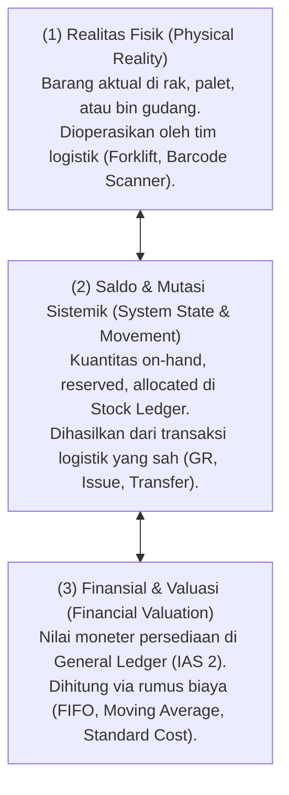
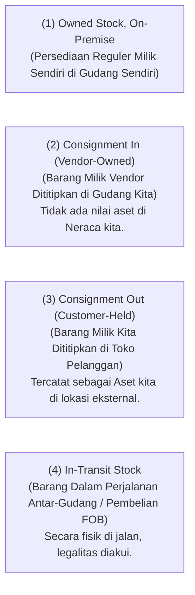

# Inventory Fundamentals in ERP

## Definition

**Inventory (Persediaan)** dalam Enterprise Resource Planning (ERP) adalah representasi komprehensif dari barang fisik berwujud (*tangible physical goods*) yang dimiliki oleh organisasi untuk tujuan diperjualbelikan kembali (barang dagang), digunakan dalam proses perakitan/manufaktur (bahan baku dan barang dalam proses), atau dikonsumsi untuk mendukung operasional harian (*consumables & MRO*).

Dalam arsitektur sistem enterprise, persediaan bukan sekadar kumpulan barang di rak fisik, melainkan **entitas multidimensi** yang menjembatani realitas fisik di gudang dengan catatan kuantitas di sistem logistik dan nilai aset moneter di buku besar keuangan:



---

## Business Purpose

1. **Memastikan Kesinambungan Rantai Pasok (*Supply Continuity*)**: Mencegah terhentinya lini produksi manufaktur atau hilangnya potensi penjualan akibat ketiadaan barang (*stockout*).
2. **Sebagai Peredam Fluktuasi Pasar (*Decoupling Buffer*)**: Menyerap variabilitas antara kecepatan pasokan dari pemasok eksternal dengan dinamika permintaan pelanggan (*demand volatility*).
3. **Akurasi Valuasi Aset Perusahaan**: Persediaan merupakan salah satu komponen aset lancar (*current assets*) terbesar dalam neraca perusahaan dagang dan manufaktur. Kesalahan saldo persediaan secara langsung mendistorsi laba kotor (*Gross Margin*) dan ekuitas perusahaan.
4. **Pemisahan Kepemilikan dan Lokasi (*Ownership vs. Custody*)**: Melacak status kepemilikan barang secara hukum, seperti persediaan konsinyasi (*consignment stock*), barang titipan, atau barang dalam perjalanan (*in-transit stock*).

---

## Taksonomi dan Perbedaan Konsep Kunci

Sering kali istilah dalam persediaan tertukar dalam operasional. ERP enterprise membedakan lima konsep ini secara ketat:

| Istilah | Definisi Konseptual | Contoh Representasi ERP | Karakteristik Utama |
| :--- | :--- | :--- | :--- |
| **Item / Product** | Definisi konseptual barang atau jasa umum dalam katalog master data. | `Laptop Pro 15-inch` | Belum tentu memiliki stok fisik; mendefinisikan atribut umum, kategori pajak, dan akun akuntansi. |
| **SKU (Stock Keeping Unit)** | Varian spesifik dari produk yang dapat diidentifikasi, disimpan, dan dilacak secara individual. | `LP-PRO-15-SLV-16GB-512SSD` | Unit terkecil untuk pelacakan fisik di gudang; memiliki barcode, berat, dan dimensi spesifik. |
| **Stock Movement (Transaction)** | Catatan atomik perpindahan atau perubahan status barang pada titik waktu tertentu. | `Mat-Doc-2026-0089: +10 Unit ke Rak A-01` | **Immutable (Kekal)**: Mutasi stok adalah jurnal logistik berpasangan (*double-entry logistics*). |
| **Inventory Balance (Saldo Stok)** | Kuantitas akumulatif yang dihitung dari total mutasi masuk dikurangi mutasi keluar pada lokasi tertentu. | `Saldo Gudang Utama: 10 Unit` | **Derived Value**: Saldo tidak boleh diedit manual secara langsung di database; wajib dihitung dari pergerakan. |
| **Inventory Valuation (Nilai Persediaan)** | Nilai moneter perolehan dari saldo persediaan berdasarkan metode penetapan biaya yang berlaku. | `10 Unit @ Rp750.000 = Rp7.500.000` | Menghubungkan mutasi logistik dengan [[02-accounting/inventory-accounting|Buku Besar Akuntansi (GL)]]. |

---

## Prinsip Dasar: Saldo Stok Merupakan Nilai Turunan (Derived Balance)

Salah satu prinsip integritas data paling fundamental dalam arsitektur persediaan ERP adalah:

> [!important]
> **Stock Ledger Immutability Principle**: Saldo persediaan (*Inventory Balance*) **bukanlah angka statis yang dapat diubah atau ditimpa secara langsung (*direct database overwrite*)**. Saldo stok adalah **hasil penjumlahan matematis (*derived state*)** dari seluruh transaksi mutasi stok (*Stock Ledger Entries / Material Documents*) yang sah sejak awal pencatatan.

$$\text{Saldo Akhir Stok} = \text{Saldo Awal} + \sum \text{Kuantitas Masuk} - \sum \text{Kuantitas Keluar}$$

Jika terjadi ketidaksesuaian antara jumlah fisik dan sistem:
* Pengguna dilarang mengubah angka saldo secara sepihak.
* Sistem mewajibkan penerbitan dokumen mutasi koreksi resmi berupa [[05-inventory/inventory-adjustment|Inventory Adjustment]] dengan jejak audit dan persetujuan manajerial.

---

## Kepemilikan Persediaan vs Lokasi Fisik (Ownership vs Location)

ERP modern membedakan antara **di mana barang berada secara fisik (*Physical Custody*)** dengan **siapa pemilik sah barang tersebut (*Legal Ownership*)**:



---

## Hubungan Domain: Inventory vs Warehouse Management

Di dalam ERP enterprise, pengelolaan persediaan dibagi menjadi dua lapisan fungsional yang berbeda:

* **Inventory Management (IM)**: Berfokus pada pertanyaan bisnis finansial dan perencanaan:
  * Berapa kuantitas yang tersedia (*available*)?
  * Berapa nilai moneter persediaan (*valuation*)?
  * Kapan dan berapa banyak barang harus dipesan ulang (*replenishment*)?
  * Bagaimana dampaknya terhadap laporan keuangan (*accounting impact*)?
* **Warehouse Management (WM / WMS)**: Berfokus pada eksekusi fisik dan tata letak operasional gudang:
  * Di rak, lorong (*aisle*), dan *bin* mana barang disimpan (*putaway*)?
  * Rute jalan kaki tercepat apa yang harus dilalui staf untuk mengambil barang (*picking path*)?
  * Bagaimana barang dikemas ke dalam palet atau kardus (*packing*)?

---

## ERP Implementation Comparison

| Aspek Arsitektur | Odoo Enterprise | ERPNext | Microsoft Dynamics 365 SCM |
| :--- | :--- | :--- | :--- |
| **Model Mutasi Stok** | Menggunakan prinsip **Double-Entry Logistics**: Setiap mutasi memindahkan stok dari *Source Location* ke *Destination Location* (termasuk lokasi virtual seperti *Vendor Location* atau *Customer Location*). | Menggunakan tabel `Stock Ledger Entry` (SLE): Setiap transaksi menambah (*incoming*) atau mengurangi (*outgoing*) kuantitas pada gudang spesifik dengan tracking perpetual. | Menggunakan konsep **Inventory Transactions** (`InventTrans`): Status transaksi bergerak dari *On-Order*, *Reserved*, *Received*, hingga *Invoiced*. |
| **Kalkulasi Saldo** | Dihitung dari akumulasi record `stock.quant` per kombinasi produk, lokasi, lot/serial, dan package. | Dihitung per baris SLE dengan saldo berjalan (*balance_qty* dan *stock_value*) yang diperbarui secara transaksional. | Tabel agregat `InventSum` menyimpan snapshot saldo on-hand dan availability secara real-time. |
| **Pemisahan IM vs WMS** | Modul *Inventory* dasar menangani IM; aktivasi opsi *Multi-Step Routes* dan *Storage Locations* mengubahnya menjadi fungsionalitas WMS terintegrasi. | Modul *Stock* berfokus pada IM murni; tata letak bin didukung via *Warehouse* hierarkis (Tree structure). | Pemisahan formal yang sangat tegas antara modul *Inventory Management* (dasar) dan *Advanced Warehouse Management System (WMS)* berbasis *Work & Wave*. |

---

## Naventra Consideration

Untuk perancangan modul Persediaan pada sistem ERP enterprise seperti **Naventra**:

1. **Immutable Stock Ledger Table**: Desain tabel `stock_ledger_entries` sebagai tabel *append-only*:
   ```sql
   CREATE TABLE stock_ledger_entries (
       id UUID PRIMARY KEY DEFAULT gen_random_uuid(),
       posting_date TIMESTAMP WITH TIME ZONE NOT NULL,
       voucher_type VARCHAR(50) NOT NULL, -- 'GOODS_RECEIPT', 'DELIVERY_ORDER', 'ADJUSTMENT'
       voucher_no VARCHAR(100) NOT NULL,
       item_id UUID NOT NULL REFERENCES items(id),
       warehouse_id UUID NOT NULL REFERENCES warehouses(id),
       location_id UUID REFERENCES storage_locations(id),
       batch_lot_number VARCHAR(100),
       serial_number VARCHAR(100),
       quantity_delta NUMERIC(15, 4) NOT NULL, -- Positif untuk Masuk, Negatif untuk Keluar
       unit_cost NUMERIC(18, 4) NOT NULL,
       total_value_delta NUMERIC(18, 4) NOT NULL,
       created_at TIMESTAMP WITH TIME ZONE DEFAULT NOW()
   );
   ```
2. **Snapshot Caching untuk Performa Tinggi**: Untuk mencegah pemindaian jutaan baris `stock_ledger_entries` saat mengecek ketersediaan stok (*stock availability check*), sediakan tabel agregasi snapshot `inventory_balances` (`item_id`, `warehouse_id`, `on_hand_qty`, `reserved_qty`, `updated_at`). Setiap mutasi memperbarui tabel snapshot ini secara atomik di dalam satu *database transaction* (`BEGIN ... COMMIT`).
3. **Pemberian ID Transaksi Unik & Idempotensi**: Setiap pergerakan persediaan wajib memiliki *idempotency key* berbasis nomor dokumen sumber untuk mencegah eksekusi ganda mutasi stok saat terjadi *retry* jaringan atau klik ganda oleh operator gudang.
4. **Pencegahan Saldo Negatif**: Sediakan konfigurasi sistem `allow_negative_stock = FALSE` pada level perusahaan dan gudang untuk mencegah distorsi valuasi HPP dan anomali akuntansi persediaan.

---

## References

- APICS / ASCM (Association for Supply Chain Management). *Supply Chain Operations Reference (SCOR) Model: Plan, Source, Make, Deliver, Return*.
- IFRS Foundation. *IAS 2: Inventories (Scope and Measurement)*.
- Microsoft Learn. *Inventory Management Architecture and Principles in Dynamics 365 Supply Chain Management*.
- Frappe ERPNext Documentation. *Stock Fundamentals and Stock Ledger Architecture*.
- Odoo 17 Documentation. *Inventory Management: Double-entry Inventory Concepts and Structure*.
