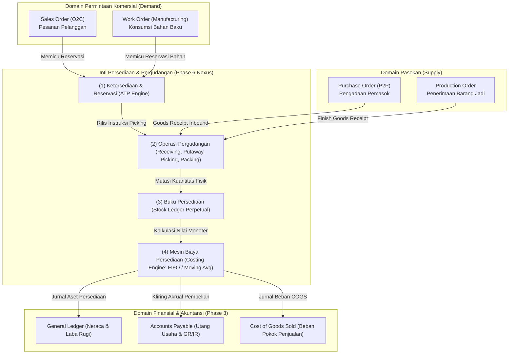

# Inventory and Warehouse Management Integration

## Definition

**Inventory and Warehouse Management Integration** adalah sintesis arsitektural yang menghubungkan pengelolaan persediaan dan pergudangan dengan seluruh domain fungsional enterprise di dalam sistem ERP—menjadikan modul persediaan sebagai **jembatan pusat (central nexus)** yang menyatukan arus fisik barang, komitmen komersial penjualan dan pengadaan, perencanaan manufaktur, hingga pengakuan nilai aset dan beban di buku besar keuangan (*General Ledger*).

Dalam sistem ERP kelas enterprise, persediaan tidak pernah beroperasi dalam isolasi:
* Setiap pesanan penjualan di [[03-sales/sales-fundamentals|Phase 4 (Sales / O2C)]] bergantung pada ketersediaan stok fisik dan reservasi.
* Setiap penerimaan barang di [[04-purchasing/purchasing-fundamentals|Phase 5 (Purchasing / P2P)]] memicu penambahan persediaan dan akrual utang.
* Setiap pergerakan barang di lantai gudang menghasilkan penilaian moneter yang disinkronkan ke [[02-accounting/inventory-accounting|Phase 3 (Accounting)]].

---

## Arsitektur Aliran Terpadu (Enterprise Integrated Architecture)

Diagram berikut merangkum posisi sentral persediaan dalam ekosistem ERP:

---

## Matriks Integrasi Lintas Domain Enterprise

Tabel berikut merangkum hubungan sebab-akibat antara peristiwa operasional di modul eksternal dengan dampak persediaan dan akuntansi di dalam ERP:

| Domain Sumber | Peristiwa Bisnis (*Event*) | Dokumen Sumber | Dampak terhadap Persediaan | Dampak Akuntansi Keuangan (GL) |
| :--- | :--- | :--- | :--- | :--- |
| **Purchasing (P2P)** | Penerimaan barang dari pemasok | [[04-purchasing/goods-receipt-and-service-receipt\|Goods Receipt (GR)]] | **Kuantitas Bertambah (+)** di zona Receiving / Storage Rak. | *(Dr)* Persediaan Barang Dagang *(Cr)* Utang Barang Belum Ditagih (GR/IR Accrual) |
| **Purchasing (P2P)** | Kapitalisasi ongkos angkut inbound | [[05-inventory/landed-cost\|Landed Cost Voucher]] | **Kuantitas Tetap (0)**; Nilai per unit naik. | *(Dr)* Persediaan Barang Dagang *(Cr)* Kliring Landed Cost / Utang Ekspedisi |
| **Purchasing (P2P)** | Pengembalian barang cacat ke pemasok | [[04-purchasing/purchase-return-and-debit-note\|Return to Vendor (RTV)]] | **Kuantitas Berkurang (-)** dari gudang. | *(Dr)* Utang Usaha (Debit Note) *(Cr)* Persediaan Barang Dagang *(Cr)* Koreksi PPN Masukan |
| **Sales (O2C)** | Otorisasi pesanan penjualan | [[03-sales/sales-order\|Sales Order (SO)]] | **Kuantitas Fisik Tetap (0)**; Kuantitas *Reserved* bertambah (+), *Available* berkurang (-). | **Tidak Ada Jurnal Akuntansi** (Komitmen Komersial). |
| **Sales (O2C)** | Pengeluaran barang ke pelanggan | [[03-sales/delivery-and-shipping\|Delivery Order (DO)]] | **Kuantitas Berkurang (-)** dari gudang aktif. | *(Dr)* Beban Pokok Penjualan (COGS) *(Cr)* Persediaan Barang Dagang |
| **Sales (O2C)** | Penerimaan barang retur dari pelanggan | [[03-sales/sales-return-and-credit-note\|Sales Return / RMA]] | **Kuantitas Bertambah (+)** di area Karantina Mutu. | *(Dr)* Persediaan Barang Dagang *(Cr)* Pemulihan Beban COGS (Credit Note terpisah) |
| **Internal Logistics** | Pemindahan stok antar-gudang | [[05-inventory/internal-stock-transfer\|Transfer Order (TO)]] | Berkurang di gudang asal (-), masuk *In-Transit*, bertambah di gudang tujuan (+). | **Umumnya Nihil terhadap Laba/Rugi**; hanya mutasi subledger cabang/akun antar-kantor. |
| **Warehouse Control** | Penyesuaian selisih fisik (*Opname*) | [[05-inventory/inventory-adjustment\|Inventory Adjustment]] | Kuantitas bertambah (+) atau berkurang (-) sesuai varians fisik. | *(Dr/Cr)* Beban/Pendapatan Selisih Persediaan *(Cr/Dr)* Persediaan Barang Dagang |
| **Manufacturing (Preview)** | Pengeluaran bahan baku ke lini perakitan | *Material Issue for Production* | Bahan baku berkurang (-) dari gudang. | *(Dr)* Barang Dalam Proses (WIP) *(Cr)* Persediaan Bahan Baku |
| **Manufacturing (Preview)** | Penerimaan barang jadi dari pabrik | *Production Receipt / Completion* | Barang jadi bertambah (+) di gudang. | *(Dr)* Persediaan Barang Jadi *(Cr)* Barang Dalam Proses (WIP) |

---

## Prinsip Kritis: Aliran Fisik vs. Aliran Finansial (Physical vs. Financial Flow)

Salah satu pilar arsitektur ERP enterprise paling fundamental adalah memahami bahwa **aliran fisik barang dan aliran finansial berjalan beriringan namun berada pada lintasan dokumen yang berbeda**:

```mermaid
flowchart TD
    subgraph PhysicalFlow["Lintasan Aliran Fisik (Logistics & Supply Chain)"]
        P1["Pemasok Eksternal"] -->|"Truk Logistik"| P2["Gudang Pembeli (Goods Receipt)"]
        P2 -->|"Internal Putaway & Storage"| P3["Rak Penyimpanan Gudang"]
        P3 -->|"Picking & Packing Outbound"| P4["Armada Ekspedisi (Delivery Order)"]
        P4 -->|"Penyerahan Fisik (POD)"| P5["Pelanggan Akhir"]
    end

    subgraph FinancialFlow["Lintasan Aliran Finansial (Accounting & Finance)"]
        F1["Faktur Pembelian Vendor"] -->|"3-Way Match Verification"| F2["Accounts Payable (Utang Usaha)"]
        F2 -->|"Transfer Kas/Bank"| F3["Penyelesaian Pembayaran (Disbursement)"]
        
        F4["Faktur Penjualan (Customer Invoice)"] -->|"Pengakuan Pendapatan IFRS 15"| F5["Accounts Receivable (Piutang Usaha)"]
        F5 -->|"Penerimaan Kas/Bank"| F6["Pelunasan Piutang (Collection)"]
    end
```

> [!important]
> **Pemisahan Peristiwa**:
> Barang dapat berpindah secara fisik hari ini, namun faktur tagihan dan pelunasan uang baru terjadi 30 atau 60 hari kemudian. ERP menggunakan akun-akun akrual perantara (*GR/IR Clearing* dan *Unbilled Receivables*) untuk menjamin neraca keuangan tetap seimbang dan taat pada prinsip akuntansi berbasis akrual (*Accrual Accounting*).

---

## Penelusuran Transaksi Kanonikal: Siklus Hidup Menyeluruh

Untuk mendemonstrasikan integrasi penuh dari awal hingga akhir, berikut adalah penelusuran numerik kanonikal terpadu:

### 1. Saldo Awal Persediaan (Opening Inventory)
* Saldo fisik di Gudang Utama: **10 unit Komponen Laptop Pro**.
* Biaya perolehan historis: **Rp700.000/unit**.
* Nilai aset persediaan di neraca: $10 \times \text{Rp}700.000 = \mathbf{\text{Rp}7.000.000}$.

### 2. Pembelian Baru + Kapitalisasi Landed Cost (Inbound Logistics)
* Dibeli tambahan **10 unit** dari PT Sumber Teknologi @ Rp700.000 = Rp7.000.000 (DPP).
* Saat barang tiba, diposting Goods Receipt `GR-2026-0010`. Saldo kuantitas fisik gudang menjadi **20 unit**.
* Jasa ekspedisi inbound menagihkan ongkos angkut freight sebesar **Rp500.000**.
* Diposting Landed Cost Voucher: Biaya freight dikapitalisasi ke nilai perolehan 10 unit pembelian baru:
  $$\text{Total Biaya Masuk Baru} = \text{Rp}7.000.000 + \text{Rp}500.000 = \mathbf{\text{Rp}7.500.000 \text{ (atau Rp750.000/unit)}}$$
* Total nilai persediaan kumulatif di neraca: $\text{Rp}7.000.000 + \text{Rp}7.500.000 = \mathbf{\text{Rp}14.500.000}$ (untuk 20 unit fisik).

### 3. Penjualan dan Pemenuhan Pesanan (Outbound Logistics)
* Pelanggan memesan **10 unit Laptop Pro**. Pesanan disetujui, stok direservasi, diambil (*picked*), dikemas, dan dikirimkan via Delivery Order `DO-2026-0088`.
* Terjadi mutasi persediaan keluar sebesar **10 unit**.

#### Perhitungan Nilai COGS dan Persediaan Akhir:
* **Jika Menggunakan Metode FIFO**:
  * 10 unit yang dijual berasal dari lapisan biaya tertua (*Layer 1 - Stok Awal*): $10 \text{ unit} \times \text{Rp}700.000 = \mathbf{\text{Rp}7.000.000 \text{ (COGS)}}$.
  * Saldo akhir persediaan: 10 unit @ Rp750.000 (lapisan pembelian baru) = **Rp7.500.000**.
  * Rekonsiliasi: $\text{Rp}7.000.000 + \text{Rp}7.500.000 - \text{Rp}7.000.000 = \mathbf{\text{Rp}7.500.000}$.
* **Jika Menggunakan Metode Moving Average**:
  * Biaya rata-rata tertimbang sebelum pengeluaran: $\frac{\text{Rp}14.500.000}{20 \text{ unit}} = \mathbf{\text{Rp}725.000/\text{unit}}$.
  * COGS diakui: $10 \text{ unit} \times \text{Rp}725.000 = \mathbf{\text{Rp}7.250.000 \text{ (COGS)}}$.
  * Saldo akhir persediaan: $10 \text{ unit} \times \text{Rp}725.000 = \mathbf{\text{Rp}7.250.000}$.
  * Rekonsiliasi: $\text{Rp}7.000.000 + \text{Rp}7.500.000 - \text{Rp}7.250.000 = \mathbf{\text{Rp}7.250.000}$.

*Korelasi Finansial*: Seluruh angka saling merekonsiliasi dengan sempurna ($\text{Stok Awal} + \text{Pembelian} - \text{COGS} = \text{Stok Akhir}$), membuktikan keutuhan matematis model data ERP.

---

## ERP Implementation Comparison

| Aspek Arsitektur | Odoo Enterprise | ERPNext | Microsoft Dynamics 365 SCM |
| :--- | :--- | :--- | :--- |
| **Model Integrasi Inti** | Arsitektur grafis rute mutasi (*Double-Entry Stock Routes*): Menghubungkan seluruh pergerakan gudang dengan modul Sales, Purchase, Manufacturing, dan Accounting secara otomatis. | Terpadu monolitik: Menggunakan tabel pusat `Stock Ledger Entry` yang langsung memicu pembaruan `GL Entry` jika perpetual inventory aktif. | Arsitektur modular terdistribusi kelas enterprise: Pemisahan tegas antara modul *Inventory Management*, *Warehouse Management (WMS)*, *Cost Management*, dan *General Ledger*. |
| **Sinkronisasi GL** | Real-time posting via jurnal otomatis saat valuasi persediaan diatur ke *Automated* pada Product Category. | Real-time posting via GL Entry saat opsi *Enable Perpetual Inventory* diaktifkan pada Company Master. | Mendukung arsitektur *Subledger Journal*: Posting dapat diset real-time (*Immediate*) atau batch terjadwal berkinerja tinggi. |
| **Dukungan Manufaktur & WMS** | Modul MRP terintegrasi langsung dengan WMS; penanganan komponen perakitan via rute *Pull / Push*. | Terintegrasi dengan modul Manufacturing: Work Order otomatis memotong persediaan via *Stock Entry (Manufacture)*. | Fitur tingkat industri: *Advanced Warehouse for Manufacturing* yang memandu pasokan material ke lantai kerja (*Work Cell*) via rute Kanban/Wave. |

---

## Naventra Consideration

Untuk perancangan arsitektur integrasi Persediaan pada sistem ERP enterprise seperti **Naventra**:

1. **Transactional Event Pipeline (Arsitektur Event-Driven Terisolasi)**:
   * Saat mutasi stok terjadi (misal: penyerahan Delivery Order), sistem mempublikasikan domain event internal: `InventoryIssuedEvent` (`item_id`, `warehouse_id`, `quantity`, `cost_method`, `cost_amount`, `source_doc_ref`).
   * Layanan akuntansi (*Accounting Subscriber*) menerima event ini dan membuat baris jurnal `gl_entries` secara asinkron atau dalam transaksi terdistribusi yang aman (*Saga Pattern / Outbox Pattern*).
2. **Kepatuhan Audit Trail Kekal (Append-Only Journaling)**:
   Pastikan tidak ada perintah `UPDATE` atau `DELETE` pada tabel mutasi persediaan (`stock_ledger_entries`) atau tabel jurnal keuangan (`gl_entries`). Koreksi wajib dilakukan dengan memposting baris mutasi cermin berpasangan (*Compensating Transaction*).
3. **Pemberlakuan Kunci Idempotensi Lintas Modul**:
   Setiap transaksi integrasi antar-modul (misal: pembuatan mutasi dari SO) wajib menyertakan kunci `idempotency_key = hash(source_doc_type, source_doc_id, line_number)`. Hal ini menjamin bahwa kegagalan jaringan atau proses *retry* tidak akan pernah menduplikasi mutasi stok fisik maupun pencatatan jurnal akuntansi ganda.

---

## References

- ASCM / APICS. *Supply Chain Operations Reference (SCOR) Model: Cross-Functional Logistics and Inventory Integration*.
- IFRS Foundation. *IAS 2: Inventories (Measurement, Cost Formulas, and Recognition as an Expense)*.
- Microsoft Learn. *End-to-End Inventory and Cost Management Integration in Dynamics 365 Supply Chain Management*.
- Frappe ERPNext Documentation. *Perpetual Inventory System and Cross-Module Integration*.
- Odoo 17 Documentation. *Automated Inventory Valuation and Integration with Sales, Purchase, and Accounting*.
