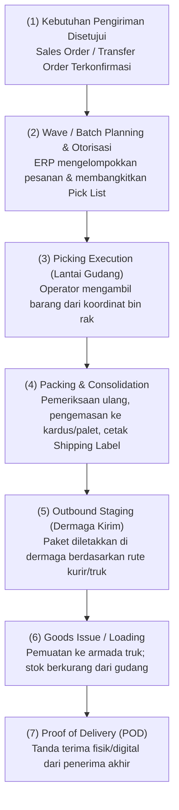
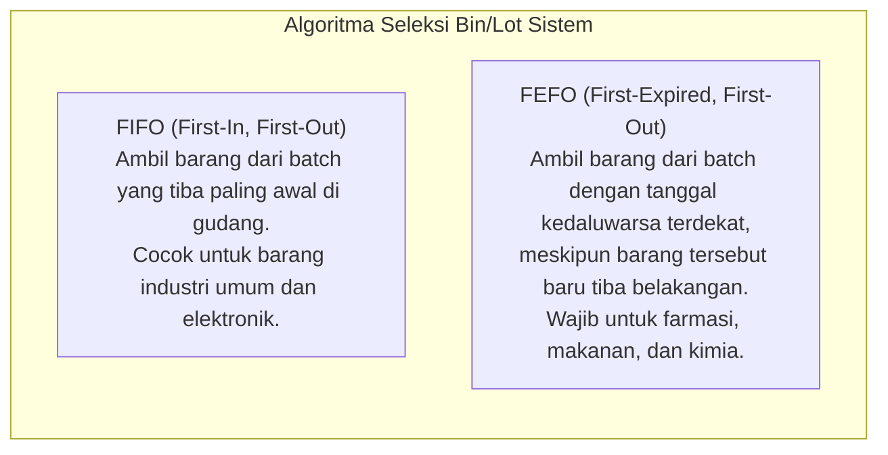
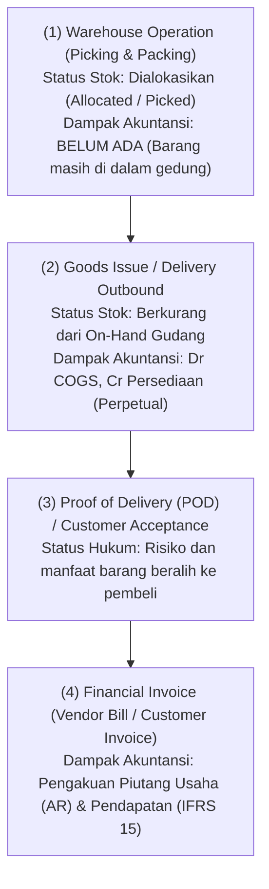

# Inventory Picking, Packing, and Delivery

## Definition

**Inventory Picking, Packing, and Delivery** adalah serangkaian proses operasional logistik keluar (*outbound logistics*) di fasilitas pergudangan untuk memenuhi permintaan pengiriman barang—mulai dari pengambilan barang dari rak penyimpanan (*picking*), pengemasan dan pelabelan paket (*packing*), penempatan di dermaga pengiriman (*staging*), hingga penyerahan fisik barang ke armada transportasi (*goods issue / shipping*) dan penerimaan konfirmasi bukti serah terima (*Proof of Delivery / POD*).

Jika pada [[03-sales/delivery-and-shipping|Phase 4 Delivery and Shipping]] fokus dititikberatkan pada alur komersial pesanan penjualan (*Sales Order*) dan pengakuan beban pokok penjualan (COGS), maka dalam domain Pergudangan dan Persediaan (Phase 6), fokus berpusat pada **efisiensi rute pengambilan fisik, strategi pengambilan massal (*picking strategies*), manajemen ruang kemas, serta pemisahan tegas antara eksekusi pergudangan dengan penagihan finansial**.

---

## Alur Logistik Outbound (Outbound Step-by-Step Flow)

Proses pemenuhan pesanan di pergudangan modern dibagi menjadi tahapan terstruktur:

---

## Strategi Pengambilan Barang di Gudang (Picking Strategies)

Memilih barang satu per satu untuk setiap pesanan penjualan (*Discrete Order Picking*) sangat tidak efisien untuk operasi pergudangan volume tinggi. Sistem WMS dan ERP modern menyediakan berbagai strategi picking lanjutan:

| Strategi Picking | Cara Kerja Operasional | Kapan Digunakan? | Manfaat Utama |
| :--- | :--- | :--- | :--- |
| **Discrete Order Picking** | Satu operator mengambil seluruh item untuk satu pesanan penjualan dari awal hingga akhir. | Gudang berskala kecil, volume pesanan harian rendah, atau barang berukuran sangat besar (*heavy machinery*). | Sederhana, minim risiko tercampurnya barang antar-pesanan. |
| **Batch Picking** | Operator mengambil barang yang sama sekaligus untuk beberapa pesanan yang berbeda dalam satu kali putaran jalan (*single tour*), lalu memilahnya di meja kemas (*sortation*). | Industri e-commerce retail dengan banyak pesanan yang memesan barang serupa dalam kuantitas kecil. | Mengurangi waktu tempuh jalan kaki (*travel time*) operator hingga 50%. |
| **Zone Picking (Pick-and-Pass)** | Gudang dibagi menjadi zona-zona fisik. Setiap operator bertanggung jawab atas satu zona tertentu dan hanya mengambil barang yang berada di zonanya. | Gudang berukuran sangat besar dengan ribuan SKU dan subdivisi khusus (misal: zona dingin, zona kimia, zona barang bernilai tinggi). | Operator sangat menguasai zonanya; mencegah kemacetan lorong (*traffic congestion*). |
| **Wave Picking** | Pesanan dikelompokkan ke dalam gelombang (*waves*) berdasarkan kriteria operasional spesifik (misal: waktu jemput truk kurir, rute geografis pengiriman, atau prioritas SLA pelanggan). | Fasilitas distribusi terpadu dengan jadwal keberangkatan armada transportasi yang terjadwal ketat. | Mensinkronkan aktivitas picking di gudang dengan jadwal kedatangan truk logistik. |

---

## Logika Pemilihan Stok: FIFO vs. FEFO

Saat sistem membangkitkan instruksi pengambilan (*Pick Directive*), algoritma ERP menentukan rak dan lot mana yang harus diambil terlebih dahulu:

> [!important]
> **Penting: Logika Fisik (Picking Path) vs. Rumus Biaya (Costing Flow)**
> * Mengambil barang berdasarkan **FEFO/FIFO fisik di lantai gudang** adalah keputusan operasional logistik agar barang lama tidak kedaluwarsa atau berdebu di rak.
> * Menghitung **biaya persediaan menggunakan Moving Average atau FIFO akuntansi** adalah keputusan kebijakan finansial. 
> 
> Sistem dapat menjalankan picking fisik berbasis FEFO di lantai gudang, sementara pembukuan akuntansi menggunakan metode *Moving Average Cost*. Keduanya saling melengkapi dan tidak boleh dicampuradukkan.

---

## Packing, Staging, dan Verifikasi Akhir

Setelah barang diambil dari rak:
1. **Packing & Barcode Verification**: Petugas meja kemas memindai kembali setiap barcode barang (*double-check*) guna memastikan tidak ada salah ambil produk (*picking error*) sebelum dimasukkan ke dalam kardus karton (*outer box*) atau palet kayu.
2. **Weight Check & Manifesting**: Kardus ditimbang pada timbangan digital. Jika berat riil menyimpang dari berat teoritis sistem (berdasarkan data *Net/Gross Weight* pada Item Master), sistem membunyikan alarm peringatan potensi barang kurang atau lebih.
3. **Pemberian Label Ekspedisi (*Shipping Label & ASN*)**: Sistem mencetak label pengiriman berstandar GS1 (*Serial Shipping Container Code / SSCC*) yang memuat nomor pelacakan kurir pihak ketiga (*Tracking Number*).
4. **Staging**: Paket diletakkan di dermaga pengiriman (*Shipping Bay*) pada lajur yang telah dialokasikan untuk truk ekspedisi yang bersangkutan.

---

## Pemisahan: Warehouse Operation vs. Delivery Confirmation vs. Financial Invoice

Sistem ERP enterprise membedakan secara tegas tiga peristiwa yang kerap kali salah dipahami sebagai peristiwa tunggal:

* Mengambil barang dari rak (*picking*) **bukanlah** pengiriman ke pelanggan.
* Menyerahkan barang ke pengemudi kurir (*goods issue*) **bukanlah** jaminan pelanggan telah menerima barang (*POD required*).
* Mencetak dokumen jalan (*Delivery Order*) **tidak boleh disamakan** dengan pencetakan faktur penagihan (*Customer Invoice*).

---

## ERP Implementation Comparison

| Dimensi | Odoo Enterprise | ERPNext | Microsoft Dynamics 365 SCM |
| :--- | :--- | :--- | :--- |
| **Alur Rute Pengiriman** | Mendukung *Multi-step Outbound Routes*: 1-step (Deliver direct), 2-step (Pick $\to$ Ship), 3-step (Pick $\to$ Pack $\to$ Ship). | Alur default adalah dokumen tunggal `Delivery Note`. Untuk alur kompleks digunakan *Pick List* terpisah sebelum *Delivery Note*. | Sangat komprehensif: Menggunakan konsep *Waves*, *Work Templates*, dan *Location Directives* untuk memandu operator via aplikasi mobile WMS. |
| **Dukungan Wave & Batch Picking** | Mendukung *Batch Transfers* dan *Wave Transfers* melalui aktivasi modul *Batch, Wave & Cluster Transfers*. | Memiliki fitur *Pick List* yang dapat mengonsolidasikan beberapa Sales Order ke dalam satu rute picking. | Fitur tingkat industri: *Wave processing engine*, *Cluster picking*, *Voice-guided picking*, dan *Cross-docking*. |
| **Aturan Alokasi FEFO/FIFO** | Ditentukan pada *Removal Strategy* di level Product Category atau Location: FIFO, LIFO, atau FEFO (*closest removal date*). | Diatur secara otomatis pada tabel batch saat item memiliki atribut *Has Expiry Date* (prioritas tanggal kedaluwarsa). | Konfigurasi formal pada *Item Model Group* dan *Reservation Hierarchy* (mendukung *FIFO Date-Controlled*). |

---

## Naventra Consideration

Untuk perancangan modul Picking dan Outbound Logistics pada sistem ERP enterprise seperti **Naventra**:

1. **Pemisahan Dokumen Perencanaan vs Eksekusi Fisik**:
   * Tabel `delivery_orders`: Dokumen pengiriman komersial/legal ke pelanggan (merujuk `sales_order_id`, alamat tujuan, kurir, nomor resi).
   * Tabel `picking_lists` dan `picking_tasks`: Dokumen kerja lantai gudang yang memuat daftar koordinat rak (`source_location_id`), kuantitas yang harus diambil, dan urutan rute jalan operator (*optimal walk path*).
2. **Pemberlakuan Locking Kuantitas Saat Picking Berjalan**:
   Saat `picking_task` diterbitkan, sistem memindahkan status kuantitas dari `reserved_qty` menjadi `allocated_qty` pada tabel `inventory_balances`. Hal ini mencegah staf gudang lain mengambil barang fisik yang sama untuk pesanan darurat yang berbeda.
3. **Konfirmasi Pemindaian Barcode Dua Titik (Two-Point Verification)**:
   Aplikasi mobile operator wajib mengharuskan dua pemindaian berurutan:
   1. Pindai barcode rak/bin untuk memvalidasi operator berada di koordinat yang benar.
   2. Pindai barcode produk/lot untuk memvalidasi barang yang diambil tidak keliru.
4. **POD Image Attachment & Geo-Tagging**: Sediakan kapabilitas penyimpanan bukti foto tanda terima fisik (*Proof of Delivery*) dan koordinat GPS penerimaan saat barang diserahkan oleh armada internal perusahaan.

---

## References

- ASCM / APICS. *Warehouse Management: Order Fulfillment, Picking Methodologies, and Packing Systems*.
- De Koster, R., et al. *Design and Control of Warehouse Order Picking: A State of the Art Review*. European Journal of Operational Research.
- Microsoft Learn. *Outbound Logistics and Wave Processing Architecture in Dynamics 365 Supply Chain Management*.
- Frappe ERPNext Documentation. *Pick List and Delivery Note Outbound Fulfillment*.
- Odoo 17 Documentation. *Outbound Shipments: Multi-step Routes and Batch/Wave Picking*.
