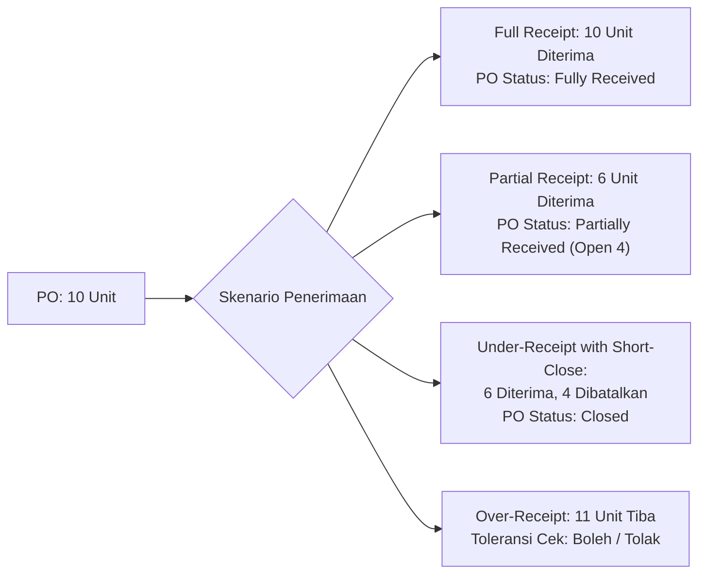

# Inventory Receiving and Inbound Logistics

## Definition

**Inventory Receiving and Inbound Logistics** adalah rangkaian proses operasional dan sistemik di fasilitas gudang untuk menerima barang fisik yang datang dari pemasok eksternal, transfer antar-gudang, atau lini perakitan pabrik internal—mulai dari pembongkaran muatan (*unloading*), verifikasi dokumen jalan, inspeksi mutu (*inspection*), pencatatan tanda terima (*Goods Receipt*), hingga penempatan barang ke rak penyimpanan definitif (*putaway*).

Jika pada [[04-purchasing/goods-receipt-and-service-receipt|Phase 5 Goods Receipt]] fokus utama dititikberatkan pada pemenuhan kontrak komersial Purchase Order dan pengakuan akrual utang (*GR/IR Accrual*), maka dalam domain Persediaan dan Pergudangan (Phase 6), fokus bergeser ke **eksekusi fisik barang, integritas tata letak rak gudang (*slotting*), penanganan cacat mutu, dan perubahan status ketersediaan stok**.

---

## Alur Langkah Penerimaan Inbound (Inbound Step-by-Step Flow)

Proses penerimaan barang di pergudangan modern dibagi menjadi tahapan terstruktur:

```mermaid
flowchart TD
    Truck["(1) Kedatangan Truk & Pembongkaran (Unloading)<br/>Truk vendor tiba di Receiving Dock"]
    --> Staging["(2) Receiving Staging & Dokumen Check<br/>Pencocokan Surat Jalan Vendor vs Open PO"]
    
    Staging --> QCReq{Butuh Inspeksi<br/>Mutu (QC)?}
    
    QCReq -- "Ya" --> Quarantine["(3) Pemindahan ke QC Hold / Karantina<br/>Status: Non-ATP (Stok Tidak Boleh Dijual)"]
    Quarantine --> QCInspect["(4) Pemeriksaan Kualitas & Pengujian Sampel"]
    
    QCInspect --> QCResult{Hasil QC?}
    QCResult -- "Lolos / Accepted" --> Putaway["(5) Putaway Process<br/>Penempatan ke Rak / Storage Bin Definitif"]
    QCResult -- "Ditolak / Rejected" --> Rejection["Penanganan Barang Cacat<br/>Dipindahkan ke Rejection Bay<br/>Memicu Return to Vendor (RTV)"]
    
    QCReq -- "Tidak (Direct)" --> Putaway
    
    Putaway --> FinalStock["(6) Stok Berstatus Available (ATP Active)<br/>Siap untuk Reservasi Penjualan & Produksi"]
```

---

## Perbedaan Status Kuantitas pada Siklus Penerimaan

Untuk menjaga akurasi operasional, sistem ERP membedakan lima status kuantitas kritis sepanjang alur penerimaan:

| Status Kuantitas | Keterangan Operasional | Dampak Lokasi Gudang |
| :--- | :--- | :--- |
| **Ordered Quantity** | Kuantitas yang disetujui pada Purchase Order. | Belum ada barang fisik di gudang. |
| **Received Quantity** | Kuantitas fisik kotor yang dibongkar dari truk di dermaga penerimaan (*Receiving Dock*). | Berada di zona *Receiving Bay*. |
| **Accepted Quantity** | Kuantitas yang dinyatakan lolos inspeksi kualitas dan spesifikasi teknis. | Siap dipindahkan ke area penyimpanan. |
| **Rejected Quantity** | Kuantitas yang cacat, pecah, terkontaminasi, atau tidak sesuai spesifikasi PO. | Berada di zona *Quarantine / Reject Bay*; menunggu retur vendor. |
| **Put Away Quantity** | Kuantitas barang yang telah selesai dipindai dan diletakkan di koordinat rak (*bin*) definitif. | Status stok beralih menjadi *Available (ATP)*. |
| **Invoiced Quantity** | Kuantitas yang telah diverifikasi dan disetujui tagihannya oleh bagian Akuntansi via [[04-purchasing/three-way-match|Three-Way Match]]. | Dampak finansial definitif di buku besar utang usaha. |

---

## Variasi Penerimaan: Full, Partial, Over-Receipt, and Under-Receipt

Sistem ERP menerapkan aturan validasi bisnis (*business rules*) untuk mengatur deviasi kuantitas antara dokumen PO dan fisik yang diterima:



### 1. Partial Receipt (Penerimaan Bertahap)
* Vendor mengirimkan sebagian pesanan karena keterbatasan armada atau stok.
* ERP memposting Goods Receipt untuk kuantitas yang diterima (misal: 6 unit dari 10 unit).
* Baris PO tetap berstatus terbuka (*Partially Received*) dengan sisa kuantitas terbuka (*open quantity*) sebesar 4 unit yang menunggu pengiriman berikutnya.

### 2. Over-Receipt (Penerimaan Melebihi Pesanan)
* Vendor mengirimkan barang lebih banyak dari yang dipesan pada PO (misal: PO 10 unit, dikirim 11 unit).
* **Toleransi Bisnis (*Over-Receipt Tolerance*)**:
  * *Zero Tolerance (Ketat)*: ERP memblokir posting penerimaan untuk 1 unit lebih; barang kelebihan harus dikembalikan langsung ke truk vendor.
  * *Percentage Tolerance (Fleksibel)*: Diizinkan batas toleransi tertentu (misal: $+10\%$). Sangat lazim untuk barang curah (pipa, kabel, bahan kimia). Unit kelebihan diterima dan menambah saldo stok serta akrual utang.

### 3. Under-Receipt & Short-Close (Kekurangan Pengiriman)
* Vendor hanya mampu mengirim 6 unit dan mengonfirmasi bahwa 4 unit sisanya tidak dapat dipenuhi.
* Manajemen pengadaan melakukan *Short-Close* (lihat [[04-purchasing/purchase-cancellation-and-amendment|Purchase Cancellation and Amendment]]), menutup sisa pesanan dan melepaskan cadangan komitmen anggaran (*budget encumbrance*).

---

## Proses Putaway dan Optimasi Slotting

**Putaway** adalah aktivitas fisik dan sistemik untuk memindahkan barang dari *Receiving Bay* ke lokasi penyimpanan definitif di dalam gudang:

1. **Direct Putaway (Satu Tahap)**:
   * Operator gudang langsung memindai barcode barang dan barcode rak tujuan dalam satu transaksi tunggal. Cocok untuk gudang berskala kecil.
2. **Directed Putaway (Berbasis Aturan Sistem / WMS Rules)**:
   * ERP menghitung lokasi penempatan optimal secara otomatis berdasarkan kriteria:
     * **Karakteristik Produk**: Barang berat diletakkan di rak bawah; barang dingin diletakkan di *Cold Storage*.
     * **Slotting Optimization (Kecepatan Pergerakan)**: Barang *Fast-Moving* diletakkan dekat dengan area pengiriman (*Shipping Dock*); barang *Slow-Moving* diletakkan di rak tinggi atau lorong belakang.
     * **Konsolidasi Lot/Batch**: Menggabungkan barang dari lot yang sama di lokasi rak yang berdekatan.

---

## Dampak Fisik vs. Dampak Akuntansi

Penting untuk memisahkan antara realitas logistik pergudangan dengan pencatatan akuntansi keuangan:

* **Realitas Pergudangan**:
  * Saat barang tiba di dermaga: Status kuantitas adalah *Received (Staging)*.
  * Saat dipindahkan ke QC: Status kuantitas adalah *Quarantine*.
  * Saat diletakkan di rak: Status kuantitas adalah *Available*.
* **Pencatatan Akuntansi Finansial**:
  * Terjadi secara atomik pada saat dokumen resmi **Goods Receipt** divalidasi (*Posted*), terlepas dari apakah barang masih di area staging atau sudah di rak:
    * *(Dr)* Persediaan Barang Dagang: $\text{Rp}4.200.000$ (untuk 6 unit @ Rp700.000)
    * *(Cr)* Utang Barang Belum Ditagih (GR/IR Accrual): $\text{Rp}4.200.000$
  * Perpindahan fisik internal dari *Receiving Bay* ke *Storage Bin* **tidak menimbulkan jurnal finansial baru** di buku besar (*General Ledger*), melainkan hanya memutasi koordinat lokasi pada buku pembantu stok (*Stock Ledger*).

---

## ERP Implementation Comparison

| Aspek | Odoo Enterprise | ERPNext | Microsoft Dynamics 365 SCM |
| :--- | :--- | :--- | :--- |
| **Alur Rute Penerimaan** | Menggunakan *Multi-step Routes* pada konfigurasi gudang: 1-step (Receive direct), 2-step (Receive $\to$ Stock), atau 3-step (Receive $\to$ Quality $\to$ Stock). | Alur default adalah dokumen tunggal `Purchase Receipt`. Alur multi-tahap dicapai melalui mutasi internal antar-gudang (*Material Transfer*). | Sangat komprehensif: Mendukung *Arrival Overview*, *Item Arrival Journal*, dan *Work Order Inbound Putaway* dengan arahan perangkat mobile WMS. |
| **Pemisahan Karantina (QC)** | Dikelola via modul *Quality*: pembentukan *Quality Alert / Quality Check* yang menahan perpindahan dokumen *Stock Picking*. | Fitur *Inspection Required* pada baris Item; kuantitas masuk ke *Rejected Warehouse* jika tidak memenuhi kriteria inspeksi. | Menggunakan *Quality Order* dan konfigurasi *Item Sampling* yang secara otomatis mengunci status persediaan ke *Blocking / Quarantine*. |
| **Over-Receipt Tolerance** | Memerlukan modul tambahan atau penyesuaian aturan kuantitas pada dokumen picking. | Kolom *Over Receipt Allowance Percentage* pada level konfigurasi Item Master atau Purchasing Settings. | Konfigurasi formal *Overdelivery Percentage* pada baris Purchase Order; memblokir penerimaan jika melampaui toleransi. |

---

## Naventra Consideration

Untuk perancangan modul Penerimaan Inbound pada sistem ERP enterprise seperti **Naventra**:

1. **Pemisahan Header dan Baris Detail Penempatan (Receipt vs Putaway)**:
   * Tabel `goods_receipts` mencatat dokumen penyerahan legal dari vendor (nomor surat jalan, tanggal tiba, vendor ID, nomor PO).
   * Tabel `goods_receipt_lines` mencatat kuantitas kotor diterima (`received_qty`), kuantitas lolos (`accepted_qty`), dan kuantitas ditolak (`rejected_qty`).
   * Tabel `putaway_tasks` mencatat instruksi pemindahan fisik dari area staging ke koordinat bin definitif (`from_location_id`, `to_location_id`, `task_status`).
2. **Validasi Toleransi Penerimaan Berbasis Persentase**:
   ```sql
   -- Validasi sebelum menyimpan baris Goods Receipt
   IF (new_received_qty + line.accumulated_received_qty) > (line.ordered_qty * (1 + line.over_receipt_tolerance_pct / 100.0)) THEN
       RAISE EXCEPTION 'Kuantitas penerimaan (%) melampaui batas toleransi over-receipt yang diizinkan (%)', 
           new_received_qty, line.ordered_qty * (1 + line.over_receipt_tolerance_pct / 100.0);
   END IF;
   ```
3. **Mobile Barcode Scanning Workflow**: Rancang antarmuka penerimaan agar ramah perangkat genggam (*handheld barcode terminal*): operator memindai nomor PO $\to$ memindai barcode produk $\to$ memindai barcode bin rak penyimpanan. Hal ini meminimalkan kesalahan input data (*human error*) di lantai gudang yang bising.

---

## References

- ASCM / APICS. *Warehouse Management: Receiving Operations, Inbound Quality Inspection, and Cross-Docking*.
- Tompkins, J. A., et al. *Facilities Planning: Receiving and Putaway Systems*.
- Microsoft Learn. *Inbound Logistics and Putaway Processing in Dynamics 365 Supply Chain Management*.
- Frappe ERPNext Documentation. *Purchase Receipt and Material Inspection Workflow*.
- Odoo 17 Documentation. *Receipts and Multi-step Inbound Routing Configurations*.
