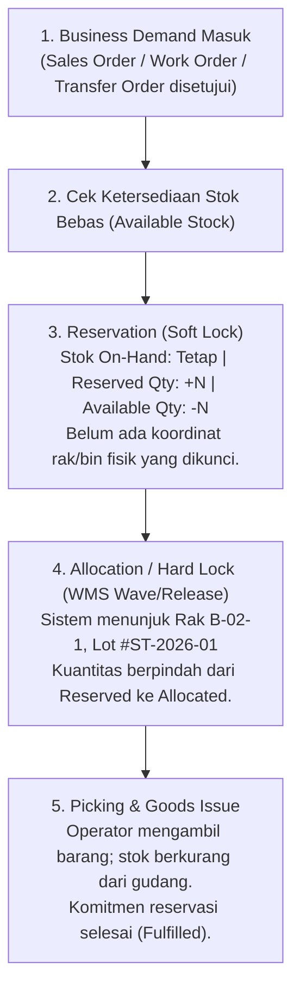

# Inventory Reservation and Allocation

## Definition

**Inventory Reservation and Allocation** adalah mekanisme orkestrasi pemenuhan permintaan (*demand fulfillment*) dalam sistem ERP yang mengunci ketersediaan persediaan barang untuk pesanan tertentu—sehingga barang tersebut terlindung dari klaim atau penjualan oleh pesanan lain yang masuk belakangan.

Meskipun dalam percakapan sehari-hari istilah *Reservation* dan *Allocation* kerap disamakan, sistem ERP enterprise membedakannya secara tegas:
* **Reservation (Komitmen Logis / Soft Lock)**: Mengikat kuantitas barang secara sistemik pada tingkat gudang tanpa menunjuk fisik barang atau koordinat rak (*bin*) tertentu.
* **Allocation (Penetapan Fisik / Hard Lock)**: Menunjuk secara spesifik unit barang, lot/batch, nomor seri, dan koordinat rak tertentu yang harus diambil oleh staf gudang saat menerbitkan instruksi pengambilan (*Pick List*).

---

## Alur Progresi Komitmen: Demand ke Fisik

Proses penguncian persediaan bergerak dari komitmen abstrak hingga pelepasan fisik:



---

## Mekanisme Kuantitas dan Contoh Perhitungan

Untuk memahami bagaimana reservasi dan alokasi memengaruhi ketersediaan persediaan, perhatikan skenario berikut:

### Parameter Awal:
* **Gudang Utama**: Komponen Laptop Pro memiliki saldo fisik $\text{On-Hand} = 100 \text{ unit}$.
* Belum ada pesanan aktif: $\text{Reserved} = 0$, $\text{Allocated} = 0$, $\text{Available} = 100 \text{ unit}$.

---

### Kronologi Transaksi:

#### Langkah 1: Masuk Pesanan A (Order A = 40 Unit)
* Pelanggan A memesan 40 unit Laptop Pro. Pesanan disetujui.
* ERP mengeksekusi **Reservasi (Soft Lock)** untuk Order A:
  $$\text{On-Hand} = 100 \text{ unit}$$
  $$\text{Reserved} = 40 \text{ unit}$$
  $$\text{Available} = 100 - 40 = \mathbf{60 \text{ unit}}$$
* *Dampak*: 40 unit telah diikat haknya oleh Order A. Staf penjualan lain hanya dapat melihat sisa 60 unit yang bebas dijual.

#### Langkah 2: Masuk Pesanan B (Order B = 50 Unit)
* Pelanggan B memesan 50 unit Laptop Pro.
* Sistem memeriksa: Kebutuhan (50 unit) $\le$ Stok Bebas Tersedia (60 unit). Reservasi disetujui:
  $$\text{On-Hand} = 100 \text{ unit}$$
  $$\text{Reserved} = 40 + 50 = 90 \text{ unit}$$
  $$\text{Available} = 100 - 90 = \mathbf{10 \text{ unit}}$$

#### Langkah 3: Gelombang Pengambilan Dimulai untuk Order A (Alokasi 40 Unit)
* Manajer gudang merilis gelombang pengiriman (*Delivery Wave*) untuk Order A.
* ERP mengeksekusi **Alokasi (Hard Lock)**: Sistem menentukan bahwa 40 unit harus diambil dari Lorong 1, Rak A-02, Lot #LPT-001.
  $$\text{On-Hand} = 100 \text{ unit}$$
  $$\text{Reserved (Non-Allocated)} = 50 \text{ unit (milik Order B)}$$
  $$\text{Allocated (Siap Pick)} = 40 \text{ unit (milik Order A)}$$
  $$\text{Available (Bebas)} = 10 \text{ unit}$$

#### Langkah 4: Pengeluaran Barang Order A (Goods Issue)
* Truk logistik tiba dan memuat 40 unit milik Order A. Dokumen Delivery Order diposting.
  $$\text{On-Hand} = 100 - 40 = \mathbf{60 \text{ unit}}$$
  $$\text{Allocated} = 0 \text{ unit}$$
  $$\text{Reserved} = 50 \text{ unit (Order B)}$$
  $$\text{Available} = 60 - 50 = \mathbf{10 \text{ unit}}$$
* Siklus komitmen untuk Order A selesai secara paripurna.

---

## Kebijakan Alokasi (Allocation Policies)

Ketika permintaan melebihi stok yang ada (*Scarcity / Shortage*), atau ketika banyak pesanan bersaing memperebutkan stok yang terbatas, ERP enterprise menerapkan berbagai aturan alokasi (*allocation rules*):

| Kebijakan Alokasi | Logika Operasional | Contoh Kasus Bisnis |
| :--- | :--- | :--- |
| **FIFO Demand (First-Ordered, First-Served)** | Pesanan yang disetujui lebih awal mendapat prioritas alokasi stok terlebih dahulu. | Toko online retail dan e-commerce konsumen umum. |
| **Customer Tier / Priority Ranking** | Pelanggan VIP / Platinum mendapatkan prioritas alokasi di atas pelanggan reguler, meskipun pesanan pelanggan reguler masuk lebih awal. | Distribusi B2B industri farmasi atau perhotelan berantai. |
| **Earliest Promised Date (EDD)** | Pesanan dengan tanggal janji pengiriman paling mendesak dialokasikan lebih dahulu. | Manufaktur berbasis proyek dengan penalti keterlambatan kontrak (*liquidated damages*). |
| **Pro-Rata / Fair Share Allocation** | Stok yang tersedia dibagi secara proporsional kepada seluruh pemesan yang ada. | Krisis kelangkaan pasokan global (misal: jatah vaksin atau chip semikonduktor). |
| **Manual Allocation Override** | Pengalokasian diputuskan secara diskresioner oleh Manajer Rantai Pasok melalui antarmuka konsol khusus. | Penanganan pesanan darurat militer, bencana alam, atau direksi. |

---

## Masa Berlaku dan Pelepasan Reservasi (Reservation Expiry & Release)

Mencadangkan stok tanpa batas waktu dapat membahayakan perputaran modal kerja perusahaan:

* **Masalah "Hoarding" (Penimbunan Stok oleh Pesanan Gantung)**:
  Pelanggan memesan barang dalam jumlah besar namun menunda pembayaran atau menolak konfirmasi pengiriman. Jika stok terkunci selamanya, penjualan kepada calon pembeli lain yang siap membayar tunai akan terlewatkan (*lost sales*).
* **Reservation Expiry Time (TTL / Time-To-Live)**:
  ERP enterprise menyediakan konfigurasi masa kedaluwarsa reservasi otomatis (misal: *Reservasi berlaku selama 48 jam kerja*).
* **Otomasi Pelepasan (*Auto-Release Engine*)**:
  Jika hingga batas waktu yang ditentukan pesanan tidak dilunasi atau tidak diterbitkan instruksi pengirimannya, latar belakang sistem (*scheduled background worker*) secara otomatis membatalkan reservasi:
  $$\text{Reserved Qty} \longrightarrow \text{Dilepas kembali ke Available Qty}$$
  Notifikasi pembatalan reservasi dikirimkan ke bagian penjualan dan pelanggan.

---

## ERP Implementation Comparison

| Dimensi | Odoo Enterprise | ERPNext | Microsoft Dynamics 365 SCM |
| :--- | :--- | :--- | :--- |
| **Tingkat Reservasi** | Dikelola pada dokumen *Delivery Order* (*Stock Picking*): tombol *Check Availability* mengunci kuantitas pada tabel `stock.quant`. | Dikelola pada level baris Sales Order: field *Reserved Qty* diperbarui otomatis saat dokumen berstatus *Submitted*. | Menggunakan hierarki reservasi formal: *Reservation Hierarchy* (Site $\to$ Warehouse $\to$ Inventory Status $\to$ Location $\to$ Batch/Serial). |
| **Otomasi Alokasi Rak** | Menggunakan *Removal Strategy* (FIFO/FEFO) untuk menentukan bin saat dokumen picking divalidasi. | Menggunakan fitur *Auto-Set Batch/Serial* saat membuat dokumen Delivery Note. | Algoritma *Work Creation*: sistem membangkitkan instruksi kerja (*Work*) dengan lokasi rak dan rute jalan teroptimasi. |
| **Masa Kedaluwarsa Reservasi** | Memerlukan modul tambahan atau penjadwalan aksi otomatis (*Automated Actions*). | Tidak memiliki fitur native auto-expire reservasi default (memerlukan pembatalan manual atau script kustom). | Memiliki fitur tingkat enterprise: *Inventory Reservation Engine* dengan parameter tanggal jatuh tempo dan kebijakan prioritas. |

---

## Naventra Consideration

Untuk perancangan modul Reservasi dan Alokasi pada sistem ERP enterprise seperti **Naventra**:

1. **Skema Tabel Reservasi Khusus (Reservation Ledger)**:
   ```sql
   CREATE TABLE inventory_reservations (
       id UUID PRIMARY KEY DEFAULT gen_random_uuid(),
       demand_document_type VARCHAR(50) NOT NULL, -- 'SALES_ORDER', 'WORK_ORDER', 'TRANSFER_ORDER'
       demand_document_id UUID NOT NULL,
       demand_line_id UUID NOT NULL,
       item_id UUID NOT NULL REFERENCES items(id),
       warehouse_id UUID NOT NULL REFERENCES warehouses(id),
       
       -- Spesifikasi Alokasi (NULL jika Soft Reservation)
       storage_location_id UUID REFERENCES storage_locations(id),
       batch_number VARCHAR(100),
       serial_number VARCHAR(100),
       
       reserved_quantity NUMERIC(15, 4) NOT NULL,
       allocated_quantity NUMERIC(15, 4) NOT NULL DEFAULT 0,
       is_hard_allocated BOOLEAN NOT NULL DEFAULT FALSE,
       
       expires_at TIMESTAMP WITH TIME ZONE,
       status VARCHAR(30) NOT NULL DEFAULT 'ACTIVE', -- 'ACTIVE', 'FULFILLED', 'RELEASED', 'EXPIRED'
       created_at TIMESTAMP WITH TIME ZONE DEFAULT NOW()
   );
   ```
2. **Atomic Check-and-Reserve Function**:
   Terapkan fungsi *stored procedure* dengan transaksi berkunci untuk menjamin kuantitas tersedia mencukupi sebelum reservasi disetujui:
   ```sql
   -- Menggunakan transactional lock pada tabel balance
   PERFORM on_hand_qty, reserved_qty 
   FROM inventory_balances 
   WHERE item_id = p_item_id AND warehouse_id = p_warehouse_id 
   FOR UPDATE;
   
   IF (v_on_hand - v_reserved) < p_requested_qty THEN
       RAISE EXCEPTION 'Kuantitas persediaan bebas tidak mencukupi untuk melakukan reservasi.';
   END IF;
   ```
3. **Daemon Worker untuk Auto-Expire**:
   Jalankan background worker berkala (misal: setiap 15 menit) untuk memindai baris reservasi berstatus `ACTIVE` dengan `expires_at < NOW()`, lalu ubah statusnya menjadi `EXPIRED` dan pulihkan saldo `available_qty` pada tabel ringkasan persediaan.

---

## References

- APICS / ASCM. *APICS Dictionary: Soft Allocation, Hard Allocation, and Reservation Hierarchy Rules*.
- Vollmann, T. E., et al. *Manufacturing Planning and Control for Supply Chain Management: Master Scheduling and Order Allocation*.
- Microsoft Learn. *Inventory Allocation and Reservation Architecture in Dynamics 365 Supply Chain Management*.
- Frappe ERPNext Documentation. *Sales Order Reserved Quantity and Stock Allocation*.
- Odoo 17 Documentation. *Stock Reservations and Removal Strategies in Inventory*.
