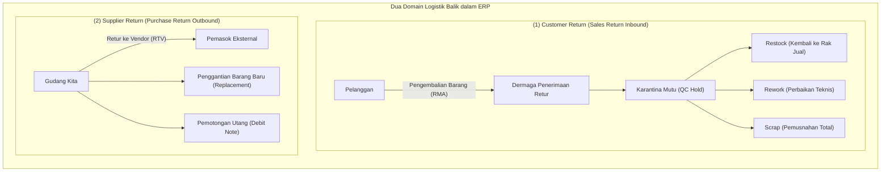
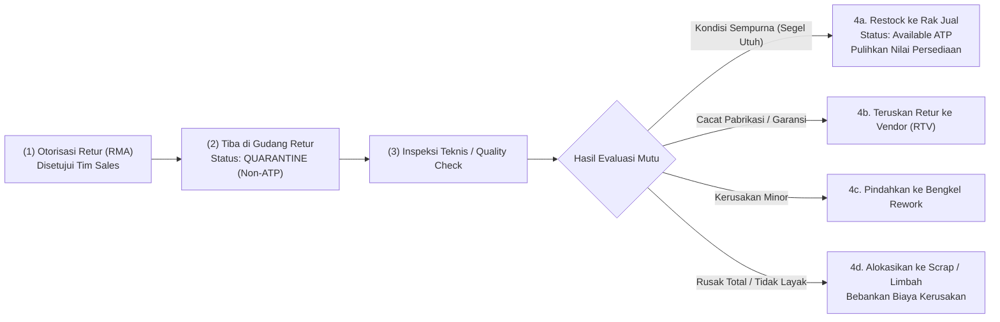
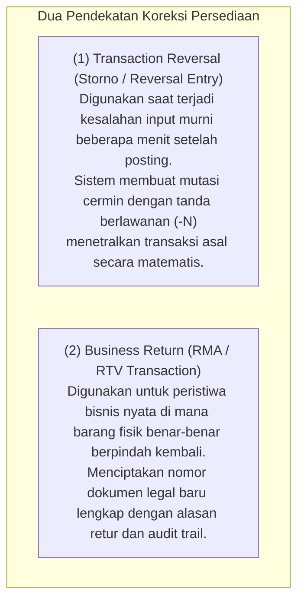

# Inventory Return, Quarantine, and Reversal

## Definition

**Inventory Return, Quarantine, and Reversal** adalah tata kelola sistemik dalam ERP yang mengatur logistik balik (*reverse logistics*) dan pembatalan mutasi stok—mulai dari pengembalian barang cacat ke pemasok (*Return to Vendor / RTV*), penerimaan pengembalian barang dari pelanggan (*Sales Return / RMA*), isolasi fisik dan sistemik di area karantina mutu (*Quality Quarantine*), hingga penentuan disposisi akhir apakah barang dapat dijual kembali (*restock*), diperbaiki (*rework*), atau harus dimusnahkan (*scrap*).

Logistik balik merupakan salah satu proses paling rentan dalam sistem ERP karena berisiko mencemari data persediaan yang sehat jika barang cacat atau barang bekas pakai salah dimasukkan kembali ke rak persediaan barang baru yang siap jual (*Available ATP*).

---

## Tipologi Logistik Balik (Reverse Logistics Typology)

Sistem ERP membedakan dua arah utama logistik balik:



---

## Logistik Balik Pelanggan: Alur Penerimaan dan Disposisi Karantina

Saat pelanggan mengembalikan barang, barang fisik **dilarang langsung dimasukkan ke rak stok bebas**. Barang wajib melalui alur inspeksi bertahap:



### Matriks Opsi Disposisi Akhir (Disposition Matrix):

| Opsi Disposisi | Tindakan Fisik di Gudang | Perlakuan Mutasi Stock Ledger | Dampak Akuntansi Finansial |
| :--- | :--- | :--- | :--- |
| **Return to Stock (Restock)** | Barang dibersihkan, dikemas ulang, dan diletakkan kembali di rak penyimpanan barang jadi. | Mutasi Masuk ke Gudang Reguler (`quantity_delta = +N`). | *(Dr)* Persediaan Barang Dagang<br/>*(Cr)* Pemulihan Beban Pokok Penjualan (COGS Recovery). |
| **Quarantine / Investigation** | Barang diisolasi di ruangan terkunci khusus menunggu uji laboratorium atau keputusan manajemen. | Kuantitas masuk ke lokasi bertipe *Quarantine* (`is_available_for_atp = FALSE`). | Nilai persediaan diakui sebagai persediaan tertahan di neraca. |
| **Scrap / Write-Off** | Barang dihancurkan secara fisik di hadapan saksi auditor untuk mencegah penyalahgunaan. | Barang dikeluarkan dari sistem persediaan secara permanen. | *(Dr)* Beban Kerusakan / Retur Rusak<br/>*(Cr)* Persediaan Barang Dagang. |
| **Return to Vendor (RTV)** | Barang dikemas dan dikirimkan kembali ke pemasok asal yang memasok komponen tersebut. | Mutasi Keluar dari Gudang (`quantity_delta = -N`). | Mengurangi utang usaha melalui [[04-purchasing/purchase-return-and-debit-note|Penerbitan Debit Note]]. |

---

## Logistik Balik Pemasok: Pengembalian Barang ke Vendor (RTV)

Pengembalian barang ke vendor terjadi ketika barang yang dibeli mengalami cacat pabrikasi tersembunyi (*latent defect*) atau salah kirim spesifikasi:

### Skenario Kanonikal Retur Pembelian:
* Dari 10 unit Komponen Utama Laptop Pro yang dibeli dari PT Sumber Teknologi, terdeteksi **1 unit mengalami cacat fungsi motherboard**.
* Tim gudang menerbitkan dokumen *Return to Vendor (RTV)*.
* Fisik 1 unit dikeluarkan dari gudang penyimpanan.
* **Dampak Finansial**:
  * Mengurangi saldo kuantitas persediaan di gudang sebesar 1 unit.
  * Mengurangi saldo nilai persediaan sebesar Rp700.000 (harga pokok perolehan DPP).
  * Bagian utang usaha menerbitkan [[04-purchasing/purchase-return-and-debit-note|Debit Note]] untuk memotong kewajiban utang ke PT Sumber Teknologi sebesar Rp777.000 (DPP + PPN 11%).

---

## Perbedaan: Dokumen Koreksi vs. Reversal Pembatalan

Dalam sistem ERP, koreksi persediaan dilakukan melalui dua pendekatan arsitektur yang berbeda:



> [!important]
> **Larangan Menghapus Transaksi Asal**: Baik melalui Reversal maupun Return, sistem ERP **dilarang menghapus baris transaksi lama (*no hard deletion*)**. Dokumen lama tetap tersimpan di database sebagai bukti audit, dan dokumen pembatalan/retur menautkan referensi ke nomor dokumen lama tersebut.

---

## ERP Implementation Comparison

| Aspek | Odoo Enterprise | ERPNext | Microsoft Dynamics 365 SCM |
| :--- | :--- | :--- | :--- |
| **Alur Retur Penjualan** | Tombol *Return* pada dokumen *Delivery Order*: membangkitkan dokumen *Stock Picking* baru berarah masuk (*IN*) dari Customer Location ke Internal Location. | Checklist *Is Return* pada form `Delivery Note` atau `Purchase Receipt`: memungkinkan input kuantitas negatif terhadap dokumen asli. | Modul formal tingkat enterprise: **Return Order (RMA)** yang terintegrasi dengan *Disposition Codes* dan *Arrival Management*. |
| **Alur Retur Pembelian** | Tombol *Return* pada dokumen *Stock Receipt*: membangkitkan picking keluar (*OUT*) dari Gudang ke Vendor Location. | Form `Purchase Receipt` baru dengan memilih opsi *Return Against Purchase Receipt*. | Fitur formal **Purchase Return Order** yang membangkitkan instruksi picking pengembalian ke vendor. |
| **Manajemen Disposisi Mutu** | Memanfaatkan rute multi-langkah dan pemilihan lokasi tujuan (pilihan ke rak stok reguler atau scrap location). | Menggunakan kolom *Rejected Warehouse* pada baris penerimaan atau dokumen pemindahan bahan sisa. | Sangat komprehensif: Menggunakan *Disposition Code* terstruktur (Credit Only, Scrap, Replace, Return to Customer). |

---

## Naventra Consideration

Untuk perancangan modul Retur Persediaan pada sistem ERP enterprise seperti **Naventra**:

1. **Skema Database RMA dan RTV Berbasis Status Disposisi**:
   ```sql
   CREATE TABLE inventory_returns (
       id UUID PRIMARY KEY DEFAULT gen_random_uuid(),
       return_number VARCHAR(50) NOT NULL UNIQUE,
       return_type VARCHAR(20) NOT NULL, -- 'CUSTOMER_RETURN_RMA', 'VENDOR_RETURN_RTV'
       reference_document_type VARCHAR(50) NOT NULL, -- 'DELIVERY_ORDER', 'GOODS_RECEIPT'
       reference_document_id UUID NOT NULL,
       partner_id UUID NOT NULL, -- Customer ID atau Vendor ID
       warehouse_id UUID NOT NULL REFERENCES warehouses(id),
       status VARCHAR(30) NOT NULL DEFAULT 'RECEIVED_AT_DOCK',
       created_at TIMESTAMP WITH TIME ZONE DEFAULT NOW()
   );

   CREATE TABLE inventory_return_lines (
       id UUID PRIMARY KEY DEFAULT gen_random_uuid(),
       return_id UUID NOT NULL REFERENCES inventory_returns(id),
       item_id UUID NOT NULL REFERENCES items(id),
       batch_number VARCHAR(100),
       serial_number VARCHAR(100),
       returned_qty NUMERIC(15, 4) NOT NULL,
       disposition_code VARCHAR(50) NOT NULL, -- 'RESTOCK', 'REWORK', 'SCRAP', 'RETURN_TO_VENDOR'
       target_storage_location_id UUID REFERENCES storage_locations(id),
       unit_cost NUMERIC(18, 4) NOT NULL,
       notes TEXT
   );
   ```
2. **Karantina Default untuk Retur Pelanggan**:
   Backend wajib secara otomatis menetapkan `target_storage_location_id` ke zona *QC Quarantine* pada saat RMA dibuat. Sistem harus memblokir pengalihan langsung ke rak barang jadi (*Finished Goods*) sebelum staf QC mengunggah lembar hasil inspeksi teknis (*Inspection Form*).
3. **Validasi Kuantitas Maksimal Retur**:
   Sistem harus memvalidasi bahwa total kuantitas yang diretur tidak boleh melebihi sisa kuantitas bersih yang pernah dikirim pada dokumen pengiriman asalnya:
   $$\sum \text{Kuantitas Retur} \le \text{Kuantitas Terkirim Dokumen Asal} - \sum \text{Retur Sebelumnya}$$

---

## References

- ASCM / APICS. *Reverse Logistics Management: Customer Returns, Quarantine, and Disposition Strategies*.
- Rogers, D. S., & Tibben-Lembke, R. S. *Going Backwards: Reverse Logistics Trends and Practices*. Reverse Logistics Executive Council.
- Microsoft Learn. *Manage Return Orders (RMA) and Disposition Codes in Dynamics 365 Supply Chain Management*.
- Frappe ERPNext Documentation. *Sales and Purchase Returns Workflow*.
- Odoo 17 Documentation. *Reverse Transfers: Handling Returns from Customers and to Vendors*.
