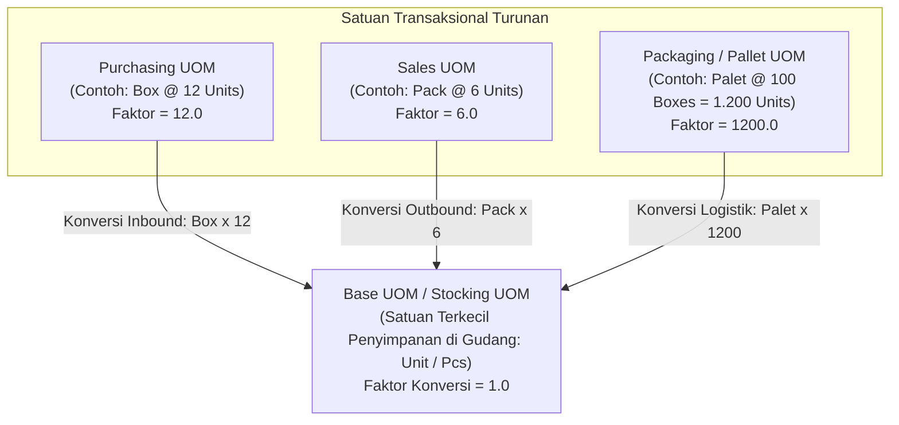

# Inventory UOM and Unit Conversion

## Definition

**Inventory UOM and Unit Conversion** adalah kerangka kerja sistemik dalam ERP yang mengelola berbagai satuan ukuran (*Unit of Measure / UOM*) yang digunakan untuk mengukur kuantitas barang sepanjang rantai pasok—mulai dari pembelian, penyimpanan di gudang, pemakaian produksi, hingga penjualan ke pelanggan akhir.

Sebuah barang yang sama sering kali ditransaksikan menggunakan satuan yang berbeda tergantung konteks operasinya:
* **Purchasing**: Dibeli dalam satuan karton atau palet dari pemasok ([[04-purchasing/purchasing-fundamentals|Purchasing Fundamentals]]).
* **Inventory**: Disimpan dan dinilai dalam satuan unit dasar terkecil di gudang.
* **Manufacturing**: Digunakan dalam satuan gram atau mililiter dalam resep produksi.
* **Sales**: Dijual dalam satuan lusin, pack, atau unit individual kepada pelanggan ([[03-sales/sales-fundamentals|Sales Fundamentals]]).

---

## Taksonomi Satuan Ukuran (UOM Hierarchy)

Untuk mencegah inkonsistensi data, ERP enterprise mengelompokkan satuan ukuran ke dalam hierarki yang berpusat pada **Base UOM**:



### Definisi Kategori UOM:

| Kategori UOM | Peran dalam Sistem ERP | Aturan Desain Penting |
| :--- | :--- | :--- |
| **Base UOM (Stocking UOM)** | Satuan dasar yang digunakan oleh sistem untuk mencatat seluruh saldo di buku persediaan (*Stock Ledger*) dan penilaian finansial (*General Ledger*). | **Wajib merupakan satuan terkecil yang tidak dapat dibagi lagi tanpa pecahan (*atomic unit*)**. Sekali diset dan memiliki transaksi, Base UOM dilarang diubah. |
| **Purchasing UOM** | Satuan default yang tercetak pada dokumen Purchase Order ke vendor. | Memiliki faktor pengali (*multiplier*) tetap terhadap Base UOM (misal: 1 Box = 12 Units). |
| **Sales UOM** | Satuan default yang ditampilkan pada brosur komersial dan penawaran ke pelanggan. | Memiliki faktor pengali atau pembagi terhadap Base UOM (misal: 1 Pack = 6 Units). |
| **Packaging / Pallet UOM** | Satuan logistik untuk perhitungan efisiensi ruang gudang dan kontainer. | Mendefinisikan kapasitas muatan per palet atau kontainer standar. |

---

## Mekanisme Konversi dan Contoh Perhitungan

Konversi kuantitas dilakukan secara otomatis oleh mesin transaksional ERP pada saat dokumen diposting:

$$\text{Kuantitas Base UOM} = \text{Kuantitas Transaksi} \times \text{Conversion Factor}$$

### Contoh Kasus Transaksi Kanonikal:
* **Item**: Komponen Kabel Penghubung Laptop Pro.
* **Base UOM**: `Pcs` (Pieces).
* **Purchasing UOM**: `Box` (1 Box = 12 Pcs; *Conversion Factor* = 12).
* **Sales UOM**: `Pack` (1 Pack = 4 Pcs; *Conversion Factor* = 4).

#### 1. Transaksi Pembelian Inbound:
* Departemen Pengadaan menerbitkan PO untuk **5 Box**.
* Saat staf gudang memposting Goods Receipt untuk 5 Box, ERP secara otomatis menghitung:
  $$\text{Mutasi Masuk Stock Ledger} = 5 \times 12 = \mathbf{60 \text{ Pcs}}$$
* Saldo gudang bertambah sebesar 60 Pcs pada Base UOM.

#### 2. Transaksi Penjualan Outbound:
* Pelanggan membeli **7 Pack** kabel.
* Saat Delivery Order divalidasi, ERP mengonversi:
  $$\text{Mutasi Keluar Stock Ledger} = 7 \times 4 = \mathbf{28 \text{ Pcs}}$$
* Saldo gudang berkurang sebesar 28 Pcs pada Base UOM. Sisa saldo akhir di gudang: $60 - 28 = 32 \text{ Pcs}$ (atau setara dengan 8 Pack atau 2,66 Box).

---

## Tantangan Operasional: Pembulatan dan Pecahan (Rounding & Precision)

Penggunaan multi-UOM menghadirkan tantangan teknis yang kritis terhadap integritas data:

### 1. Masalah Pecahan Tak Hingga (*Repeating Fractions*)
* **Kasus**: 1 Lusin = 12 Unit. Jika sistem mencatat Base UOM dalam Lusin dan menjual 1 Unit, maka kuantitas tercatat adalah $1/12 = 0,083333...$ Lusin.
* **Solusi ERP**: Selalu tetapkan **satuan fisik terkecil sebagai Base UOM** (`Unit / Pcs`), sehingga faktor konversi selalu berbentuk bilangan bulat atau desimal terbatas, bukan pecahan berulang.

### 2. Presisi Desimal (*Decimal Precision*)
* Untuk komoditas curah (*bulk goods* seperti bahan kimia, minyak, beras, atau logam), barang diukur dalam berat atau volume (Kg, Ton, Liter).
* Jika 1 Drum = 208,198 Liter, maka pembulatan ke 2 angka desimal dapat menghilangkan nilai komersial yang signifikan pada transaksi jutaan liter.
* Sistem ERP enterprise mendukung konfigurasi presisi desimal (biasanya 4 hingga 6 digit desimal: `0.000001`) pada tabel konversi satuan.

### 3. Incompatible UOM Classes (Ketidaksesuaian Dimensi Fisik)
* ERP enterprise membatasi konversi hanya dalam kelas dimensi fisik yang sama:
  * **Kelas Satuan (Unit)**: Pcs, Lusin, Box, Gross.
  * **Kelas Berat (Weight)**: Gram, Kilogram, Pound, Metrik Ton.
  * **Kelas Volume (Volume)**: Mililiter, Liter, Gallon, Meter Kubik.
  * **Kelas Panjang (Length)**: Milimeter, Sentimeter, Meter, Yard.
* Konversi lintas kelas (misal: dari *Liter* ke *Kilogram*) **dilarang menggunakan rumus konversi statis universal**, karena massa jenis (*density*) berbeda untuk setiap jenis cairan. Konversi lintas kelas harus didefinisikan secara khusus per item master (*Item-Specific UOM Conversion*).

---

## Konsep Catch Weight (Dual-UOM Inventory)

Dalam industri tertentu (seperti daging potong, hasil laut, keju, atau baja batangan), satu unit barang memiliki berat yang bervariasi secara alami:

> [!note]
> **Catch Weight Concept**: Suatu barang dilacak dalam **dua satuan ukuran independen secara paralel**:
> * **Inventory Quantity UOM**: Dilacak dalam jumlah fisik bulat (misal: 10 Ekor Sapi / 10 Batang Baja).
> * **Pricing / Valuation UOM**: Ditagih dan dinilai berdasarkan berat aktual saat ditimbang di timbangan digital (misal: 4.852,50 Kg).
> 
> ERP kelas atas (seperti Dynamics 365 Supply Chain dan SAP S/4HANA) menyediakan modul khusus *Catch Weight Management* untuk menangani transaksi dual-UOM ini tanpa menimbulkan selisih pembulatan persediaan.

---

## ERP Implementation Comparison

| Aspek | Odoo Enterprise | ERPNext | Microsoft Dynamics 365 SCM |
| :--- | :--- | :--- | :--- |
| **Model UOM** | Menggunakan konsep **UOM Category** (Unit, Weight, Volume). Setiap UOM didefinisikan sebagai rasio terhadap referensi kategori (*Reference UOM*). | Setiap UOM adalah dokumen mandiri (`UOM`). Konversi item diatur pada tabel anak `UOM Conversion Detail` di dalam form Item. | Menggunakan arsitektur multi-level: *Standard conversion* (lintas item), *Intra-class conversion*, dan *Inter-class conversion* spesifik item. |
| **UOM Pembelian & Penjualan** | Ditentukan pada tab General Information di formulir produk: *Purchase UoM* dan *Sales/Default UoM*. | Field *Purchase UOM* pada form Item; konversi ke Base UOM dihitung otomatis pada baris PO/PR. | Dikonfigurasi secara independen pada *Purchasing FastTab* dan *Sell FastTab* dengan aturan toleransi pembulatan. |
| **Catch Weight Support** | Memerlukan modul kustom atau penyesuaian khusus (default Odoo tidak native mendukung dual-UOM parallel). | Tidak mendukung dual-UOM catch weight out-of-the-box (hanya single stocking UOM). | Mendukung fitur kelas industri **Catch Weight Processing** secara *native* pada modul Advanced WMS. |

---

## Naventra Consideration

Untuk perancangan modul UOM pada sistem ERP enterprise seperti **Naventra**:

1. **Skema Database Konversi UOM Dinamis**:
   ```sql
   CREATE TABLE uom_categories (
       id UUID PRIMARY KEY DEFAULT gen_random_uuid(),
       category_name VARCHAR(50) NOT NULL UNIQUE -- 'UNIT', 'WEIGHT', 'VOLUME', 'LENGTH'
   );

   CREATE TABLE uoms (
       id UUID PRIMARY KEY DEFAULT gen_random_uuid(),
       uom_category_id UUID NOT NULL REFERENCES uom_categories(id),
       uom_code VARCHAR(20) NOT NULL UNIQUE, -- 'PCS', 'BOX', 'KG'
       uom_name VARCHAR(100) NOT NULL,
       is_reference_uom BOOLEAN DEFAULT FALSE,
       conversion_ratio NUMERIC(15, 6) NOT NULL DEFAULT 1.0, -- Rasio terhadap reference UOM kategori
       decimal_places INT NOT NULL DEFAULT 0
   );

   CREATE TABLE item_uom_conversions (
       id UUID PRIMARY KEY DEFAULT gen_random_uuid(),
       item_id UUID NOT NULL REFERENCES items(id),
       from_uom_id UUID NOT NULL REFERENCES uoms(id),
       to_uom_id UUID NOT NULL REFERENCES uoms(id),
       conversion_factor NUMERIC(15, 6) NOT NULL, -- Contoh: 1 Box = 12 Pcs
       created_at TIMESTAMP WITH TIME ZONE DEFAULT NOW(),
       UNIQUE (item_id, from_uom_id, to_uom_id)
   );
   ```
2. **Aturan Mutlak: Base UOM Adalah Kebenaran Tunggal**: Seluruh kolom `quantity` pada tabel transaksional inti (`stock_ledger_entries`, `inventory_balances`, `gl_entries`) **wajib selalu disimpan dalam satuan Base UOM**. Kuantitas dalam dokumen komersial (PO, SO) hanya bertindak sebagai representasi presentasi antarmuka yang dikonversi sebelum data masuk ke lapisan penyimpanan persediaan.
3. **Pemberlakuan Batas Desimal Validasi (Input Validation)**: Jika sebuah UOM memiliki `decimal_places = 0` (seperti unit fisik `Pcs`), backend wajib menolak transaksi yang memasukkan kuantitas pecahan desimal (misal: `2.5 Pcs`) dengan pesan error validasi yang jelas.

---

## References

- UNECE (United Nations Economic Commission for Europe). *Recommendation No. 20: Codes for Units of Measure Used in International Trade*.
- APICS / ASCM. *APICS Dictionary: Unit of Measure Conversion and Packaging Hierarchies*.
- Microsoft Learn. *Units of Measure and Conversions Architecture in Dynamics 365 Supply Chain Management*.
- Frappe ERPNext Documentation. *UOM Management and Conversion Factor Rules*.
- Odoo 17 Documentation. *Units of Measure (UoM) Setup and Category Conversions*.
