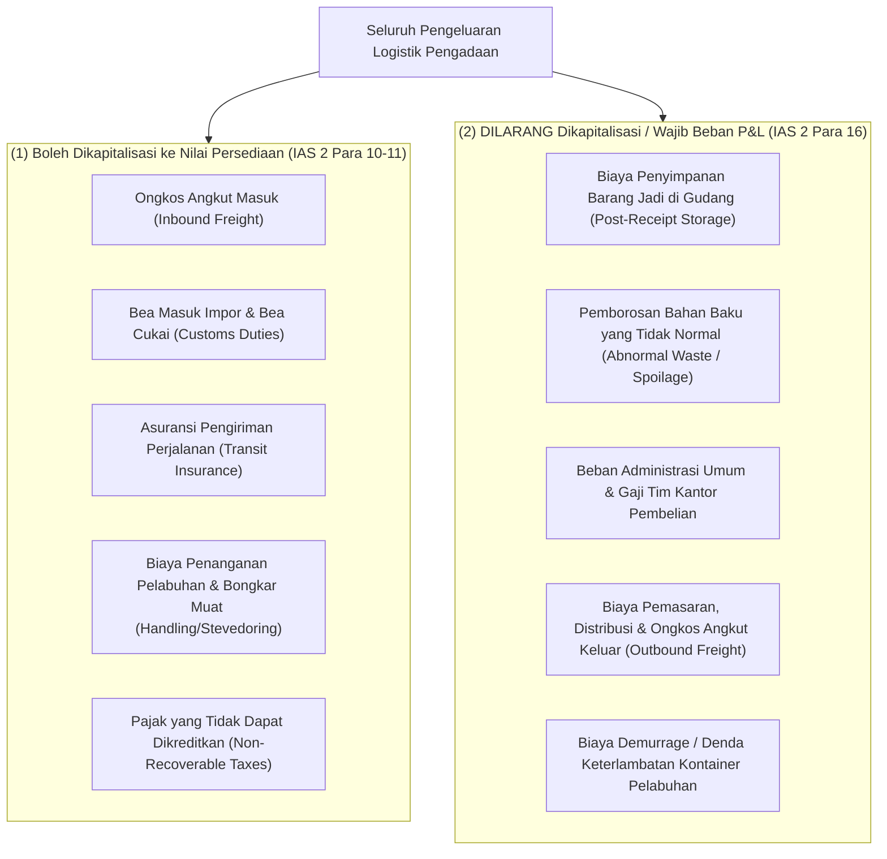
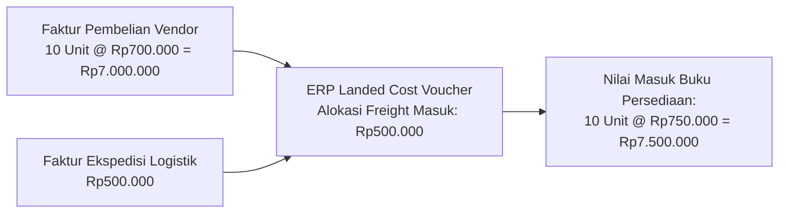

# Landed Cost and Capitalization

## Definition

**Landed Cost** adalah total akumulasi biaya perolehan yang dikeluarkan oleh entitas untuk membawa persediaan barang dagang atau bahan baku dari lokasi pemasok hingga tiba di gudang penyimpanan dalam kondisi siap untuk dijual atau digunakan dalam proses produksi.

Dalam sistem ERP enterprise, nilai aset persediaan tidak hanya mencakup harga beli yang tertera pada faktur pemasok (*Purchase Invoice Price*), melainkan mencakup seluruh **biaya-biaya yang dapat diatribusikan secara langsung (*Directly Attributable Acquisition Costs*)** sesuai dengan prinsip standar akuntansi internasional **IAS 2 (*Inventories*)**:

$$\text{Total Landed Cost} = \text{Harga Beli Faktur Bersih} + \sum \text{Biaya Tambahan yang Memenuhi Syarat Kapitalisasi}$$

---

## Taksonomi Biaya: Mana yang Boleh Masuk Persediaan?

Salah satu prinsip tata kelola terpenting dalam akuntansi persediaan ERP adalah menyaring biaya tambahan yang boleh dikapitalisasi (*capitalizable*) vs biaya yang wajib langsung dibebankan ke laporan laba rugi (*expensed immediately*):



---

## Metode Alokasi Biaya Tambahan (Landed Cost Allocation Bases)

Ketika satu faktur ekspedisi (misal: jasa pengiriman kontainer senilai Rp5.000.000) menagihkan pengangkutan beberapa jenis item barang sekaligus, ERP menyediakan berbagai dasar alokasi matematis:

| Dasar Alokasi | Rumus Bobot Alokasi | Kapan Digunakan? |
| :--- | :--- | :--- |
| **Berdasarkan Nilai Barang (*By Value / Monetary Amount*)** | $\text{Bobot Item} = \frac{\text{Nilai Pembelian Item}}{\text{Total Nilai Seluruh Item}}$ | Biaya asuransi pengiriman (*marine cargo insurance*), bea masuk impor ad-valorem, atau biaya jasa kepabeanan umum. |
| **Berdasarkan Kuantitas (*By Quantity / Units*)** | $\text{Bobot Item} = \frac{\text{Kuantitas Item}}{\text{Total Kuantitas Seluruh Item}}$ | Barang sejenis dengan dimensi seragam atau biaya penanganan bongkar muat per karton standar. |
| **Berdasarkan Berat (*By Net/Gross Weight*)** | $\text{Bobot Item} = \frac{\text{Berat Item (Kg)}}{\text{Total Berat Seluruh Item (Kg)}}$ | Tarif angkutan darat atau udara yang dikenakan berbasis bobot riil per kilogram. |
| **Berdasarkan Volume (*By Volume / CBM*)** | $\text{Bobot Item} = \frac{\text{Volume Kubikasi Item (CBM)}}{\text{Total Volume Seluruh Item (CBM)}}$ | Biaya sewa kontainer laut (*Ocean Freight LCL/FCL*) di mana ruang kubikasi kontainer menjadi faktor pembatas. |

---

## Analisis Numerik Kanonikal: Alokasi Biaya Angkut Inbound

Untuk menjaga konsistensi dengan skenario di [[04-purchasing/purchasing-pricing-and-terms|Purchasing Pricing and Terms]] dan [[02-accounting/inventory-accounting|Inventory Accounting]], perhatikan alokasi biaya berikut:

### Skenario Transaksi:
* **Entitas Pembeli**: PT Maju Bersama.
* **Barang**: 10 unit Komponen Utama Laptop Pro.
* **Faktur Pemasok (PT Sumber Teknologi)**:
  $$10 \text{ unit} \times \text{Rp}700.000 = \mathbf{\text{Rp}7.000.000 \text{ (DPP)}}$$
* **Jasa Ekspedisi Inbound (PT Logistik Cepat)**:
  Diterbitkan faktur jasa angkut resmi sebesar **Rp500.000**.
* **Kriteria**: Biaya angkut inbound memenuhi syarat kapitalisasi IAS 2 sebagai biaya perolehan persediaan langsung.

---

### Perhitungan Biaya Perolehan Bersih (Landed Cost Calculation):

$$\text{Total Nilai Persediaan Baru} = \text{Rp}7.000.000 + \text{Rp}500.000 = \mathbf{\text{Rp}7.500.000}$$
$$\text{Biaya Perolehan per Unit Baru} = \frac{\text{Rp}7.500.000}{10 \text{ unit}} = \mathbf{\text{Rp}750.000/\text{unit}}$$



---

### Alur Penjurnalan Akuntansi Terpadu

Proses kapitalisasi landed cost di buku besar akuntansi melibatkan tahapan akrual dan alokasi:

#### 1. Saat Penerimaan Fisik Barang dari Pemasok (Goods Receipt):
Sistem mencatat nilai persediaan awal berdasarkan harga Purchase Order:
* *(Dr)* Persediaan Barang Dagang: Rp7.000.000
* *(Cr)* Utang Barang Belum Ditagih (GR/IR Accrual): Rp7.000.000

#### 2. Saat Penerimaan Faktur Jasa Ekspedisi Logistik:
Tagihan dari pihak ketiga dicatat melalui akun sementara kliring landed cost:
* *(Dr)* Akun Kliring Biaya Perolehan Persediaan (*Landed Cost Clearing*): Rp500.000
* *(Cr)* Utang Usaha (PT Logistik Cepat): Rp500.000

#### 3. Saat Dokumen Landed Cost Voucher Divalidasi:
ERP mengalokasikan saldo akun kliring ke nilai buku persediaan barang:
* *(Dr)* Persediaan Barang Dagang: Rp500.000
* *(Cr)* Akun Kliring Biaya Perolehan Persediaan (*Landed Cost Clearing*): Rp500.000

*Hasil Finansial Akhir*: Saldo akun persediaan di buku besar resmi menjadi **Rp7.500.000** (atau Rp750.000/unit), akun kliring landed cost kembali bernilai nol (nihil), dan seluruh biaya angkut telah berhasil menjadi bagian dari aset persediaan.

---

## Tantangan Khusus: Landed Cost Pasca Penjualan (Post-Sale Landed Cost)

Dalam praktik rantai pasok global, sering kali faktur ekspedisi internasional atau bea masuk baru diterima berminggu-minggu setelah barang fisik tiba—bahkan setelah barang tersebut sebagian atau seluruhnya telah laku terjual:

* **Masalah**: Jika 10 unit Laptop Pro telah terjual habis sebelum faktur freight Rp500.000 diterima, ke mana biaya freight tersebut harus dialokasikan?
* **Penanganan ERP yang Benar**:
  * Unit barang yang masih ada di gudang dinaikkan nilai persediaannya (*Revaluation*).
  * Unit barang yang sudah terlanjur terjual **dilarang menambah saldo persediaan**, melainkan selisih biaya angkutnya harus dialokasikan langsung mendebit akun **Beban Pokok Penjualan (COGS Adjustment)** di laporan laba rugi.

---

## ERP Implementation Comparison

| Aspek | Odoo Enterprise | ERPNext | Microsoft Dynamics 365 SCM |
| :--- | :--- | :--- | :--- |
| **Dokumen Khusus** | Dokumen `Landed Costs` (dapat ditautkan ke *Stock Transfers / Pickings* atau *Vendor Bills*). | Dokumen `Landed Cost Voucher` (dapat ditautkan ke *Purchase Receipt* atau *Purchase Invoice*). | Modul formal tingkat enterprise: **Transportation Management (TMS)** dan fitur *Miscellaneous Charges / Landed Cost*. |
| **Dasar Alokasi** | *Equal*, *By Quantity*, *By Current Cost*, *By Weight*, *By Volume*. | *Qty*, *Amount*, dan *Weight*. | Sangat detail: *Net amount*, *Gross weight*, *Volume*, *Quantity*, *Measurement*, dan konfigurasi custom. |
| **Penanganan Barang yang Sudah Terjual** | Otomatis membagi alokasi: sebagian ke akun persediaan (stok tersisa) dan sebagian ke akun *Expense/COGS* (stok yang sudah keluar). | Memposting penyesuaian biaya mundur (*Cost Difference Entry*) ke COGS pada GL untuk kuantitas yang telah dikeluarkan. | Menggunakan proses penutupan persediaan berkala (*Inventory Close*) untuk merekonsiliasi lapisan biaya historis. |

---

## Naventra Consideration

Untuk perancangan modul Landed Cost pada sistem ERP enterprise seperti **Naventra**:

1. **Struktur Data Landed Cost Voucher**:
   * Tabel header: `landed_cost_vouchers` (`voucher_no`, `posting_date`, `vendor_bill_id`, `allocation_basis`, `total_landed_cost_amount`).
   * Tabel baris penerimaan target: `landed_cost_target_receipts` (`voucher_id`, `goods_receipt_id`).
   * Tabel baris alokasi item: `landed_cost_allocation_lines` (`voucher_id`, `item_id`, `receipt_line_id`, `allocated_amount`, `cost_per_unit_increase`).
2. **Algoritma Deteksi Kuantitas Tersisa (Remaining Qty Check)**:
   ```sql
   -- Menentukan porsi persediaan vs COGS
   v_remaining_qty := get_remaining_on_hand_qty(target_line.item_id, target_line.goods_receipt_id);
   
   IF v_remaining_qty >= target_line.received_qty THEN
       -- Seluruh barang masih ada di gudang -> 100% debit persediaan
       v_inventory_debit := target_line.allocated_amount;
       v_cogs_debit := 0;
   ELSE
       -- Sebagian atau seluruh barang telah terjual -> bagi proporsional
       v_inventory_debit := (v_remaining_qty / target_line.received_qty) * target_line.allocated_amount;
       v_cogs_debit := target_line.allocated_amount - v_inventory_debit;
   END IF;
   ```
3. **Pembaruan Stock Ledger & Moving Average**:
   Setiap posting landed cost wajib menciptakan mutasi penyesuaian nilai (*Value Adjustment Entry*) pada tabel `stock_ledger_entries` dengan `quantity_delta = 0` dan `total_value_delta = v_inventory_debit`, serta memperbarui kolom `unit_cost` pada tabel persediaan.

---

## References

- IFRS Foundation. *IAS 2: Inventories (Paragraphs 10-18: Costs of Purchase and Other Costs)*.
- APICS / ASCM. *APICS Dictionary: Landed Cost Modeling, Freight Allocation, and Total Cost of Ownership*.
- Microsoft Learn. *Landed Cost Module and Costing Directives in Dynamics 365 Supply Chain Management*.
- Frappe ERPNext Documentation. *Landed Cost Voucher Implementation and Cost Allocation*.
- Odoo 17 Documentation. *Landed Costs: Integrating Transportation and Duties into Stock Value*.
