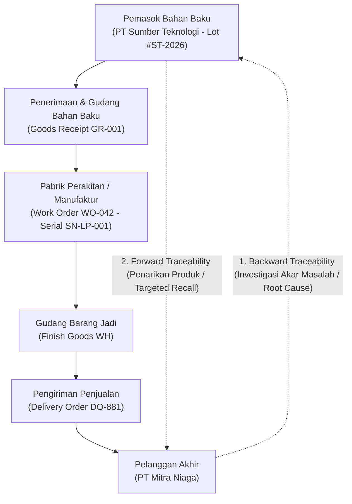
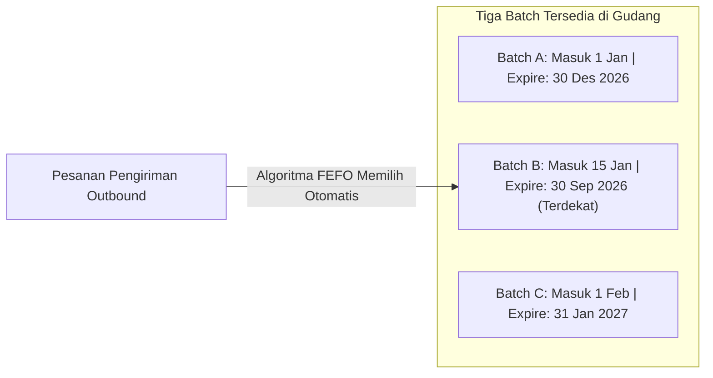

# Lot and Serial Number Tracking

## Definition

**Lot and Serial Number Tracking** adalah mekanisme sistemik dalam ERP yang memberikan identitas unik kepada barang persediaan guna mencatat riwayat pergerakan, asal-usul bahan baku, tanggal produksi, masa kedaluwarsa, hingga tujuan akhir pengiriman barang sepanjang siklus rantai pasok.

Mekanisme pelacakan (*Traceability*) ini menjadi syarat mutlak dalam kepatuhan regulasi industri (seperti BPOM, FDA, ISO 9001, dan sertifikasi keselamatan otomotif/penerbangan) untuk memfasilitasi penarikan produk cacat secara tepat (*product recall*), klaim garansi purna jual, dan pengendalian mutu berbasis tanggal kedaluwarsa.

---

## Perbedaan Fundamental: Lot (Batch) vs. Serial Number

Sistem ERP enterprise membedakan secara tegas antara pelacakan berbasis kelompok (*group-level*) dan pelacakan berbasis unit tunggal (*unit-level*):

| Karakteristik | Lot / Batch Number | Serial Number |
| :--- | :--- | :--- |
| **Kardinalitas Relasi** | **1 Nomor : Banyak Unit (1 to Many)** | **1 Nomor : Tepat 1 Unit Fisik (1 to 1)** |
| **Definisi Unit** | Kumpulan barang yang diproduksi atau dibeli bersamaan dalam satu siklus produksi/pembelian dengan karakteristik dan kualitas yang seragam. | Pengenal unik individual yang membedakan satu fisik barang dari barang lain yang bertipe identik. |
| **Karakteristik Khas** | Tanggal Produksi (*Manufacturing Date*), Tanggal Kedaluwarsa (*Expiration Date*), Hasil Uji Lab (*Certificate of Analysis / CoA*). | Masa Garansi (*Warranty Start/End*), Alamat MAC kartu jaringan, Nomor Rangka/Mesin (VIN), Riwayat Servis Pemeliharaan. |
| **Contoh Industri** | Farmasi (Obat, Vaksin), Makanan & Minuman, Bahan Kimia Industri, Cat, Biji Plastik. | Perangkat Elektronik (Laptop, Smartphone), Mesin Pabrik, Kendaraan Bermotor, Alat Medis Implan. |
| **Kompleksitas Input Data** | Sedang: Operator menginput nomor lot sekali untuk satu palet isi 1.000 botol sirup. | Tinggi: Operator wajib memindai barcode nomor seri satu per satu untuk setiap unit yang masuk atau keluar. |

---

## Ketertelusuran Penuh: Forward vs. Backward Traceability

Kemampuan audit rantai pasok (*Supply Chain Traceability*) diukur dari kemampuan sistem menjalankan pelacakan dalam dua arah:



### 1. Backward Traceability (Pelacakan Mundur / Root-Cause Analysis)
* **Skenario**: Pelanggan melaporkan bahwa Laptop Pro dengan nomor seri `SN-LP-001` mengalami kerusakan baterai melembung.
* **Tindakan Sistem**: ERP melacak balik:
  * Kapan dan oleh siapa laptop tersebut dirakit (*Work Order*).
  * Komponen baterai nomor berapa yang dipasang ke dalam laptop tersebut (*Genealogy Tree*).
  * Nomor lot bahan kimia baterai tersebut dari pemasok mana (*Purchase Order & Goods Receipt*).
* **Hasil**: Ditemukan bahwa komponen baterai berasal dari Lot Vendor `#BAT-CHEM-99`.

### 2. Forward Traceability (Pelacakan Maju / Targeted Product Recall)
* **Skenario**: Pemasok baterai memberi peringatan resmi bahwa seluruh baterai pada Lot `#BAT-CHEM-99` mengandung cacat bahan pemisah elektroda yang rentan korsleting.
* **Tindakan Sistem**: ERP melakukan penelusuran maju:
  * Mencari seluruh nomor seri laptop yang menggunakan baterai dari lot tersebut.
  * Memeriksa keberadaan unit-unit tersebut: apakah masih ada di rak gudang (*Quarantine immediately*), sedang dalam perjalanan kurir (*Intercept shipment*), atau sudah dikirim ke pelanggan (*Issue recall letter*).
* **Hasil Finansial**: Penarikan produk hanya dilakukan secara presisi pada 50 unit yang terdampak, alih-alih menarik seluruh 10.000 unit yang beredar di pasar, menghemat miliaran rupiah biaya penarikan dan melindungi reputasi perusahaan.

---

## Logika FEFO untuk Barang dengan Masa Kedaluwarsa

Untuk barang yang menggunakan pelacakan batch dengan tanggal kedaluwarsa, ERP menerapkan aturan pengambilan **FEFO (First-Expired, First-Out)**:



### Aturan Batas Minimal Kedaluwarsa (*Shelf-Life Constraints*):
1. **Total Shelf Life**: Umur simpan produk sejak tanggal diproduksi (misal: 730 hari / 2 tahun).
2. **Minimum Remaining Shelf Life for Delivery**: Batas waktu minimal yang disyaratkan oleh jaringan supermarket besar (misal: tolak pengiriman jika sisa masa kedaluwarsa $< 75\%$).
3. **Quarantine Before Expiry**: Sistem secara otomatis memindahkan status batch ke *Blocked / Quarantine* 30 hari sebelum tanggal kedaluwarsa agar tidak dapat terambil secara tidak sengaja oleh operator picking.

---

## ERP Implementation Comparison

| Aspek | Odoo Enterprise | ERPNext | Microsoft Dynamics 365 SCM |
| :--- | :--- | :--- | :--- |
| **Model Entitas** | Menggunakan entitas tunggal `stock.lot` yang menyimpan nomor seri atau nomor lot tergantung setting *Product Tracking*. | Memiliki entitas terpisah yang tegas: Dokumen `Serial No` (1:1) dan Dokumen `Batch` (1:N). | Menggunakan dimensi pelacakan formal: *Tracking Dimension Group* dengan kontrol ketat atas nomor serial dan nomor batch. |
| **Pencatatan Nomor Seri** | Dapat diinput manual, dipindai via barcode, atau di-generate otomatis saat transaksi receipt/delivery. | Serial number disimpan sebagai string teks multiline atau individual records yang tertaut ke dokumen pergerakan stok. | Sangat canggih: Mendukung *Serial Number Registration*, *Capturing Serial at Receipt vs at Delivery*, dan generator format penomoran otomatis. |
| **Genealogi Produksi** | Fitur *Upstream / Downstream Traceability Report* yang menampilkan grafik hubungan lot bahan baku ke lot produk jadi. | Menampilkan *Batch History* dan *Serial No Lifecycle* yang menunjukkan seluruh tautan transaksi dokumen. | Fitur tingkat industri: *Item Traceability / Trace Tool* dengan visualisasi pohon silsilah (*Genealogy Tree*) multi-level. |

---

## Naventra Consideration

Untuk perancangan modul Lot dan Serial Number pada sistem ERP enterprise seperti **Naventra**:

1. **Skema Database Relasional Terpisah**:
   ```sql
   CREATE TABLE item_lots (
       id UUID PRIMARY KEY DEFAULT gen_random_uuid(),
       item_id UUID NOT NULL REFERENCES items(id),
       lot_number VARCHAR(100) NOT NULL,
       manufacturing_date DATE,
       expiration_date DATE,
       removal_date DATE, -- Tanggal mulai ditarik dari rak
       status VARCHAR(30) NOT NULL DEFAULT 'ACTIVE', -- 'ACTIVE', 'QUARANTINE', 'EXPIRED'
       created_at TIMESTAMP WITH TIME ZONE DEFAULT NOW(),
       UNIQUE (item_id, lot_number)
   );

   CREATE TABLE item_serials (
       id UUID PRIMARY KEY DEFAULT gen_random_uuid(),
       item_id UUID NOT NULL REFERENCES items(id),
       serial_number VARCHAR(100) NOT NULL UNIQUE,
       lot_id UUID REFERENCES item_lots(id), -- Opsional: Serial number dari lot tertentu
       current_warehouse_id UUID REFERENCES warehouses(id),
       current_location_id UUID REFERENCES storage_locations(id),
       status VARCHAR(30) NOT NULL DEFAULT 'IN_STOCK', -- 'IN_STOCK', 'DELIVERED', 'SCRAPPED', 'RETURNED'
       warranty_start_date DATE,
       warranty_end_date DATE,
       created_at TIMESTAMP WITH TIME ZONE DEFAULT NOW()
   );
   ```
2. **Enforcement Mutlak pada Layer Mutasi Stok**:
   Jika sebuah SKU memiliki atribut `tracking_policy = 'SERIAL'`, maka seluruh API mutasi persediaan (`/api/v1/goods-receipts/post`, `/api/v1/deliveries/post`) wajib memvalidasi bahwa jumlah elemen array `serial_numbers` yang dikirimkan **harus tepat sama dengan kuantitas transaksi**, dan setiap nomor seri belum pernah aktif sebelumnya di gudang (mencegah duplikasi).
3. **Pohon Genealogi Berbasis Relasi Atomik**: Sediakan tabel relasi `production_genealogy` (`parent_serial_id`, `child_serial_id`, `child_lot_id`, `work_order_id`) untuk merekam jejak perakitan komponen ke dalam produk jadi secara permanen.

---

## References

- GS1 Standards. *Traceability Standard: Business Process and System Architecture for Global Supply Chain Traceability*.
- ISO 9001:2015. *Clause 8.5.2: Identification and Traceability in Quality Management Systems*.
- Microsoft Learn. *Tracking Dimensions and Traceability in Dynamics 365 Supply Chain Management*.
- Frappe ERPNext Documentation. *Serial Numbers and Batches Management*.
- Odoo 17 Documentation. *Traceability: Managing Lots and Serial Numbers in Inventory*.
