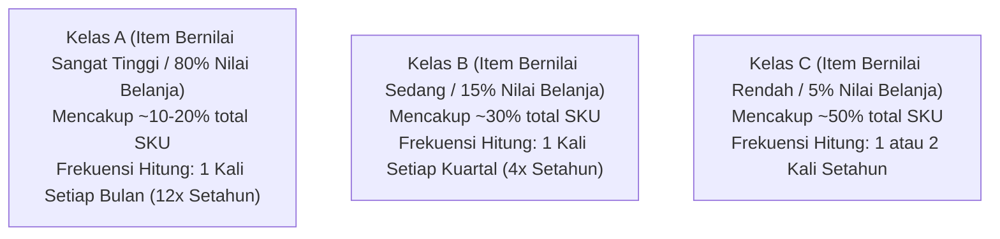
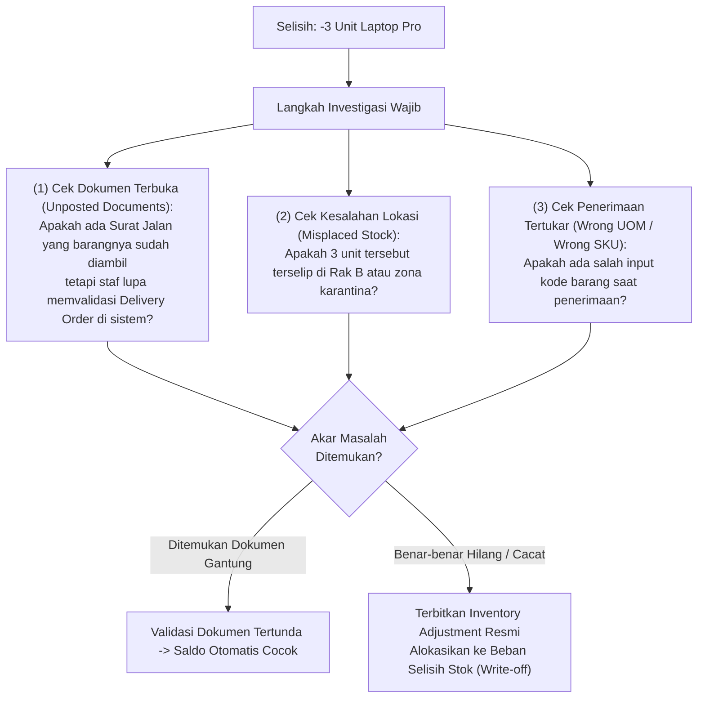

# Physical Inventory Count and Stock Opname

## Definition

**Physical Inventory Count** (di Indonesia lazim dikenal sebagai **Stock Opname**) adalah proses verifikasi audit operasional di mana seluruh atau sebagian persediaan barang fisik di fasilitas gudang dihitung, diukur, atau ditimbang secara manual oleh tim pencacah (*counting team*), untuk kemudian dibandingkan dengan saldo teoritis yang tercatat di dalam sistem ERP (*System Book Quantity*).

Penghitungan fisik merupakan instrumen pengendalian internal paling mendasar untuk membuktikan **eksistensi nyata aset (*existence assertion*)** dalam audit laporan keuangan, mendeteksi penyusutan barang (*inventory shrinkage*), serta memulihkan akurasi catatan persediaan agar keputusan operasional pemenuhan pesanan dapat diandalkan.

---

## Metodologi Penghitungan: Periodic Full Count vs. Cycle Counting

Sistem ERP modern mendukung dua pendekatan metodologis utama dalam pelaksanaan penghitungan fisik:

| Karakteristik | Full Physical Inventory Count (Stock Opname Tahunan) | Perpetual Cycle Counting (Penghitungan Siklus Berkala) |
| :--- | :--- | :--- |
| **Frekuensi Pelaksanaan** | Biasanya 1 atau 2 kali setahun (pada akhir tahun buku atau semester). | Berkelanjutan sepanjang tahun (harian, mingguan, atau bulanan). |
| **Cakupan Barang** | **100% seluruh SKU dan rak gudang** dihitung secara serentak. | Hanya sebagian kecil SKU terpilih yang dihitung setiap hari. |
| **Dampak Operasional** | **Operasional gudang wajib dihentikan total (*Warehouse Freeze*)**: Penerimaan dan pengiriman disetop selama 1–3 hari. | **Tanpa henti (*No Freeze*)**: Operasional pengiriman dan penerimaan normal tetap berjalan di zona lain. |
| **Kriteria Seleksi** | Seluruh gudang secara menyeluruh. | Menggunakan **Analisis ABC** (Item bernilai tinggi / Fast-moving dihitung lebih sering). |
| **Manfaat Utama** | Kebutuhan formal kepatuhan audit eksternal laporan keuangan tahunan. | Menjaga akurasi persediaan harian tetap tinggi ($> 98\%$) dan mendeteksi kesalahan sistem secara dini. |

---

## Analisis ABC untuk Cycle Counting

Dalam metode *Cycle Counting*, sistem ERP mengelompokkan barang berdasarkan kontribusi nilai tahunannya (*Pareto Principle 80/20 Rule*):



---

## Siklus Tata Kelola Penghitungan Fisik (Stock Opname Lifecycle)

Alur pelaksanaan penghitungan fisik diatur melalui tahapan sistematis untuk mencegah manipulasi data:

```mermaid
flowchart TD
    Plan["(1) Perencanaan & Jadwal Count<br/>Sistem membangkitkan Physical Inventory Document"]
    --> Freeze["(2) Pembekuan Transaksi (System Snapshot / Freeze)<br/>Sistem merekam kuantitas buku tepat pada jam cut-off"]
    
    Freeze --> Sheet["(3) Penerbitan Count Sheet (Lembar Hitung)<br/>Diserahkan ke tim pencacah fisik di lantai gudang"]
    
    Sheet --> Count["(4) Pencacahan Fisik di Lapangan<br/>Staf menghitung fisik barang di rak/bin"]
    
    Count --> Entry["(5) Pemasukan Data Hasil Hitung (Count Entry)<br/>ERP membandingkan Kuantitas Fisik vs Saldo Buku Sistem"]
    
    Entry --> VarCheck{Apakah Ada<br/>Selisih (Variance)?}
    
    VarCheck -- "Ada Selisih (> Ambang Batas)" --> Recount["(6) Penghitungan Ulang Independen (Recount)<br/>Dilakukan oleh tim auditor / pengawas berbeda"]
    Recount --> Investigate["(7) Investigasi Akar Masalah<br/>(Cek dokumen gantung, salah rak, salah ketik)"]
    Investigate --> Approval["(8) Persetujuan Manajerial (Approval Workflow)"]
    
    VarCheck -- "Nihil / Sesuai" --> Approval
    
    Approval --> Post["(9) Posting Adjustment Otomatis<br/>Penyelarasan Saldo Stock Ledger & General Ledger"]
```

---

## Prinsip Pengendalian Internal: Blind Count vs. Open Count

Metode penyerahan lembar hitung (*Count Sheet*) sangat memengaruhi integritas data lapangan:

* **Open Count (Lembar Terbuka)**:
  Lembar hitung mencantumkan kuantitas saldo buku teoritis sistem (misal: *Di Rak A tertera harus ada 100 unit Laptop Pro*).
  * *Risiko*: Operator lapangan cenderung malas menghitung teliti satu per satu dan hanya menyalin angka sistem (*rubber-stamping*).
* **Blind Count (Lembar Hitung Buta - Praktik Terbaik Audit)**:
  Lembar hitung hanya mencantumkan kode produk, deskripsi, dan koordinat rak/bin, **tanpa menampilkan angka saldo teoritis sistem**.
  * *Keunggulan*: Operator wajib benar-benar menghitung fisik secara riil di lapangan tanpa bias atau prasangka angka sistem.

---

## Analisis Varians dan Investigasi (Variance Investigation)

Salah satu prinsip terpenting dalam tata kelola persediaan adalah:

> [!important]
> **Variance $\neq$ Automatic Accounting Loss**:
> Adanya selisih antara fisik dan sistem **tidak boleh langsung diposting sebagai kerugian akuntansi (*inventory loss*)** tanpa proses investigasi dan rekonsiliasi operasional terlebih dahulu!

### Skenario Kanonikal Selisih Fisik:
* **Data Buku Sistem**: 100 unit Komponen Laptop Pro.
* **Hasil Cacah Fisik**: 97 unit.
* **Selisih (*Variance*)**: $-3 \text{ unit}$ (Kurang 3 unit).



---

## Dampak Akuntansi dan Rekonsiliasi Finansial

Jika setelah penghitungan ulang independen (*recount*) dan investigasi tuntas selisih 3 unit tetap tidak dapat ditemukan:
1. Manajer Rantai Pasok dan Controller Keuangan menandatangani Berita Acara Stock Opname.
2. ERP membangkitkan dokumen koreksi [[05-inventory/inventory-adjustment|Inventory Adjustment]]:
   * Kuantitas stock ledger berkurang 3 unit (@ Rp750.000, inklusif landed cost = Rp2.250.000).
3. **Jurnal Finansial Buku Besar (General Ledger)**:
   * *(Dr)* Beban Selisih Persediaan (*Inventory Variance / Shrinkage Loss*): **Rp2.250.000**
   * *(Cr)* Persediaan Barang Dagang: **Rp2.250.000**
4. Saldo fisik dan saldo sistem kembali sinkron sempurna pada angka 97 unit.

---

## ERP Implementation Comparison

| Aspek | Odoo Enterprise | ERPNext | Microsoft Dynamics 365 SCM |
| :--- | :--- | :--- | :--- |
| **Model Dokumen** | Menggunakan menu *Inventory Adjustments* (tampilan tabular seluruh quant yang dapat difilter per lokasi atau produk). | Menggunakan dokumen formal `Stock Reconciliation` yang membandingkan *Current Qty* vs *Real Qty*. | Menggunakan jurnal formal: **Counting Journal** dengan dukungan konfigurasi *Cycle Counting Plans*. |
| **Dukungan Blind Count** | Opsi sembunyikan kolom *Counted Quantity* pada lembar cetak hitung. | Memerlukan kustomisasi format cetak (*Print Format*) untuk menyembunyikan kuantitas sistem. | Fitur bawaan (*native*): Parameter *Display quantity on count sheet = False* untuk pelaksanaan Blind Count. |
| **Otomasi Jadwal Cycle Count** | Dikelola melalui field *Annual Inventory Day and Month* pada level lokasi atau integrasi modul barcode. | Memiliki fitur *Cycle Count* yang secara otomatis memilih item secara acak berbasis frekuensi yang ditentukan. | Sangat komprehensif: Mesin *Cycle count threshold* (memicu hitung saat stok menyentuh angka tertentu) dan integrasi aplikasi seluler WMS. |

---

## Naventra Consideration

Untuk perancangan modul Penghitungan Fisik pada sistem ERP enterprise seperti **Naventra**:

1. **Skema Database Dokumen Stock Opname**:
   ```sql
   CREATE TABLE stock_opname_sessions (
       id UUID PRIMARY KEY DEFAULT gen_random_uuid(),
       session_number VARCHAR(50) NOT NULL UNIQUE,
       warehouse_id UUID NOT NULL REFERENCES warehouses(id),
       count_type VARCHAR(30) NOT NULL, -- 'FULL_COUNT', 'CYCLE_COUNT_ABC', 'SPOT_CHECK'
       is_blind_count BOOLEAN NOT NULL DEFAULT TRUE,
       freeze_stock BOOLEAN NOT NULL DEFAULT FALSE,
       snapshot_timestamp TIMESTAMP WITH TIME ZONE NOT NULL,
       status VARCHAR(30) NOT NULL DEFAULT 'IN_PROGRESS', -- 'DRAFT', 'IN_PROGRESS', 'RECOUNT_REQUIRED', 'APPROVED', 'POSTED'
       created_at TIMESTAMP WITH TIME ZONE DEFAULT NOW()
   );

   CREATE TABLE stock_opname_lines (
       id UUID PRIMARY KEY DEFAULT gen_random_uuid(),
       session_id UUID NOT NULL REFERENCES stock_opname_sessions(id),
       item_id UUID NOT NULL REFERENCES items(id),
       storage_location_id UUID REFERENCES storage_locations(id),
       batch_number VARCHAR(100),
       serial_number VARCHAR(100),
       system_snapshot_qty NUMERIC(15, 4) NOT NULL, -- Dibekukan saat sesi dimulai
       counted_qty NUMERIC(15, 4), -- Input dari tim pencacah lapangan
       recounted_qty NUMERIC(15, 4), -- Input pencacahan ulang jika ada varians
       variance_qty NUMERIC(15, 4) GENERATED ALWAYS AS (COALESCE(recounted_qty, counted_qty) - system_snapshot_qty) STORED,
       investigation_notes TEXT
   );
   ```
2. **Prinsip Snapshot Beku (System Snapshot Lock)**:
   Saat sesi dimulai, sistem wajib membekukan saldo buku sistem (`system_snapshot_qty`) pada detik tersebut. Jika selama proses penghitungan fisik berlangsung masih ada mutasi pengiriman darurat, varians dihitung secara independen terhadap saldo beku tersebut dengan memperhitungkan log mutasi transaksi yang terjadi pasca-snapshot.
3. **Pemicu Recount Otomatis Berbasis Toleransi**:
   Backend secara otomatis menandai baris yang memiliki nilai deviasi moneter $|\text{variance\_qty} \times \text{unit\_cost}| > \text{Threshold}$ (misal: selisih $> \text{Rp}500.000$) untuk mewajibkan verifikasi hitung ulang (*Recount Required*) oleh staf pengawas independen sebelum tombol persetujuan dapat diakses.

---

## References

- APICS / ASCM. *Cycle Counting Program Guidelines and Inventory Record Accuracy Best Practices*.
- AICPA (American Institute of CPAs). *AU-C Section 501: Audit Evidence — Specific Considerations for Selected Items (Inventories Observation)*.
- Microsoft Learn. *Cycle Counting and Physical Inventory Architecture in Dynamics 365 Supply Chain Management*.
- Frappe ERPNext Documentation. *Stock Reconciliation and Physical Verification Process*.
- Odoo 17 Documentation. *Inventory Adjustments and Cycle Count Automations*.
