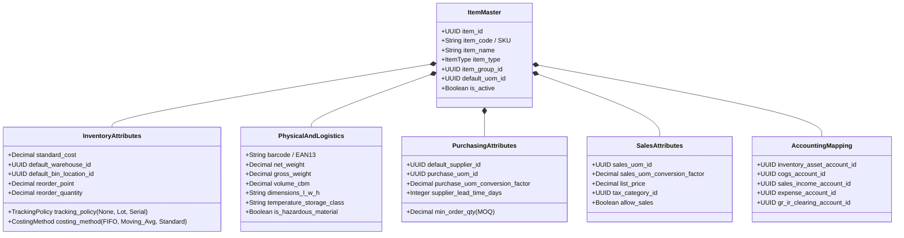

# Product and Inventory Master Data

## Definition

**Product and Inventory Master Data** adalah kumpulan data induk terpusat yang mendefinisikan seluruh karakteristik fisik, logistik, pengadaan, penjualan, perpajakan, dan akuntansi dari setiap barang atau jasa yang dikelola di dalam ekosistem ERP.

Item Master bertindak sebagai **fondasi referensi statis (single source of truth)** yang dirujuk oleh seluruh modul transaksional:
* Modul Penjualan merujuk harga jual, diskon, dan UOM jual ([[03-sales/customer-and-sales-master-data|Customer and Sales Master Data]]).
* Modul Pengadaan merujuk vendor utama, UOM beli, dan harga beli standar ([[04-purchasing/supplier-and-purchasing-master-data|Supplier and Purchasing Master Data]]).
* Modul Persediaan merujuk metode pelacakan, dimensi fisik, dan lokasi penyimpanan standar.
* Modul Akuntansi merujuk akun persediaan neraca, akun beban pokok penjualan (COGS), dan akun pendapatan ([[02-accounting/chart-of-accounts|Chart of Accounts]]).

---

## Klasifikasi Tipe Item dalam ERP

Sistem ERP enterprise membedakan jenis-jenis produk berdasarkan cara penanganan fisik dan akuntansinya:

| Tipe Produk | Karakteristik Fisik | Manajemen Stok di Gudang | Dampak Finansial & Akuntansi | Contoh Penggunaan |
| :--- | :--- | :--- | :--- | :--- |
| **Stockable / Inventory Item** | Barang berwujud fisik yang disimpan, dihitung, dan dinilai. | **Ya**: Dicatat di Stock Ledger; memiliki saldo kuantitas on-hand. | Pembelian menambah aset persediaan di neraca. Penjualan mendebit COGS dan mengkredit persediaan. | Laptop Pro, Komponen Utama Motherboard, Kabel Daya. |
| **Consumable / Expense Item** | Barang fisik berbiaya rendah yang langsung habis dipakai atau tidak bernilai material untuk dilacak per unit. | **Opsional**: Dapat dilacak kuantitas fisiknya tanpa penilaian moneter individual. | Nilai perolehan langsung dibebankan ke akun biaya operasional (*Expense Account*) saat diterima. | Alat Tulis Kantor (ATK), Mur & Baut standar, Sarung tangan pabrik. |
| **Service (Jasa)** | Layanan tidak berwujud (*intangible*) tanpa wujud fisik. | **Tidak**: Tidak ada saldo stok fisik atau lokasi gudang. | Pembelian diakui sebagai Beban Jasa; penjualan diakui langsung sebagai Pendapatan Jasa. | Jasa Konsultasi Implementasi, Biaya Servis Pemeliharaan, Ongkos Pasang. |
| **Kit / Bundle / Phantom** | Entitas virtual yang terdiri dari kumpulan beberapa item fisik individual. | **Tidak untuk Kit-nya**: Stok dilacak pada level komponen penyusunnya (*Bill of Materials / BOM*). | Harga dapat dipatok pada level bundel atau akumulasi komponen. | Paket Bundel Laptop + Mouse + Tas Ransel. |

---

## Anatomi Atribut Item Master (Data Model)

Struktur data induk produk dalam ERP diorganisasikan ke dalam beberapa segmen fungsional:

---

## Atribut Fisik dan Logistik Gudang (WMS Attributes)

Untuk mendukung operasional pergudangan modern (*Warehouse Management System*), Item Master wajib memuat spesifikasi fisik:

1. **Kode Barcode / EAN / UPC**: Standar pengenal global untuk pemindaian optik cepat menggunakan terminal *handheld scanner* di area penerimaan dan pengiriman.
2. **Dimensi Kubikasi dan Berat (*Cubing and Weighing*)**:
   * Panjang $\times$ Lebar $\times$ Tinggi ($L \times W \times H$) menentukan kapasitas volume kubik (*Cubic Meters / CBM*).
   * Berat bersih (*Net Weight*) dan berat kotor (*Gross Weight*).
   * *Aplikasi*: Digunakan oleh algoritma gudang untuk menentukan kapasitas muat rak (*rack weight limit*), optimasi pemanfaatan ruang kontainer (*container loading optimization*), dan kalkulasi tarif ekspedisi pihak ketiga.
3. **Karakteristik Penyimpanan Khusus (*Storage Classes*)**:
   * Suhu kontrol (misal: *Cold Chain* 2°C – 8°C vs suhu ruang biasa).
   * Kategori bahaya kimia (*Hazardous Material / HAZMAT*), mudah terbakar (*flammable*), atau rentan pecah (*fragile*).

---

## Kebijakan Pelacakan (Tracking Policy)

ERP enterprise memungkinkan konfigurasi pelacakan pada level data induk:

* **No Tracking**: Barang komoditas massal tanpa identifikasi unik (misal: kabel USB standar). Stok dihitung murni berdasarkan agregat kuantitas.
* **Batch / Lot Tracking**: Sekelompok barang diproduksi atau dibeli bersamaan dalam satu siklus. Memiliki tanggal kedaluwarsa (*expiry date*) dan tanggal produksi. Wajib untuk industri farmasi, makanan, dan kimia.
* **Serial Number Tracking**: Setiap satu unit fisik memiliki nomor seri alfanumerik unik 1:1. Wajib untuk barang bernilai tinggi (laptop, mesin industri, kendaraan) guna pelacakan garansi dan layanan purna jual.

---

## Pemisahan: Product Master vs Inventory Transaction

Sangat penting untuk memahami batas antara master data dan transaksi:

> [!important]
> **Data vs State Separation**:
> * **Product Master** mendefinisikan *apa* barang tersebut dan *bagaimana* sistem harus memperlakukannya (aturan validasi, akun default, UOM).
> * **Inventory Transaction** mencatat *peristiwa bisnis nyata* (kapan barang berpindah, berapa banyak, ke mana, dan siapa yang mengotorisasi).
> 
> Mengubah harga pokok standar (*standard cost*) atau akun default pada Product Master **tidak boleh mengubah angka historis** pada transaksi dan jurnal yang telah diposting di masa lalu. Transaksi masa lalu tetap membekukan nilai historisnya (*snapshotting*).

---

## ERP Implementation Comparison

| Dimensi | Odoo Enterprise | ERPNext | Microsoft Dynamics 365 SCM |
| :--- | :--- | :--- | :--- |
| **Model Entitas Master** | Pemisahan antara `Product Template` (konsep umum) dan `Product Variant` (kombinasi atribut SKU spesifik). | Entitas tunggal `Item` yang mendukung varian produk (*Item Variant Settings* berbasis Attributes). | Pemisahan antara `Product` (definisi global di shared master) dan `Released Product` (entitas legal yang siap ditransaksikan per company). |
| **Item Category & Accounting** | Akun persediaan, COGS, dan valuasi diatur pada entitas `Product Category` dan diwariskan ke item. | Akun akuntansi dan default warehouse diatur pada `Item Group` atau dioverride di level individual `Item`. | Menggunakan `Item Model Group` (mengatur metode costing & inventory policy) dan `Item Group` (mengatur integrasi GL). |
| **Konfigurasi Pelacakan** | Pilihan *Tracking* pada formulir produk: *By Unique Serial Number*, *By Lots*, atau *No Tracking*. | Checklist pada formulir Item: *Has Serial No*, *Has Batch No*, *Has Expiry Date*. | Menggunakan dimensi pelacakan formal: *Tracking Dimension Group* (Serial, Batch) dan *Storage Dimension Group* (Site, Warehouse, Location). |

---

## Naventra Consideration

Untuk perancangan modul Master Data Produk pada sistem ERP enterprise seperti **Naventra**:

1. **Normalisasi Multi-Entitas yang Efisien**: Pisahkan katalog produk menjadi struktur bersih:
   * `products`: Definisi global (nama, deskripsi, kategori, brand).
   * `product_skus`: Varian operasional spesifik (SKU code, barcode, berat, volume, tracking policy).
   * `product_sku_uom_conversions`: Multi-satuan konversi UOM.
   * `product_accounting_configs`: Pemetaan akun GL per legal entity/company.
2. **Audit Trail Perubahan Master Data**: Terapkan histori perubahan (*audit versioning*) untuk atribut kritis seperti `costing_method`, `tracking_policy`, dan `tax_category_id`. Perubahan pada atribut ini tidak boleh diizinkan secara langsung jika SKU tersebut telah memiliki saldo persediaan (*on-hand stock > 0*) tanpa melalui prosedur penyesuaian formal.
3. **Validasi Keunikan Global Barcode & SKU**: Terapkan *unique constraint* pada kolom `sku_code` dan `barcode` pada tingkat perusahaan untuk mencegah duplikasi pemindaian di lantai gudang.

---

## References

- GS1 General Specifications. *Standard International Barcode, GTIN (Global Trade Item Number), and Product Master Attributes*.
- APICS / ASCM. *APICS Dictionary: Item Master, Stock Keeping Unit (SKU), and Material Management Standards*.
- Microsoft Learn. *Product Information Management and Released Products Architecture in Dynamics 365 Supply Chain Management*.
- Frappe ERPNext Documentation. *Item Master and Item Groups Configuration*.
- Odoo 17 Documentation. *Product Master: Product Templates vs Variants, Categories, and Logistics Policies*.
