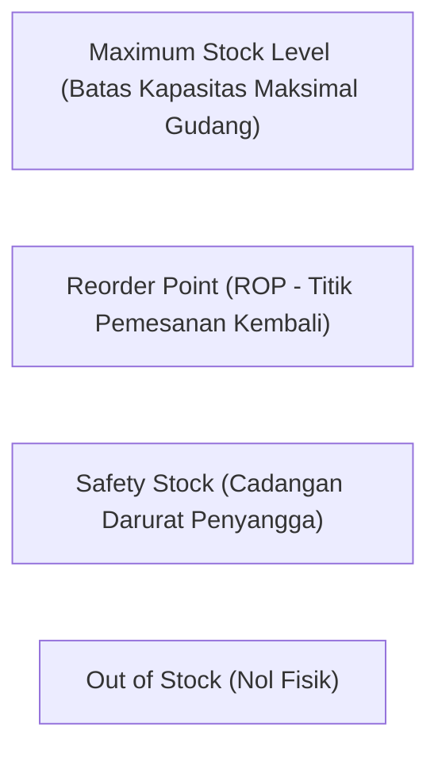

# Replenishment and Stock Planning

## Definition

**Replenishment and Stock Planning** (Perencanaan dan Pengisian Ulang Persediaan) adalah serangkaian aturan bisnis matematis dan mesin otomatisasi dalam ERP yang memantau tingkat persediaan barang secara terus-menerus guna mendeteksi potensi kekurangan stok dan secara otomatis membangkitkan usulan pengadaan (*Purchase Requisition*), pemindahan antar-gudang (*Transfer Order*), atau perintah produksi pabrik (*Manufacturing Work Order*).

Tujuan utama dari pengisian ulang persediaan adalah menjaga keseimbangan optimal antara **tingkat layanan pelanggan (*Customer Service Level / Fill Rate*)** yang tinggi dengan **biaya penahanan persediaan (*Holding / Carrying Cost*)** dan modal kerja seminimal mungkin.

---

## Siklus Mental Model: Dari Permintaan Hingga Pemulihan Stok

Proses pengisian ulang persediaan bergerak dalam siklus dinamis:

```mermaid
flowchart TD
    Demand["(1) Permintaan Konsumsi Terjadi<br/>(Penjualan, Pemakaian Pabrik, atau Pemindahan)"]
    --> Proj["(2) Proyeksi Kuantitas Bersih (Projected Net Stock)<br/>ERP menghitung: On-Hand + On-Order - Demand Terikat"]
    
    Proj --> CheckROP{Apakah Proyeksi Stok<br/>$\le$ Reorder Point (ROP)?}
    
    CheckROP -- "Tidak (Stok Aman)" --> Monitor["3a. Tetap Pantau Tingkat Stok Berkala"]
    
    CheckROP -- "Ya (Picu Pengisian)" --> Engine["3b. Jalankan Mesin Replenishment Engine<br/>Hitung Kuantitas Pesan Optimal (Order Qty)"]
    
    Engine --> TriggerType{Tipe Sumber Pemenuhan<br/>(Supply Mechanism)?}
    
    TriggerType -- "Barang Beli (Buy)" --> PR["Bangkiskan Draft Purchase Requisition (PR)<br/>ke Pemasok Eksternal"]
    TriggerType -- "Barang Pindah (Transfer)" --> TR["Bangkiskan Transfer Request (TR)<br/>dari Gudang Pusat Distribusi"]
    TriggerType -- "Barang Rakit (Make)" --> MO["Bangkiskan Manufacturing Order (MO)<br/>ke Lantai Produksi Pabrik"]
    
    PR --> Inbound["(4) Penerimaan Barang di Gudang (Goods Receipt)"]
    TR --> Inbound
    MO --> Inbound
    
    Inbound --> Recover["(5) Pemulihan Saldo Persediaan (Stock Recovery)<br/>Stok kembali di atas ambang batas aman"]
```

---

## Logika dan Formula Parameter Kunci Persediaan

Sistem ERP menggunakan parameter konfigurasi baku untuk menghitung waktu dan kuantitas pemesanan:



### 1. Safety Stock (Cadangan Pengaman)
Bantalan stok (*buffer*) yang disiapkan untuk melindungi organisasi dari dua ketidakpastian utama: lonjakan permintaan pelanggan mendadak dan keterlambatan pengiriman dari pemasok (*lead time delay*):

$$\text{Safety Stock (SS)} = Z \times \sigma_d \times \sqrt{L}$$
*Di mana $Z$ adalah faktor tingkat layanan (misal: 1,65 untuk 95% service level), $\sigma_d$ adalah standar deviasi permintaan harian, dan $L$ adalah lead time pengiriman (hari).*

### 2. Lead Time (Waktu Tunggu Pasokan)
Total hari kerja yang dibutuhkan sejak Purchase Order diterbitkan hingga barang benar-benar lolos inspeksi QC dan siap digunakan di rak penyimpanan.

### 3. Reorder Point (ROP - Titik Pemesanan Kembali)
Ambang batas saldo persediaan di mana sistem ERP wajib memicu pembuatan pesanan pengadaan baru:

$$\mathbf{ROP = (\text{Rata-rata Permintaan Harian} \times \text{Lead Time}) + \text{Safety Stock}}$$

#### Contoh Skenario Kanonikal ROP:
* Komponen Laptop Pro dikonsumsi rata-rata **5 unit per hari**.
* *Lead time* pengiriman dari PT Sumber Teknologi = **6 hari**.
* *Safety Stock* yang ditetapkan manajemen = **10 unit**.
$$\text{ROP} = (5 \times 6) + 10 = 30 + 10 = \mathbf{40 \text{ unit}}$$
* *Artinya*: Segera setelah saldo bersih terproyeksi menyentuh angka 40 unit, ERP secara otomatis membangkitkan draft PR/PO untuk mencegah kehabisan stok sebelum kiriman baru tiba 6 hari kemudian.

---

## Kebijakan dan Strategi Pengisian Ulang (Replenishment Strategies)

ERP enterprise menyediakan berbagai model perencanaan stok:

| Strategi Perencanaan | Mekanisme Kerja Sistem | Cocok untuk Karakteristik Barang |
| :--- | :--- | :--- |
| **Min-Max Planning** | Menetapkan batas *Minimum* (setara ROP) dan *Maximum*. Saat stok menyentuh batas Minimum, sistem memesan sejumlah: $\text{Order Qty} = \text{Max} - \text{Current Stock}$. | Barang komoditas operasional, ATK, suku cadang MRO dengan permintaan relatif stabil. |
| **Fixed Order Quantity (EOQ)** | Saat stok menyentuh ROP, sistem selalu memesan kuantitas tetap yang telah dioptimalkan secara matematis (*Economic Order Quantity*). | Barang dengan biaya penyiapan pesanan (*ordering cost*) atau biaya kirim truk kontainer yang mahal. |
| **Periodic Review (Order-Up-To-Level)** | Stok ditinjau pada interval waktu tetap (misal: setiap hari Senin). Kuantitas dipesan untuk mengembalikan stok ke tingkat target. | Toko retail yang dikunjungi armada distributor seminggu sekali. |
| **Material Requirements Planning (MRP)** | Menghitung kebutuhan material berbasis waktu (*time-phased*) berdasarkan jadwal induk produksi (*MPS*) dan struktur pohon komponen (*BOM*). | Komponen manufaktur dan bahan baku perakitan industri diskrit. |
| **Just-in-Time / Kanban** | Pengisian ulang dipicu secara visual atau elektronik oleh kartu sinyal konsumsi nyata di lini perakitan (*pull system*). | Manufaktur otomotif dan elektronik volume tinggi bebas gudang penyangga (*lean manufacturing*). |

---

## Pemisahan: Replenishment Rule vs. Purchase Execution

Sangat krusial untuk memisahkan antara aturan penentu kebutuhan dengan eksekusi pembelian:

> [!important]
> **Planning $\neq$ Execution**:
> * **Replenishment Rule (Aturan Perencanaan Persediaan)**: Algoritma analitis yang mendeteksi defisit stok dan menghasilkan **rekomendasi kuantitas yang dibutuhkan (*Suggested Requisition / Exception Message*)**.
> * **Purchase Execution (Eksekusi Pengadaan)**: Keputusan komersial manusia di departemen pengadaan untuk mengonsolidasikan beberapa rekomendasi PR, menegosiasikan harga penawaran via [[04-purchasing/request-for-quotation|RFQ]], dan menerbitkan [[04-purchasing/purchase-order|Purchase Order]] resmi.
> 
> Rekomendasi otomatis dari sistem replenishment tidak boleh langsung menjadi komitmen utang finansial tanpa melalui gerbang otorisasi dan kontrol anggaran (*budget check*).

---

## ERP Implementation Comparison

| Aspek | Odoo Enterprise | ERPNext | Microsoft Dynamics 365 SCM |
| :--- | :--- | :--- | :--- |
| **Model Aturan** | Fitur **Reordering Rules**: Menentukan *Min Quantity*, *Max Quantity*, *Multiple Quantity*, dan rute pemenuhan (Buy, Manufacture, Dropship). | Fitur **Auto Reorder** pada Item Master: Menentukan ambang batas per warehouse, *Re-order Level*, *Re-order Qty*, dan jenis dokumen yang dibangkitkan (Material Request). | Sangat komprehensif: Menggunakan konsep **Coverage Groups** dan **Master Planning (MRP Engine)** dengan parameter *Min/Max*, *Requirement*, dan *Period*. |
| **Pemisahan Sumber Pemenuhan** | Rute fleksibel berbasis grafik (*Procurement Routes / Pull Rules*): menentukan apakah kebutuhan dipenuhi via PR, Transfer internal, atau MO. | Pilihan *Material Request Type* pada aturan reorder: *Purchase*, *Material Transfer*, atau *Manufacture*. | Menggunakan *Default Order Settings* yang mendefinisikan *Item Coverage* terpisah per Site dan Warehouse. |
| **Kalkulasi Safety Stock** | Input manual angka statis pada formulir aturan reorder. | Input manual angka statis pada konfigurasi item per gudang. | Mendukung kalkulasi otomatis *Safety Stock Journal* berbasis formula statistik deviasi historis. |

---

## Naventra Consideration

Untuk perancangan modul Replenishment pada sistem ERP enterprise seperti **Naventra**:

1. **Skema Database Aturan Pengisian Ulang Multi-Gudang**:
   ```sql
   CREATE TABLE item_replenishment_rules (
       id UUID PRIMARY KEY DEFAULT gen_random_uuid(),
       item_id UUID NOT NULL REFERENCES items(id),
       warehouse_id UUID NOT NULL REFERENCES warehouses(id),
       strategy VARCHAR(30) NOT NULL DEFAULT 'MIN_MAX', -- 'MIN_MAX', 'ROP_EOQ', 'MANUAL'
       safety_stock_qty NUMERIC(15, 4) NOT NULL DEFAULT 0,
       reorder_point_qty NUMERIC(15, 4) NOT NULL,
       min_order_qty NUMERIC(15, 4) NOT NULL DEFAULT 1,
       max_order_qty NUMERIC(15, 4),
       order_multiple_qty NUMERIC(15, 4) DEFAULT 1, -- Kelipatan kemasan pabrik (pack size)
       replenishment_source VARCHAR(30) NOT NULL, -- 'PURCHASE', 'INTERNAL_TRANSFER', 'MANUFACTURE'
       source_warehouse_id UUID REFERENCES warehouses(id), -- Jika internal transfer
       is_active BOOLEAN NOT NULL DEFAULT TRUE,
       UNIQUE (item_id, warehouse_id)
   );
   ```
2. **Automated Planning Worker (MRP/Replenishment Runner)**:
   Rancang background worker berkala (misal: berjalan setiap malam pukul 01:00) yang mengevaluasi persamaan ketersediaan:
   $$\text{Net Available} = \text{On-Hand} + \text{On-Order (PO/TR)} - \text{Reserved (SO/WO)}$$
   Jika $\text{Net Available} \le \text{reorder\_point\_qty}$, sistem membangkitkan record draft baru pada tabel `purchase_requisitions` atau `internal_transfer_orders`.
3. **Pencegahan Pemesanan Ganda (*Duplicate Suggestion Prevention*)**:
   Sebelum membangkitkan rekomendasi baru, sistem wajib memeriksa apakah sudah ada dokumen draft PR atau PO terbuka (*unfulfilled inbound*) yang dibuat oleh siklus sebelumnya untuk item dan gudang yang sama.

---

## References

- APICS / ASCM. *Master Planning of Resources and Detailed Scheduling: Safety Stock, Reorder Point, and Min-Max Mechanics*.
- Silver, E. A., Pyke, D. F., & Peterson, R. *Inventory Management and Production Planning and Scheduling*. John Wiley & Sons.
- Microsoft Learn. *Master Planning and Item Coverage Architecture in Dynamics 365 Supply Chain Management*.
- Frappe ERPNext Documentation. *Auto Reorder and Material Request Planning*.
- Odoo 17 Documentation. *Reordering Rules: Automated Replenishment and Stock Min/Max Triggers*.
