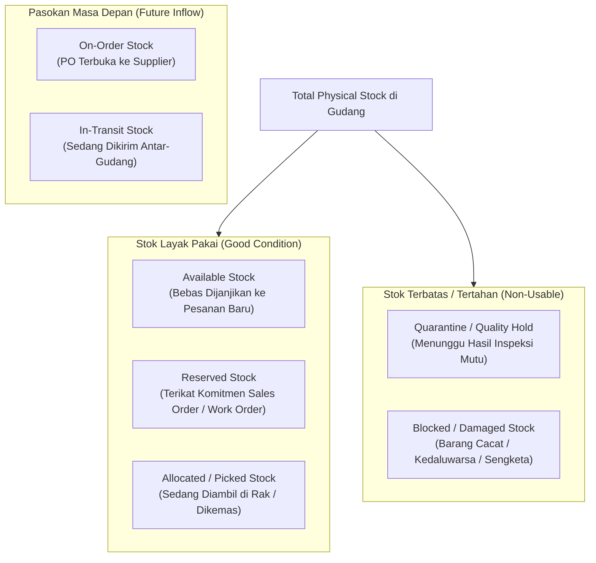
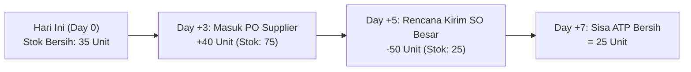

# Stock Quantity and Availability

## Definition

**Stock Quantity and Availability** adalah mekanisme kalkulasi kuantitas stok dalam ERP yang mendefinisikan secara presisi berapa banyak barang fisik yang ada di gudang (*physical presence*), berapa banyak yang telah terikat oleh pesanan (*commitments*), dan berapa banyak yang benar-benar bebas untuk dijanjikan kepada pesanan baru (*available to promise*).

Dalam operasional bisnis, pertanyaan sederhana seperti *"Berapa stok Laptop Pro yang kita miliki?"* tidak pernah memiliki satu jawaban tunggal. Menjawab *"Ada 100 unit di gudang"* tanpa memperhitungkan pesanan penjualan yang sedang disiapkan atau barang yang rusak akan menyebabkan *overselling*, keterlambatan pengiriman, dan kekecewaan pelanggan.

---

## Taksonomi Status Kuantitas Persediaan

ERP enterprise memecah persediaan ke dalam berbagai kategori kuantitas terstruktur:



### Definisi Matriks Kuantitas:

| Kategori Kuantitas | Definisi Konseptual | Dampak terhadap Penjualan Baru |
| :--- | :--- | :--- |
| **On-Hand (Stok Fisik Ada)** | Total seluruh unit fisik yang berada di dalam fasilitas gudang pada saat ini, tanpa memedulikan status komitmennya. | **Bukan** acuan penjualan langsung; masih mengandung stok yang sudah dipesan pihak lain atau rusak. |
| **Reserved (Dicadangkan)** | Kuantitas yang telah dikomitkan untuk Sales Order atau Work Order tertentu, namun barang fisiknya masih berada di rak penyimpanan. | Mengurangi stok bebas; tidak boleh dijual ke pelanggan lain. |
| **Allocated / Picked (Dialokasikan)** | Kuantitas yang telah diterbitkan dalam daftar pengambilan (*Pick List*) dan saat ini sedang diambil staf gudang atau berada di area *Packing Staging*. | Mengurangi stok on-hand yang belum tersentuh; siap diberangkatkan. |
| **Available (Tersedia)** | Kuantitas bersih yang bebas dari komitmen apa pun dan siap dialokasikan untuk permintaan baru seketika. | Acuan utama staf penjualan saat mengonfirmasi pesanan baru. |
| **Quarantine / QC Hold** | Barang yang berada di gudang namun ditahan sistem untuk verifikasi mutu, pengujian laboratorium, atau sertifikasi keaslian. | Tidak boleh dijual atau diproduksi sampai tim QC membebaskannya (*release*). |
| **Blocked / Damaged** | Barang yang rusak fisik, pecah, terkontaminasi, atau mendekati masa kedaluwarsa (*near expiry*). | Diisolasi dari pemenuhan pesanan normal; menunggu retur vendor atau pemusnahan. |
| **On-Order (Dalam Pemesanan)** | Kuantitas barang yang telah diterbitkan Purchase Order resminya ke pemasok, namun barang fisiknya belum tiba di gudang. | Belum ada di gudang fisik; dapat diperhitungkan dalam proyeksi ketersediaan masa depan. |
| **In-Transit (Dalam Perjalanan)** | Barang yang telah keluar dari gudang asal namun belum diverifikasi penerimaannya di gudang tujuan. | Aset perusahaan yang masih dalam perjalanan ekspedisi logistik. |

---

## Logika Perhitungan: Available vs. On-Hand

Tidak ada satu formula tunggal yang berlaku mutlak sebagai hukum universal bagi seluruh perusahaan. Formula ketersediaan stok sangat bergantung pada **kebijakan bisnis (*business policy*)** yang dikonfigurasi di dalam ERP:

### Skenario Dasar:
Misalkan kondisi persediaan untuk komponen Laptop Pro di Gudang Utama:
* $\text{On-Hand} = 100 \text{ unit}$
* $\text{Reserved (Sales Order terkonfirmasi)} = 30 \text{ unit}$
* $\text{Allocated (Pick list aktif di lantai gudang)} = 20 \text{ unit}$
* $\text{Quarantine (Menunggu uji QC)} = 10 \text{ unit}$
* $\text{Blocked (Kerusakan fisik)} = 5 \text{ unit}$
* $\text{On-Order (PO ke PT Sumber Teknologi)} = 40 \text{ unit}$

---

### Variasi Kebijakan Ketersediaan (Availability Policies):

#### 1. Kebijakan Konservatif (Strict Physical Availability)
Hanya memperhitungkan stok fisik yang sempurna dan benar-benar belum terikat komitmen sama sekali:
$$\text{Available} = \text{On-Hand} - \text{Reserved} - \text{Allocated} - \text{Quarantine} - \text{Blocked}$$
$$\text{Available} = 100 - 30 - 20 - 10 - 5 = \mathbf{35 \text{ unit}}$$
* *Karakteristik*: Mencegah risiko *backorder* sekecil apa pun; sangat cocok untuk bisnis retail dan *same-day delivery*.

#### 2. Kebijakan Operasional Standar (Operational Usable Stock)
Jika sistem telah memisahkan kuantitas *Allocated* sebagai bagian dari *Reserved*, atau barang rusak telah dipindahkan ke lokasi virtual non-stok:
$$\text{Available} = \text{On-Hand Usable} - \text{Reserved}$$
$$\text{Available} = 85 - 50 = \mathbf{35 \text{ unit}}$$

#### 3. Kebijakan Prospektif / Available-to-Promise (ATP)
Memperhitungkan pasokan masa depan yang sudah memiliki komitmen tanggal pasti dari pemasok (*Inbound PO*):
$$\text{Projected ATP} = (\text{On-Hand Usable} - \text{Demand Terikat}) + \text{Inbound PO}$$
$$\text{Projected ATP} = (85 - 50) + 40 = \mathbf{75 \text{ unit}}$$
* *Karakteristik*: Memungkinkan tim penjualan menjanjikan pengiriman di masa depan (*Promised Delivery Date*) kepada pelanggan untuk pesanan yang melebihi stok fisik saat ini.

---

## Konsep Available-to-Promise (ATP) dan Projected Availability

**Available-to-Promise (ATP)** adalah fungsi analitik dinamis dalam ERP yang menghitung ketersediaan persediaan yang belum terpakai pada periode waktu tertentu di masa depan (*time-phased inventory*):



### Manfaat Utama ATP:
1. **Order Promising Akurat**: Staf penjualan dapat langsung memberikan tanggal penyerahan barang yang realistis tanpa harus menelepon manajer gudang atau pabrik.
2. **Safety Stock Buffer**: Perhitungan ATP dapat mengunci saldo minimum (*Safety Stock*) agar tidak pernah tersentuh oleh pesanan reguler, memastikan perlindungan terhadap kondisi darurat.

---

## ERP Implementation Comparison

| Aspek | Odoo Enterprise | ERPNext | Microsoft Dynamics 365 SCM |
| :--- | :--- | :--- | :--- |
| **Istilah Kuantitas** | *On Hand Quantity* vs *Forecasted Quantity* (memperhitungkan incoming receipts & outgoing deliveries). | *Actual Qty* (On-Hand), *Reserved Qty*, *Projected Qty* (Actual + Requested - Reserved). | *Physical inventory*, *Physical reserved*, *Available physical*, *Ordered in total*, *Available to promise (ATP)*. |
| **Mekanisme Reservasi** | Konsep *Reservations* otomatis pada dokumen pengiriman (*Stock Picking*); kuantitas berstatus *Reserved*. | Dikelola pada baris Item: kolom *Reserved Qty for Sales Order* diperbarui otomatis saat SO disubmit. | Menggunakan mesin reservasi fleksibel: *Manual*, *Automatic*, atau *Explosion* dengan kriteria dimensi inventaris. |
| **Kalkulasi Real-Time vs Snapshot** | Dihitung real-time dari tabel agregat `stock.quant` berdasarkan lokasi internal yang bertipe stok. | Dihitung dari baris `Stock Ledger Entry` dan dicatat ke tabel denormalisasi `Bin` per warehouse. | Dikelola melalui cache performa tinggi di tabel `InventSum` dengan dukungan query multi-dimensi. |

---

## Naventra Consideration

Untuk perancangan modul Ketersediaan Stok pada sistem ERP enterprise seperti **Naventra**:

1. **Struktur Tabel Kuantitas Multi-Dimensi (Bin / Balance Cache)**:
   ```sql
   CREATE TABLE inventory_balances (
       id UUID PRIMARY KEY DEFAULT gen_random_uuid(),
       item_id UUID NOT NULL REFERENCES items(id),
       warehouse_id UUID NOT NULL REFERENCES warehouses(id),
       storage_location_id UUID REFERENCES storage_locations(id),
       batch_number VARCHAR(100),
       serial_number VARCHAR(100),
       
       -- Kuantitas Fisik dan Komitmen
       on_hand_qty NUMERIC(15, 4) NOT NULL DEFAULT 0,
       reserved_qty NUMERIC(15, 4) NOT NULL DEFAULT 0,
       allocated_qty NUMERIC(15, 4) NOT NULL DEFAULT 0,
       quarantine_qty NUMERIC(15, 4) NOT NULL DEFAULT 0,
       blocked_qty NUMERIC(15, 4) NOT NULL DEFAULT 0,
       
       updated_at TIMESTAMP WITH TIME ZONE DEFAULT NOW(),
       UNIQUE (item_id, warehouse_id, storage_location_id, batch_number, serial_number)
   );
   ```
2. **Generated Column / Virtual View untuk Available Stock**:
   ```sql
   -- Menggunakan computed column atau database view untuk menjamin konsistensi formula
   CREATE OR REPLACE VIEW view_item_availability AS
   SELECT 
       item_id,
       warehouse_id,
       SUM(on_hand_qty) AS total_on_hand,
       SUM(reserved_qty) AS total_reserved,
       SUM(allocated_qty) AS total_allocated,
       SUM(quarantine_qty + blocked_qty) AS total_restricted,
       -- Formula Konservatif
       SUM(on_hand_qty - reserved_qty - allocated_qty - quarantine_qty - blocked_qty) AS available_qty
   FROM inventory_balances
   GROUP BY item_id, warehouse_id;
   ```
3. **Pemberlakuan Locking Concurrency saat Check-and-Reserve**:
   Saat pesanan penjualan melakukan reservasi stok, gunakan mekanisme *Pessimistic Locking* (`SELECT ... FOR UPDATE`) atau transaksi berbasis isolasi tinggi untuk mencegah *race condition* di mana dua pesanan berbeda secara bersamaan mengambil sisa stok yang sama (*double allocation*).

---

## References

- APICS / ASCM. *APICS Dictionary: Available-to-Promise (ATP), Capable-to-Promise (CTP), and Inventory Allocation*.
- Vollmann, T. E., et al. *Manufacturing Planning and Control for Supply Chain Management: Master Production Scheduling and Order Promising*.
- Microsoft Learn. *Inventory On-Hand and Availability Calculation in Dynamics 365 Supply Chain Management*.
- Frappe ERPNext Documentation. *Item Quantity Metrics: Actual, Reserved, and Projected Quantity*.
- Odoo 17 Documentation. *Stock Forecasts and Inventory Reservations*.
