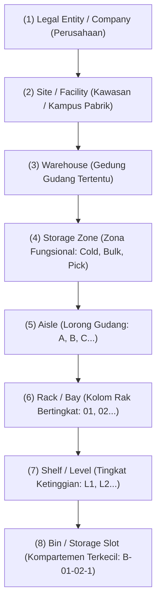
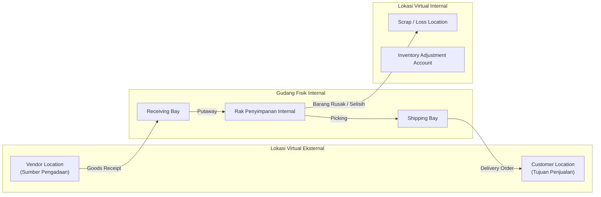

# Warehouse and Location Topology

## Definition

**Warehouse and Location Topology** adalah pemodelan arsitektural ruang fisik dan fungsional tempat persediaan disimpan, dipindahkan, dan dikelola dalam sistem ERP.

Topologi gudang memetakan realitas tata letak fasilitas fisik (seperti gedung fasilitas, zona penyimpanan, lorong rak, dan kompartemen *bin*) ke dalam struktur data hierarkis sistem, sehingga ERP dapat secara presisi melacak tidak hanya *berapa banyak* barang yang dimiliki, melainkan *di koordinat mana* barang tersebut berada dan *apa status operasionalnya*.

---

## Hierarki Topologi Gudang (Warehouse Topology)

Tingkat kerumitan pemodelan lokasi dalam ERP bervariasi dari struktur sederhana hingga sistem pergudangan tingkat lanjut (*Advanced WMS*):



### Konvensi Pengalamatan Bin (*Bin Addressing Coordinate*)
Dalam operasional pergudangan modern, setiap *bin* memiliki kode koordinat unik yang dicetak sebagai barcode:
$$\text{Format Koordinat:} \quad \mathbf{WH\text{-}ZN\text{-}AIS\text{-}RCK\text{-}LVL\text{-}BIN}$$
* Contoh: `WH1-DRY-A-04-3-B` $\to$ Gudang Utama (WH1), Zona Kering (DRY), Lorong A, Rak 04, Tingkat 3, Bin B.

---

## Klasifikasi dan Tipe Lokasi Fungsional

Tidak semua lokasi di dalam ERP mewakili rak penyimpanan statis. Sistem membedakan berbagai tipe lokasi berdasarkan peran alur kerjanya:

| Tipe Lokasi | Karakteristik Operasional | Apakah Masuk Stok Tersedia (*ATP*)? | Fungsi Bisnis |
| :--- | :--- | :--- | :--- |
| **Storage / Putaway Bin** | Lokasi penyimpanan reguler di rak gudang tempat barang siap diambil. | **Ya** | Titik penyimpanan utama persediaan aktif yang siap dipenuhi untuk pesanan pelanggan atau produksi. |
| **Receiving Dock / Bay** | Area pembongkaran muatan dari truk pemasok (*Inbound Staging*). | **Tidak** (dalam proses) | Menampung barang saat dibongkar sebelum verifikasi kuantitas dan inspeksi mutu. |
| **Inspection / Quality Hold** | Area karantina mutu (*QC Quarantine*). | **Tidak** | Menahan barang yang membutuhkan uji laboratorium atau pemeriksaan sampel sebelum diizinkan masuk stok. |
| **Picking / Fast-Moving Area** | Rak tingkat rendah yang mudah dijangkau operator (*Ground Level*). | **Ya** | Mempercepat proses pemenuhan pesanan retail (*order fulfillment*). |
| **Packing & Shipping Staging** | Area pengepakan akhir dan konsolidasi sebelum dimuat ke truk (*Outbound Dock*). | **Tidak** (sudah dialokasikan/dikeluarkan dari gudang aktif) | Tempat meletakkan kardus siap kirim yang menunggu penjemputan armada kurir. |
| **Damaged / Scrap Location** | Lokasi penampungan barang rusak, tumpah, atau kedaluwarsa. | **Tidak** | Menampung barang cacat sebelum disetujui untuk dimusnahkan (*write-off / disposal*). |
| **In-Transit Location** | Lokasi virtual di jalan saat barang berpindah antar-gudang fisik. | **Tidak** di gudang lokal (diakui sebagai stok dalam perjalanan perusahaan) | Menjaga saldo kepemilikan persediaan saat barang berada di atas truk ekspedisi antarkota. |

---

## Lokasi Fisik vs. Lokasi Virtual (Virtual / System Locations)

Beberapa arsitektur ERP enterprise (seperti Odoo dan SAP) memanfaatkan konsep **Virtual Location** untuk menjaga keseimbangan mutasi logistik berpasangan:



* **Manfaat Lokasi Virtual**: Memastikan setiap pergerakan barang selalu memiliki pasangan *Source Location* dan *Destination Location*, mencegah hilangnya kuantitas secara gaib tanpa jejak mutasi.

---

## Multi-Warehouse vs. Multi-Location

Organisasi skala menengah hingga besar mengoperasikan jaringan rantai pasok terdistribusi:

1. **Multi-Warehouse (Multi-Gudang)**:
   * Mengelola entitas fisik yang terpisah secara geografis (misal: *Gudang Pusat Cikarang*, *Hub Distribusi Surabaya*, *Hub Distribusi Medan*).
   * Masing-masing gudang dapat memiliki kebijakan jam operasional, manajer gudang, akun akuntansi, dan strategi pengisian ulang (*replenishment*) yang independen.
2. **Multi-Location (Multi-Lokasi dalam Satu Gudang)**:
   * Mengatur subdivisi internal di dalam satu bangunan gudang yang sama.
   * Memungkinkan diferensiasi perlakuan barang (misal: lorong makanan dingin vs lorong suku cadang logam).
3. **Cross-Warehouse Transfer**:
   * Perpindahan barang antar-gudang fisik yang memerlukan dokumen [[05-inventory/internal-stock-transfer|Internal Stock Transfer]]. Jika jarak tempuh membutuhkan waktu berhari-hari, barang wajib singgah di *In-Transit Warehouse* agar kuantitas tidak hilang dari laporan persediaan konsolidasi.

---

## ERP Implementation Comparison

| Dimensi | Odoo Enterprise | ERPNext | Microsoft Dynamics 365 SCM |
| :--- | :--- | :--- | :--- |
| **Model Topologi** | Konsep **Locations as Nodes**: Seluruh pergerakan dimodelkan sebagai grafik perpindahan antar lokasi (Internal, Vendor, Customer, Inventory Loss, Production). | Hierarki Pohon (**Warehouse Tree**): Gudang dimodelkan sebagai grup hierarkis (Parent Warehouse $\to$ Child Warehouse). | Hierarki Berdimensi: **Site $\to$ Warehouse $\to$ Location** dengan konfigurasi *Location Profile* dan *Aisle/Rack/Shelf/Bin*. |
| **Dukungan Koordinat Rak/Bin** | Tersedia melalui aktivasi fitur *Storage Locations*. Mendukung *Putaway Rules* otomatis ke bin tertentu. | Dilacak melalui pembuatan child warehouse setingkat bin atau penambahan field *Bin/Shelf Location*. | Sangat komprehensif: Memiliki arsitektur *Location Directives* dan *Work Templates* untuk putaway dan picking berbasis volume/berat. |
| **Pemisahan Karantina & Kerusakan** | Menggunakan tipe lokasi khusus berstatus non-internal atau konfigurasi *Scrap Location*. | Menggunakan child warehouse berstatus khusus (misal: *Rejected Warehouse / Scrap Warehouse*). | Menggunakan *Inventory Status* (Available, Blocked, Quarantine) yang dapat diterapkan pada bin fisik mana pun tanpa harus memindahkan barang. |

---

## Naventra Consideration

Untuk perancangan topologi gudang pada sistem ERP enterprise seperti **Naventra**:

1. **Skema Database Topologi Hierarkis**:
   ```sql
   CREATE TABLE warehouses (
       id UUID PRIMARY KEY DEFAULT gen_random_uuid(),
       company_id UUID NOT NULL REFERENCES companies(id),
       warehouse_code VARCHAR(20) NOT NULL UNIQUE,
       warehouse_name VARCHAR(100) NOT NULL,
       is_in_transit BOOLEAN DEFAULT FALSE,
       address TEXT,
       created_at TIMESTAMP WITH TIME ZONE DEFAULT NOW()
   );

   CREATE TABLE storage_locations (
       id UUID PRIMARY KEY DEFAULT gen_random_uuid(),
       warehouse_id UUID NOT NULL REFERENCES warehouses(id),
       parent_location_id UUID REFERENCES storage_locations(id), -- Self-referencing untuk hierarki zona/rak
       location_code VARCHAR(50) NOT NULL, -- Contoh: ZN-DRY-A-01-1
       location_type VARCHAR(30) NOT NULL, -- 'STORAGE', 'RECEIVING', 'SHIPPING', 'QC', 'SCRAP'
       is_scrap BOOLEAN DEFAULT FALSE,
       is_available_for_atp BOOLEAN DEFAULT TRUE,
       max_weight_capacity NUMERIC(12, 2),
       max_volume_cbm NUMERIC(12, 4),
       UNIQUE (warehouse_id, location_code)
   );
   ```
2. **Flagging Ketersediaan ATP pada Level Lokasi**: Kolom `is_available_for_atp` memungkinkan sistem menyaring secara instan lokasi mana saja yang kuantitasnya boleh diperhitungkan dalam perhitungan [[05-inventory/stock-quantity-and-availability|Available-to-Promise (ATP)]]. Area *Receiving Bay*, *QC Hold*, dan *Damaged Area* wajib diset `is_available_for_atp = FALSE`.
3. **Pemberian Label Barcode Standar**: Sistem wajib mampu menghasilkan label barcode berformat Code 128 atau QR Code untuk setiap `location_code` agar operator gudang dapat memindai lokasi secara presisi saat melakukan putaway dan picking menggunakan perangkat mobile.

---

## References

- ASCM / APICS. *Warehouse Management Best Practices: Facility Layout, Storage Topology, and Slotting Optimization*.
- Microsoft Learn. *Warehouse Layout and Location Directives in Dynamics 365 Supply Chain Management*.
- Frappe ERPNext Documentation. *Warehouse Tree and Location Structure*.
- Odoo 17 Documentation. *Warehouse Configurations: Locations, Multi-step Routes, and Putaway Rules*.
- Tompkins, J. A., et al. *Facilities Planning: Warehouse Design, Material Flow, and Storage Systems*.
