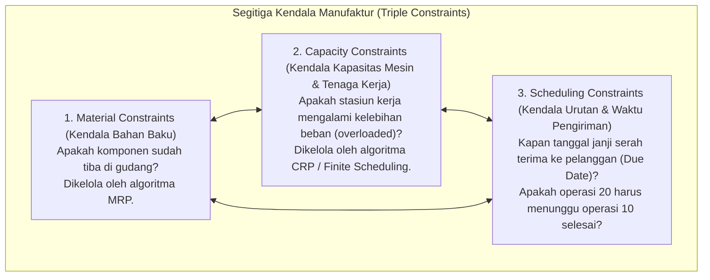
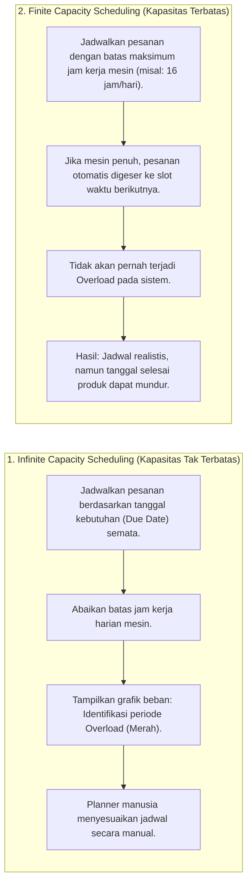

# Capacity Planning and Production Scheduling

## Definition

**Capacity Planning and Production Scheduling** adalah domain analitis dan operasional dalam ERP yang mengukur, membandingkan, dan mengalokasikan beban kerja manufaktur terhadap ketersediaan sumber daya fisik pabrik—memastikan bahwa pesanan produksi dijadwalkan secara realistis dengan mempertimbangkan batas daya tampung mesin (*machine capacity*), ketersediaan jam kerja operator (*labor capacity*), jam giliran kerja (*shifts*), serta hari aktif kalender pabrik.

Jika [[06-manufacturing/mrp-material-requirement-planning|MRP]] berfokus pada **pembatasan material (*Material Constraints*)** untuk menjawab pertanyaan *"Apakah bahan baku tersedia?"*, maka Capacity Planning berfokus pada **pembatasan daya muat sumber daya (*Capacity Constraints*)** untuk menjawab pertanyaan **"Apakah mesin dan tenaga kerja memiliki waktu luang untuk mengerjakannya?"**.

---

## Tiga Dimensi Kendala Manufaktur (Manufacturing Constraints)

Sistem perencanaan manufaktur yang tangguh menyeimbangkan tiga pilar pembatas yang saling mengunci:



---

## Spektrum Perencanaan Kapasitas: Dari Jangka Panjang ke Detail

Dalam arsitektur ERP enterprise, perencanaan kapasitas dianalisis pada tiga tingkatan:

| Tingkatan Kapasitas | Pasangan Perencanaan | Horizon Waktu | Sumber Daya yang Dianalisis |
| :--- | :--- | :--- | :--- |
| **Resource Requirements Planning (RRP)** | Sales & Operations Planning (S&OP) | Jangka Panjang (1–3 Tahun) | Fasilitas agregat: luas lantai pabrik, kebutuhan penambahan lini pabrik baru, investasi modal mesin. |
| **Rough-Cut Capacity Planning (RCCP)** | Master Production Schedule (MPS) | Jangka Menengah (1–6 Bulan) | Stasiun kerja kritis dan titik leher botol (*Bottleneck Work Centers*) untuk memastikan MPS dapat dieksekusi. |
| **Capacity Requirements Planning (CRP)** | Material Requirements Planning (MRP) | Jangka Pendek (1–8 Minggu) | Seluruh stasiun kerja individual, jam mesin, dan jam tenaga kerja per rute operasi (*Detailed Operation Level*). |

---

## Model Penjadwalan: Finite vs. Infinite Capacity Scheduling

Salah satu perbedaan arsitektur paling fundamental dalam sistem ERP adalah bagaimana mesin penjadwal memperlakukan batas kapasitas mesin:



### Kapan Menggunakan Masing-Masing Metode?
* **Infinite Scheduling**: Sangat berguna pada tahap perencanaan awal (*Early Planning*). Metode ini memperlihatkan lonjakan kebutuhan kapasitas secara visual, memberi tahu manajemen kapan pabrik harus membuka lembur (*overtime*), menyewa pekerja kontrak, atau mengalihkan pekerjaan ke pihak luar (*subcontracting*).
* **Finite Scheduling**: Wajib digunakan pada tingkat eksekusi lantai pabrik harian (*Shop Floor Dispatching*). Mesin tidak dapat memproses dua pekerjaan sekaligus; finite scheduling memastikan antrean kerja di depan mesin sesuai dengan hukum fisika nyata.

---

## Strategi Penjadwalan Arah Waktu: Forward vs. Backward Scheduling

Sistem ERP menyediakan dua arah perhitungan penanggalan:

```mermaid
flowchart TD
    subgraph Forward["1. Forward Scheduling (Penjadwalan Maju / Earliest Possible)"]
        F_Start["Mulai pada tanggal paling awal yang memungkinkan (Hari Ini)"]
        --> F_Op1["Operasi 10: Setup & Run"]
        --> F_Op2["Operasi 20: Assembly"]
        --> F_Op3["Operasi 30: QC & Pack"]
        --> F_End["Dihasilkan: Tanggal Penyelesaian Paling Awal (Earliest Completion Date)"]
    end

    subgraph Backward["2. Backward Scheduling (Penjadwalan Mundur / Just-in-Time)"]
        B_Due["Mulai dari Tanggal Janji Kirim Pelanggan (Due Date: Hari ke-30)"]
        --> B_Op3["Mundur durasi Operasi 30"]
        --> B_Op2["Mundur durasi Operasi 20"]
        --> B_Op1["Mundur durasi Operasi 10"]
        --> B_Start["Dihasilkan: Batas Akhir Produksi Wajib Dimulai (Latest Start Date)"]
    end
```



### Karakteristik Masing-Masing Pendekatan:
* **Backward Scheduling (Default ERP / JIT Principle)**:
  * Menghitung mundur dari tanggal janji kirim pelanggan (*Promised Delivery Date*).
  * *Tujuan*: Meminimalkan waktu penumpukan barang jadi di gudang. Barang selesai tepat saat truk kurir tiba untuk menjemput (*Just-in-Time*).
  * *Kelemahan*: Sangat rentan terhadap keterlambatan jika terjadi kerusakan mesin mendadak, karena tidak menyisakan ruang jeda (*buffer time*).
* **Forward Scheduling**:
  * Menghitung maju dari tanggal saat ini atau tanggal bahan baku tersedia.
  * *Tujuan*: Mengetahui seberapa cepat pesanan darurat dapat diselesaikan (*Rush Order / Lead Time Quoting*).
  * *Kelemahan*: Barang jadi dapat selesai terlalu awal dan menumpuk di gudang, membebani modal kerja.

---

## Teori Kendala dan Manajemen Titik Macet (Theory of Constraints & Bottlenecks)

Berdasarkan prinsip **Theory of Constraints (TOC)**:

> [!important]
> **The Bottleneck Principle**:
> *Kapasitas keseluruhan pabrik ditentukan oleh stasiun kerja yang memiliki kapasitas paling rendah (*Bottleneck Work Center*).*
> 
> Mengoptimalkan stasiun kerja non-bottleneck hanya akan menghasilkan tumpukan barang setengah jadi (WIP) yang menggunung di depan stasiun bottleneck, tanpa menambah jumlah barang jadi yang keluar dari pabrik.

### Strategi Pengendalian Bottleneck dalam ERP:
1. **Drum-Buffer-Rope (DBR)**:
   * **Drum (Genderang)**: Jadwal stasiun kerja bottleneck menjadi penentu kecepatan seluruh pabrik.
   * **Buffer (Penyangga)**: Ditempatkan persediaan penyangga (*Time/Material Buffer*) tepat di depan stasiun bottleneck agar mesin tersebut tidak pernah berhenti beroperasi karena kehabisan bahan.
   * **Rope (Tali)**: Pelepasan bahan baku dari gudang diatur kecepatannya agar tepat sama dengan laju konsumsi stasiun bottleneck.

---

## ERP Implementation Comparison

| Aspek | Odoo Enterprise | ERPNext | Microsoft Dynamics 365 SCM |
| :--- | :--- | :--- | :--- |
| **Model Penjadwalan** | Mendukung Finite Capacity berbasis efisiensi Work Center; visualisasi jadwal via **Gantt Chart View** dengan drag-and-drop. | Penjadwalan kapasitas sederhana pada Workstation; fitur penyesuaian jam kerja dan kalender hari libur. | Sangat komprehensif: Menggunakan mesin **Scheduling Engine** dengan opsi *Job Scheduling* (detail menit) dan *Operation Scheduling* (agregat hari). |
| **Dukungan Finite vs Infinite** | Parameter kapasitas harian pada Work Center; sistem menggeser pesanan berikutnya jika kapasitas hari ini telah penuh. | Default mengasumsikan kapasitas tidak terbatas kecuali opsi pemeriksaan beban diaktifkan pada modul kustom. | Parameter formal: Pilihan checklist *Finite capacity* dan *Finite material* yang dapat diaktifkan per resource atau group. |
| **Optimasi Penjadwalan Visual** | Fitur *Planning App* terintegrasi dengan penugasan operator dan stasiun kerja berbasis kalender interaktif. | Visualisasi sederhana jadwal produksi melalui tampilan *Gantt View* pada daftar Work Order. | Fitur tingkat industri: **Gantt Chart for Operations / Job Scheduling** dengan kapabilitas simulasi penjadwalan ulang dinamis. |

---

## Naventra Consideration

Untuk perancangan modul Perencanaan Kapasitas pada sistem ERP enterprise seperti **Naventra**:

1. **Skema Database Pembebanan Kapasitas Stasiun Kerja**:
   ```sql
   CREATE TABLE work_center_capacity_loads (
       id UUID PRIMARY KEY DEFAULT gen_random_uuid(),
       work_center_id UUID NOT NULL REFERENCES work_centers(id),
       calendar_date DATE NOT NULL,
       total_available_hours NUMERIC(6, 2) NOT NULL,
       allocated_setup_hours NUMERIC(6, 2) NOT NULL DEFAULT 0,
       allocated_run_hours NUMERIC(6, 2) NOT NULL DEFAULT 0,
       allocated_downtime_hours NUMERIC(6, 2) NOT NULL DEFAULT 0,
       utilization_percentage NUMERIC(5, 2) GENERATED ALWAYS AS (
           ((allocated_setup_hours + allocated_run_hours) / NULLIF(total_available_hours, 0)) * 100.0
       ) STORED,
       UNIQUE (work_center_id, calendar_date)
   );
   ```
2. **Algoritma Finite Forward Scheduling pada Level Backend**:
   Saat pesanan dijadwalkan, sistem memeriksa tabel `work_center_capacity_loads`. Jika `utilization_percentage >= 100%`, algoritma secara otomatis melompat ke tanggal hari kerja berikutnya (`calendar_date + 1`) hingga menemukan slot waktu luang yang mencukupi.
3. **Pemberitahuan Peringatan Overload (Overload Warning Alerts)**:
   Sediakan antarmuka grafik batang kapasitas (*Capacity Load Profile*) yang secara visual mewarnai tanggal stasiun kerja menjadi merah jika utilisasi melampaui 90%, membantu manajer pabrik mengambil keputusan pembukaan shift lembur secara proaktif.

---

## References

- ASCM / APICS. *Detailed Scheduling and Planning: Capacity Requirements Planning (CRP), Finite vs Infinite Loading, and Theory of Constraints*.
- Goldratt, E. M., & Cox, J. *The Goal: A Process of Ongoing Improvement (Theory of Constraints and Drum-Buffer-Rope)*. North River Press.
- Vollmann, T. E., et al. *Manufacturing Planning and Control for Supply Chain Management: Capacity Management and Shop Scheduling*.
- Microsoft Learn. *Scheduling and Capacity Allocation Architecture in Dynamics 365 Supply Chain Management*.
- Frappe ERPNext Documentation. *Workstation Capacity and Work Order Scheduling*.
- Odoo 17 Documentation. *Work Center Capacity and Planning Operations with Gantt Views*.
