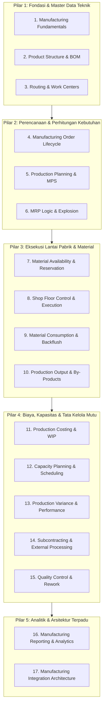
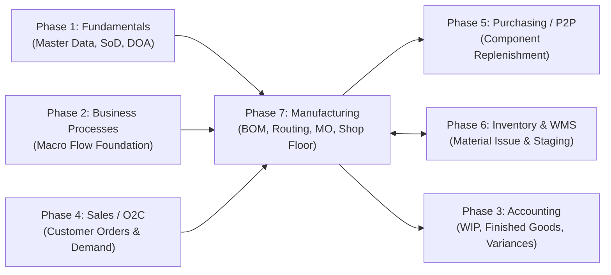

# Manufacturing & Production Management in ERP

Bagian ini membahas arsitektur, rekayasa data induk, perencanaan berjenjang, pengendalian lantai pabrik (*shop floor control*), akuntansi biaya barang dalam proses (*WIP*), dan integrasi menyeluruh dari domain **Manufacturing (Produksi / Pabrikasi)** dalam sistem ERP enterprise secara universal dan *vendor-agnostic*.

Gambaran umum alur proses manufaktur telah diperkenalkan pada [[01-business-processes/manufacturing-process|Phase 2 — Manufacturing Process]]. Pada Phase 7 ini, pembahasan diperdalam menjadi **manual arsitektur domain pengetahuan tingkat lanjut**: bagaimana ERP memodelkan struktur hierarki bahan baku, merencanakan kapasitas mesin dan kebutuhan material, mengontrol eksekusi fisik perakitan, melacak cacat mutu, hingga menghitung harga pokok produksi dan varians akuntansi secara presisi.

---

## Tujuan Pembelajaran

Setelah mempelajari modul Manufacturing ini, pembaca diharapkan mampu:
1. Memahami perbedaan mendasar antara tipe manufaktur diskrit (*Discrete*), proses kimia/formula (*Process*), dan lini kontinu (*Repetitive*).
2. Mendesain struktur data induk teknik terpadu antara resep material ([[06-manufacturing/product-structure-and-bom|Bill of Materials / BOM]]) dan tahapan aktivitas stasiun kerja ([[06-manufacturing/routing-and-work-center|Routing and Work Centers]]).
3. Menguasai logika komputasi perencanaan kebutuhan material berbasis waktu ([[06-manufacturing/mrp-material-requirement-planning|Material Requirements Planning / MRP]]) dan perencanaan kapasitas mesin ([[06-manufacturing/capacity-planning-and-scheduling|Capacity Planning]]).
4. Mengendalikan siklus hidup pesanan produksi ([[06-manufacturing/manufacturing-order|Manufacturing Order Lifecycle]]) mulai dari reservasi bahan, kitting, eksekusi lantai kerja, hingga konfirmasi hasil jadi.
5. Memahami perlakuan akuntansi biaya manufaktur sesuai standar **IAS 2 (*Inventories*)**: penyerapan biaya tenaga kerja dan overhead ke akun Barang Dalam Proses ([[06-manufacturing/production-costing-and-wip|WIP Costing]]) serta analisis varians produksi ([[06-manufacturing/production-variance-and-performance|Production Variance]]).
6. Mengintegrasikan proses maklon pihak ketiga ([[06-manufacturing/subcontracting-and-external-processing|Subcontracting]]) dan gerbang kendali mutu ([[06-manufacturing/production-quality-and-rework|Quality Control & Rework]]).

---

## Alur Pembelajaran (Learning Path)

Materi disusun mengikuti perkembangan alur manufaktur dari perancangan hingga pelaporan keuangan:

---

## Daftar 17 Materi Pembelajaran Manufacturing

### 1. Fondasi & Master Data Teknik
1. [[06-manufacturing/manufacturing-fundamentals|Manufacturing Fundamentals in ERP]]  
   Definisi manufaktur dalam ERP, tipologi produksi (Discrete, Process, Repetitive), strategi respon permintaan (MTS, MTO, ATO, ETO), serta pemisahan tegas antara Master Data teknik vs Data Transaksional pabrik.

2. [[06-manufacturing/product-structure-and-bom|Product Structure and Bill of Materials (BOM)]]  
   Hierarki resep bahan bertingkat (*Multi-Level BOM*), penomoran level terdalam (*Low-Level Coding*), scrap factor, masa berlaku versi BOM, perbandingan EBOM vs MBOM, dan konsep *Phantom BOM*.

3. [[06-manufacturing/routing-and-work-center|Routing and Work Center Architecture]]  
   Dekomposisi tahapan kerja pabrik, parameter Work Center (jam kerja kalender, tarif upah operator, tarif mesin, kapasitas efektif), elemen lead time (*setup, run, queue, wait, move*), serta variasi operasi serial dan paralel.

---

### 2. Perencanaan & Perhitungan Kebutuhan
4. [[06-manufacturing/manufacturing-order|Manufacturing Order Lifecycle and State Machine]]  
   Siklus hidup pesanan produksi dari *Draft*, *Planned*, *Scheduled*, *Released*, *In-Progress*, *Completed*, hingga *Closed*, matriks transisi FSM, dan perbandingan metrik rencana vs aktual.

5. [[06-manufacturing/production-planning|Production Planning and Master Production Scheduling (MPS)]]  
   Perencanaan taktis berjangka menengah, pemisahan independent demand vs dependent demand, zona pembatas waktu (*Frozen, Slushy, Liquid Time Fences*), aturan ukuran lot (*L4L, EOQ, FOQ*), dan kisi-kisi kalkulasi MPS.

6. [[06-manufacturing/mrp-material-requirement-planning|Material Requirements Planning (MRP)]]  
   Algoritma komputasi kebutuhan bahan berbasis waktu, rumus kebutuhan bersih (*Net Requirements*), penyesuaian waktu mundur (*lead time offsetting*), contoh numerik rekonsiliasi BOM berjenjang, dan pesan aksi sistem (*expedite/defer*).

---

### 3. Eksekusi Lantai Pabrik & Manajemen Material
7. [[06-manufacturing/material-availability-and-reservation|Material Availability and Production Reservation]]  
   Pemeriksaan ketersediaan komponen sebelum rilis pesanan, perbedaan mendasar antara *Soft Reservation* (komitmen stok bebas) vs *Hard Allocation / Kitting* (penguncian fisik rak), dan protokol mitigasi kekurangan bahan (*shortage*).

8. [[06-manufacturing/shop-floor-execution|Shop Floor Control and Work Order Execution]]  
   Operasional stasiun kerja lantai pabrik, pencatatan waktu setup dan waktu proses, pelaporan jam kerja operator (*labor booking*), pelacakan waktu henti mesin (*downtime reason codes*), dan perhitungan *Yield* operasional.

9. [[06-manufacturing/material-consumption-and-backflush|Material Consumption and Backflushing Mechanics]]  
   Dua paradigma konsumsi material: *Manual Material Issue* riil vs *Backflushing* otomatis pasca-produksi, jeda waktu pencatatan fisik vs sistem, serta perhitungan varians pemakaian bahan baku (*Material Usage Variance*).

10. [[06-manufacturing/production-output-and-by-product|Production Output, Co-Products, and By-Products]]  
    Spektrum hasil konversi pabrik, perbedaan barang jadi utama vs *Co-Products* vs *By-Products* vs *Scrap*, metode alokasi biaya bersama (*Joint Cost Allocation*), dan perlakuan scrap normal vs abnormal menurut IAS 2.

---

### 4. Biaya, Kapasitas & Tata Kelola Mutu
11. [[06-manufacturing/production-costing-and-wip|Production Costing and Work in Process (WIP)]]  
    Akumulasi tiga elemen biaya produksi (Bahan Baku Langsung + Tenaga Kerja Langsung + Overhead Pabrik), penilaian persediaan Barang Dalam Proses (*Ending WIP*) menggunakan metode unit ekuivalen (*EUP*), dan alur penjurnalan akuntansi perpetual.

12. [[06-manufacturing/capacity-planning-and-scheduling|Capacity Planning and Production Scheduling]]  
    Penyeimbangan beban kerja terhadap kapasitas stasiun kerja, model penjadwalan berkapasitas terbatas (*Finite Capacity*) vs tidak terbatas (*Infinite*), strategi arah waktu (*Forward vs Backward Scheduling*), serta Teori Kendala (*Theory of Constraints & Bottlenecks*).

13. [[06-manufacturing/production-variance-and-performance|Production Variance and Operational Performance]]  
    Pembedaan tegas varians akuntansi finansial vs KPI fisik, dekomposisi varians biaya standar (*Material Price & Usage, Labor Rate & Efficiency, Overhead*), contoh perhitungan matematis lengkap, dan metrik kinerja *Overall Equipment Effectiveness (OEE)*.

14. [[06-manufacturing/subcontracting-and-external-processing|Subcontracting and External Processing]]  
    Tata kelola maklon manufaktur, aspek kepemilikan hukum bahan baku di lokasi pihak ketiga (*Consignment/Subcontractor Warehouse*), pemrosesan operasi eksternal, penggabungan biaya jasa maklon ke barang jadi, dan integrasi modul Purchasing (P2P).

15. [[06-manufacturing/production-quality-and-rework|Production Quality Control and Rework Management]]  
    Tiga titik gerbang kendali mutu (*Incoming, In-Process, Final QC*), laporan ketidaksesuaian (*Non-Conformance Report / NCR*), alur eksekusi pesanan perbaikan (*Rework Order*), dan integrasi paspor kualitas dengan ketertelusuran nomor seri produk.

---

### 5. Analitik & Arsitektur Terpadu
16. [[06-manufacturing/manufacturing-reporting-and-analytics|Manufacturing Reporting and Operational Analytics]]  
    Taksonomi metrik manufaktur (Operasional, Perencanaan, Mutu, Finansial), formula eksplisit OEE, First Pass Yield (FPY), dan WIP Turnover, serta hierarki dasbor lantai pabrik taktis vs eksekutif.

17. [[06-manufacturing/manufacturing-integration|Manufacturing and Production Integration Architecture]]  
    Master sintesis arsitektur manufaktur hulu-ke-hilir, matriks integrasi lintas domain (Sales, Planning, Purchasing, WMS, Accounting), dan penelusuran siklus hidup kanonikal produk Laptop Pro dari pesanan penjualan hingga realisasi laba kotor komersial.

---

## Hubungan Terintegrasi dengan Fase 1–6

---

## Referensi Standar Utama

- **IFRS Foundation**: *IAS 2: Inventories (Costs of Conversion, Joint Products, and Overhead Allocation)*.
- **ASCM / APICS**: *Supply Chain Operations Reference (SCOR) Model: Make Domain, Production Activity Control (PAC), and Detailed Scheduling and Planning (DSP)*.
- **International Organization for Standardization (ISO)**: *ISO 9001:2015 Quality Management Systems (Clauses 8.5 & 8.7)*.
- **Academic Authorities**:
  - Vollmann, T. E., et al. *Manufacturing Planning and Control for Supply Chain Management*. McGraw-Hill.
  - Horngren, C. T., et al. *Cost Accounting: A Managerial Emphasis*. Pearson.
  - Groover, M. P. *Fundamentals of Modern Manufacturing: Materials, Processes, and Systems*. Wiley.
- **Enterprise Software Documentation**:
  - Microsoft Dynamics 365 Supply Chain Management (Production Control & Master Planning).
  - Frappe ERPNext (Manufacturing, Work Order & BOM Architecture).
  - Odoo 17 Enterprise (Manufacturing MRP, Work Centers, and Shop Floor Execution).
