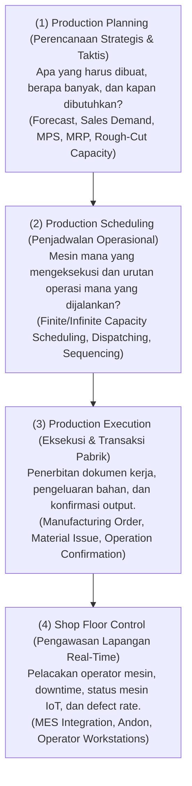
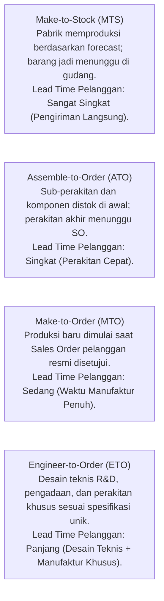

# Manufacturing Fundamentals in ERP

## Definition

**Manufacturing (Manufaktur / Produksi)** dalam arsitektur Enterprise Resource Planning (ERP) adalah domain fungsional terpadu yang memodelkan, merencanakan, menjadwalkan, mengeksekusi, mengontrol, dan mencatat proses transformasi bahan baku (*raw materials*), suku cadang, dan komponen rakitan (*subassemblies*) menjadi produk setengah jadi (*semi-finished goods*) atau produk jadi (*finished goods*) dengan menambahkan nilai melalui pengerahan tenaga kerja manusia (*direct labor*), mesin pabrik (*machine run time*), dan utilitas overhead (*manufacturing overhead*).

Gambaran umum alur bisnis manufaktur telah diperkenalkan pada [[01-business-processes/manufacturing-process|Phase 2 — Manufacturing Process]]. Pada Phase 7 ini, fokus diperdalam ke arah **arsitektur data, algoritma perencanaan kebutuhan material, kontrol lantai pabrik (*shop floor execution*), genealogi mutu, penyerapan biaya (*cost absorption*), hingga varians produksi finansial**.

---

## Business Purpose

1. **Transformasi Nilai Tambah Terukur (*Value-Add Transformation*)**: Mengubah bahan baku bernilai rendah menjadi barang jadi bernilai komersial tinggi dengan efisiensi biaya yang terkontrol.
2. **Sinkronisasi Pasokan dan Permintaan (*Demand-Supply Synchronization*)**: Menghubungkan pesanan penjualan pelanggan (*Customer Orders*) dan prakiraan pasar (*Forecasts*) dengan kapasitas fisik mesin serta jadwal pasokan material dari vendor.
3. **Optimasi Pemanfaatan Kapasitas Pabrik (*Capacity Optimization*)**: Memaksimalkan utilitas aset pabrik (*Overall Equipment Effectiveness / OEE*) guna menekan waktu menganggur (*downtime*) dan biaya penyiapan mesin (*setup cost*).
4. **Pengendalian Biaya dan Barang Dalam Proses (*WIP & Cost Control*)**: Memastikan modal kerja yang terikat di lantai pabrik dalam bentuk Barang Dalam Proses (*Work in Process / WIP*) terpantau secara transparan dan terakumulasi secara akurat ke neraca keuangan sesuai standar akuntansi **IAS 2 (*Inventories*)**.

---

## Business Context & Lapisan Fungsional Manufaktur

Pengelolaan manufaktur di dalam ERP kelas enterprise dibagi ke dalam empat lapisan fungsional yang berjenjang:

### Perbedaan Antar-Lapisan Fungsional:
* **Production Management**: Disiplin menyeluruh yang mencakup kebijakan bisnis, manajemen data induk (*BOM & Routing*), perencanaan anggaran produksi, dan akuntansi biaya.
* **Production Planning**: Perhitungan matematis kebutuhan masa depan berbasis waktu (*time-phased demand*), menghasilkan rekomendasi pesanan pengadaan dan pesanan produksi yang belum mengikat (*Planned Orders*).
* **Production Execution**: Penerbitan dokumen komersial pabrik yang mengikat (*Released Manufacturing Orders*), memotong stok bahan baku dari gudang dan mengakui Barang Dalam Proses (WIP).
* **Shop Floor Control (SFC)**: Pengendalian fisik detik-demi-detik di lantai bengkel kerja, memantau kemajuan operasi mesin, waktu istirahat operator, dan pemisahan barang afkir (*scrap*).

---

## Tipologi Lingkungan Manufaktur (Manufacturing Environments)

Sistem ERP membedakan industri manufaktur ke dalam tiga tipologi proses produksi utama:

| Dimensi | Discrete Manufacturing | Process Manufacturing | Repetitive Manufacturing |
| :--- | :--- | :--- | :--- |
| **Bentuk Output** | Unit terhitung individual (*Distinct countable items*). Dapat dibongkar kembali (*disassemblable*). | Massa curah, cairan, gas, atau serbuk (*Non-countable / Volume / Weight*). Tidak dapat dibongkar kembali. | Produksi kontinu barang sejenis dalam kecepatan tinggi pada lini perakitan tetap (*assembly line*). |
| **Struktur Resep** | **Bill of Materials (BOM)**: Komponen dan part dengan kuantitas bulat (*Pcs, Unit*). | **Formula / Recipe**: Bahan kimia/pangan dengan konsentrasi persentase, densitas, dan toleransi suhu. | BOM standar dengan jadwal laju produksi per jam/hari (*production rate*). |
| **Pelacakan Fisik** | Nomor Seri (*Serial Number*) dan Lot/Batch perakitan. | Nomor Batch/Lot dengan atribut potensi kimia (*Potency*) dan tanggal kedaluwarsa (*Expiry*). | Pelacakan kumulatif per periode/shift kerja tanpa work order individual per unit. |
| **Output Sekunder** | Afkir komponen (*Scrap*) dan suku cadang rework. | **Co-Products** (produk sampingan bernilai setara) dan **By-Products** (limbah bernilai rendah). | Cacat perakitan massal (*Scrap rate*). |
| **Contoh Industri** | Elektronik (Laptop Pro, Smartphone), Otomotif, Mesin Industri, Furnitur. | Farmasi, Makanan & Minuman, Kilang Minyak, Cat Kimia, Pengolahan Sawit. | Lini pengalengan minuman, perakitan kabel massal, pembuatan bola lampu. |

---

## Strategi Respon Permintaan (Demand Fulfillment Strategies)

Strategi manufaktur menentukan pada titik mana pesanan pelanggan (*Sales Order*) memicu proses produksi di pabrik:

### Karakteristik Strategi dalam ERP:

1. **Make-to-Stock (MTS)**:
   * Pemicu: Prakiraan penjualan (*Forecast*) dan pemenuhan batas stok pengaman (*Safety Stock / ROP*) di gudang barang jadi (lihat [[05-inventory/replenishment-and-stock-planning|Replenishment and Stock Planning]]).
   * Fokus ERP: Optimasi ukuran lot produksi (*Economic Batch Quantity*) dan perataan beban mesin (*Load Leveling*).
2. **Assemble-to-Order (ATO)**:
   * Pemicu: Modul Penjualan memilih varian produk (misal: Laptop Pro dengan opsi RAM 32GB dan SSD 1TB).
   * Fokus ERP: Konfigurator produk (*Product Configurator*), reservasi komponen modular, dan perakitan akhir kilat.
3. **Make-to-Order (MTO)**:
   * Pemicu: Pesanan resmi pelanggan pada [[03-sales/sales-order|Sales Order]].
   * Fokus ERP: Penautan langsung antara dokumen SO dengan Manufacturing Order (*Pegging / Back-to-Back Production*); biaya produksi dapat dilacak spesifik per kontrak pesanan pelanggan.
4. **Engineer-to-Order (ETO)**:
   * Pemicu: Penandatanganan kontrak proyek khusus (misal: pembangunan turbin pembangkit listrik atau pabrik kelapa sawit).
   * Fokus ERP: Integrasi erat antara modul Manufaktur dengan modul Manajemen Proyek (*Project Management / WBS*) dan Engineering BOM (EBOM).

---

## Pemisahan Kritis: Master Data vs. Transaksional Manufaktur

Menjaga integritas data manufaktur mengharuskan pemisahan tegas antara definisi desain dengan catatan eksekusi historis:

> [!important]
> **Separation of Design and Execution**:
> * **Production Master Data** (*BOM, Routing, Work Center*) mendefinisikan *standar teoritis*: komponen apa yang direncanakan dipakai dan tahapan mesin mana yang seharusnya dilalui.
> * **Production Transaction Data** (*Manufacturing Order, Material Issue, Operation Timesheet*) mencatat *realitas empiris*: berapa kuantitas bahan yang nyata-nyata terambil di rak, operator mana yang bekerja, dan berapa unit yang lolos uji QC.
> 
> Perubahan spesifikasi teknik atau revisi BOM di masa depan **tidak boleh mengubah data historis** pada pesanan produksi yang sudah selesai atau sedang berjalan (*Historical Immutability*).

---

## ERP Implementation Comparison

| Aspek | Odoo Enterprise | ERPNext | Microsoft Dynamics 365 SCM |
| :--- | :--- | :--- | :--- |
| **Model Manufaktur** | Menggabungkan Discrete dan Repetitive dalam modul *Manufacturing (MRP)*; Process manufacturing didukung via by-product pada BOM. | Berfokus pada Discrete Manufacturing melalui modul *Manufacturing* (BOM, Work Order, Job Card). | Menyediakan modul terpisah yang sangat kuat: *Discrete Manufacturing*, *Process Manufacturing* (Formula/Batch Orders), dan *Lean Manufacturing* (Kanban). |
| **Pemisahan Perencanaan vs Eksekusi** | Jadwal pengadaan otomatis via *Reordering Rules* (MTS) atau rute *Replenish on Order / MTO*; eksekusi via dokumen *Manufacturing Order*. | Perencanaan via dokumen *Production Plan* yang mengonsolidasikan Sales Order/Material Request; eksekusi via *Work Order*. | Pemisahan formal tingkat enterprise: *Master Planning Engine* (membangkitkan *Planned Orders*) yang di-firming menjadi *Production Orders*. |
| **Shop Floor Terminal** | Tersedia modul *Shop Floor / Work Center Tablet View* dengan pelacakan waktu operator real-time. | Fitur *Job Card* dengan tombol Start/Pause/Stop timer untuk pelacakan jam kerja operator. | Aplikasi mobile khusus: *Production Floor Execution Interface* dengan kapabilitas pelaporan kartu kerja, ketiadaan material, dan integrasi mesin. |

---

## Naventra Consideration

Untuk perancangan modul Manufaktur pada sistem ERP enterprise seperti **Naventra**:

1. **State Machine Pesanan Produksi yang Ketat**: Terapkan mesin status berbasis FSM pada entitas pesanan produksi:
   `DRAFT` $\to$ `PLANNED` $\to$ `CONFIRMED` $\to$ `RELEASED` $\to$ `IN_PROGRESS` $\to$ `COMPLETED` $\to$ `CLOSED` (atau `CANCELLED`). Mutasi persediaan fisik hanya diizinkan pada status `RELEASED` dan `IN_PROGRESS`.
2. **Snapshotting BOM dan Routing pada Saat Order Release**:
   Saat status pesanan beralih ke `RELEASED`, sistem wajib menyalin (*snapshot*) seluruh baris komponen BOM dan urutan operasi Routing ke dalam tabel kerja transaksi (`mo_materials` dan `mo_operations`). Hal ini mencegah terganggunya proses produksi yang sedang berjalan jika tim R&D merevisi master data BOM pada saat bersamaan.
3. **Pemisahan Jalur Transaksi (Decoupled Services)**:
   Pisahkan modul perencanaan (*MRP Service*) yang bersifat komputasi berat (*batch calculation*) dari modul eksekusi lantai pabrik (*Shop Floor Execution Service*) yang menuntut latensi rendah (*low latency*) saat operator memindai barcode pekerjaan.

---

## References

- ASCM / APICS. *APICS Dictionary: Manufacturing Management, Discrete vs Process, and Decoupling Points*.
- Vollmann, T. E., et al. *Manufacturing Planning and Control for Supply Chain Management*. McGraw-Hill.
- Groover, M. P. *Automation, Production Systems, and Computer-Integrated Manufacturing*. Pearson.
- Microsoft Learn. *Production Control and Manufacturing Methodologies in Dynamics 365 Supply Chain Management*.
- Frappe ERPNext Documentation. *Manufacturing Module and Production Concepts*.
- Odoo 17 Documentation. *Manufacturing (MRP) Concepts and Work Center Operations*.
