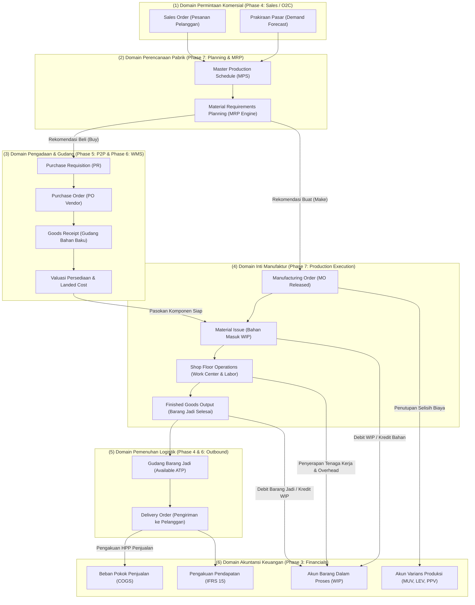

# Manufacturing and Production Integration Architecture

## Definition

**Manufacturing and Production Integration Architecture** adalah sintesis arsitektural komprehensif dalam ERP yang menghubungkan seluruh siklus manufaktur dengan ekosistem domain bisnis lainnya—menjadikan modul produksi sebagai **mesin pengonversi nilai (*value conversion engine*)** yang menerjemahkan permintaan komersial dari pelanggan menjadi kebutuhan pengadaan material, menggerakkan eksekusi logistik di lantai gudang, serta mencatat akumulasi biaya dan laba kotor di buku besar keuangan (*General Ledger*).

Manufaktur adalah jantung operasional perusahaan industri. Tanpa integrasi yang mulus, pabrik akan beroperasi secara buta (*siloed operation*): memproduksi barang yang tidak dibutuhkan pasar, kehabisan komponen di tengah perakitan, atau menghasilkan biaya produksi yang tidak dapat direkonsiliasi dengan laporan keuangan.

---

## Arsitektur Aliran Terpadu Hulu-ke-Hilir (End-to-End Architecture)

Diagram berikut memetakan bagaimana data dan transaksi mengalir melintasi seluruh domain ERP:

---

## Matriks Integrasi Lintas Fase (Cross-Phase Integration Matrix)

Tabel berikut merangkum hubungan ketergantungan data dan transaksi antara Phase 7 dengan fase-fase ERP sebelumnya:

| Domain Terkait | Titik Temu Integrasi Data | Dokumen / Transaksi Terlibat | Dampak Operasional & Finansial |
| :--- | :--- | :--- | :--- |
| **Phase 1: Fundamentals** | Hak akses, batas wewenang, dan jejak audit. | *Approval limits*, *Audit logging*, *User Roles*. | Memastikan otorisasi pelepasan pesanan produksi dan penyesuaian varians sesuai batas kewenangan (*Delegation of Authority / DOA*). |
| **Phase 2: Business Processes** | Pendalaman alur bisnis makro menjadi eksekusi detail. | [[01-business-processes/manufacturing-process\|Manufacturing Process]], [[01-business-processes/order-to-cash\|O2C]], [[01-business-processes/procure-to-pay\|P2P]]. | Mengubah konsep alur proses umum menjadi aturan validasi, model data, dan formula matematis yang dapat dieksekusi. |
| **Phase 3: Accounting** | Akuntansi biaya persediaan dan penyerapan beban. | [[02-accounting/inventory-accounting\|Inventory Accounting]], [[02-accounting/chart-of-accounts\|COA]], [[02-accounting/general-ledger-and-subledger\|GL]]. | Akumulasi biaya bahan, tenaga kerja, dan overhead ke akun WIP; penutupan varians produksi ke laporan laba rugi bulanan. |
| **Phase 4: Sales (O2C)** | Sumber permintaan komersial dan pemenuhan pesanan. | [[03-sales/sales-order\|Sales Order]], [[03-sales/order-fulfillment\|Order Fulfillment]], [[03-sales/delivery-and-shipping\|Delivery Order]]. | Pesanan penjualan memicu jadwal produksi (MTO/ATO); penyelesaian barang jadi mengaktifkan kuantitas ATP untuk pengiriman ke pelanggan. |
| **Phase 5: Purchasing (P2P)** | Pengadaan kekurangan komponen bahan baku. | [[04-purchasing/purchase-requisition\|Purchase Requisition]], [[04-purchasing/purchase-order\|Purchase Order]], [[04-purchasing/goods-receipt-and-service-receipt\|Goods Receipt]]. | Hasil komputasi MRP meledakkan BOM dan otomatis menerbitkan PR ke pemasok eksternal untuk komponen yang defisit di gudang. |
| **Phase 6: Inventory & WMS** | Alokasi stok, logistik fisik, dan biaya perolehan. | [[05-inventory/stock-quantity-and-availability\|Stock Availability (ATP)]], [[05-inventory/inventory-receiving\|Putaway]], [[05-inventory/inventory-costing\|Costing]]. | Kuantitas bahan baku direservasi logis (*Soft Lock*) lalu diambil fisik (*Material Issue*); kapitalisasi landed cost freight memperbarui biaya pokok bahan. |

---

## Penelusuran Transaksi Kanonikal Terpadu (End-to-End Trace)

Untuk membuktikan keutuhan integrasi dari awal hingga akhir, berikut adalah penelusuran numerik kanonikal terpadu pembuatan produk jadi **Laptop Pro**:

### 1. Permintaan Masuk (Sales / O2C)
* Pelanggan PT Mitra Niaga memesan **100 unit Laptop Pro**.
* Diterbitkan Sales Order `SO-2026-0088`. Saldo stok bebas di gudang barang jadi saat ini = 0 unit (*MTO Environment*).

### 2. Perencanaan dan Kebutuhan Material (Planning & MRP)
* Modul MPS menjadwalkan perakitan 100 unit Laptop Pro untuk selesai pada **Minggu ke-4**.
* Mesin MRP meledakkan BOM: Dibutuhkan **100 unit Komponen Utama Motherboard** dan **100 unit Baterai**.
* Sistem memeriksa persediaan: Komponen Motherboard di gudang = 0 unit.
* MRP secara otomatis menerbitkan usulan pengadaan (*Planned Purchase Order*) kepada pemasok **PT Sumber Teknologi** (lihat konsistensi dengan Phase 5).

### 3. Pengadaan dan Penerimaan Bahan Baku (Purchasing & Inbound WMS)
* Bagian Purchasing menerbitkan `PO-2026-00042` untuk 100 unit Komponen Motherboard @ Rp700.000 = **Rp70.000.000 (DPP)**.
* Barang tiba di dermaga dan diposting Goods Receipt `GR-2026-0010`.
* Ekspedisi menagihkan ongkos angkut freight sebesar Rp5.000.000 yang dikapitalisasi melalui Landed Cost Voucher:
  $$\text{Nilai Perolehan Bersih Bahan Baku} = \text{Rp}70.000.000 + \text{Rp}5.000.000 = \mathbf{\text{Rp}75.000.000 \text{ (atau Rp750.000/unit)}}$$

### 4. Eksekusi Perakitan Pabrik (Manufacturing Order & WIP)
* Diterbitkan Manufacturing Order `MO-2026-0042` untuk 100 unit Laptop Pro.
* **Pengeluaran Bahan Baku (*Material Issue*)**:
  100 unit motherboard ditarik dari gudang bahan baku ke lini perakitan:
  * *(Dr)* Persediaan Barang Dalam Proses (*WIP — Materials*): **Rp75.000.000**
  * *(Cr)* Persediaan Bahan Baku: **Rp75.000.000**
* **Operasi Kerja dan Penyerapan Biaya Konversi (*Shop Floor Execution*)**:
  Operator mencatat 100 jam kerja dan mesin berjalan 50 jam:
  * Biaya Tenaga Kerja Diserap = 100 jam @ Rp20.000 = **Rp2.000.000**.
  * Biaya Overhead Mesin Diserap = 50 jam @ Rp40.000 = **Rp2.000.000**.
  * Jurnal Penyerapan Konversi:
    * *(Dr)* Persediaan Barang Dalam Proses (*WIP — Conversion*): **Rp4.000.000**
    * *(Cr)* Beban Tenaga Kerja Langsung Dialokasikan: **Rp2.000.000**
    * *(Cr)* Beban Overhead Pabrik Dialokasikan: **Rp2.000.000**
* **Total Akumulasi Biaya di Akun WIP**:
  $$\text{Total Saldo Debet WIP} = \text{Rp}75.000.000 \text{ (Bahan)} + \text{Rp}4.000.000 \text{ (Konversi)} = \mathbf{\text{Rp}79.000.000}$$

### 5. Penyelesaian Produksi dan Pemeriksaan Mutu (Output & QC)
* 100 unit Laptop Pro selesai dirakit secara fisik dan menjalani pengujian fungsi (*Burn-in Test*).
* Hasil Uji QC: **100 unit dinyatakan Lolos Sempurna (100% Pass Yield)**.
* Diposting dokumen *Finished Goods Receipt*:
  * *(Dr)* Persediaan Barang Jadi (*Finished Goods*): **Rp79.000.000** (atau **Rp790.000/unit**)
  * *(Cr)* Persediaan Barang Dalam Proses (*WIP*): **Rp79.000.000**
* *Hasil*: Saldo akun WIP kembali bersaldo nol (nihil). Gudang barang jadi mencatat tambahan 100 unit Laptop Pro siap kirim dengan nilai perolehan sah Rp790.000/unit.

### 6. Pengiriman ke Pelanggan dan Pengakuan Laba (O2C & Finance)
* Dokumen Delivery Order `DO-2026-0088` divalidasi: 100 unit Laptop Pro dikirim ke PT Mitra Niaga.
* **Jurnal Beban Pokok Penjualan (COGS)**:
  * *(Dr)* Beban Pokok Penjualan (*COGS*): **Rp79.000.000**
  * *(Cr)* Persediaan Barang Jadi: **Rp79.000.000**
* **Jurnal Faktur Penjualan (Invoice @ Rp1.200.000/unit)**:
  * *(Dr)* Piutang Usaha (*Accounts Receivable*): **Rp133.200.000** (DPP Rp120.000.000 + PPN Rp13.200.000)
  * *(Cr)* Pendapatan Penjualan: **Rp120.000.000**
  * *(Cr)* Utang Pajak Keluaran (PPN Keluaran 11%): **Rp13.200.000**
* **Laba Kotor yang Terealisasi**:
  $$\text{Laba Kotor Operasional} = \text{Rp}120.000.000 - \text{Rp}79.000.000 = \mathbf{\text{Rp}41.000.000 \text{ (Gross Margin = 34,17\%)}}$$

*Korelasi Paripurna*: Aliran material fisik, transaksi operasional pabrik, dan pembukuan finansial terbukti sinkron 100% tanpa ada selisih yang menggantung.

---

## ERP Implementation Comparison

| Aspek Arsitektur | Odoo Enterprise | ERPNext | Microsoft Dynamics 365 SCM |
| :--- | :--- | :--- | :--- |
| **Model Integrasi Inti** | Terintegrasi erat berbasis rute (*Procurement & Manufacturing Routes*): Menghubungkan pesanan penjualan langsung ke MO (MTO) dan memicu RFQ via scheduler. | Dokumen pusat `Production Plan`: Menggabungkan permintaan Sales Order dan menghasilkan Work Order serta Material Request secara serentak. | Arsitektur modular enterprise: Pemisahan tegas antara *Master Planning Service*, *Production Control*, *Warehouse Management*, dan *Cost Accounting*. |
| **Otomasi Aliran Finansial** | Otomasi penuh via rute akrual inventaris pada Product Category saat valuasi diatur ke *Automated*. | Real-time posting via tabel `GL Entry` saat dokumen Stock Entry tipe Manufacture disubmit. | Arsitektur formal *Subledger Journal*: Posting biaya produksi diatur pada parameter *Production order posting profiles* ke buku besar. |
| **Dukungan Shop Floor to WMS** | Integrasi native antara Shop Floor App dengan modul Barcode & Inventory Transfers. | Integrasi antara Job Card dengan Stock Entry perpindahan material lantai kerja. | Fitur tingkat industri: **Advanced Warehouse Integration for Production** (penanganan pemindahan bahan otomatis via kartu Kanban dan rute Wave). |

---

## Naventra Consideration

Untuk perancangan modul Integrasi Manufaktur pada sistem ERP enterprise seperti **Naventra**:

1. **Pola Desain Arsitektur Event-Driven (Domain Events Pipeline)**:
   * Saat pesanan produksi selesai, sistem mempublikasikan domain event internal: `ManufacturingOrderCompletedEvent` (`mo_id`, `product_id`, `produced_qty`, `scrap_qty`, `total_cost_incurred`).
   * Layanan-layanan konsumen (*Subscribers*) merespons secara terisolasi:
     * *Inventory Service*: Menambah saldo barang jadi di gudang target.
     * *Accounting Service*: Menutup akun WIP dan mencatat jurnal persediaan barang jadi serta varians.
     * *Sales Service*: Memperbarui status pemenuhan pada Sales Order yang ditautkan (*Pegged SO*).
2. **Kepatuhan Transaksional dan Idempotensi Mutlak**:
   Setiap transaksi konfirmasi produksi wajib menggunakan kunci idempotensi (`idempotency_key = hash(mo_id, operation_id, confirmation_timestamp)`). Hal ini menjamin bahwa gangguan koneksi jaringan pada terminal operator lantai pabrik tidak akan pernah menggandakan pencatatan output fisik maupun penjurnalan biaya di buku besar.
3. **Penyediaan Visualisasi Pohon Genealogi Produk (Product Traceability Tree)**:
   Rancang antarmuka penelusuran grafis yang memungkinkan auditor mengklik nomor seri laptop jadi untuk langsung melihat nomor lot baterai, nomor surat jalan penerimaan pemasok (P2P), stasiun kerja yang merakitnya, dan nomor faktur penjualan ke pelanggan (O2C).

---

## References

- ASCM / APICS. *Supply Chain Operations Reference (SCOR) Model: Make Process and Enterprise Cross-Functional Integration*.
- IFRS Foundation. *IAS 2: Inventories (Measurement, Conversion Costs, and Cost of Goods Sold Recognition)*.
- Microsoft Learn. *Production Control Integration with Inventory, Procurement, and General Ledger in Dynamics 365*.
- Frappe ERPNext Documentation. *Manufacturing Workflow and Cross-Module Integration*.
- Odoo 17 Documentation. *Manufacturing (MRP) Integration with Sales, Purchase, Inventory, and Accounting*.
