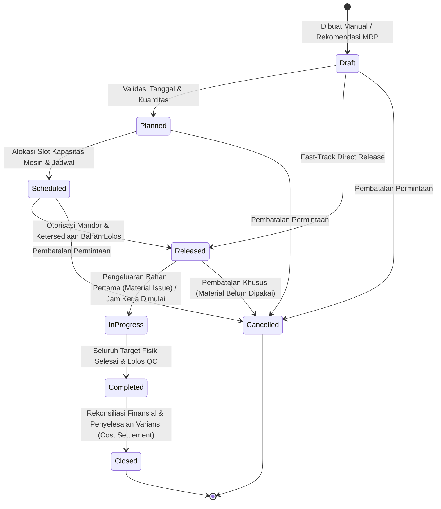
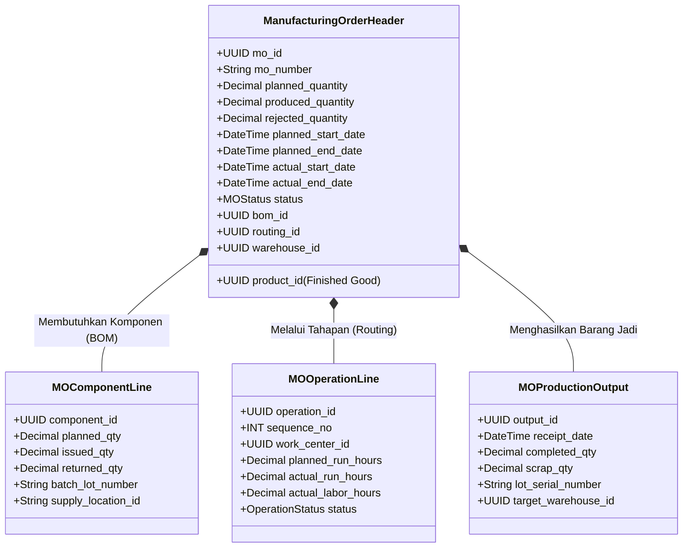

# Manufacturing Order Lifecycle and State Machine

## Definition

**Manufacturing Order (MO)** (juga dikenal sebagai *Production Order* atau *Work Order*) adalah dokumen transaksi operasional resmi dalam ERP yang memberikan otorisasi kepada fasilitas pabrik untuk memproduksi sejumlah produk tertentu dalam rentang waktu yang disepakati, mengonsumsi bahan baku sesuai [[06-manufacturing/product-structure-and-bom|Bill of Materials]], dan memanfaatkan kapasitas mesin serta tenaga kerja sesuai [[06-manufacturing/routing-and-work-center|Routing]].

MO bertindak sebagai **pusat komando eksekusi manufaktur**, menjadi simpul pertemuan antara komitmen komersial permintaan (*Sales Demand / MPS*), komitmen logistik bahan di gudang (*Material Allocation*), instruksi kerja fisik di lantai bengkel (*Shop Floor Dispatching*), serta pengakumulasian biaya produksi (*Cost Collector & WIP*).

---

## State Machine Siklus Hidup Pesanan Produksi (MO Lifecycle)

Siklus hidup Manufacturing Order dikendalikan secara ketat oleh mesin status (*Finite-State Machine / FSM*) untuk memastikan setiap pergerakan operasional dan akuntansi terjadi pada gerbang yang sah:



---

## Matriks Transisi Status dan Dampak Lintas Modul

Setiap transisi status pada Manufacturing Order memicu serangkaian aksi operasional, logistik, dan akuntansi:

| Status Pesanan | Arti Bisnis | Dampak terhadap Persediaan Bahan | Dampak terhadap Kapasitas Mesin | Dampak Akuntansi Keuangan (GL) |
| :--- | :--- | :--- | :--- | :--- |
| **Draft** | Dokumen awal sedang disusun; parameter teknis masih dapat diedit bebas. | Belum ada reservasi stok. | Belum ada alokasi kapasitas. | **Nihil** |
| **Planned** | Pesanan disepakati sebagai rencana pasti (*firm plan*); siap masuk tahap penjadwalan. | Terbentuk *Soft Reservation* (komitmen kuantitas di tingkat gudang). | Menjadi beban muatan dalam perhitungan *Rough-Cut Capacity*. | **Nihil** |
| **Scheduled** | Slot waktu mesin dan stasiun kerja telah dikunci pada kalender produksi. | Reservasi komponen aktif. | Jam kapasitas mesin pada *Work Center* terkunci (*Hard Capacity Load*). | **Nihil** |
| **Released** | Otorisasi resmi diberikan ke lantai pabrik; instruksi kerja dan daftar ambil bahan (*Pick List*) dicetak. | Bahan baku dikunci koordinat raknya (*Hard Allocation*); siap dipindahkan ke area staging produksi. | Jadwal kerja aktif di terminal operator lantai pabrik (*Dispatch List*). | **Nihil** (Barang masih di gudang). |
| **In-Progress** | Proses perakitan fisik sedang berjalan di lantai pabrik. | Bahan baku dikeluarkan dari gudang (*Material Issue*); stok gudang berkurang. | Mesin dan operator mencatat jam kerja aktual (*Labor/Machine Run Time*). | **Ya (Perpetual)**: *(Dr) Barang Dalam Proses (WIP)* dan *(Cr) Persediaan Bahan Baku*. Penyerapan biaya konversi. |
| **Completed** | Produk fisik selesai dirakit dan lolos inspeksi kendali mutu (*QC Inspection*). | Saldo produk jadi (*Finished Goods*) bertambah di gudang barang jadi. | Kapasitas mesin dibebaskan kembali (*Resource Released*). | **Ya**: *(Dr) Persediaan Barang Jadi* dan *(Cr) Barang Dalam Proses (WIP)*. |
| **Closed (Financial Close)** | Penutupan administratif dan finansial tuntas; varians biaya telah diselesaikan. | Tidak ada mutasi persediaan baru. | Tidak ada perubahan kapasitas. | **Ya**: Penutupan selisih sisa saldo akun WIP ke akun beban varians produksi (*Production Variance*). Dokumen terkunci permanen (*Immutable*). |
| **Cancelled** | Pesanan dibatalkan karena pembatalan pesanan penjualan atau kendala kritis. | Seluruh reservasi bahan baku dilepaskan kembali menjadi stok bebas (*Available ATP*). | Seluruh alokasi kapasitas mesin dibebaskan. | **Nihil** (Jika ada bahan yang terlanjur dikeluarkan, wajib diretur via *Material Return* sebelum cancel). |

---

## Data Model Dokumen Manufacturing Order

Dokumen MO dalam ERP diorganisasikan ke dalam struktur relasional terpadu:



---

## Perbedaan Krusial: Planned vs. Actual Metrics

Untuk keperluan evaluasi kinerja dan akuntansi biaya, ERP selalu memisahkan metrik rencana dari hasil nyata:

* **Planned Quantity vs Actual Produced Quantity**:
  * *Target Rencana*: 100 unit Laptop Pro.
  * *Keluaran Riil*: 97 unit lolos uji QC, 3 unit rusak saat proses perakitan (*Scrap*). Total output fisik = 100 unit, namun output layak jual = 97 unit (*Yield = 97%*).
* **Planned Dates vs Actual Dates**:
  * Mengukur kepatuhan jadwal pabrik (*Schedule Adherence*). Keterlambatan tanggal mulai aktual (*Actual Start Date*) mengindikasikan ketiadaan bahan atau kemacetan stasiun kerja sebelumnya.
* **Standard Cost vs Actual Cost**:
  * Akumulasi biaya material dan jam kerja nyata dibandingkan dengan biaya standar teknik untuk menghitung varians efisiensi produksi (lihat [[06-manufacturing/production-variance-and-performance|Production Variance]]).

---

## ERP Implementation Comparison

| Aspek | Odoo Enterprise | ERPNext | Microsoft Dynamics 365 SCM |
| :--- | :--- | :--- | :--- |
| **Terminologi Dokumen** | Dokumen tunggal `Manufacturing Order` (mrp.production) yang menaungi *Work Orders* per stasiun kerja. | Dokumen `Work Order` (dulu disebut Production Order) yang membangkitkan `Job Card` per operasi. | Menggunakan istilah formal **Production Order** (siklus: Created $\to$ Estimated $\to$ Scheduled $\to$ Released $\to$ Started $\to$ Reported as Finished $\to$ Ended). |
| **Mekanisme Release** | Tombol *Confirm* (reservasi stok) dan tombol *Plan* (menjadwalkan work orders). | Tombol *Submit* mengubah status ke `Not Started`; tombol *Start* membangkitkan Job Cards. | Tombol aksi *Release*: mencetak kartu rute (*Route Card*), daftar ambil (*Picking List*), dan mengubah status ke `Released`. |
| **Penyelesaian Finansial (Close)** | Tombol *Produce All* langsung mengalokasikan biaya dan menutup pesanan (WIP diselesaikan seketika pada saat produksi). | Status berubah ke `Completed`; rekonsiliasi biaya difinalisasi saat semua Job Card dan Stock Entry ditutup. | Fitur formal **Costing / End**: Proses *Production End* menutup saldo pesanan secara permanen dan menghitung seluruh varians biaya ke GL. |

---

## Naventra Consideration

Untuk perancangan modul Manufacturing Order pada sistem ERP enterprise seperti **Naventra**:

1. **Skema Database Header dan Baris Transaksi MO**:
   ```sql
   CREATE TABLE manufacturing_orders (
       id UUID PRIMARY KEY DEFAULT gen_random_uuid(),
       order_number VARCHAR(50) NOT NULL UNIQUE,
       product_id UUID NOT NULL REFERENCES items(id),
       bom_id UUID NOT NULL REFERENCES bill_of_materials(id),
       routing_id UUID NOT NULL REFERENCES routings(id),
       warehouse_id UUID NOT NULL REFERENCES warehouses(id),
       
       planned_quantity NUMERIC(15, 4) NOT NULL,
       produced_quantity NUMERIC(15, 4) NOT NULL DEFAULT 0,
       scrapped_quantity NUMERIC(15, 4) NOT NULL DEFAULT 0,
       
       planned_start_date TIMESTAMP WITH TIME ZONE NOT NULL,
       planned_end_date TIMESTAMP WITH TIME ZONE NOT NULL,
       actual_start_date TIMESTAMP WITH TIME ZONE,
       actual_end_date TIMESTAMP WITH TIME ZONE,
       
       status VARCHAR(30) NOT NULL DEFAULT 'DRAFT', -- 'DRAFT', 'PLANNED', 'SCHEDULED', 'RELEASED', 'IN_PROGRESS', 'COMPLETED', 'CLOSED', 'CANCELLED'
       created_at TIMESTAMP WITH TIME ZONE DEFAULT NOW()
   );
   ```
2. **Kepatuhan Guard Condition FSM**:
   Backend wajib memblokir transisi status yang melompati tahapan logis. Sebagai contoh, status `DRAFT` dilarang langsung beralih ke `IN_PROGRESS` tanpa melalui gerbang `RELEASED` guna memastikan alokasi bahan baku di gudang telah tereksekusi dengan benar.
3. **Pemberlakuan Kunci Concurrency pada Pengeluaran dan Penerimaan**:
   Gunakan transaksi database berpasangan saat memproses *Material Issue* dan *Output Confirmation* untuk mencegah *race condition* pada pemotongan saldo persediaan di gudang penyimpanan.

---

## References

- ASCM / APICS. *APICS Dictionary: Manufacturing Orders, Work Order Lifecycle, Shop Floor Dispatching, and Order Statuses*.
- Vollmann, T. E., et al. *Manufacturing Planning and Control for Supply Chain Management: Order Release and Shop Floor Control*.
- Microsoft Learn. *Production Order Lifecycle and Statuses in Dynamics 365 Supply Chain Management*.
- Frappe ERPNext Documentation. *Work Order Lifecycle and Management*.
- Odoo 17 Documentation. *Manufacturing Orders: From Planning to Production Closing*.
