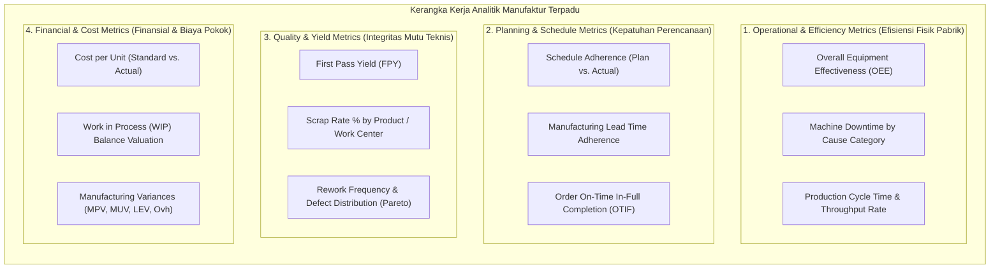
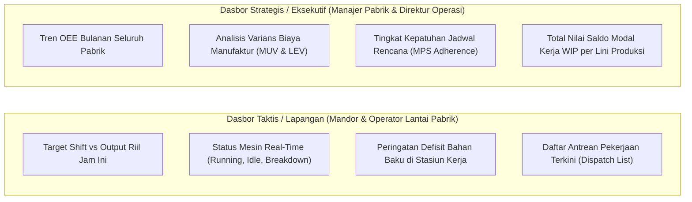

# Manufacturing Reporting and Operational Analytics

## Definition

**Manufacturing Reporting and Operational Analytics** adalah kumpulan laporan kinerja, dasbor intelijen bisnis (*Business Intelligence Dashboards*), dan metrik operasional terstruktur dalam ERP yang menyediakan visibilitas menyeluruh terhadap efisiensi lini produksi—mulai dari kepatuhan rencana terhadap realitas (*Plan vs. Actual*), tingkat hasil bersih (*Yield*), rasio afkir (*Scrap Rate*), pemanfaatan kapasitas mesin (*Capacity Utilization*), waktu henti (*Downtime*), saldo modal kerja di lantai kerja (*WIP*), hingga analisis varians biaya perakitan.

Data manufaktur dalam arsitektur ERP bertindak sebagai **Sumber Kebenaran Tunggal (*Single Source of Truth / SSOT*)** yang menyatukan laporan fisik dari mandor lapangan dengan laporan akuntansi biaya dari controller keuangan.

---

## Taksonomi Metrik Manufaktur (Manufacturing KPI Taxonomy)

Sistem ERP membagi analitik manufaktur ke dalam empat domain utama yang saling melengkapi:

---

## Definisi dan Formula Metrik Kunci Manufaktur

Sebelum angka dihitung dalam dasbor analitik, setiap metrik harus didefinisikan secara konseptual:

### 1. Planning & Schedule Adherence (Kepatuhan Jadwal)
* **Definisi**: Mengukur seberapa disiplin lini produksi memenuhi target kuantitas dan tanggal jatuh tempo yang ditetapkan oleh [[06-manufacturing/production-planning|Master Production Schedule (MPS)]].
* **Formula**:
  $$\mathbf{\text{Schedule Adherence (\%)} = \frac{\text{Actual Units Produced within Schedule}}{\text{Planned Units in Schedule}} \times 100\%}$$

---

### 2. Overall Equipment Effectiveness (OEE)
* **Definisi**: Metrik standar global untuk mengukur efektivitas menyeluruh suatu mesin atau stasiun kerja dengan memperhitungkan tiga faktor kerugian utama: waktu berhenti (*Availability*), penurunan kecepatan (*Performance*), dan barang cacat (*Quality*).
* **Formula**:
  $$\mathbf{\text{OEE (\%)} = \text{Availability} \times \text{Performance} \times \text{Quality}}$$
  * Di mana:
    $$\text{Availability} = \frac{\text{Operating Time}}{\text{Planned Production Time}} = \frac{\text{Planned Time} - \text{Downtime}}{\text{Planned Time}}$$
    $$\text{Performance} = \frac{\text{Total Units Produced} \times \text{Ideal Cycle Time}}{\text{Operating Time}}$$
    $$\text{Quality} = \frac{\text{Good Units Produced}}{\text{Total Units Produced}}$$

#### Contoh Kasus Perhitungan OEE:
* Mesin SMT dijadwalkan bekerja 8 jam (480 menit).
* Mengalami downtime perbaikan 48 menit $\implies \text{Operating Time} = 432 \text{ menit} \implies \text{Availability} = \frac{432}{480} = \mathbf{90\%}$.
* Selama 432 menit, mesin memproduksi 400 unit board (kecepatan ideal = 1 menit/unit) $\implies \text{Performance} = \frac{400 \times 1}{432} = \mathbf{92,59\%}$.
* Dari 400 unit, 388 unit lolos uji QC, 12 unit afkir $\implies \text{Quality} = \frac{388}{400} = \mathbf{97\%}$.
$$\mathbf{\text{OEE Mesin SMT}} = 0,90 \times 0,9259 \times 0,97 = \mathbf{80,83\%}$$

---

### 3. First Pass Yield (FPY) dan Scrap Rate
* **Definisi First Pass Yield**: Proporsi unit yang berhasil dirakit dengan sempurna pada percobaan pertama tanpa pernah disentuh oleh proses perbaikan (*rework*).
* **Formula**:
  $$\mathbf{\text{FPY (\%)} = \frac{\text{Units Entering Process} - \text{Scrapped Units} - \text{Reworked Units}}{\text{Units Entering Process}} \times 100\%}$$
* **Definisi Scrap Rate**: Persentase material atau unit yang rusak permanen dan harus dibuang ke tempat pemusnahan limbah.
  $$\mathbf{\text{Scrap Rate (\%)} = \frac{\text{Scrapped Quantity}}{\text{Total Input Quantity}} \times 100\%}$$

---

### 4. Work in Process (WIP) Turnover & Aging
* **Definisi**: Mengukur seberapa cepat modal kerja yang tertanam di lantai pabrik berputar menjadi barang jadi yang siap dijual.
* **Formula**:
  $$\mathbf{\text{WIP Days}} = \frac{\text{Rata-rata Saldo Akun WIP di Neraca}}{\text{Beban Pokok Penjualan (COGS)}} \times 365 \text{ hari}$$
  *WIP Days yang terlalu tinggi mengindikasikan banyaknya antrean pekerjaan yang mangkrak di lorong stasiun kerja.*

---

## Tingkatan Dasbor Manufaktur (Dashboard Hierarchy)

Sistem ERP modern menyajikan visualisasi analitik ke dalam dua tingkatan pengguna yang berbeda:

---

## ERP Implementation Comparison

| Aspek | Odoo Enterprise | ERPNext | Microsoft Dynamics 365 SCM |
| :--- | :--- | :--- | :--- |
| **Pelaporan Bawaan** | Tampilan *Pivot View* dan *Graph View* di modul Manufacturing (filter per produk, stasiun kerja, dan status); modul *OEE Analysis*. | Laporan bawaan komprehensif: *Work Order Summary*, *Production Analytics*, *Downtime Analysis*, dan *BOM Costing Report*. | Sangat komprehensif: Terintegrasi native dengan **Power BI** (*Production Performance and Cost Analysis Content Pack*). |
| **Analisis Bottleneck** | Analisis waktu tunggu pada Gantt View modul Planning dan grafik beban Work Center. | Membandingkan jam kapasitas pada laporan *Workstation Capacity Utilization*. | Fitur tingkat industri: **Gantt Chart Resource Loading** dan visualisasi beban kerja dengan penanda stasiun leher botol (*Bottleneck indicators*). |
| **Pelaporan Varians Biaya** | Selisih biaya ditampilkan pada tab *Cost Analysis* di setiap formulir pesanan produksi yang selesai. | Menampilkan tabel komparasi biaya bahan standar vs aktual pada laporan *Work Order Cost Analysis*. | Dasbor analitik formal: **Variance Analysis Breakdown** dengan kapabilitas drill-down langsung hingga ke baris jurnal GL terkait. |

---

## Naventra Consideration

Untuk perancangan modul Pelaporan Manufaktur pada sistem ERP enterprise seperti **Naventra**:

1. **Denormalisasi untuk Analitik Kinerja Cepat (Materialized Views)**:
   Perhitungan metrik manufaktur melibatkan penggabungan tabel yang sangat besar (`mo`, `lines`, `operations`, `confirmations`, `scraps`). Bangun tabel agregat atau *materialized view* khusus (misal: `analytics_daily_factory_performance`) yang diperbarui secara terjadwal setiap pergantian shift kerja.
2. **Kalkulasi Metrik OEE Otomatis pada Database Events**:
   Saat operator men-submit `mo_operation_confirmations`, trigger sistem secara otomatis menghitung durasi produktif vs downtime dan menyimpan metrik OEE parsial per mesin di tabel `work_center_oee_logs`.
3. **Penyediaan Widget Dasbor Pabrik Out-of-the-Box**:
   Sediakan widget bawaan pada halaman beranda staf manufaktur:
   * Widget *Andon Board*: Menampilkan status lampu hijau/kuning/merah untuk setiap stasiun kerja secara real-time.
   * Widget *Scrap Pareto Chart*: Diagram batang yang mengurutkan penyebab kecacatan produk terbesar untuk memandu program perbaikan berkelanjutan (*Kaizen / Six Sigma*).

---

## References

- ASCM / APICS. *APICS Dictionary: Manufacturing Key Performance Indicators, OEE, Scrap Rate, and First Pass Yield*.
- Nakajima, S. *Introduction to TPM: Total Productive Maintenance*. Productivity Press.
- Microsoft Learn. *Production Performance and Cost Analysis Power BI Content in Dynamics 365*.
- Frappe ERPNext Documentation. *Manufacturing Reports and Analytics*.
- Odoo 17 Documentation. *Production Analysis and OEE Dashboards in Manufacturing*.
