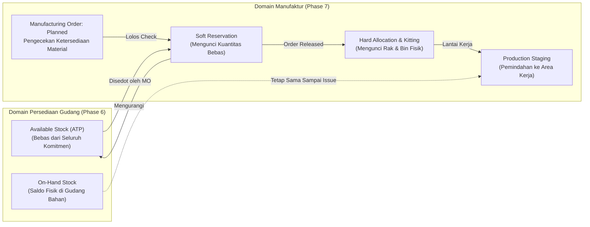

# Material Availability and Production Reservation

## Definition

**Material Availability and Production Reservation** adalah mekanisme pengendalian persediaan dalam sistem ERP yang memeriksa kecukupan stok bahan baku dan mengunci komponen yang dibutuhkan oleh [[06-manufacturing/manufacturing-order|Manufacturing Order]] sebelum proses perakitan fisik di lantai pabrik diizinkan untuk dimulai.

Dalam lingkungan manufaktur modern, merilis pesanan produksi ke lantai pabrik tanpa kepastian ketersediaan material yang lengkap (*Material Shortage*) akan mengakibatkan penumpukan barang setengah jadi yang mangkrak di lorong pabrik, pemborosan jam kerja operator, dan kekacauan tata letak stasiun kerja.

---

## Hubungan Domain: Integrasi dengan Persediaan Phase 6

Materi ini memperluas konsep kuantitas yang telah dibangun pada [[05-inventory/stock-quantity-and-availability|Stock Quantity and Availability]] dan [[05-inventory/inventory-reservation-and-allocation|Inventory Reservation and Allocation]] ke dalam konteks lantai pabrik:



---

## Perbedaan Krusial: Reservation vs. Physical Consumption

Salah satu kesalahan konsepsi paling umum dalam sistem persediaan manufaktur adalah menyamakan reservasi dengan pemakaian fisik:

> [!important]
> **Reservation $\neq$ Physical Consumption**:
> * **Reservation (Penguncian Logis / Komitmen Stok)**: Terjadi di sistem komputer saat pesanan produksi disetujui (*Approved / Released*). Tindakan ini **tidak mengubah saldo fisik On-Hand** dan **tidak menghasilkan jurnal akuntansi**, melainkan mengurangi saldo stok bebas (*Available ATP*) agar pesanan produksi lain tidak dapat mengambil komponen yang sama.
> * **Physical Consumption / Issue (Konsumsi Nyata)**: Terjadi ketika operator atau forklift mengambil fisik komponen dari rak gudang dan membawanya ke stasiun kerja. Tindakan ini **memotong saldo On-Hand** di kartu stok dan **menghasilkan jurnal akuntansi**: mendebit Barang Dalam Proses (WIP) dan mengkredit Persediaan Bahan Baku (lihat [[06-manufacturing/material-consumption-and-backflush|Material Consumption and Backflush]]).

---

## Logika Pemeriksaan Ketersediaan Bahan (Availability Checking Engine)

Sebelum Manufacturing Order berstatus `Released`, ERP menjalankan algoritma verifikasi material:

```mermaid
flowchart TD
    CheckReq["Pemicu: Verifikasi Ketersediaan Bahan untuk MO"]
    --> LoopLines["Evaluasi Seluruh Baris Komponen BOM"]
    
    LoopLines --> EvalLine{Kuantitas Bebas (ATP)<br/>$\ge$ Kebutuhan Bahan?}
    
    EvalLine -- "Lengkap (100% Tersedia)" --> CommitRes["Kunci Reservasi Komponen (Status: Available)<br/>MO Diizinkan Berstatus RELEASED"]
    
    EvalLine -- "Kurang / Shortage" --> ShortagePolicy{Kebijakan Shortage Pabrik?}
    
    ShortagePolicy -- "Strict (Full Availability Only)" --> BlockRelease["MO Diblokir / Ditahan (Status: Material Shortage)<br/>Penerbitan Pick List Ditunda"]
    ShortagePolicy -- "Partial Release Allowed" --> PartialRel["Rilis Parsial untuk Operasi Awal Saja<br/>Bahan yang Kurang Ditandai Backorder"]
    ShortagePolicy -- "Material Substitution" --> SubCheck["Cari Komponen Pengganti (Alternative Item)"]
```

---

## Penanganan Kekurangan Bahan (Material Shortage Handling)

Ketika terjadi kekurangan komponen kritis di gudang penyimpanan, ERP menyediakan protokol mitigasi:

### 1. Partial Order Release (Pelepasan Sebagian)
* **Kasus**: Komponen untuk Operasi 10 (Sasis Laptop) dan Operasi 20 (Motherboard) telah tersedia lengkap di gudang, namun komponen untuk Operasi 50 (Kardus Kemasan) baru tiba 3 hari lagi.
* **Solusi**: Sistem mengizinkan pelepasan parsial (*Partial Release*). Operator diizinkan memulai tahapan perakitan sasis dan motherboard, sementara proses pengepakan ditahan hingga kardus tiba di dermaga penerimaan.

### 2. Material Substitution (Penggantian Komponen Alternatif)
* Jika komponen utama mengalami kekosongan stok (*stockout*), ERP memeriksa tabel *Item Substitution*:
  * *Contoh*: Modul RAM 16GB Merek A kosong, sistem menawarkan penggantian otomatis dengan Modul RAM 16GB Merek B yang telah memiliki sertifikasi teknik setara (*Form-Fit-Function Equivalent*).
  * Sistem memperbarui baris pesanan produksi dan mencatat riwayat substitusi untuk keperluan ketertelusuran garansi mutu.

---

## Metode Pemindahan Material: Kitting vs. Point-of-Use

Bagaimana komponen berpindah dari gudang penyimpanan menuju mesin pabrik diatur melalui dua pendekatan logistik:

| Karakteristik | Kitting (Pre-Assembly Packaging) | Point-of-Use (Kanban / Floor Stock) |
| :--- | :--- | :--- |
| **Mekanisme Logistik** | Seluruh komponen yang dibutuhkan untuk 1 unit produk dikumpulkan dalam satu keranjang (*kit tote/cart*) di gudang sebelum dikirim ke perakitan. | Komponen curah disimpan dalam jumlah besar di rak yang berada tepat di samping mesin perakitan (*point of use*). |
| **Waktu Pengambilan** | Terjadwal sebelum pesanan produksi dimulai (*Pre-assembly stage*). | Operator mengambil sendiri saat merakit (*Continuous replenishment*). |
| **Karakteristik Material** | Komponen bernilai tinggi, sensitif, unik per model (misal: CPU, Motherboard, Layar Display Laptop). | Komponen berbiaya murah, standar, ukuran kecil (misal: baut, mur, kabel jumper, stiker label). |
| **Pengendalian Sistem** | Pengeluaran bahan dicatat per unit pesanan produksi (*Order-specific picking*). | Diisi ulang menggunakan sistem kartu Kanban dua kotak (*Two-Bin Kanban System*). |

---

## ERP Implementation Comparison

| Aspek | Odoo Enterprise | ERPNext | Microsoft Dynamics 365 SCM |
| :--- | :--- | :--- | :--- |
| **Pengecekan Ketersediaan** | Tombol *Check Availability* pada Manufacturing Order; indikator visual warna (Hijau = Tersedia, Merah = Kurang). | Kolom status ketersediaan pada baris BOM di Work Order; tombol *Create Pick List*. | Sangat komprehensif: Fitur formal **Material Availability Check / Critical on-hand items view** dengan simulasi ledakan pasokan. |
| **Pemisahan Kitting & Staging** | Menggunakan konfigurasi *Multi-step Manufacturing Routes* (Pick Components $\to$ Manufacture $\to$ Store Goods). | Menggunakan dokumen `Stock Entry` bertipe *Material Transfer for Manufacture* untuk staging ke gudang lantai kerja (*WIP Warehouse*). | Fitur tingkat industri: **Warehouse Work Execution for Production** (instruksi pengambilan bahan via aplikasi mobile WMS menuju *Input Location* mesin). |
| **Penanganan Substitusi** | Memerlukan pemilihan manual atau penggantian baris komponen pada formulir MO. | Fitur *Alternate Item* yang dapat dipilih langsung pada tabel baris komponen Work Order. | Fitur formal **Alternative Items and Interchangeability Rules** yang otomatis menawarkan substitusi saat terjadi shortage. |

---

## Naventra Consideration

Untuk perancangan modul Reservasi Material Manufaktur pada sistem ERP enterprise seperti **Naventra**:

1. **Skema Database Alokasi Komponen MO**:
   ```sql
   CREATE TABLE mo_material_allocations (
       id UUID PRIMARY KEY DEFAULT gen_random_uuid(),
       manufacturing_order_id UUID NOT NULL REFERENCES manufacturing_orders(id) ON DELETE CASCADE,
       component_item_id UUID NOT NULL REFERENCES items(id),
       required_quantity NUMERIC(15, 4) NOT NULL,
       reserved_quantity NUMERIC(15, 4) NOT NULL DEFAULT 0,
       issued_quantity NUMERIC(15, 4) NOT NULL DEFAULT 0,
       source_storage_location_id UUID REFERENCES storage_locations(id),
       allocated_batch_number VARCHAR(100),
       status VARCHAR(30) NOT NULL DEFAULT 'PENDING', -- 'PENDING', 'FULLY_RESERVED', 'PARTIALLY_RESERVED', 'SHORTAGE', 'ISSUED'
       created_at TIMESTAMP WITH TIME ZONE DEFAULT NOW()
   );
   ```
2. **Atomic Soft-to-Hard Reservation Transition**:
   Saat status MO berpindah ke `RELEASED`, backend mengeksekusi fungsi transaksi yang mengubah status `mo_material_allocations` dari kuantitas abstrak menjadi penunjukan koordinat rak (`source_storage_location_id`) dan nomor batch (`allocated_batch_number`) secara spesifik.
3. **Shortage Warning Dashboard API**:
   Sediakan endpoint analitik (`GET /api/v1/manufacturing/orders/:id/shortage-analysis`) yang mengembalikan daftar rincian komponen yang mengalami defisit, tanggal ekspektasi kedatangan Purchase Order terkait, dan rekomendasi alternatif suku cadang yang tersedia di gudang lain.

---

## References

- ASCM / APICS. *Detailed Scheduling and Planning: Material Availability, Kitting Systems, and Production Allocation Rules*.
- Vollmann, T. E., et al. *Manufacturing Planning and Control for Supply Chain Management: Material Staging and Floor Stock Control*.
- Microsoft Learn. *Release Production Orders and Warehouse Material Staging in Dynamics 365 Supply Chain Management*.
- Frappe ERPNext Documentation. *Material Transfer for Manufacturing and Shortage Tracking*.
- Odoo 17 Documentation. *Reserve Materials and Manage Component Availability in Manufacturing*.
