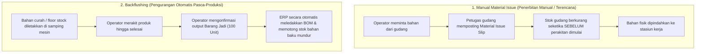
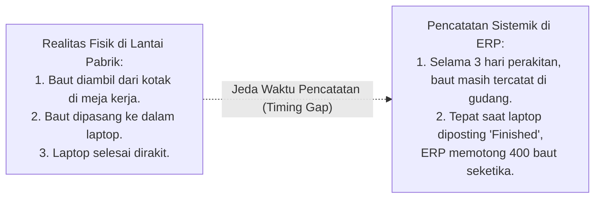

# Material Consumption and Backflushing Mechanics

## Definition

**Material Consumption and Backflushing Mechanics** adalah tata kelola operasional dan akuntansi dalam ERP yang mencatat pemotongan saldo fisik bahan baku dari persediaan gudang dan membebankan nilai perolehannya ke dalam akun Barang Dalam Proses (*Work in Process / WIP*) pesanan produksi.

Dalam eksekusi manufaktur, pencatatan konsumsi bahan baku merupakan **titik temu krusial antara logistik fisik dan akuntansi biaya**. Ketepatan waktu dan akurasi pencatatan konsumsi ini menentukan apakah saldo stok di kartu persediaan gudang mencerminkan ketersediaan fisik yang nyata, serta apakah harga pokok produk dihitung berdasarkan pemakaian riil (*Actual Costing*) atau standar resep (*Standard Costing*).

---

## Dua Paradigma Konsumsi: Manual Issue vs. Backflushing

Sistem ERP enterprise menyediakan dua metode utama untuk mencatat konsumsi komponen:



### Analisis Komparasi Mendalam:

| Parameter | Manual Material Issue | Backflushing (Pencatatan Mundur) |
| :--- | :--- | :--- |
| **Titik Waktu Transaksi Sistem** | **Pre-Production / Real-Time**: Diposting sebelum atau tepat saat bahan fisik keluar dari gudang. | **Post-Production**: Diposting secara retrospektif setelah barang jadi selesai diproduksi. |
| **Akurasi Kuantitas Bahan** | **Tinggi (Actual Usage)**: Mencatat kuantitas riil yang diambil, termasuk jika ada tumpahan atau pemborosan. | **Teoretis (Standard Usage)**: Dihitung otomatis: $\text{Kuantitas Selesai} \times \text{BOM Qty Per Unit}$. |
| **Beban Administrasi Data** | Tinggi: Setiap pengambilan material memerlukan pemindaian barcode atau input dokumen pengambilan. | Sangat Rendah: Tanpa input data per komponen; transaksi terjadi otomatis di latar belakang. |
| **Karakteristik Material yang Cocok** | Komponen bernilai tinggi, sensitif, unik, atau yang memiliki nomor seri/lot individual (misal: Motherboard, CPU, Layar Display). | Komponen berbiaya rendah (*hardware consumables*), perakitan berkecepatan tinggi (*fast assembly*), baut, mur, kabel curah, cairan pelarut. |
| **Risiko Operasional** | Hambatan antrean logistik jika petugas gudang lambat memvalidasi dokumen pengeluaran. | **Anomali Stok Negatif**: Jika saldo gudang di sistem tidak mencukupi saat backflush berjalan, sistem dapat memicu *Negative Inventory*. |

---

## Titik Waktu Pelaksanaan Backflush (Backflush Triggers)

Dalam sistem ERP kelas enterprise, pemicu eksekusi *backflush* dapat dikonfigurasi pada level yang berbeda:

1. **Backflush at Assembly Completion (Tingkat Barang Jadi)**:
   Seluruh komponen dari Level 0 diledakkan dan dipotong dari stok saat produk jadi resmi diterima di gudang barang jadi (*Finished Goods Receipt*).
2. **Backflush at Operation Confirmation (Tingkat Operasi Routing)**:
   Komponen dipotong secara bertahap saat setiap tahapan operasi kerja (*Work Order*) selesai dikonfirmasi.
   * *Contoh*: Komponen Sasis dan Motherboard di-backflush saat Operasi 10 selesai; Komponen Layar di-backflush saat Operasi 30 selesai; Kardus Kemasan di-backflush saat Operasi 50 selesai.
   * *Keunggulan*: Nilai Barang Dalam Proses (WIP) di neraca mencerminkan progres perakitan yang jauh lebih akurat sepanjang bulan berjalan.

---

## Hubungan Fisik vs. Sistemik (Physical Reality vs System State)

Perbedaan mendasar antara kejadian fisik di lantai kerja dengan pencatatan buku persediaan:



> [!caution]
> **Peringatan Tata Kelola Backflushing**:
> Karena backflushing memotong persediaan secara teoretis berdasarkan standar BOM, pemborosan bahan riil di lantai kerja (misal: operator menjatuhkan dan menginjak 50 baut hingga rusak) **tidak akan pernah terdeteksi oleh sistem** hingga saat pelaksanaan penghitungan fisik berkala ([[05-inventory/physical-inventory-count|Stock Opname]]). 
> 
> Oleh karena itu, industri yang menerapkan backflushing wajib melengkapi operasionalnya dengan dokumen pelaporan sisa/cacat material manual (*Scrap Reporting*) untuk menjaga akurasi kartu stok.

---

## Analisis Varians Pemakaian Bahan: Standard vs. Actual Consumption

Ketika perusahaan menerapkan sistem pencatatan pemakaian bahan aktual (*Actual Material Issue*):

* **Standard Consumption (Konsumsi Standar)**:
  $$\text{Standar Pemakaian} = \text{Output Aktual Selesai} \times \text{BOM Quantity Per Unit}$$
  *Contoh*: 100 unit Laptop Pro $\times 1 \text{ set sasis} = \mathbf{100 \text{ set}}$.
* **Actual Consumption (Konsumsi Riil Lapangan)**:
  Kuantitas fisik yang nyata-nyata ditarik oleh operator dari gudang (misal: **102 set sasis**, karena 2 set mengalami retak saat pemasangan).

### Perhitungan Varians Kuantitas Bahan (*Material Usage Variance*):

$$\mathbf{\text{Material Usage Variance (MUV)} = (\text{Actual Quantity} - \text{Standard Quantity}) \times \text{Standard Unit Price}}$$

* Skenario Kanonikal: Harga standar sasis = Rp500.000/set.
$$\text{MUV} = (102 - 100) \times \text{Rp}500.000 = +2 \text{ set} \times \text{Rp}500.000 = \mathbf{\text{Rp}1.000.000 \text{ (Unfavorable / Merugikan)}}$$

### Dampak Penjurnalan Akuntansi Biaya (Perpetual):
1. **Saat Pengeluaran 102 Set Sasis ke Lantai Pabrik**:
   * *(Dr)* Persediaan Barang Dalam Proses (*WIP*): **Rp51.000.000** ($102 \times \text{Rp}500.000$)
   * *(Cr)* Persediaan Bahan Baku: **Rp51.000.000**
2. **Saat Penerimaan 100 Unit Barang Jadi ke Gudang**:
   * *(Dr)* Persediaan Barang Jadi (*Finished Goods*): **Rp50.000.000** ($100 \times \text{Rp}500.000$)
   * *(Cr)* Persediaan Barang Dalam Proses (*WIP*): **Rp50.000.000**
3. **Saat Penutupan Perintah Kerja (Order Financial Close)**:
   Sisa saldo Rp1.000.000 yang menggantung di akun WIP ditutup ke akun varians laba rugi:
   * *(Dr)* Beban Selisih Pemakaian Bahan (*Material Usage Variance*): **Rp1.000.000**
   * *(Cr)* Persediaan Barang Dalam Proses (*WIP*): **Rp1.000.000**

---

## ERP Implementation Comparison

| Aspek | Odoo Enterprise | ERPNext | Microsoft Dynamics 365 SCM |
| :--- | :--- | :--- | :--- |
| **Metode Konsumsi per Komponen** | Ditentukan pada field *Flexible Consumption* pada BOM: *Allowed*, *Allowed with warning*, atau *Blocked*. Mendukung rute *Replenish on Order*. | Parameter *Allow Over Production* dan dokumen *Stock Entry (Manufacture)* yang dapat diedit baris kuantitas aktualnya. | Konfigurasi formal pada *BOM Line*: **Flushing Principle** (Pilihan: *Start, Finish, Manual, Flushed at Operation*). |
| **Pencegahan Stok Negatif saat Backflush** | Dibatasi oleh setting umum inventaris Odoo. Jika stok tidak cukup, sistem memperingatkan kuantitas yang belum tersedia. | Memerlukan konfigurasi *Allow Negative Stock = False* pada Stock Settings untuk memblokir backflush jika stok defisit. | Sangat ketat: Parameter *Physical negative inventory = False* memblokir konfirmasi produksi jika saldo komponen tidak mencukupi di lokasi input. |
| **Alokasi Floor Stock** | Komponen disimpan di lokasi internal bertipe produksi (*Production Location*). | Menggunakan gudang perantara khusus (*Work-in-Progress Warehouse*). | Menggunakan konsep **Warehouse Management Production Input Location** dengan pemindahan otomatis via kartu Kanban. |

---

## Naventra Consideration

Untuk perancangan modul Konsumsi Material pada sistem ERP enterprise seperti **Naventra**:

1. **Skema Database Mutasi Konsumsi Bahan**:
   ```sql
   CREATE TABLE mo_material_consumptions (
       id UUID PRIMARY KEY DEFAULT gen_random_uuid(),
       manufacturing_order_id UUID NOT NULL REFERENCES manufacturing_orders(id),
       operation_id UUID REFERENCES routing_operations(id),
       component_item_id UUID NOT NULL REFERENCES items(id),
       source_warehouse_id UUID NOT NULL REFERENCES warehouses(id),
       source_storage_location_id UUID REFERENCES storage_locations(id),
       batch_number VARCHAR(100),
       serial_number VARCHAR(100),
       
       consumption_type VARCHAR(20) NOT NULL, -- 'MANUAL_ISSUE', 'BACKFLUSH'
       standard_quantity NUMERIC(15, 4) NOT NULL,
       actual_quantity NUMERIC(15, 4) NOT NULL,
       unit_cost NUMERIC(18, 4) NOT NULL,
       total_cost NUMERIC(18, 4) GENERATED ALWAYS AS (actual_quantity * unit_cost) STORED,
       
       posted_at TIMESTAMP WITH TIME ZONE DEFAULT NOW()
   );
   ```
2. **Flag Flushing Principle pada Master BOM**:
   Sediakan kolom `flushing_principle` pada tabel `bill_of_material_lines` (`'MANUAL'`, `'AT_START'`, `'AT_FINISH'`). Saat memproses API output barang jadi, backend secara otomatis memicu fungsi *backflush worker* hanya untuk komponen yang berstatus non-manual.
3. **Pemberlakuan Kunci Mutasi Stok Atomik**:
   Setiap konsumsi bahan wajib dieksekusi di dalam blok transaksi database bersamaan dengan pemotongan stok pada tabel `inventory_balances` dan penambahan saldo pada akun buku besar WIP, guna menjamin tidak ada ketimpangan antara kartu stok dan neraca keuangan.

---

## References

- ASCM / APICS. *APICS Dictionary: Backflushing, Point-of-Use Inventory, Material Issue, and Usage Variance*.
- Vollmann, T. E., et al. *Manufacturing Planning and Control for Supply Chain Management: Material Control and Floor Stock Practices*.
- Microsoft Learn. *Flushing Principles and Material Consumption in Dynamics 365 Supply Chain Management*.
- Frappe ERPNext Documentation. *Stock Entry for Manufacture and Raw Material Consumption*.
- Odoo 17 Documentation. *Component Consumption and Flexible Consumption Policies in Manufacturing*.
