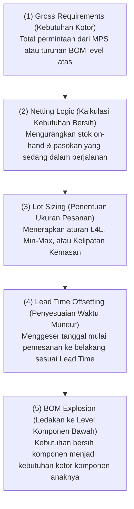
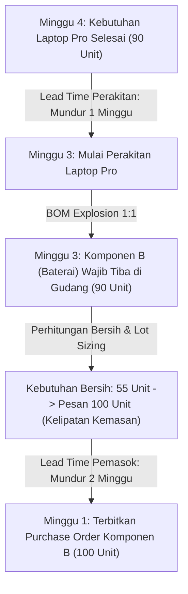

# Material Requirements Planning (MRP)

## Definition

**Material Requirements Planning (MRP)** adalah algoritma komputasi inti dalam sistem ERP yang menghitung kebutuhan material berbasis waktu (*time-phased material requirements*) untuk seluruh komponen, suku cadang, dan bahan baku yang dibutuhkan untuk merealisasikan [[06-manufacturing/production-planning|Master Production Schedule (MPS)]].

Algoritma MRP menjawab empat pertanyaan mendasar rantai pasok:
1. **Komponen apa yang dibutuhkan?** (Berdasarkan ledakan [[06-manufacturing/product-structure-and-bom|Bill of Materials]]).
2. **Berapa kuantitas yang dibutuhkan?** (Memperhitungkan kebutuhan bersih setelah dikurangi stok gudang).
3. **Kapan material tersebut dibutuhkan?** (Berdasarkan tanggal mulai operasi perakitan di pabrik).
4. **Kapan pesanan pengadaan atau produksi komponen harus diterbitkan?** (Memperhitungkan waktu tunggu pasokan / *lead time*).

---

## Logika Komputasi MRP dan Persamaan Matematis

Algoritma MRP bekerja secara berulang (*recursive looping*) dari level teratas (Level 0) menuju level komponen terdalam melalui lima langkah sistematis:



### Rumus Standar Kebutuhan Bersih (Net Requirements Formula):

$$\mathbf{\text{Net Requirement} = \text{Gross Requirement} - \text{Projected On-Hand} - \text{Scheduled Receipts} + \text{Safety Stock}}$$

Di mana:
* **Gross Requirement**: Total permintaan material pada ember waktu tertentu.
* **Projected On-Hand**: Saldo persediaan fisik bebas di gudang pada awal periode.
* **Scheduled Receipts**: Pesanan pembelian ke pemasok (*Open PO*) atau pesanan produksi internal (*Open MO*) yang telah diterbitkan dan dijadwalkan tiba pada periode tersebut.
* **Safety Stock**: Batas persediaan pengaman minimum yang wajib dipertahankan di gudang.

Jika hasil perhitungan $\text{Net Requirement} \le 0$, maka stok saat ini dinilai mencukupi dan tidak ada pesanan baru yang dibangkitkan. Jika $\text{Net Requirement} > 0$, sistem membangkitkan **Planned Order**.

---

## Contoh Numerik Kanonikal: Perhitungan MRP Berjenjang

Untuk memahami bagaimana MRP mengeksekusi *BOM explosion* dan penyesuaian waktu (*lead time offset*), perhatikan skenario berikut:

### 1. Struktur Produk dan Data Master:
* **Produk Jadi**: Laptop Pro (`FG-100`).
* **Struktur BOM Level 1**:
  * Komponen A (Motherboard Assembly): **1 unit** per Laptop Pro (Buat Sendiri, Lead Time = 1 Minggu).
  * Komponen B (Baterai Lithium 70Wh): **1 unit** per Laptop Pro (Beli Jadi dari Pemasok, Lead Time = 2 Minggu).
* **Permintaan Produk Jadi (MPS)**:
  * Kebutuhan: **100 unit Laptop Pro** harus selesai dirakit pada **Minggu ke-4**.

---

### 2. Kisi-Kisi Perhitungan MRP Level 0: Laptop Pro (`FG-100`)
* *Parameter*: On-Hand = 20 unit; Safety Stock = 10 unit; Scheduled Receipt = 0; Lead Time = 1 Minggu; Lot Size = Lot-for-Lot.

| Parameter Komputasi | Minggu 1 | Minggu 2 | Minggu 3 | Minggu 4 |
| :--- | :---: | :---: | :---: | :---: |
| **Gross Requirements** | 0 | 0 | 0 | **100** |
| **Scheduled Receipts** | 0 | 0 | 0 | 0 |
| **Projected Available Balance (Awal: 20)** | 20 | 20 | 20 | $20 - 100 = \mathbf{-80} \implies \text{Defisit}$ |
| **Net Requirements** ($100 - 20 + 10$) | 0 | 0 | 0 | **90** |
| **Planned Order Receipts** | 0 | 0 | 0 | **90** |
| **Planned Order Releases (Lead Time = 1 Mgg)** | 0 | 0 | **90** | 0 |

*Hasil Level 0*: Untuk menghasilkan 90 unit bersih Laptop Pro pada Minggu ke-4, perakitan akhir harus dimulai pada **Minggu ke-3**. Hal ini memicu kebutuhan kotor (*Gross Requirements*) bagi Komponen A dan Komponen B sebesar 90 unit pada **Minggu ke-3**.

---

### 3. Kisi-Kisi Perhitungan MRP Level 1: Komponen B (Baterai Lithium)
* *Parameter*: Kebutuhan per unit induk = 1 unit; On-Hand = 30 unit; Safety Stock = 15 unit; Scheduled Receipt = 20 unit (PO terbuka tiba di Minggu ke-2); Lead Time = 2 Minggu; Lot Sizing = Kelipatan Kemasan (*Fixed Multiple*) 50 unit.

| Parameter Komputasi Komponen B | Minggu 1 | Minggu 2 | Minggu 3 | Minggu 4 |
| :--- | :---: | :---: | :---: | :---: |
| **Gross Requirements (Dari Release Level 0)** | 0 | 0 | **90** | 0 |
| **Scheduled Receipts (PO Terbuka)** | 0 | **20** | 0 | 0 |
| **Projected Available Balance (Awal: 30)** | 30 | $30 + 20 = \mathbf{50}$ | $50 - 90 = \mathbf{-40} \implies \text{Defisit}$ | 10 |
| **Net Requirements** ($90 - 50 + 15$) | 0 | 0 | **55** | 0 |
| **Planned Order Receipts (Kelipatan 50)** | 0 | 0 | **100** (Dibulatkan) | 0 |
| **Projected Ending Balance** | 30 | 50 | $50 + 100 - 90 = \mathbf{60}$ | 60 |
| **Planned Order Releases (Lead Time = 2 Mgg)** | **100** | 0 | 0 | 0 |



#### Rekonsiliasi Hasil MRP:
* Departemen Pengadaan mendapatkan rekomendasi resmi pada **Minggu ke-1** untuk menerbitkan Purchase Order atas **100 unit Baterai** ke pemasok.
* Barang tiba di dermaga gudang pada **Minggu ke-3** (tepat saat perakitan Laptop Pro dimulai).
* Sisa persediaan baterai di gudang pada Minggu ke-3 adalah 60 unit, yang berada aman di atas batas *Safety Stock* (15 unit).

---

## Output Aksi Sistem MRP (MRP Action Messages)

Keluaran utama dari eksekusi algoritma MRP terbagi menjadi dua kelompok:

### 1. Rekomendasi Dokumen Rencana (Planned Supply)
* **Planned Production Orders**: Rekomendasi penerbitan pesanan produksi baru untuk komponen buatan sendiri (*Make items*). Diteruskan ke modul Manufaktur.
* **Planned Purchase Requisitions**: Rekomendasi penerbitan surat permintaan pembelian baru untuk komponen beli (*Buy items*). Diteruskan ke modul [[04-purchasing/purchase-requisition|Purchasing (P2P)]].

### 2. Pesan Pengecualian dan Penyesuaian Jadwal (Exception / Action Messages)
Ketika realitas lapangan menyimpang dari rencana awal (misal: pesanan penjualan dimajukan oleh pelanggan), mesin MRP menerbitkan peringatan aksi:
* **Expedite (Percepat)**: Jadwalkan penerimaan PO/MO lebih awal karena kebutuhan material terjadi lebih cepat dari proyeksi semula.
* **Postpone / Defer (Tunda)**: Undur tanggal penerimaan pesanan ke masa depan karena tanggal kebutuhan mundur, guna mencegah penumpukan modal kerja di gudang.
* **Cancel (Batalkan)**: Batalkan pesanan pengadaan karena pesanan penjualan induk telah dibatalkan.

---

## ERP Implementation Comparison

| Aspek | Odoo Enterprise | ERPNext | Microsoft Dynamics 365 SCM |
| :--- | :--- | :--- | :--- |
| **Mesin Kalkulasi MRP** | Dieksekusi melalui fitur *Scheduler* (otomatis terjadwal via cron atau tombol *Run Scheduler* manual). | Dieksekusi melalui dokumen `Production Plan` dengan tombol *Get Items for Work Order* dan *Get Items for Purchase*. | Menggunakan layanan awan in-memory terdedikasi: **Planning Optimization Service** (mampu menghitung jutaan SKU dalam hitungan menit). |
| **Action Messages** | Ditampilkan sebagai peringatan *Replenishment Exceptions* atau notifikasi penyesuaian tanggal pada dokumen picking. | Ditampilkan sebagai peringatan kekurangan bahan (*Shortage Warning*) saat men-submit Production Plan. | Fitur tingkat industri: Tabel **Action Messages** formal (*Advance, Postpone, Increase, Decrease*) yang dapat di-approve langsung. |
| **Integrasi Pegging** | Fitur *Traceability* yang menautkan dokumen MO langsung ke asal permintaan Sales Order (MTO route). | Tabel relasi *Sales Order Item* yang tersimpan pada baris Production Plan. | Fitur komprehensif: **Dynamic Pegging** yang memperlihatkan visualisasi pohon hubungan multi-level antara pasokan dan permintaan. |

---

## Naventra Consideration

Untuk perancangan modul MRP pada sistem ERP enterprise seperti **Naventra**:

1. **Skema Database Hasil Komputasi MRP**:
   ```sql
   CREATE TABLE mrp_runs (
       id UUID PRIMARY KEY DEFAULT gen_random_uuid(),
       run_code VARCHAR(50) NOT NULL UNIQUE,
       run_timestamp TIMESTAMP WITH TIME ZONE DEFAULT NOW(),
       status VARCHAR(30) NOT NULL DEFAULT 'COMPLETED', -- 'RUNNING', 'COMPLETED', 'FAILED'
       parameters_json JSONB
   );

   CREATE TABLE mrp_planned_orders (
       id UUID PRIMARY KEY DEFAULT gen_random_uuid(),
       mrp_run_id UUID NOT NULL REFERENCES mrp_runs(id) ON DELETE CASCADE,
       item_id UUID NOT NULL REFERENCES items(id),
       warehouse_id UUID NOT NULL REFERENCES warehouses(id),
       order_type VARCHAR(20) NOT NULL, -- 'MANUFACTURE', 'PURCHASE', 'TRANSFER'
       suggested_quantity NUMERIC(15, 4) NOT NULL,
       demand_date DATE NOT NULL, -- Tanggal material dibutuhkan
       release_date DATE NOT NULL, -- Tanggal pesanan harus diterbitkan (offset lead time)
       pegged_demand_doc_type VARCHAR(50),
       pegged_demand_doc_id UUID,
       status VARCHAR(30) NOT NULL DEFAULT 'SUGGESTED' -- 'SUGGESTED', 'CONVERTED', 'IGNORED'
   );
   ```
2. **Kalkulasi Rekursif Berbasis Low-Level Code (LLC)**:
   Algoritma MRP pada backend wajib mengurutkan komputasi berdasarkan `items.low_level_code ASC` (mulai dari level 0, lalu level 1, hingga level terbawah). Hal ini menjamin bahwa seluruh kebutuhan kotor turunan (*dependent gross requirements*) telah terakumulasi secara lengkap sebelum perhitungan kebutuhan bersih komponen anak dieksekusi.
3. **Mekanisme Bulk Conversion ke Dokumen Transaksional**:
   Sediakan API *bulk conversion* (`POST /api/v1/mrp/convert-planned-orders`) yang secara atomik mengubah baris-baris `mrp_planned_orders` berjenis `PURCHASE` menjadi dokumen draf `purchase_requisitions` dan berjenis `MANUFACTURE` menjadi dokumen draf `manufacturing_orders`.

---

## References

- ASCM / APICS. *Detailed Scheduling and Planning: Material Requirements Planning (MRP) Mechanics and Logic*.
- Orlicky, J. *Material Requirements Planning: The New Way of Life in Production and Inventory Management*. McGraw-Hill.
- Vollmann, T. E., et al. *Manufacturing Planning and Control for Supply Chain Management: MRP Calculations*.
- Microsoft Learn. *Master Planning and MRP Engine Architecture in Dynamics 365 Supply Chain Management*.
- Frappe ERPNext Documentation. *Material Requirements Planning through Production Plan*.
- Odoo 17 Documentation. *Run the MRP Scheduler and Procurement Automations*.
