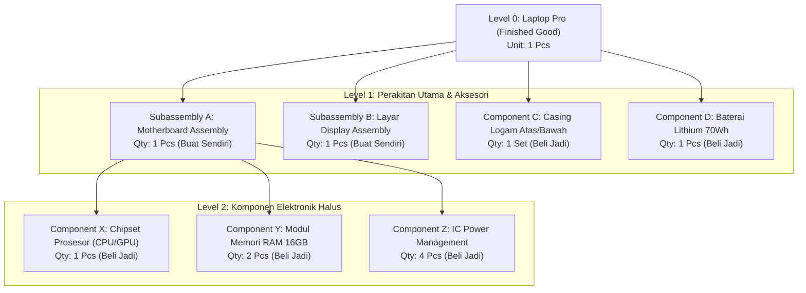
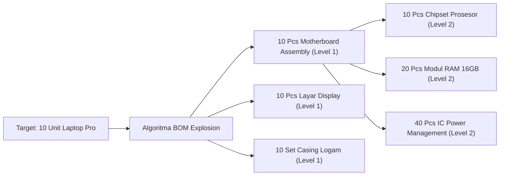

# Product Structure and Bill of Materials (BOM)

## Definition

**Product Structure and Bill of Materials (BOM)** adalah data induk fundamental dalam ERP yang mendefinisikan arsitektur fisik sebuah produk—merinci daftar hierarkis lengkap dari seluruh bahan baku (*raw materials*), sub-perakitan (*subassemblies*), komponen jadi, dan suku cadang yang dibutuhkan, lengkap dengan kuantitas yang tepat, satuan ukuran (*UOM*), serta faktor penyusutan teknis (*scrap factor*) untuk menghasilkan satu unit produk jadi (*finished good*).

Jika [[05-inventory/product-and-inventory-master-data|Item Master]] mendefinisikan *apa* barang tersebut secara individual, maka BOM mendefinisikan **bagaimana barang-barang tersebut saling tersusun dan terikat dalam hubungan induk-anak (*Parent-Child Relationship*)**. Tanpa BOM yang akurat, sistem ERP tidak dapat menjalankan perhitungan kebutuhan bahan ([[06-manufacturing/mrp-material-requirement-planning|MRP]]), penjadwalan produksi, ataupun penghitungan biaya standar produk.

---

## Anatomi Hierarki Struktur Produk (Multi-Level BOM)

Produk manufaktur modern (seperti perangkat elektronik, mesin, atau kendaraan) hampir selalu memiliki struktur bertingkat (*multi-level*):



### Konvensi Penomoran Level (*Low-Level Coding*):
* **Level 0 (Top Level)**: Produk jadi akhir yang dijual langsung ke pelanggan (*Finished Good*).
* **Level 1**: Sub-perakitan langsung atau komponen yang dipasang pada tahap perakitan akhir.
* **Level 2 dst**: Komponen pembentuk sub-perakitan.
* **Low-Level Code (LLC)**: Nomor level terdalam di mana suatu komponen muncul di seluruh struktur produk perusahaan. Algoritma MRP menggunakan LLC untuk memastikan kebutuhan kotor komponen dihitung hanya setelah seluruh level induk di atasnya selesai diledakkan (*exploded*).

---

## Taksonomi dan Tipe-Tipe Bill of Materials

Sistem ERP enterprise mengklasifikasikan BOM berdasarkan tujuan fungsional dan perilaku sistemiknya:

| Tipe BOM | Karakteristik dan Perilaku Sistemik | Kapan Digunakan? |
| :--- | :--- | :--- |
| **Manufacturing BOM (MBOM)** | Resep baku operasional pabrik yang mencerminkan tahapan perakitan nyata di lantai kerja dan ditautkan ke [[06-manufacturing/routing-and-work-center|Routing]]. | Standar operasional harian untuk penerbitan Manufacturing Order dan penyerapan biaya. |
| **Engineering BOM (EBOM)** | Struktur desain murni yang dihasilkan oleh tim R&D / CAD; diorganisasikan berdasarkan fungsi teknik produk (bukan urutan perakitan pabrik). | Fase perancangan produk baru (*New Product Introduction / NPI*) sebelum diserahkan ke tim teknik produksi. |
| **Phantom BOM (Blow-Through BOM)** | Sub-perakitan virtual yang **tidak pernah disimpan di gudang fisik sebagai persediaan**. Saat pesanan produksi dibuat, sistem langsung meledakkan (*blow through*) komponen di bawahnya ke pesanan induk. | Sekumpulan komponen kecil yang selalu dipasang bersamaan (misal: satu set kabel jumper dan baut pengikat) untuk menyederhanakan dokumentasi. |
| **Configurable / Super BOM** | Struktur modular yang memuat daftar opsi komponen variabel yang dipilih menggunakan logika aturan konfigurasi (*Product Configurator*). | Bisnis *Assemble-to-Order (ATO)* seperti penyesuaian spesifikasi laptop, mobil, atau furnitur kustom. |
| **Alternative / Substitute BOM** | Resep cadangan yang disetujui untuk membuat produk yang sama menggunakan komponen atau mesin alternatif saat terjadi kelangkaan pasokan. | Situasi darurat rantai pasok (misal: penggantian chip pemasok A dengan pemasok B yang berspesifikasi setara). |

---

## Atribut Kritis Baris Komponen BOM (BOM Line Attributes)

Setiap baris komponen dalam tabel BOM memuat parameter teknis penentu:

1. **Quantity Per (Kuantitas per Satuan Induk)**:
   Jumlah komponen yang dibutuhkan untuk membuat tepat 1 unit (atau 1 basis batch) produk induk.
2. **Scrap Factor / Shrinkage Percentage (Faktor Penyusutan Teknis)**:
   Persentase kehilangan material yang diperkirakan terjadi secara wajar akibat proses pemotongan, penyolderan, penguapan, atau pengujian mutu:
   $$\text{Kuantitas Kebutuhan Kotor} = \text{Target Produksi Induk} \times \text{Quantity Per} \times \left(1 + \frac{\text{Scrap Factor \%}}{100}\right)$$
   *Contoh*: Jika membuat 100 unit membutuhkan kabel 2 meter/unit dengan scrap factor 5%, maka kuantitas material yang dialokasikan adalah: $100 \times 2 \times 1,05 = \mathbf{210 \text{ meter}}$.
3. **Effective Date / Validity Period (Masa Berlaku BOM)**:
   Rentang tanggal (*Valid From* s.d. *Valid To*) yang menentukan kapan versi resep tersebut sah digunakan. Berguna untuk memprogram transisi suku cadang lama ke suku cadang baru secara otomatis pada tanggal tertentu (*Phase-In / Phase-Out*).
4. **Operation Sequence Linkage (Kaitan Operasi Routing)**:
   Menunjukkan pada tahapan operasi nomor berapa komponen tersebut pertama kali dibutuhkan (misal: Komponen Layar baru ditarik dari gudang pada Operasi 30: *Screen Assembly*, bukan di Operasi 10: *Base Chassis Assembly*). Hal ini mencegah penumpukan bahan di lantai kerja sebelum waktunya (*Just-in-Time Staging*).

---

## Konsep Ledakan BOM (BOM Explosion) dan Implikasinya

**BOM Explosion** adalah proses komputasi di mana sistem ERP menguraikan produk induk Level 0 ke bawah menelusuri seluruh cabang pohon komponen untuk menghitung kebutuhan total:



### Implikasi Terhadap Domain ERP Lainnya:
* **Ke Modul Inventory**: Menghitung kuantitas komponen yang harus direservasi di gudang penyimpanan (lihat [[06-manufacturing/material-availability-and-reservation|Material Availability and Reservation]]).
* **Ke Modul Purchasing**: Memicu penerbitan Purchase Requisition otomatis untuk komponen Level 2 yang saldo gudangnya tidak mencukupi (lihat [[06-manufacturing/mrp-material-requirement-planning|MRP]]).
* **Ke Modul Akuntansi Biaya**: Mengakumulasikan biaya standar bahan baku (*Cost Roll-up*) dari daun terbawah struktur pohon hingga menghasilkan harga pokok standar produk jadi Level 0.

---

## ERP Implementation Comparison

| Aspek | Odoo Enterprise | ERPNext | Microsoft Dynamics 365 SCM |
| :--- | :--- | :--- | :--- |
| **Model Entitas** | Dokumen tunggal `mrp.bom` dengan tipe: *Manufacture this product*, *Kit/Phantom*, atau *Subcontracting*. | Dokumen tunggal `BOM` dengan hierarki bertingkat dan integrasi perutean operasi kerja (*Workstations*). | Memisahkan formal antara **BOM Header** (versi produk) dan **BOM Lines**, dengan mekanisme persetujuan (*Approval & Activation*). |
| **Dukungan Phantom BOM** | Memilih opsi BOM Type = *Kit* pada formulir BOM; komponen langsung meledak pada pesanan pengiriman/produksi. | Checklist *Is Phantom* pada baris komponen anak di dalam dokumen BOM. | Baris komponen diset dengan *Line Type = Phantom*; sistem meledakkan komponen saat penjadwalan. |
| **Engineering Change Management (ECM)** | Menggunakan modul tambahan *PLM (Product Lifecycle Management)* dengan dokumen *Engineering Change Order (ECO)*. | Menggunakan fitur *BOM Revision / Versioning* (membuat BOM baru dan menonaktifkan BOM lama). | Fitur tingkat industri: *Engineering Change Management (ECM)* dengan kontrol siklus hidup versi teknik dan alur audit ketat. |

---

## Naventra Consideration

Untuk perancangan modul BOM pada sistem ERP enterprise seperti **Naventra**:

1. **Skema Relasional BOM Multi-Level Terindeks**:
   ```sql
   CREATE TABLE bill_of_materials (
       id UUID PRIMARY KEY DEFAULT gen_random_uuid(),
       bom_number VARCHAR(50) NOT NULL UNIQUE,
       parent_item_id UUID NOT NULL REFERENCES items(id),
       bom_version VARCHAR(20) NOT NULL DEFAULT '1.0',
       bom_type VARCHAR(30) NOT NULL DEFAULT 'MANUFACTURING', -- 'MANUFACTURING', 'PHANTOM', 'SUBCONTRACT'
       quantity NUMERIC(15, 4) NOT NULL DEFAULT 1.0, -- Basis kuantitas induk
       uom_id UUID NOT NULL REFERENCES uoms(id),
       is_active BOOLEAN NOT NULL DEFAULT TRUE,
       valid_from DATE NOT NULL,
       valid_to DATE,
       routing_id UUID REFERENCES routings(id),
       created_at TIMESTAMP WITH TIME ZONE DEFAULT NOW(),
       UNIQUE (parent_item_id, bom_version)
   );

   CREATE TABLE bill_of_material_lines (
       id UUID PRIMARY KEY DEFAULT gen_random_uuid(),
       bom_id UUID NOT NULL REFERENCES bill_of_materials(id) ON DELETE CASCADE,
       component_item_id UUID NOT NULL REFERENCES items(id),
       quantity_per NUMERIC(15, 4) NOT NULL,
       uom_id UUID NOT NULL REFERENCES uoms(id),
       scrap_factor_pct NUMERIC(5, 2) NOT NULL DEFAULT 0.00,
       is_phantom BOOLEAN NOT NULL DEFAULT FALSE,
       operation_sequence_no INT, -- Ditautkan ke nomor operasi routing
       line_position INT NOT NULL
   );
   ```
2. **Pencegahan Struktur Sirkular (*Circular Reference Check*)**:
   Backend wajib menerapkan fungsi validasi rekursif (menggunakan *Common Table Expression / CTE*) untuk mencegah pembuatan BOM yang merujuk dirinya sendiri secara langsung atau tidak langsung (misal: Item A membutuhkan Subassembly B, dan Subassembly B diatur membutuhkan Item A).
3. **BOM Cost Roll-up Engine**:
   Sediakan fungsi otomatis untuk menghitung ulang biaya bahan baku standar produk jadi: sistem menjumlahkan $(\text{unit\_cost} \times \text{quantity\_per} \times (1 + \text{scrap\_factor})) $ dari seluruh komponen anak secara berjenjang ke atas.

---

## References

- ASCM / APICS. *APICS Dictionary: Bill of Materials, Low-Level Coding, Multi-Level Structures, and Phantom Assemblies*.
- Vollmann, T. E., et al. *Manufacturing Planning and Control for Supply Chain Management: Structuring the Bill of Materials*.
- Microsoft Learn. *Bills of Materials and Formulas Architecture in Dynamics 365 Supply Chain Management*.
- Frappe ERPNext Documentation. *Managing Multi-level Bill of Materials (BOM)*.
- Odoo 17 Documentation. *Bills of Materials (BOM): Standard, Kit, and Subcontracting Configurations*.
