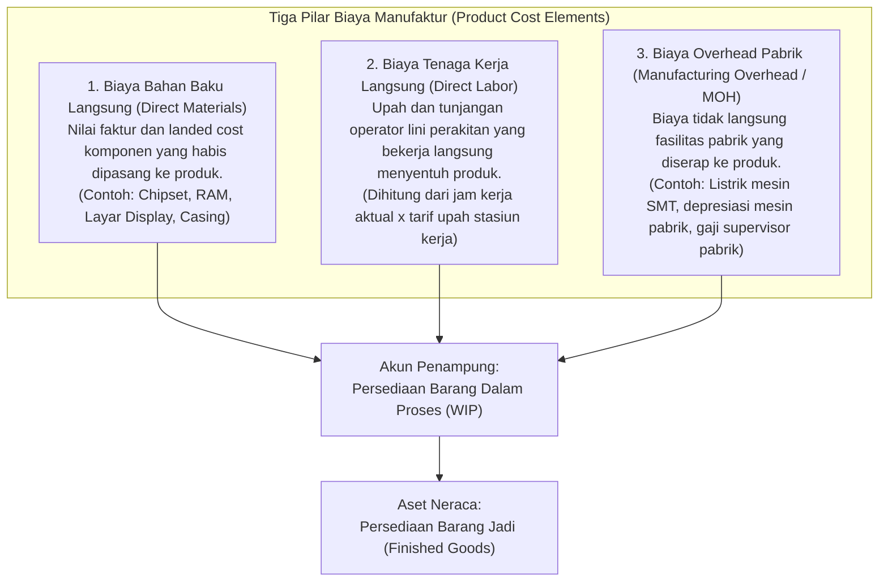
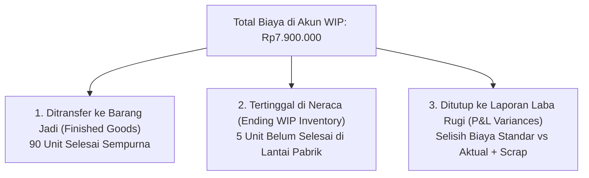

# Production Costing and Work in Process (WIP)

## Definition

**Production Costing and Work in Process (WIP)** adalah cabang dari akuntansi biaya (*cost accounting*) dan manajemen manufaktur dalam ERP yang mengakumulasikan, mengalokasikan, dan menilai seluruh komponen biaya produksi yang terjadi selama proses konversi bahan baku menjadi produk jadi—mulai dari bahan baku langsung (*Direct Materials*), upah tenaga kerja langsung (*Direct Labor*), hingga biaya overhead pabrik (*Manufacturing Overhead*).

Persediaan **Barang Dalam Proses (*Work in Process / WIP*)** mencerminkan nilai moneter dari seluruh material dan biaya konversi yang telah dikeluarkan dari gudang penyimpanan dan saat ini sedang berada di stasiun kerja lantai pabrik, namun belum selesai dirakit menjadi produk jadi pada tanggal penutupan periode akuntansi.

---

## Struktur Biaya Produk Menurut Standar Akuntansi (IAS 2)

Sesuai dengan standar akuntansi internasional **IAS 2 (*Inventories*) Paragraf 12**, biaya perolehan persediaan manufaktur wajib mencakup seluruh biaya yang dikeluarkan untuk membawa persediaan ke lokasi dan kondisi saat ini:

$$\mathbf{\text{Biaya Pokok Produksi} = \text{Bahan Baku Langsung} + \text{Tenaga Kerja Langsung} + \text{Overhead Pabrik Dialokasikan}}$$



---

## Model Penetapan Biaya Manufaktur: Standard vs. Actual Costing

Sistem ERP mendukung dua pendekatan filosofis utama dalam akuntansi biaya produksi:

| Karakteristik | Standard Costing (Biaya Standar) | Actual Costing (Biaya Aktual) |
| :--- | :--- | :--- |
| **Dasar Penilaian Unit** | Nilai barang jadi dipatok di awal tahun berdasarkan perhitungan teknis standar (*BOM Cost Roll-up*). | Nilai barang jadi dihitung berdasarkan biaya riil bahan dan jam kerja aktual yang benar-benar terserap. |
| **Penanganan Selisih Biaya** | Selisih antara biaya aktual dan standar langsung diakui sebagai **Varians Produksi (*Production Variances*)** di Laporan Laba Rugi pada saat penutupan pesanan. | Seluruh variasi biaya riil diserap langsung ke dalam nilai persediaan akhir barang jadi (*Moving Average Unit Cost berubah*). |
| **Kelebihan Utama** | Menghilangkan distorsi fluktuasi biaya harian; memfasilitasi evaluasi efisiensi manajerial; harga pokok stabil untuk perencanaan harga jual komersial. | Mencerminkan biaya historis 100% tanpa perlu melakukan penyesuaian varians akhir bulan. |
| **Kelemahan** | Menuntut pembaruan standar biaya secara berkala dan analisis varians bulanan (*variance analysis*). | Biaya per unit produk jadi dapat berfluktuasi drastis antar-batch akibat jam lembur operator atau lonjakan harga bahan baku jangka pendek. |

---

## Analisis Numerik Kanonikal: Akumulasi Biaya dan Penilaian WIP

Untuk memahami bagaimana ERP melacak akumulasi biaya dan membagi nilai antara Barang Jadi dan WIP akhir periode, perhatikan skenario berikut:

### 1. Parameter Pesanan Produksi (Manufacturing Order `MO-2026-0042`):
* **Target Produksi**: 100 unit Laptop Pro.
* **Standar Estimasi Biaya (Standard Costing)**:
  * Biaya Bahan Baku Langsung (*Direct Materials*): Rp5.000.000 (@ Rp50.000/unit).
  * Biaya Tenaga Kerja Langsung (*Direct Labor*): Rp1.500.000 (@ Rp15.000/unit).
  * Biaya Overhead Pabrik (*Manufacturing Overhead*): Rp1.000.000 (@ Rp10.000/unit).
  * **Total Biaya Standar Estimasi**: **Rp7.500.000** (atau **Rp75.000/unit**).

---

### 2. Realitas Eksekusi Lapangan Sepanjang Periode Berjalan:
* **Bahan Baku Dikeluarkan (Material Issue)**:
  Seluruh komponen untuk 100 unit dikeluarkan dari gudang. Karena terjadi pemborosan material (*over-consumption*), bahan baku yang terpakai bernilai **Rp5.200.000** (terjadi selisih bahan +Rp200.000).
* **Jam Kerja Operator Dicatat (Labor Confirmation)**:
  Operator mencatat 110 jam kerja dengan total biaya riil **Rp1.650.000** (terjadi selisih tenaga kerja +Rp150.000).
* **Overhead Diserap (Machine Overhead Absorption)**:
  Overhead diserap berdasarkan jam mesin aktual sebesar **Rp1.050.000** (selisih overhead +Rp50.000).
* **Total Biaya Aktual yang Masuk ke Akun WIP**:
  $$\text{Total Debet Akun WIP} = \text{Rp}5.200.000 + \text{Rp}1.650.000 + \text{Rp}1.050.000 = \mathbf{\text{Rp}7.900.000}$$

---

### 3. Status Fisik pada Akhir Periode (Cut-off):
Di akhir bulan berjalan, saat laporan keuangan bulanan ditutup:
1. **Selesai Sempurna (*Completed Good Output*)**: **90 unit** lolos uji QC dan ditransfer ke gudang barang jadi.
2. **Cacat Permanen (*Normal Scrap*)**: **5 unit** mengalami kerusakan fatal pada tahapan perakitan sasis.
3. **Masih Dalam Proses (*Ending WIP*)**: **5 unit** masih berada di meja kerja stasiun perakitan (telah menyerap 100% bahan baku, namun baru menyelesaikan 50% tahapan tenaga kerja dan overhead).



---

### 4. Perhitungan Penilaian Barang Jadi dan Ending WIP:

#### A. Penilaian Unit Ekuivalen (*Equivalent Units of Production - EUP*):
Untuk menilai 5 unit yang belum selesai di lantai kerja:
* *Material (100% selesai)*: $5 \text{ unit} \times \text{Rp}50.000 = \text{Rp}250.000$.
* *Tenaga Kerja & Overhead (50% selesai)*: $5 \text{ unit} \times 50\% \times (\text{Rp}15.000 + \text{Rp}10.000) = 2,5 \text{ unit ekuivalen} \times \text{Rp}25.000 = \text{Rp}62.500$.
* **Nilai Saldo Akhir Persediaan WIP di Neraca**: $\text{Rp}250.000 + \text{Rp}62.500 = \mathbf{\text{Rp}312.500}$.

#### B. Penilaian Barang Jadi yang Ditransfer (90 Unit):
Berdasarkan biaya standar:
$$\text{Transfer ke Finished Goods} = 90 \text{ unit} \times \text{Rp}75.000 = \mathbf{\text{Rp}6.750.000}$$

#### C. Perhitungan dan Penutupan Varians Biaya Produksi:
* Total Biaya Masuk WIP = Rp7.900.000.
* Dikurangi Transfer ke Finished Goods = (Rp6.750.000).
* Dikurangi Saldo Akhir WIP di Neraca = (Rp312.500).
* **Sisa Saldo Varians yang Ditutup ke P&L**:
  $$\text{Total Unfavorable Variance} = \text{Rp}7.900.000 - \text{Rp}6.750.000 - \text{Rp}312.500 = \mathbf{\text{Rp}837.500}$$
  *(Rincian varians: Pemborosan Bahan Rp200.000 + Kelebihan Jam Kerja Rp150.000 + Selisih Overhead Rp50.000 + Biaya 5 Unit Scrap Rp437.500 = Rp837.500)*.

---

### 5. Jurnal Akuntansi Finansial Terpadu (Perpetual Inventory)

| Tahap Transaksi | Debit (Rp) | Kredit (Rp) | Keterangan Jurnal |
| :--- | ---:| ---:| :--- |
| **Pengeluaran Bahan ke Pabrik** | | | |
| *(Dr)* Persediaan Barang Dalam Proses (WIP — Material) | 5.200.000 | - | Memindahkan aset bahan baku ke WIP. |
| *(Cr)* Persediaan Bahan Baku (*Raw Materials*) | - | 5.200.000 | Saldo persediaan gudang berkurang. |
| **Penyerapan Biaya Konversi** | | | |
| *(Dr)* Persediaan Barang Dalam Proses (WIP — Labor) | 1.650.000 | - | Menyerahkan biaya upah kerja ke WIP. |
| *(Cr)* Beban Tenaga Kerja Langsung Dialokasikan | - | 1.650.000 | Akun kontra beban operasional. |
| *(Dr)* Persediaan Barang Dalam Proses (WIP — Overhead) | 1.050.000 | - | Menyerahkan biaya mesin ke WIP. |
| *(Cr)* Beban Overhead Pabrik Dialokasikan | - | 1.050.000 | Akun kontra beban operasional. |
| **Penerimaan 90 Unit Barang Jadi** | | | |
| *(Dr)* Persediaan Barang Jadi (*Finished Goods*) | 6.750.000 | - | Menambah aset barang jadi di neraca. |
| *(Cr)* Persediaan Barang Dalam Proses (WIP) | - | 6.750.000 | Mengurangi saldo WIP sebesar unit selesai. |
| **Penutupan Akhir Bulan (Variance Settlement)** | | | |
| *(Dr)* Beban Selisih Biaya Manufaktur (*Production Variance*) | 837.500 | - | Dibebankan ke Laporan Laba Rugi. |
| *(Cr)* Persediaan Barang Dalam Proses (WIP) | - | 837.500 | Menutup sisa saldo selisih pada akun WIP. |

*Hasil Akhir Neraca*: Saldo akhir akun WIP persis sebesar **Rp312.500** (mencerminkan 5 unit belum selesai), akun Barang Jadi bertambah **Rp6.750.000**, dan laporan laba rugi mengakui beban inefisiensi produksi sebesar **Rp837.500**.

---

## ERP Implementation Comparison

| Aspek | Odoo Enterprise | ERPNext | Microsoft Dynamics 365 SCM |
| :--- | :--- | :--- | :--- |
| **Model Akun WIP** | Menggunakan akun *Stock Interim (Production)* atau *WIP Account* yang dikonfigurasi pada Product Category. | Menggunakan akun penampung *Work In Progress - Company* yang terhubung ke dokumen Stock Entry. | Menggunakan kelompok akun pembebanan formal: *WIP issue, WIP labor, WIP machine, WIP indirect cost*. |
| **Penyelesaian Varians** | Pada metode AVCO, selisih biaya langsung menambah nilai rata-rata unit; pada Standard Costing dialokasikan ke akun Price Variance. | Selisih biaya operasional dialokasikan ke *Cost of Goods Sold* atau akun penyesuaian biaya persediaan. | Memiliki proses bulanan formal: **Inventory Close and Cost Recalculation** yang merekonsiliasi seluruh lapisan biaya WIP dan Varians ke GL. |
| **Penilaian Unit Ekuivalen (EUP)** | Dihitung otomatis berdasarkan persentase penyelesaian Work Order yang dilaporkan di Shop Floor App. | Memerlukan input manual estimasi penyelesaian atau pencatatan transfer parsial. | Sangat canggih: Modul *Cost Accounting* mendukung pemodelan formula alokasi biaya berbasis *Cost Objects* dan *Cost Element Dimensions*. |

---

## Naventra Consideration

Untuk perancangan modul Akuntansi Biaya Manufaktur pada sistem ERP enterprise seperti **Naventra**:

1. **Skema Database Akumulasi Biaya Pesanan Produksi (Cost Ledgers)**:
   ```sql
   CREATE TABLE mo_cost_accumulations (
       id UUID PRIMARY KEY DEFAULT gen_random_uuid(),
       manufacturing_order_id UUID NOT NULL REFERENCES manufacturing_orders(id),
       cost_category VARCHAR(30) NOT NULL, -- 'DIRECT_MATERIAL', 'DIRECT_LABOR', 'MACHINE_OVERHEAD', 'SUBCONTRACT'
       standard_cost_amount NUMERIC(18, 4) NOT NULL DEFAULT 0,
       actual_cost_amount NUMERIC(18, 4) NOT NULL DEFAULT 0,
       variance_amount NUMERIC(18, 4) GENERATED ALWAYS AS (actual_cost_amount - standard_cost_amount) STORED,
       gl_wip_account_id UUID NOT NULL REFERENCES chart_of_accounts(id),
       gl_variance_account_id UUID REFERENCES chart_of_accounts(id),
       updated_at TIMESTAMP WITH TIME ZONE DEFAULT NOW()
   );
   ```
2. **Kalkulasi Otomatis Ending WIP pada Penutupan Periode**:
   Sediakan prosedur akhir bulan yang memindai seluruh MO berstatus `IN_PROGRESS`. Sistem menghitung nilai `ending_wip_value` berdasarkan material yang telah di-issue dikurangi proporsi unit yang telah di-*receipt*, memastikan neraca keuangan mencerminkan nilai aset yang sah sebelum pembukuan ditutup.
3. **Pemberlakuan Kunci Mutasi Pasca Financial Close**:
   Segera setelah status MO berubah menjadi `CLOSED`, backend wajib memblokir seluruh upaya posting baru (baik material issue, timesheet labor, maupun penyesuaian tambahan) untuk menjamin integritas laporan keuangan audit.

---

## References

- IFRS Foundation. *IAS 2: Inventories (Paragraphs 12-14: Costs of Conversion and Allocation of Overhead)*.
- Horngren, C. T., Datar, S. M., & Rajan, M. V. *Cost Accounting: A Managerial Emphasis*. Pearson.
- ASCM / APICS. *APICS Dictionary: Work in Process (WIP), Equivalent Units of Production, and Cost Absorption*.
- Microsoft Learn. *Production Order Costing and Inventory Close in Dynamics 365 Supply Chain Management*.
- Frappe ERPNext Documentation. *Work-in-Progress Valuation and Production Costing*.
- Odoo 17 Documentation. *Manufacturing Cost Valuation and Work Center Hourly Rates*.
