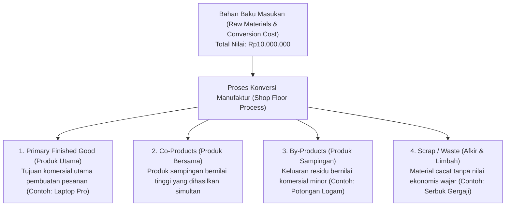
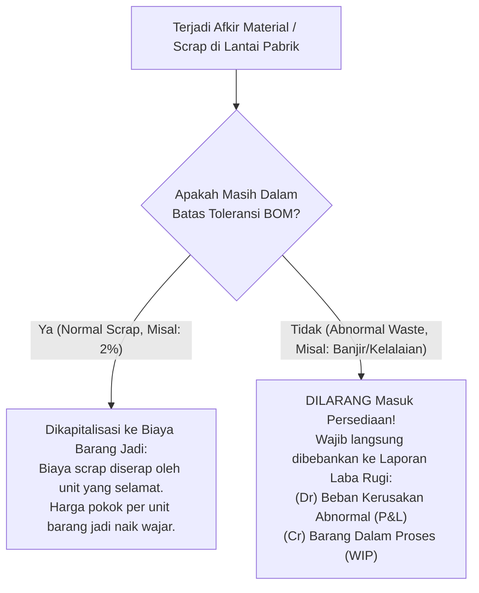

# Production Output, Co-Products, and By-Products

## Definition

**Production Output, Co-Products, and By-Products** adalah kerangka kerja dalam sistem ERP yang mengelola dan mencatat seluruh hasil fisik yang keluar dari proses manufaktur—mulai dari barang jadi utama (*Primary Finished Goods*), produk bersama bernilai setara (*Co-Products*), produk sampingan bernilai rendah (*By-Products*), hingga limbah pembuangan dan barang afkir (*Scrap & Waste*).

Dalam dunia nyata, proses manufaktur jarang sekali menghasilkan 100% barang jadi sempurna tanpa sisa. Proses pemotongan pelat baja menghasilkan sisa potongan besi (*metal scrap*), pemurnian minyak mentah menghasilkan bensin, solar, dan aspal secara simultan, serta perakitan elektronik menghasilkan unit afkir yang gagal uji kendali mutu (*defective rejects*). Sistem ERP wajib memodelkan seluruh spektrum output ini secara akurat untuk memastikan pencatatan persediaan fisik yang presisi dan alokasi biaya pokok produksi yang adil.

---

## Spektrum Hasil Keluaran Manufaktur (Manufacturing Output Spectrum)

Hubungan antara bahan baku masukan (*input*) dengan variasi keluaran (*outputs*) dimodelkan sebagai berikut:



---

## Karakteristik dan Perlakuan Akuntansi Setiap Tipe Keluaran

Sistem ERP membedakan perlakuan persediaan dan akuntansi biaya berdasarkan kategori output:

| Tipe Keluaran | Karakteristik Komersial | Perlakuan Mutasi Persediaan Gudang | Metode Alokasi Biaya Produksi (Costing Treatment) |
| :--- | :--- | :--- | :--- |
| **Primary Output** | Produk utama yang ditargetkan dalam pesanan penjualan (*Sales Order*). | Menambah saldo persediaan barang jadi di gudang (*Finished Goods Warehouse*). | Menyerap porsi biaya terbesar dari total akumulasi biaya di akun WIP. |
| **Co-Product** | Produk yang keluar bersamaan dan memiliki nilai komersial substansial yang sebanding dengan produk utama. | Diberi kode SKU mandiri; menambah stok barang jadi sebagai entitas persediaan resmi. | **Joint Cost Allocation**: Biaya dibagi proporsional menggunakan metode nilai jual relatif (*Relative Sales Value*) atau bobot fisik (*Physical Measure*). |
| **By-Product** | Residu atau hasil turunan tak terhindarkan yang bernilai komersial rendah (dapat dijual sebagai barang bekas/limbah). | Dilacak kuantitas fisiknya di gudang penampungan barang sisa (*Scrap Yard*). | **Net Realizable Value (NRV) Credit**: Estimasi nilai pasar bersih by-product **dikreditkan sebagai pengurang biaya produk utama** di akun WIP. |
| **Scrap / Reject** | Komponen cacat, pecah, atau potongan kecil yang tidak dapat digunakan kembali dan tidak memiliki nilai jual material. | Dikeluarkan dari pesanan produksi; dipindahkan ke lokasi afkir (*Scrap Location*). | Nilai biaya bahan yang hangus **tetap terserap di dalam biaya produk utama yang berhasil lolos** (menaikkan biaya per unit produk jadi). |

---

## Metrik Efisiensi Produksi: Yield vs. Scrap Rate

Dalam mengevaluasi keandalan proses manufaktur, ERP menghitung indikator hasil secara matematis:

### 1. Production Yield (Rasio Keberhasilan Produksi)
Persentase bahan atau unit yang berhasil diubah menjadi produk jadi yang memenuhi standar kualitas:

$$\mathbf{\text{Yield (\%)} = \frac{\text{Actual Good Output}}{\text{Planned Output}} \times 100\%}$$

* *Contoh*: Manufacturing Order menargetkan 100 unit Laptop Pro. Di akhir lini perakitan, 96 unit dinyatakan lolos uji QC, 4 unit dinyatakan cacat permanen (*scrap*).
$$\text{Yield} = \frac{96}{100} \times 100\% = \mathbf{96\%}$$

### 2. Scrap Rate (Tingkat Kehilangan / Afkir)
Persentase material yang terbuang selama proses pengerjaan:

$$\mathbf{\text{Scrap Rate (\%)} = \frac{\text{Scrapped Quantity}}{\text{Total Input Quantity}} \times 100\%} = \frac{4}{100} \times 100\% = \mathbf{4\%}$$

---

## Mekanisme Alokasi Biaya: Co-Products vs. By-Products

Untuk memahami dampak finansialnya di buku besar akuntansi, perhatikan perbandingan dua skenario manufaktur berikut:

### Skenario A: Perlakuan By-Product (Pengurang Biaya Pokok)
* **Kasus**: Pemotongan pelat casing laptop menghasilkan 100 unit sasis laptop utama dan 50 Kg potongan sisa aluminium (*by-product*).
* Total biaya produksi yang terakumulasi di akun WIP = **Rp10.000.000**.
* Potongan sisa aluminium dapat dijual ke pengepul daur ulang seharga Rp10.000/Kg (Total nilai realisasi = **Rp500.000**).
* **Perlakuan Finansial**:
  * Nilai by-product mengurangi beban biaya produk utama:
    $$\text{Beban Bersih Sasis Utama} = \text{Rp}10.000.000 - \text{Rp}500.000 = \mathbf{\text{Rp}9.500.000}$$
    $$\text{Biaya Pokok per Unit Sasis} = \frac{\text{Rp}9.500.000}{100 \text{ unit}} = \mathbf{\text{Rp}95.000/\text{unit}}$$
* **Jurnal Finansial Penerimaan Hasil (Perpetual)**:
  * *(Dr)* Persediaan Barang Jadi (Sasis Laptop): **Rp9.500.000**
  * *(Dr)* Persediaan Produk Sampingan (Aluminium Scrap): **Rp500.000**
  * *(Cr)* Persediaan Barang Dalam Proses (*WIP*): **Rp10.000.000**

---

### Skenario B: Perlakuan Scrap Normal vs. Abnormal (IAS 2)
Standar akuntansi internasional **IAS 2 (*Inventories*) Paragraf 16** membedakan secara tegas antara penyusutan wajar (*normal scrap*) dan pemborosan di luar batas wajar (*abnormal waste*):



---

## ERP Implementation Comparison

| Aspek | Odoo Enterprise | ERPNext | Microsoft Dynamics 365 SCM |
| :--- | :--- | :--- | :--- |
| **Konfigurasi By-Products** | Tab khusus *By-products* pada formulir BOM: mendefinisikan produk turunan, kuantitas per unit, dan lokasi penyimpanan target. | Tabel anak *Scrap Item* pada dokumen BOM atau penerbitan dokumen *Stock Entry* bertipe scrap. | Konfigurasi formal pada formulir *Formula / BOM*: tab **Co-products and By-products** dengan metode alokasi biaya. |
| **Metode Alokasi Biaya Bersama** | Nilai biaya dialokasikan berdasarkan persentase biaya (*Cost Share %*) yang dikonfigurasi pada baris by-product. | Nilai scrap dialokasikan sebagai pengurang biaya produksi dasar secara otomatis. | Sangat komprehensif: Mendukung metode alokasi joint-cost tingkat lanjut (*TCA - Total Cost Allocation*, *Relative Sales Value*, *Physical Quantity*). |
| **Pencatatan Scrap di Shop Floor** | Tombol khusus *Scrap* pada antarmuka *Work Order* lantai kerja yang memindahkan barang ke lokasi afkir sistemik. | Tombol *Scrap Item* pada Work Order yang memotong saldo material dari proses manufaktur. | Menggunakan jurnal afkir khusus: **Scrap Journal** atau pelaporan afkir langsung pada layar kartu rute (*Route Card*). |

---

## Naventra Consideration

Untuk perancangan modul Hasil Produksi dan By-Products pada sistem ERP enterprise seperti **Naventra**:

1. **Skema Database Hasil Produksi Multi-Output**:
   ```sql
   CREATE TABLE mo_production_outputs (
       id UUID PRIMARY KEY DEFAULT gen_random_uuid(),
       manufacturing_order_id UUID NOT NULL REFERENCES manufacturing_orders(id),
       output_type VARCHAR(20) NOT NULL, -- 'PRIMARY_FG', 'CO_PRODUCT', 'BY_PRODUCT', 'SCRAP'
       item_id UUID NOT NULL REFERENCES items(id),
       target_warehouse_id UUID NOT NULL REFERENCES warehouses(id),
       target_storage_location_id UUID REFERENCES storage_locations(id),
       lot_number VARCHAR(100),
       serial_number VARCHAR(100),
       
       quantity_completed NUMERIC(15, 4) NOT NULL,
       cost_allocation_pct NUMERIC(5, 2) NOT NULL DEFAULT 100.00, -- Persentase alokasi biaya WIP
       unit_cost NUMERIC(18, 4) NOT NULL,
       total_value NUMERIC(18, 4) GENERATED ALWAYS AS (quantity_completed * unit_cost) STORED,
       
       received_at TIMESTAMP WITH TIME ZONE DEFAULT NOW()
   );
   ```
2. **Pemberlakuan Batas Alokasi Biaya Total (100% Cost Rule)**:
   Backend wajib memvalidasi bahwa total persentase alokasi biaya gabungan antara produk utama dan seluruh co-products tepat sama dengan 100%:
   $$\sum \text{cost\_allocation\_pct} = 100,00\%$$
3. **Pemisahan Jalur Penerimaan Fisik**:
   Sediakan otomatisasi penentuan lokasi gudang target: baris bertipe `PRIMARY_FG` dialokasikan ke *Finished Goods Warehouse*, sedangkan baris bertipe `SCRAP` secara otomatis diarahkan ke *Quarantine/Scrap Yard* agar tidak bercampur dengan stok komersial.

---

## References

- IFRS Foundation. *IAS 2: Inventories (Paragraph 14: Joint Products, Co-Products, and By-Products Cost Allocation)*.
- ASCM / APICS. *APICS Dictionary: Co-Products, By-Products, Scrap Factor, and Production Yield Metrics*.
- Microsoft Learn. *Co-products and By-products Architecture in Dynamics 365 Supply Chain Management*.
- Frappe ERPNext Documentation. *Managing Scrap and By-products in Manufacturing*.
- Odoo 17 Documentation. *By-products Management and Finished Goods Registration*.
