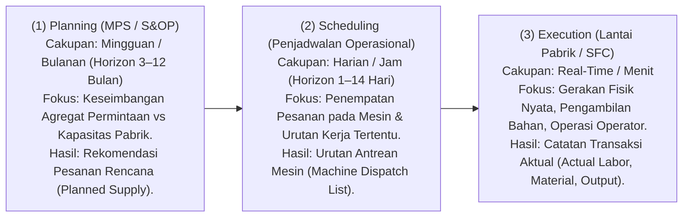
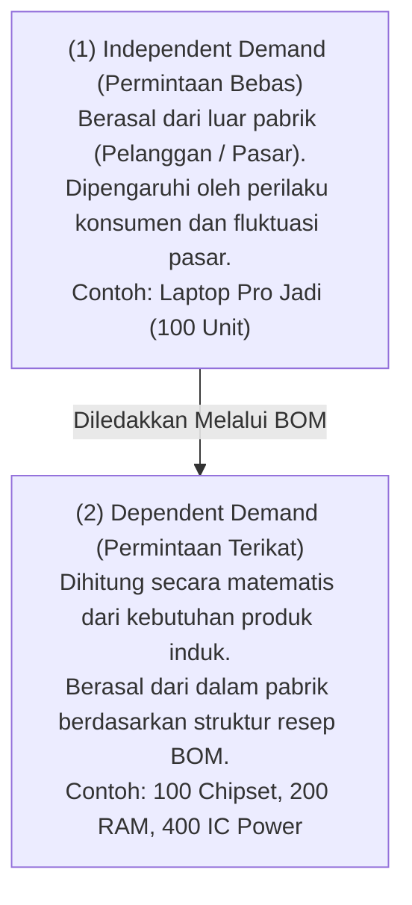
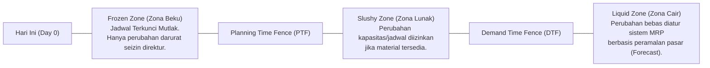

# Production Planning and Master Production Scheduling (MPS)

## Definition

**Production Planning and Master Production Scheduling (MPS)** adalah disiplin perencanaan tingkat menengah (*tactical planning*) dalam sistem ERP yang menguraikan agregat rencana bisnis organisasi ke dalam jadwal produksi spesifik untuk setiap produk jadi (*finished good*)—menentukan **apa yang harus diproduksi, berapa jumlahnya, dan kapan harus diselesaikan** dalam setiap ember waktu mingguan atau harian (*time buckets*).

Rencana produksi bukan sekadar angan-angan target penjualan, melainkan jembatan terkalibrasi yang menyeimbangkan permintaan pasar (*Market Demand*) dengan kapasitas fisik pabrik (*Plant Capacity*) serta ketersediaan modal kerja perusahaan.

---

## Perbedaan Krusial: Planning vs. Scheduling vs. Execution

Dalam sistem ERP enterprise, pengelolaan produksi dipisahkan ke dalam tiga cakupan waktu (*time horizons*) dan fungsi yang berbeda:



> [!important]
> **Planning Output Is a Recommendation, Not Execution**:
> Hasil dari modul Production Planning atau MPS adalah **usulan pasokan (*Planned Orders / Suggested MOs*)**. Dokumen rencana ini **belum bernilai hukum atau operasional** dan **tidak memotong stok di gudang**. Rencana baru berubah menjadi komitmen fisik saat disetujui dan dialihkan (*firmed / released*) menjadi dokumen [[06-manufacturing/manufacturing-order|Manufacturing Order]].

---

## Sumber Permintaan: Independent vs. Dependent Demand

ERP mengklasifikasikan kebutuhan material ke dalam dua kategori mendasar:



* **Independent Demand**: Dikelola oleh modul **Sales & Marketing** melalui kombinasi Pesanan Penjualan pasti ([[03-sales/sales-order|Sales Order]]) dan Prakiraan Penjualan statistik (*Demand Forecasting*). Independent Demand menjadi input utama bagi **Master Production Schedule (MPS)**.
* **Dependent Demand**: Dihitung secara deterministik oleh mesin **Material Requirements Planning (MRP)** (lihat [[06-manufacturing/mrp-material-requirement-planning|MRP]]) berdasarkan struktur hierarkis [[06-manufacturing/product-structure-and-bom|Bill of Materials]].

---

## Konsep Zona Waktu dan Pembatas Perencanaan (Planning Time Fences)

Untuk mencegah kekacauan operasional akibat perubahan pesanan penjualan pelanggan di menit-menit terakhir (*schedule nervousness*), ERP enterprise membagi garis waktu masa depan menjadi zona-zona perlindungan (*Time Fences*):



### Karakteristik Zona Waktu:
1. **Frozen Zone (Di dalam PTF)**:
   Pesanan produksi telah dirilis (*Released*) ke lantai pabrik atau bahan baku khusus telah dipotong. Sistem ERP secara otomatis memblokir modul perencanaan untuk membatalkan atau menggeser pesanan pada zona ini.
2. **Slushy Zone (Antara PTF dan DTF)**:
   Pesanan produksi berstatus terencana (*Planned/Scheduled*). Perubahan kuantitas atau jadwal dapat disetujui secara manual oleh Manajer Perencanaan Produksi (*Master Scheduler*) setelah memverifikasi ketersediaan bahan baku.
3. **Liquid Zone (Di luar DTF)**:
   Horizon perencanaan jangka panjang. Algoritma ERP bebas menjadwalkan ulang atau membangkitkan pesanan rencana baru secara otomatis setiap malam saat proses kalkulasi MRP dijalankan.

---

## Aturan Penentuan Ukuran Lot (Lot-Sizing Rules)

Dalam menyusun rencana produksi, kuantitas pesanan yang disarankan oleh sistem ditentukan oleh kebijakan ukuran lot (*Lot-Sizing Policy*):

| Kebijakan Lot Sizing | Logika Perhitungan | Kapan Tepat Digunakan? | Dampak Finansial & Persediaan |
| :--- | :--- | :--- | :--- |
| **Lot-for-Lot (L4L)** | Menghasilkan pesanan rencana dengan kuantitas tepat sama dengan kebutuhan bersih periode tersebut ($\text{Order Qty} = \text{Net Requirement}$). | Lingkungan *Make-to-Order*, komponen bernilai sangat mahal, atau barang yang mudah rusak. | Biaya penyimpanan stok minimal (*zero holding stock*), namun biaya frekuensi penyetelan mesin (*setup cost*) tinggi. |
| **Fixed Order Quantity (FOQ)** | Setiap kali memesan, kuantitas selalu dalam jumlah tetap yang telah disepakati (misal: kelipatan 100 unit atau kapasitas 1 truk kontainer). | Pembelian komponen curah atau kapasitas oven/tangki produksi yang memiliki ukuran fisik baku. | Terjadi sisa persediaan di gudang jika kebutuhan riil di bawah kuantitas tetap. |
| **Economic Order Quantity (EOQ)** | Menghitung ukuran lot optimal yang menyeimbangkan antara biaya penyiapan (*setup cost*) dengan biaya simpan persediaan (*holding cost*). | Produk Make-to-Stock dengan laju konsumsi permintaan yang relatif stabil sepanjang tahun. | Meminimalkan total biaya operasional tahunan secara matematis. |
| **Period Order Quantity (POQ)** | Menggabungkan kebutuhan bersih dari beberapa periode ember waktu (misal: kebutuhan 2 minggu ke depan digabung menjadi satu pesanan produksi). | Komponen berbiaya murah yang dipesan secara berkala untuk memangkas biaya administrasi. | Menghaluskan beban administrasi pesanan dengan sedikit tambahan stok pengaman. |

---

## Alur Logika Perhitungan Master Production Schedule (MPS)

Tabel berikut mengilustrasikan kisi-kisi kalkulasi MPS standar untuk produk jadi Laptop Pro:

* **Parameter Produk**: Saldo Awal Gudang = 30 unit; Stok Pengaman (*Safety Stock*) = 10 unit; Aturan Lot Size = Fixed 50 unit; Lead Time = 1 Minggu.

| Parameter Grid MPS | Minggu 1 (Frozen) | Minggu 2 (Frozen) | Minggu 3 (Slushy) | Minggu 4 (Liquid) | Minggu 5 (Liquid) |
| :--- | :---: | :---: | :---: | :---: | :---: |
| **Prakiraan Penjualan (*Forecast*)** | 20 | 25 | 30 | 35 | 40 |
| **Pesanan Pasti (*Customer Orders*)** | **28** | **20** | 15 | 8 | 0 |
| **Kebutuhan Efektif ($\max(\text{FC}, \text{SO})$)** | **28** | **25** | **30** | **35** | **40** |
| **Penerimaan Terjadwal (*Scheduled Receipts*)** | 0 | 50 | 0 | 0 | 0 |
| **Proyeksi Saldo Stok (*Projected Available*)** | $30 - 28 = \mathbf{2}$ | $2 + 50 - 25 = \mathbf{27}$ | $27 - 30 = \mathbf{-3} \implies \text{Defisit!}$ | $47 - 35 = \mathbf{12}$ | $12 - 40 = \mathbf{-28} \implies \text{Defisit!}$ |
| **Penerimaan Rencana (*MPS Receipts*)** | 0 | 0 | **50** (Picu Lot) | 0 | **50** (Picu Lot) |
| **Proyeksi Akhir Bersih** | **2** | **27** | $27 + 50 - 30 = \mathbf{47}$ | **12** | $12 + 50 - 40 = \mathbf{22}$ |
| **Pelepasan Rencana (*MPS Start / Release*)** | 0 | **50** (Mulai Mgg 2) | 0 | **50** (Mulai Mgg 4) | 0 |

*Penjelasan*: Pada Minggu 3, proyeksi stok turun di bawah batas Safety Stock (10 unit) menjadi -3. Sistem MPS secara otomatis merekomendasikan penerimaan rencana (*MPS Receipt*) sebesar 50 unit pada awal Minggu 3, yang berarti produksi harus dimulai (*MPS Start*) pada Minggu 2 dengan memperhitungkan waktu pengerjaan pabrik (*lead time*) selama 1 minggu.

---

## ERP Implementation Comparison

| Aspek | Odoo Enterprise | ERPNext | Microsoft Dynamics 365 SCM |
| :--- | :--- | :--- | :--- |
| **Arsitektur Perencanaan** | Menggunakan modul *Master Production Schedule (MPS)* terintegrasi dengan baris produk, target persediaan bulanan, dan tombol *Replenish*. | Menggunakan dokumen formal `Production Plan` yang dapat memuat permintaan dari Sales Order dan Material Request. | Menggunakan mesin canggih **Planning Optimization Service** (arsitektur cloud in-memory terpisah untuk kalkulasi cepat). |
| **Dukungan Time Fence** | Dikelola melalui konfigurasi *Security Lead Time* dan rute pengadaan pada level perusahaan atau produk. | Tidak memiliki konsep formal visual time fence default (mengandalkan filter tanggal pada Production Plan). | Sangat komprehensif: Konfigurasi *Coverage Groups* dengan parameter *Freeze time fence, Capacity time fence*, dan *Explosion time fence*. |
| **Pemisahan Forecast vs Actual Demand** | Kolom *Demand Forecast* vs *Indirect Sales Demand* pada kisi-kisi layar MPS. | Fitur *Demand Forecasting* yang dapat dimasukkan ke baris Production Plan. | Fitur formal *Demand Forecast Reduction Rules* (metode pengurangan forecast otomatis saat pesanan penjualan riil masuk). |

---

## Naventra Consideration

Untuk perancangan modul Production Planning pada sistem ERP enterprise seperti **Naventra**:

1. **Skema Database Perencanaan MPS**:
   ```sql
   CREATE TABLE master_production_schedules (
       id UUID PRIMARY KEY DEFAULT gen_random_uuid(),
       plan_code VARCHAR(50) NOT NULL UNIQUE,
       planning_horizon_start DATE NOT NULL,
       planning_horizon_end DATE NOT NULL,
       bucket_type VARCHAR(20) NOT NULL DEFAULT 'WEEKLY', -- 'DAILY', 'WEEKLY', 'MONTHLY'
       status VARCHAR(30) NOT NULL DEFAULT 'ACTIVE',
       created_at TIMESTAMP WITH TIME ZONE DEFAULT NOW()
   );

   CREATE TABLE mps_line_items (
       id UUID PRIMARY KEY DEFAULT gen_random_uuid(),
       schedule_id UUID NOT NULL REFERENCES master_production_schedules(id) ON DELETE CASCADE,
       product_id UUID NOT NULL REFERENCES items(id),
       warehouse_id UUID NOT NULL REFERENCES warehouses(id),
       time_bucket_date DATE NOT NULL,
       forecast_quantity NUMERIC(15, 4) NOT NULL DEFAULT 0,
       sales_order_quantity NUMERIC(15, 4) NOT NULL DEFAULT 0,
       projected_available_balance NUMERIC(15, 4) NOT NULL DEFAULT 0,
       mps_planned_receipt_qty NUMERIC(15, 4) NOT NULL DEFAULT 0,
       mps_planned_start_qty NUMERIC(15, 4) NOT NULL DEFAULT 0,
       is_firmed BOOLEAN NOT NULL DEFAULT FALSE
   );
   ```
2. **Kalkulasi Latar Belakang Asinkron (*Background Planning Engine*)**:
   Komputasi MPS dan perataan permintaan melibatkan ribuan baris data. Jalankan perhitungan pada *background worker* terpisah dan simpan hasilnya pada tabel `mps_line_items`, sehingga antarmuka pengguna dapat menampilkan kisi-kisi perencanaan (*planning matrix*) secara instan tanpa membebani thread transaksi utama.
3. **Mekanisme Firming Transaksional**:
   Sediakan tombol *Firm Order* pada kisi MPS yang secara atomik mengunci baris rencana (`is_firmed = TRUE`) dan mengubahnya menjadi draf pesanan resmi pada tabel `manufacturing_orders`.

---

## References

- ASCM / APICS. *Master Planning of Resources: Master Production Scheduling (MPS) and Demand Reduction Rules*.
- Vollmann, T. E., et al. *Manufacturing Planning and Control for Supply Chain Management: Master Production Scheduling Techniques*.
- Microsoft Learn. *Master Planning Optimization Architecture in Dynamics 365 Supply Chain Management*.
- Frappe ERPNext Documentation. *Production Plan and Demand Aggregation*.
- Odoo 17 Documentation. *Master Production Schedule (MPS) and Lead Times Configurations*.
