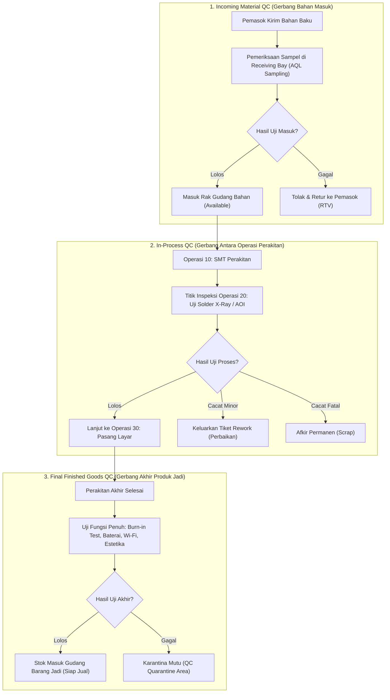
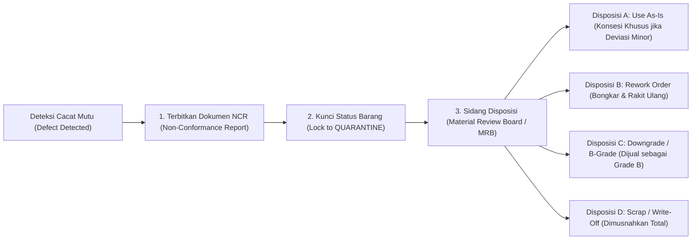

# Production Quality Control and Rework Management

## Definition

**Production Quality Control and Rework Management** adalah subsistem tata kelola mutu dalam ERP yang mengintegrasikan pengujian standar mutu teknis ke dalam seluruh tahapan manufaktur—mulai dari inspeksi bahan baku masuk (*Incoming QC*), pengujian titik kritis selama proses perakitan (*In-Process QC*), audit penerimaan akhir produk jadi (*Final Outgoing QC*), hingga penanganan produk tidak sesuai (*Non-Conformance / CAPA*), perbaikan ulang (*Rework*), atau pemusnahan (*Scrap*).

Kualitas bukan sekadar departemen independen, melainkan **gerbang validasi terintegrasi (*Quality Gates*)** yang mengontrol transisi status transaksi di sistem ERP: barang yang gagal uji mutu tidak diizinkan masuk ke rak persediaan siap jual ([[05-inventory/stock-quantity-and-availability|Available ATP]]), melainkan secara otomatis dialihkan ke status terkunci di area karantina (*Quality Hold*).

---

## Tiga Titik Gerbang Kendali Mutu Manufaktur (Quality Inspection Points)

Sistem ERP enterprise menanamkan titik-titik inspeksi (*Inspection Points*) sepanjang rantai pasok manufaktur:



---

## Tata Kelola Ketidaksesuaian Produk (Non-Conformance Management)

Ketika sebuah produk atau sampel gagal memenuhi parameter spesifikasi teknis, ERP memicu alur penanganan ketidaksesuaian (*Non-Conformance Report / NCR*):



---

## Manajemen Perbaikan Ulang (Rework Order Mechanics)

Ketika diputuskan bahwa unit yang cacat dapat diperbaiki secara teknis dan ekonomis (*economically viable*), sistem ERP mengeksekusi alur **Rework Order**:

### 1. Model Dokumen Rework:
* **Child Rework Order**: Pesanan produksi anak (*Sub-order*) yang ditautkan langsung ke Manufacturing Order induknya.
* **Stand-Alone Rework Order**: Pesanan produksi mandiri yang mengambil unit cacat dari gudang karantina sebagai bahan baku utama, dengan BOM khusus (hanya memuat komponen pengganti yang rusak) dan Routing perbaikan khusus.

### 2. Akuntansi Biaya Rework (Rework Costing):
Biaya tambahan yang timbul akibat proses pengerjaan ulang (komponen baru + jam kerja perbaikan) dapat ditangani melalui dua pendekatan kebijakan:
* **Penyerapan ke Produk Induk (*Cost Absorbed into Batch*)**:
  Total biaya perbaikan ditambahkan ke akun WIP pesanan induk, sehingga menaikkan biaya pokok per unit produk jadi batch tersebut.
* **Pembebanan Langsung ke Biaya Mutu (*Charged to Quality Expense*)**:
  Biaya perbaikan langsung dibukukan ke akun laba rugi sebagai **Beban Kegagalan Internal (*Internal Failure Cost*)**, agar biaya pokok standar produk jadi tidak terdistorsi oleh kesalahan operasional.

---

## Hubungan Erat dengan Ketertelusuran Nomor Seri (Serial Traceability)

Dalam manufaktur berteknologi tinggi (seperti pembuatan Laptop Pro), pengujian mutu terikat 1:1 dengan nomor seri unik (lihat [[05-inventory/lot-and-serial-number-tracking|Lot and Serial Number Tracking]]):

* **Digital Quality Passport**:
  Setiap nomor seri laptop (misal: `SN-LP-2026-0042`) memiliki paspor kualitas digital di dalam ERP yang merekam:
  * Suhu puncak prosesor saat uji *Burn-in Test* (misal: 68°C $\to$ Lulus).
  * Kapasitas riil baterai saat pengisian pertama (misal: 70,5 Wh $\to$ Lulus).
  * ID operator yang melakukan pengujian visual dan stempel digital inspektur QC.
* **Pencegahan Pengiriman Otomatis (*Outbound Quality Lock*)**:
  Jika nomor seri belum berstatus `QC_PASSED`, modul [[03-sales/delivery-and-shipping|Delivery Order]] secara otomatis memblokir pemindaian barcode saat pemuatan barang ke truk pengiriman, mencegah produk cacat sampai ke tangan pelanggan (*zero-defect fulfillment*).

---

## ERP Implementation Comparison

| Aspek | Odoo Enterprise | ERPNext | Microsoft Dynamics 365 SCM |
| :--- | :--- | :--- | :--- |
| **Arsitektur Modul Mutu** | Modul khusus **Quality**: Mendukung *Quality Points* pada operasi manufaktur, *Quality Checks* (Pass/Fail, Measure), dan dokumen *Quality Alerts*. | Dokumen formal `Quality Inspection` yang ditautkan ke Work Order atau Purchase Receipt, dengan tabel parameter pengujian terukur. | Modul tingkat industri: **Quality Management** dengan dokumen formal *Quality Orders*, *Item Sampling*, dan *Quality Associations*. |
| **Pemicu Inspeksi Otomatis** | Quality Point dapat dikonfigurasi untuk muncul otomatis saat operator membuka Work Order di Shop Floor App. | Checklist *Inspection Required* pada Item Master memicu kewajiban verifikasi sebelum dokumen produksi dapat disubmit. | Sistem otomatis membangkitkan *Quality Order* dan memindahkan status persediaan ke *Blocking / Quarantine* saat barang diproduksi. |
| **Tata Kelola Rework** | Membuat Manufacturing Order baru dengan tipe perbaikan (*Unbuild Order* atau *Repair Order*). | Memilih opsi *Is Rework* pada dokumen Work Order yang mereferensikan nomor seri barang cacat. | Fitur tingkat industri: **Rework Production Order** dengan perutean khusus dan pelacakan biaya kegagalan internal terpisah. |

---

## Naventra Consideration

Untuk perancangan modul Manajemen Mutu Manufaktur pada sistem ERP enterprise seperti **Naventra**:

1. **Skema Database Pemeriksaan Mutu Terintegrasi**:
   ```sql
   CREATE TABLE quality_inspection_orders (
       id UUID PRIMARY KEY DEFAULT gen_random_uuid(),
       inspection_number VARCHAR(50) NOT NULL UNIQUE,
       source_doc_type VARCHAR(50) NOT NULL, -- 'MANUFACTURING_ORDER', 'GOODS_RECEIPT'
       source_doc_id UUID NOT NULL,
       operation_id UUID REFERENCES routing_operations(id),
       item_id UUID NOT NULL REFERENCES items(id),
       lot_number VARCHAR(100),
       serial_number VARCHAR(100),
       inspected_quantity NUMERIC(15, 4) NOT NULL,
       passed_quantity NUMERIC(15, 4) NOT NULL DEFAULT 0,
       failed_quantity NUMERIC(15, 4) NOT NULL DEFAULT 0,
       inspection_result VARCHAR(20) NOT NULL DEFAULT 'PENDING', -- 'PENDING', 'PASSED', 'FAILED'
       inspector_user_id UUID REFERENCES users(id),
       inspected_at TIMESTAMP WITH TIME ZONE,
       created_at TIMESTAMP WITH TIME ZONE DEFAULT NOW()
   );

   CREATE TABLE quality_inspection_parameters (
       id UUID PRIMARY KEY DEFAULT gen_random_uuid(),
       inspection_order_id UUID NOT NULL REFERENCES quality_inspection_orders(id) ON DELETE CASCADE,
       parameter_name VARCHAR(100) NOT NULL, -- Contoh: 'Tegangan Baterai (Volt)', 'Suhu CPU (C)'
       specification_min NUMERIC(12, 4),
       specification_max NUMERIC(12, 4),
       actual_reading NUMERIC(12, 4),
       is_passed BOOLEAN NOT NULL
   );
   ```
2. **Quality Gate Hook pada Output Confirmation**:
   Backend wajib menolak pemindahan status kuantitas ke `Available ATP` jika `quality_inspection_orders` yang ditautkan belum berstatus `PASSED`. Kuantitas yang gagal uji secara otomatis diarahkan ke tabel `inventory_balances` dengan status `quarantine_qty`.
3. **Penyediaan Alur Otomasi Dokumen NCR**:
   Saat `failed_quantity > 0`, sistem secara otomatis menerbitkan draft dokumen *Non-Conformance Report (NCR)* dan mengirimkan notifikasi ke tim *Quality Engineer* untuk segera menentukan keputusan disposisi (*Scrap* atau *Rework*).

---

## References

- ISO 9001:2015. *Clause 8.6: Release of Products and Services, and Clause 8.7: Control of Nonconforming Outputs*.
- ASCM / APICS. *APICS Dictionary: Quality Control, Inspection Points, Non-Conformance, Rework Orders, and Cost of Quality (CoQ)*.
- Juran, J. M., & Godfrey, A. B. *Juran's Quality Handbook: The Complete Guide to Performance Excellence*. McGraw-Hill.
- Microsoft Learn. *Quality Management and Non-Conformance Architecture in Dynamics 365 Supply Chain Management*.
- Frappe ERPNext Documentation. *Quality Inspection and Quality Criteria Configurations*.
- Odoo 17 Documentation. *Quality Control Points and Quality Alerts in Manufacturing*.
