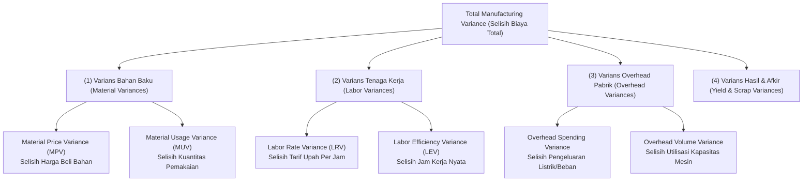

# Production Variance and Operational Performance

## Definition

**Production Variance and Operational Performance** adalah disiplin pengendalian manajerial dan akuntansi biaya dalam sistem ERP yang mengukur, menganalisis, dan melaporkan penyimpangan (*variances*) antara kinerja aktual di lantai pabrik dengan standar teknis yang telah ditetapkan sebelumnya—baik dalam dimensi moneter finansial (*Financial Variances*) maupun dimensi efisiensi operasional fisik (*Operational KPIs*).

Di dalam sistem ERP, varians bukan sekadar angka selisih di laporan akuntansi, melainkan **sinyal diagnosis dini (*early warning diagnostic*)** yang menunjukkan secara spesifik di departemen mana inefisiensi atau pemborosan terjadi: apakah bagian Pengadaan membeli material dengan harga terlalu mahal (*Price Variance*), operator pabrik bekerja terlalu lambat (*Efficiency Variance*), atau mesin membuang terlalu banyak material afkir (*Scrap Variance*).

---

## Perbedaan Fundamental: Variance Akuntansi vs. KPI Operasional

Sangat penting untuk tidak menyamakan varians akuntansi dengan indikator kinerja operasional:

> [!important]
> **Accounting Variance $\neq$ Operational KPI**:
> * **Production Variance (Varians Akuntansi Finansial)**: Deviasi moneter matematis yang dihitung saat penutupan pesanan produksi (*Order Close*) untuk keperluan pembukuan neraca dan laba rugi. Varians ini membukukan selisih saldo di akun Barang Dalam Proses (WIP) ke akun beban di buku besar (*General Ledger*).
> * **Operational KPI (Indikator Kinerja Lapangan)**: Metrik fisik non-moneter yang dipantau secara langsung oleh manajer pabrik (seperti *Yield %, Scrap Rate %, Downtime Hours, OEE %*) untuk mengevaluasi kedisiplinan dan produktivitas harian di lantai kerja.

---

## Taksonomi Varians Produksi (Manufacturing Variance Taxonomy)

Dalam sistem berbasis biaya standar (*Standard Costing System*), total varians produksi dipecah (*decomposed*) ke dalam pilar-pilar penyebab spesifik:



---

## Formula Matematis dan Analisis Komparasi Numerik

Untuk memahami bagaimana ERP menghitung setiap varians secara terisolasi, perhatikan skenario manufaktur Laptop Pro berikut:

### Data Standar vs Data Aktual (Batch 100 Unit Laptop Pro):
* **Bahan Baku (Sasis Laptop)**:
  * Standar: 100 set @ Rp500.000 = Rp50.000.000.
  * Aktual Pembelian: Dibeli seharga Rp520.000/set (Harga naik Rp20.000/set).
  * Aktual Pemakaian: Terpakai 103 set (Terjadi pemborosan 3 set sasis).
* **Tenaga Kerja Langsung (Lini Perakitan)**:
  * Standar: 100 jam @ Rp15.000/jam = Rp1.500.000 (1 jam per laptop).
  * Aktual Upah: Rata-rata upah operator Rp16.000/jam (karena ada porsi jam lembur).
  * Aktual Jam: Membutuhkan 110 jam kerja (pekerjaan memakan waktu 10 jam lebih lama).

---

### 1. Perhitungan Varians Bahan Baku (Material Variances)

#### A. Material Price Variance (MPV - Tanggung Jawab Bagian Purchasing):
Mengukur dampak finansial akibat perbedaan harga beli aktual terhadap harga standar:

$$\mathbf{\text{MPV} = (\text{Actual Price} - \text{Standard Price}) \times \text{Actual Quantity Purchased}}$$
$$\text{MPV} = (\text{Rp}520.000 - \text{Rp}500.000) \times 103 \text{ set} = +\text{Rp}20.000 \times 103 = \mathbf{+\text{Rp}2.060.000 \text{ (Unfavorable / Merugikan)}}$$

#### B. Material Usage Variance (MUV - Tanggung Jawab Bagian Pabrik):
Mengukur dampak finansial akibat pemborosan fisik material yang melebihi standar BOM:

$$\mathbf{\text{MUV} = (\text{Actual Quantity Used} - \text{Standard Quantity Allowed}) \times \text{Standard Price}}$$
$$\text{MUV} = (103 \text{ set} - 100 \text{ set}) \times \text{Rp}500.000 = +3 \text{ set} \times \text{Rp}500.000 = \mathbf{+\text{Rp}1.500.000 \text{ (Unfavorable / Merugikan)}}$$

---

### 2. Perhitungan Varians Tenaga Kerja (Labor Variances)

#### A. Labor Rate Variance (LRV - Tanggung Jawab HR / Kebijakan Lembur):
Mengukur selisih tarif upah aktual yang dibayarkan per jam:

$$\mathbf{\text{LRV} = (\text{Actual Rate} - \text{Standard Rate}) \times \text{Actual Hours Worked}}$$
$$\text{LRV} = (\text{Rp}16.000 - \text{Rp}15.000) \times 110 \text{ jam} = +\text{Rp}1.000 \times 110 = \mathbf{+\text{Rp}110.000 \text{ (Unfavorable / Merugikan)}}$$

#### B. Labor Efficiency Variance (LEV - Tanggung Jawab Supervisor Pabrik):
Mengukur dampak finansial dari operator yang bekerja lebih lambat dari waktu standar routing:

$$\mathbf{\text{LEV} = (\text{Actual Hours Worked} - \text{Standard Hours Allowed}) \times \text{Standard Rate}}$$
$$\text{LEV} = (110 \text{ jam} - 100 \text{ jam}) \times \text{Rp}15.000 = +10 \text{ jam} \times \text{Rp}15.000 = \mathbf{+\text{Rp}150.000 \text{ (Unfavorable / Merugikan)}}$$

---

### Ringkasan Rekonsiliasi Varians:

| Komponen Varians | Nilai (Rp) | Kategori Sifat | Penanggung Jawab Teridentifikasi |
| :--- | ---:| :---: | :--- |
| **Material Price Variance (MPV)** | 2.060.000 | Unfavorable (Rugi) | Departemen Pengadaan / Kenaikan Harga Vendor |
| **Material Usage Variance (MUV)** | 1.500.000 | Unfavorable (Rugi) | Operator Lantai Pabrik / Kerusakan Penanganan |
| **Labor Rate Variance (LRV)** | 110.000 | Unfavorable (Rugi) | HRD / Otorisasi Kebijakan Jam Lembur |
| **Labor Efficiency Variance (LEV)** | 150.000 | Unfavorable (Rugi) | Supervisor Produksi / Produktivitas Kerja Rendah |
| **Total Inefisiensi Biaya Produksi** | **3.820.000** | **Unfavorable** | **Dibebankan ke Laporan Laba Rugi Periode Berjalan** |

---

## Indikator Kinerja Utama Manufaktur (Operational KPIs)

Di samping angka finansial, ERP memantau efisiensi pabrik melalui metrik fisik standar industri:

1. **Overall Equipment Effectiveness (OEE)**:
   Standar emas produktivitas mesin manufaktur:
   $$\mathbf{\text{OEE (\%)} = \text{Availability (\%)} \times \text{Performance (\%)} \times \text{Quality (\%)}}$$
   * *Availability*: Rasio jam operasi riil terhadap jam rencana kerja (mengukur dampak *Downtime*).
   * *Performance*: Rasio kecepatan produksi riil terhadap kecepatan desain ideal mesin.
   * *Quality*: Rasio unit lolos (*Good Units*) terhadap total unit yang diproduksi (mengukur dampak *Scrap*).
2. **Schedule Adherence (Kepatuhan Jadwal Produksi)**:
   Persentase pesanan produksi yang diselesaikan tepat pada tanggal jadwal yang ditentukan oleh MPS.
3. **First Pass Yield (FPY)**:
   Persentase produk yang berhasil dirakit dengan sempurna pada kali pertama tanpa memerlukan perbaikan (*rework*) sama sekali.

---

## ERP Implementation Comparison

| Aspek | Odoo Enterprise | ERPNext | Microsoft Dynamics 365 SCM |
| :--- | :--- | :--- | :--- |
| **Analisis Varians Biaya** | Laporan varians terintegrasi pada modul akuntansi; selisih biaya tercatat otomatis pada akun *Price Difference* atau *Expense*. | Menampilkan tabel perbandingan *Expected Quantity vs Actual Quantity* pada form Work Order yang selesai. | Sangat komprehensif: Layar formal **Production Variances / Variance Breakdown** (memecah detail MPV, MUV, LRV, LEV, dan Overhead per batch). |
| **Pelacakan OEE Bawaan** | Tersedia widget native **OEE Analysis** pada Work Center (menampilkan metrik Availability, Performance, Quality, dan grafik pie alasan downtime). | Pelacakan efisiensi berbasis perbandingan *Expected Operating Time* vs *Actual Operating Time* pada Job Card. | Modul analitik terdedikasi: **Production Performance Power BI Content** yang menghitung metrik OEE, FPY, dan pemanfaatan mesin. |
| **Penutupan Varians ke GL** | Terjadi otomatis saat pesanan ditutup (*Produce All*) jika produk menggunakan metode Standard Price. | Melalui dokumen *Stock Entry* rekonsiliasi akhir atau penutupan pesanan produksi. | Menggunakan proses penutupan berkala formal: **Production Order Ending and Ledger Settlement** yang membukukan seluruh varians ke akun GL spesifik. |

---

## Naventra Consideration

Untuk perancangan modul Analisis Varians Manufaktur pada sistem ERP enterprise seperti **Naventra**:

1. **Skema Database Catatan Varians Produksi (Variance Ledgers)**:
   ```sql
   CREATE TABLE mo_production_variances (
       id UUID PRIMARY KEY DEFAULT gen_random_uuid(),
       manufacturing_order_id UUID NOT NULL REFERENCES manufacturing_orders(id),
       variance_type VARCHAR(30) NOT NULL, -- 'MATERIAL_USAGE', 'MATERIAL_PRICE', 'LABOR_RATE', 'LABOR_EFFICIENCY', 'SCRAP'
       cost_element_code VARCHAR(50) NOT NULL,
       standard_amount NUMERIC(18, 4) NOT NULL,
       actual_amount NUMERIC(18, 4) NOT NULL,
       variance_amount NUMERIC(18, 4) GENERATED ALWAYS AS (actual_amount - standard_amount) STORED,
       is_favorable BOOLEAN GENERATED ALWAYS AS ((actual_amount - standard_amount) <= 0) STORED,
       gl_variance_account_id UUID NOT NULL REFERENCES chart_of_accounts(id),
       calculated_at TIMESTAMP WITH TIME ZONE DEFAULT NOW()
   );
   ```
2. **Kalkulasi Varians Otomatis Saat Eksekusi Order Close**:
   Saat status pesanan beralih ke `CLOSED`, backend mengeksekusi fungsi kalkulasi varians yang membandingkan baris `mo_material_consumptions` dan `mo_operation_confirmations` terhadap standar BOM dan Routing, lalu secara otomatis memposting baris jurnal ke akun varians GL yang relevan.
3. **Penyediaan Dashboard Eksekutif Pabrik (Factory Floor Scorecard)**:
   Sediakan antarmuka dashboard yang menampilkan perbandingan visual antara target biaya standar vs biaya riil per unit produk jadi, dilengkapi dengan metrik tren OEE stasiun kerja untuk membantu manajemen pabrik mengidentifikasi sumber inefisiensi biaya secara cepat.

---

## References

- Horngren, C. T., Datar, S. M., & Rajan, M. V. *Cost Accounting: A Managerial Emphasis (Variance Analysis and Standard Costing)*. Pearson.
- ASCM / APICS. *APICS Dictionary: Variance Analysis, Material Usage Variance, Labor Efficiency, and Overall Equipment Effectiveness (OEE)*.
- Nakajima, S. *Introduction to TPM: Total Productive Maintenance (The OEE Methodology)*. Productivity Press.
- Microsoft Learn. *Production Variances Analysis and Cost Breakdown in Dynamics 365 Supply Chain Management*.
- Frappe ERPNext Documentation. *Work Order Performance and Scrap Analysis*.
- Odoo 17 Documentation. *Overall Equipment Effectiveness (OEE) and Work Center Productivity Tracking*.
