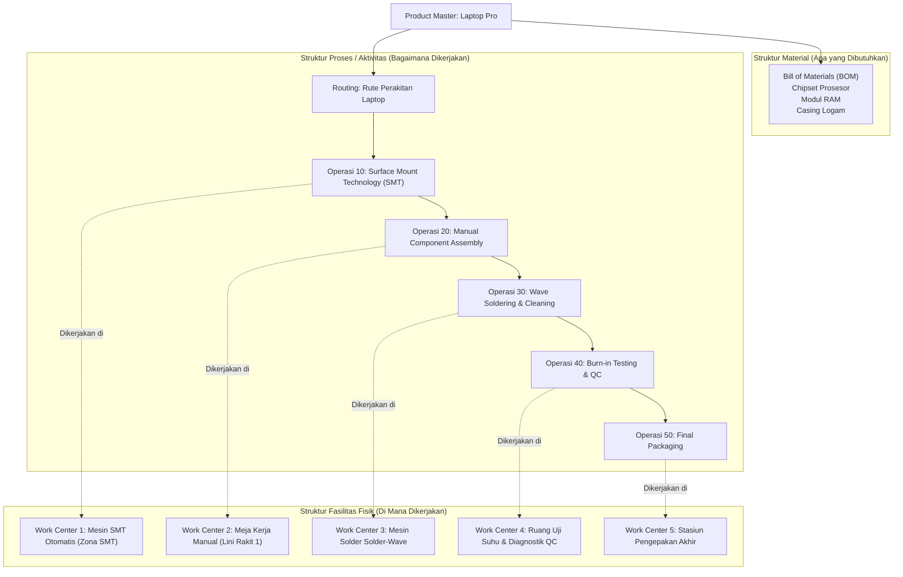
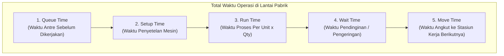
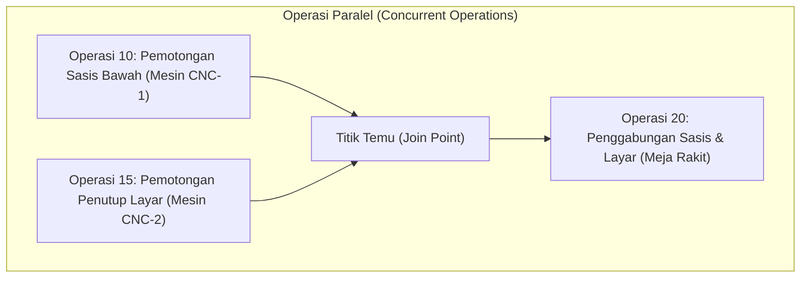

# Routing and Work Center Architecture

## Definition

**Routing and Work Center Architecture** adalah kerangka kerja data induk dalam ERP yang mendefinisikan aspek prosedural dan kapasitas fisik dari proses manufaktur:
* **Work Center (Pusat Kerja / Stasiun Kerja)**: Sumber daya fisik tempat pekerjaan produksi dilakukan—dapat berupa mesin tunggal, kelompok mesin sejenis (*Work Center Group*), lini perakitan, atau regu operator manusia dengan keahlian khusus.
* **Routing (Perutean / Lembar Rute Operasi)**: Urutan langkah-langkah kerja berurutan (*operations*) yang harus dilalui oleh suatu produk untuk mengubah komponen material menjadi produk jadi, lengkap dengan penetapan stasiun kerja, instruksi teknik, serta estimasi standar waktu kerja.

Jika [[06-manufacturing/product-structure-and-bom|Bill of Materials (BOM)]] menjawab pertanyaan *"Material apa yang dibutuhkan?"*, maka Routing menjawab pertanyaan **"Operasi apa yang harus dilakukan, di mana harus dikerjakan, dan berapa lama waktu yang dibutuhkan?"**.

---

## Hubungan Rantai Desain Manufaktur

Struktur produk dan struktur aktivitas saling berpasangan untuk mendefinisikan proses produksi yang utuh:



---

## Anatomi Waktu Operasi Manufaktur (Manufacturing Lead Time Elements)

Salah satu fungsi terpenting dari Routing adalah menyediakan parameter waktu untuk penghitungan kapasitas pabrik dan jadwal induk produksi:



### Definisi Elemen Waktu:

| Elemen Waktu | Sifat Ketergantungan Kuantitas | Karakteristik Operasional | Contoh Kasus Perakitan Laptop |
| :--- | :--- | :--- | :--- |
| **Setup Time (Waktu Persiapan)** | **Konstan (Batch-Independent)**: Terjadi sekali per pesanan produksi, berapa pun kuantitas yang dibuat. | Pemasangan cetakan (*die/mold*), pemanasan oven, penggantian rol komponen, atau kalibrasi software robot. | Operator memasang rol komponen chip ke mesin SMT (membutuhkan 30 menit). |
| **Run Time (Waktu Proses)** | **Variabel (Quantity-Dependent)**: Berbanding lurus dengan jumlah unit yang diproduksi. | Waktu siklus (*cycle time*) mesin atau operator untuk memproses tepat satu unit barang. | Mesin SMT memasang seluruh chip pada satu board (membutuhkan 45 detik per unit). |
| **Queue Time (Waktu Antrean)** | Non-operasional | Waktu tunggu suatu pesanan di depan stasiun kerja karena mesin masih sibuk memproses pesanan lain. | Palet board menunggu mesin solder yang sedang dipakai pesanan lain (2 jam). |
| **Wait Time (Waktu Tunggu Pasca-Proses)** | Non-operasional | Waktu jeda teknis setelah pemrosesan selesai sebelum barang dapat disentuh atau dipindahkan. | Papan sirkuit harus didinginkan selama 15 menit setelah melewati oven pemanas. |
| **Move Time (Waktu Pemindahan)** | Logistik internal | Waktu angkut fisik dari Work Center saat ini ke Work Center tujuan operasi berikutnya. | Pemindahan palet menggunakan forklift ke ruang pengujian QC (10 menit). |

$$\mathbf{\text{Total Manufacturing Lead Time} = \text{Setup Time} + (\text{Run Time per Unit} \times \text{Batch Size}) + \text{Queue} + \text{Wait} + \text{Move}}$$

---

## Parameter dan Kapasitas Work Center

Work Center mendefinisikan kemampuan daya tampung produksi pabrik melalui beberapa dimensi utama:

1. **Production Calendar (Kalender Kerja Pabrik)**:
   Mendefinisikan hari kerja aktif dan jam operasional reguler (misal: Shift 1: 08.00–16.00, Shift 2: 16.00–24.00, hari Sabtu/Minggu libur).
2. **Kapasitas Teoretis vs Efisiensi Nyata**:
   $$\text{Kapasitas Efektif (Jam)} = \text{Jam Kerja Kalender} \times \text{Jumlah Mesin/Tenaga Kerja} \times \text{Tingkat Efisiensi (\%)} \times \text{Tingkat Utilisasi (\%)}$$
   * *Contoh*: Stasiun kerja memiliki 2 mesin yang bekerja 8 jam sehari (16 jam mesin bruto). Jika efisiensi historis 90% dan utilisasi 85%, maka kapasitas harian efektif yang dapat dijadwalkan adalah: $16 \times 0,90 \times 0,85 = \mathbf{12,24 \text{ jam}}$.
3. **Tarif Pembebanan Biaya (*Cost Rates*)**:
   Setiap Work Center memiliki tarif penyerapan biaya per jam (*hourly absorption rates*):
   * **Tarif Tenaga Kerja Langsung (*Direct Labor Rate*)**: Upah operator per jam kerja.
   * **Tarif Jam Mesin (*Machine Rate*)**: Biaya depresiasi mesin pabrik per jam pakai.
   * **Tarif Overhead Pabrik (*Overhead Rate*)**: Alokasi biaya listrik, pelumas, pendingin ruangan, dan supervisi per jam operasi.

---

## Variasi Urutan Operasi: Serial, Paralel, dan Alternatif

Alur perutean dalam ERP tidak selalu berbentuk garis lurus linear (*serial*):



* **Operasi Paralel (*Parallel Operations*)**: Dua tahapan kerja dieksekusi secara bersamaan pada stasiun kerja yang berbeda untuk memperpendek total lead time produk.
* **Rute Alternatif (*Alternative Routing*)**: Jalur operasi cadangan yang digunakan saat mesin utama mengalami kerusakan (*breakdown*) atau kemacetan (*bottleneck*). Rute alternatif biasanya menggunakan mesin yang lebih tua atau proses semi-manual dengan biaya per jam yang lebih tinggi.

---

## ERP Implementation Comparison

| Aspek | Odoo Enterprise | ERPNext | Microsoft Dynamics 365 SCM |
| :--- | :--- | :--- | :--- |
| **Model Entitas** | Menggunakan dokumen `mrp.workcenter` dan `mrp.routing.workcenter` (tahapan operasi terintegrasi langsung di dalam formulir BOM). | Memiliki entitas mandiri `Workstation` dan `Routing` (dokumen master rute operasi yang ditautkan ke BOM). | Pemisahan formal tingkat enterprise: **Resources / Resource Groups** (stasiun kerja) dan **Route Templates / Route Versions**. |
| **Perhitungan Waktu Operasi** | Mendukung perhitungan otomatis berbasis durasi historis (*Compute based on real time*) atau manual (*Set duration manually*). | Kolom *Operation Time (Minutes)* pada tabel baris Routing per Workstation. | Sangat komprehensif: Mendukung formula *Queue before, Setup, Run, Process, Overlap, Queue after*, dan *Transport days*. |
| **Pembebanan Biaya per Jam** | Field *Cost per hour* pada Work Center; sistem mengalikan durasi kerja dengan tarif untuk menghasilkan biaya manufaktur. | Kolom *Hour Rate* pada Workstation (dibagi menjadi *Operating Cost, Electricity, Consumable, Rent*). | Menggunakan *Costing Sheets* dan *Cost Categories* yang ditautkan ke jam kerja dan jam mesin per operasi. |

---

## Naventra Consideration

Untuk perancangan modul Routing dan Work Center pada sistem ERP enterprise seperti **Naventra**:

1. **Skema Database Relasional Work Center dan Routing**:
   ```sql
   CREATE TABLE work_centers (
       id UUID PRIMARY KEY DEFAULT gen_random_uuid(),
       code VARCHAR(20) NOT NULL UNIQUE,
       name VARCHAR(100) NOT NULL,
       work_center_type VARCHAR(30) NOT NULL, -- 'MACHINE', 'LABOR_LINE', 'OUTSOURCED'
       capacity_per_day_hours NUMERIC(6, 2) NOT NULL DEFAULT 8.00,
       efficiency_percentage NUMERIC(5, 2) NOT NULL DEFAULT 100.00,
       cost_per_hour_labor NUMERIC(18, 4) NOT NULL DEFAULT 0,
       cost_per_hour_machine NUMERIC(18, 4) NOT NULL DEFAULT 0,
       cost_per_hour_overhead NUMERIC(18, 4) NOT NULL DEFAULT 0,
       calendar_id UUID NOT NULL REFERENCES production_calendars(id),
       is_active BOOLEAN NOT NULL DEFAULT TRUE
   );

   CREATE TABLE routings (
       id UUID PRIMARY KEY DEFAULT gen_random_uuid(),
       routing_code VARCHAR(50) NOT NULL UNIQUE,
       name VARCHAR(100) NOT NULL,
       product_id UUID NOT NULL REFERENCES items(id),
       is_active BOOLEAN NOT NULL DEFAULT TRUE,
       created_at TIMESTAMP WITH TIME ZONE DEFAULT NOW()
   );

   CREATE TABLE routing_operations (
       id UUID PRIMARY KEY DEFAULT gen_random_uuid(),
       routing_id UUID NOT NULL REFERENCES routings(id) ON DELETE CASCADE,
       sequence_number INT NOT NULL, -- 10, 20, 30...
       operation_name VARCHAR(100) NOT NULL,
       work_center_id UUID NOT NULL REFERENCES work_centers(id),
       setup_time_minutes NUMERIC(8, 2) NOT NULL DEFAULT 0,
       run_time_minutes_per_unit NUMERIC(8, 2) NOT NULL DEFAULT 0,
       wait_time_minutes NUMERIC(8, 2) NOT NULL DEFAULT 0,
       move_time_minutes NUMERIC(8, 2) NOT NULL DEFAULT 0,
       work_instructions_text TEXT,
       UNIQUE (routing_id, sequence_number)
   );
   ```
2. **Kalkulasi Total Lead Time Terotomasi**:
   Sediakan fungsi backend yang menghitung proyeksi tanggal selesai (*Projected Completion Date*) berdasarkan ukuran pesanan produksi dan kalender kerja stasiun kerja (mengabaikan hari libur dan jam non-operasional).
3. **Pemberlakuan Kaitan Komponen BOM ke Nomor Operasi**:
   Saat mengeksekusi *Shop Floor Control*, operator hanya disajikan daftar komponen yang memiliki `operation_sequence_no` yang cocok dengan tahapan kerja yang sedang aktif di stasiun kerjanya.

---

## References

- ASCM / APICS. *APICS Dictionary: Routing, Work Center Capacity, Setup Time, Run Time, and Lead Time Elements*.
- Groover, M. P. *Fundamentals of Modern Manufacturing: Materials, Processes, and Systems*. Wiley.
- Microsoft Learn. *Routes and Operations Architecture in Dynamics 365 Supply Chain Management*.
- Frappe ERPNext Documentation. *Workstations and Routing Operations Setup*.
- Odoo 17 Documentation. *Work Centers and Routing Operations Configurations*.
