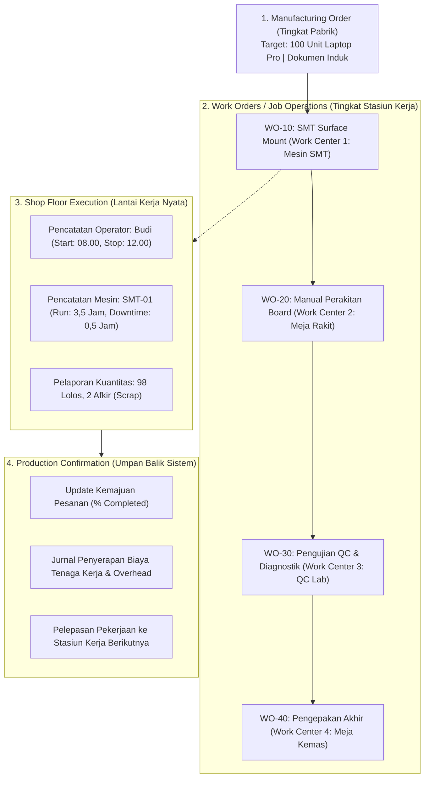
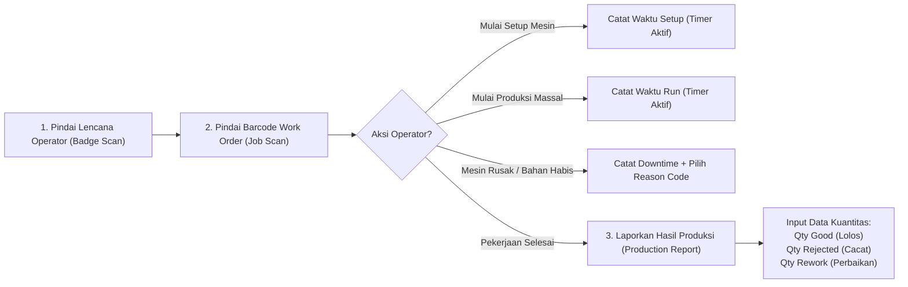

# Shop Floor Control and Work Order Execution

## Definition

**Shop Floor Control (SFC) and Work Order Execution** adalah subsistem operasional dalam ERP yang memantau, memandu, mencatat, dan mengontrol aktivitas fisik manufaktur yang berlangsung secara nyata di lantai pabrik—mulai dari penerbitan antrean tugas kerja stasiun (*dispatching*), pencatatan waktu persiapan mesin (*setup time*) dan waktu proses (*run time*), pelaporan jam kerja operator (*labor booking*), pencatatan waktu henti mesin (*downtime tracking*), hingga pelaporan hasil produksi (*production confirmation*).

SFC bertindak sebagai **jembatan sensorik antara dunia fisik dan data sistem**, menerjemahkan gerakan fisik tangan operator dan putaran mesin pabrik menjadi catatan transaksi digital yang dapat diaudit oleh tim manajemen dan akuntansi.

---

## Dekomposisi Operasional: Dari MO ke Konfirmasi Lantai Pabrik

Struktur pelaksanaan pesanan produksi di lantai pabrik diuraikan secara berjenjang:



---

## Alur Transaksi Operator Lantai Kerja (Labor and Machine Booking)

Antarmuka lantai kerja (*Shop Floor Terminal*) dirancang untuk memudahkan operator melaporkan tahapan kerja secara cepat menggunakan terminal layar sentuh (*touchscreen*) atau pemindai barcode:



---

## Taksonomi Waktu Kerja dan Pelacakan Waktu Henti (Downtime Tracking)

Efisiensi lini manufaktur diukur dari bagaimana jam kerja pabrik dimanfaatkan:

### 1. Kategori Waktu di Lantai Pabrik:
* **Productive Time (Waktu Produktif)**:
  * *Setup Time*: Waktu kalibrasi alat dan pemasangan komponen awal.
  * *Run Time*: Waktu mesin atau operator memproses produk secara nyata.
* **Non-Productive Time (Waktu Tidak Produktif / Downtime)**:
  * Waktu di mana stasiun kerja berhenti beroperasi karena gangguan tak terencana.

### 2. Kode Alasan Waktu Henti (*Downtime Reason Codes*):
Untuk keperluan analisis *Root-Cause* dan metrik efektivitas mesin (*OEE*), operator wajib memilih kode alasan saat mesin terhenti:

| Kode Alasan | Kategori Gangguan | Tanggung Jawab Departemen | Contoh Peristiwa Lapangan |
| :--- | :--- | :--- | :--- |
| **MCH_BREAKDOWN** | Kerusakan Mekanikal/Elektrikal | Departemen Pemeliharaan (*Maintenance*) | Motor penggerak mesin konveyor terbakar atau lengan robot macet. |
| **MAT_STARVATION** | Kekurangan Material Bahan Baku | Departemen Logistik Gudang | Operator kehabisan baut pengikat karena terlambat dikirim dari gudang. |
| **TOOLING_DEFECT** | Kerusakan Cetakan / Mata Pisau | Tim Teknik (*Tooling / Jig Engineer*) | Mata bor CNC patah atau cetakan plastik aus. |
| **POWER_OUTAGE** | Gangguan Utilitas Listrik/Angin | Departemen Fasilitas Pabrik (*Utility*) | Tekanan kompresor angin turun drastis atau listrik padam. |
| **OPR_MEETING** | Aktivitas Personel Terencana | Manajemen Operasional | Rapat pengarahan keselamatan kerja pagi (*Toolbox Meeting / Daily Standup*). |

---

## Perbedaan Krusial: Planned vs. Actual Quantities

Sistem ERP memisahkan secara ketat antara target pesanan dengan realitas hasil fisik:

* **Planned Quantity**: Kuantitas pesanan yang disetujui pada awal penerbitan dokumen (misal: 100 unit Laptop Pro).
* **Actual Produced Quantity**: Jumlah barang yang selesai diproses pada stasiun kerja.
* **Good Quantity (Kuantitas Lolos)**: Jumlah unit yang memenuhi toleransi spesifikasi teknis dan siap dipindahkan ke stasiun kerja berikutnya (misal: 97 unit).
* **Rejected / Scrapped Quantity**: Jumlah unit yang rusak permanen dan tidak dapat diperbaiki (misal: 2 unit sasis retak).
* **Rework Quantity**: Unit cacat minor yang harus diproses ulang sebelum dapat digabungkan kembali (misal: 1 unit layar kabel kendur).

$$\mathbf{\text{Yield Operasi (\%)} = \frac{\text{Good Quantity}}{\text{Good Quantity} + \text{Scrapped Quantity} + \text{Rework Quantity}} \times 100\%}$$

*Contoh*: Pada Operasi 10, Yield = $\frac{97}{97 + 2 + 1} \times 100\% = \mathbf{97\%}$.

---

## Dampak Konfirmasi Produksi terhadap Akuntansi Biaya

Setiap kali operator menekan tombol konfirmasi penyelesaian operasi kerja di terminal lantai pabrik, ERP secara otomatis menghitung dan mencatat penyerapan biaya konversi:

$$\text{Biaya Tenaga Kerja Diserap} = \text{Jam Tenaga Kerja Aktual} \times \text{Tarif Upah Standar per Jam Work Center}$$
$$\text{Biaya Mesin/Overhead Diserap} = \text{Jam Mesin Aktual} \times \text{Tarif Jam Mesin Standar Work Center}$$

### Jurnal Finansial Penyerapan Konversi (Perpetual Inventory):
* *(Dr)* Persediaan Barang Dalam Proses (*WIP — Conversion Cost*)
* *(Cr)* Beban Tenaga Kerja Langsung Dialokasikan (*Direct Labor Absorbed*)
* *(Cr)* Beban Overhead Pabrik Dialokasikan (*Manufacturing Overhead Absorbed*)

Akun kredit bertindak sebagai akun kontra beban (*contra-expense*) yang menetralkan beban gaji karyawan pabrik dan depresiasi mesin di laporan laba rugi, memindahkan beban tersebut menjadi aset persediaan barang dalam proses di neraca keuangan.

---

## ERP Implementation Comparison

| Aspek | Odoo Enterprise | ERPNext | Microsoft Dynamics 365 SCM |
| :--- | :--- | :--- | :--- |
| **Antarmuka Lantai Pabrik** | Modul khusus **Shop Floor App**: Tampilan ramah tablet dengan instruksi kerja PDF, tombol timer *Start/Pause*, dan pelaporan scrap. | Dokumen **Job Card**: Mendukung tombol *Start/Stop Timer* per operator dan pencatatan kuantitas selesai. | Aplikasi mobile khusus **Production Floor Execution**: Sangat komprehensif, mendukung pemindaian barcode batch, pelaporan paralel, dan instruksi multimedia. |
| **Pelacakan Downtime** | Fitur *Productivity Loss / OEE Reasons* pada tombol jeda Work Order. | Tidak memiliki tabel downtime formal bawaan default (dapat dicatat pada catatan log Job Card). | Fitur tingkat industri: **Machine Downtime Registration** dengan kode penyebab gangguan dan integrasi ke modul *Asset Management*. |
| **Dukungan MES Eksternal** | Mendukung integrasi via REST API atau konektor IoT Box (menghubungkan timbangan dan PLC mesin). | Mendukung REST API untuk integrasi data log mesin industri (SCADA/IoT). | Mendukung integrasi native berstandar industri: **Manufacturing Execution System (MES) Integration API** berbasis pesan mikrofonik. |

---

## Naventra Consideration

Untuk perancangan modul Shop Floor Execution pada sistem ERP enterprise seperti **Naventra**:

1. **Skema Database Konfirmasi Operasi Kerja (Job Confirmations)**:
   ```sql
   CREATE TABLE mo_operation_confirmations (
       id UUID PRIMARY KEY DEFAULT gen_random_uuid(),
       manufacturing_order_id UUID NOT NULL REFERENCES manufacturing_orders(id),
       operation_id UUID NOT NULL REFERENCES routing_operations(id),
       work_center_id UUID NOT NULL REFERENCES work_centers(id),
       operator_user_id UUID NOT NULL REFERENCES users(id),
       
       start_time TIMESTAMP WITH TIME ZONE NOT NULL,
       end_time TIMESTAMP WITH TIME ZONE NOT NULL,
       setup_duration_minutes NUMERIC(8, 2) NOT NULL DEFAULT 0,
       run_duration_minutes NUMERIC(8, 2) NOT NULL DEFAULT 0,
       downtime_duration_minutes NUMERIC(8, 2) NOT NULL DEFAULT 0,
       downtime_reason_code VARCHAR(50),
       
       good_quantity NUMERIC(15, 4) NOT NULL DEFAULT 0,
       scrapped_quantity NUMERIC(15, 4) NOT NULL DEFAULT 0,
       rework_quantity NUMERIC(15, 4) NOT NULL DEFAULT 0,
       
       status VARCHAR(30) NOT NULL DEFAULT 'CONFIRMED',
       created_at TIMESTAMP WITH TIME ZONE DEFAULT NOW()
   );
   ```
2. **Desain Antarmuka Touchscreen Tanpa Keyboard (Operator-Centric UI)**:
   Rancang layar antarmuka *Shop Floor Terminal* berbasis tombol besar yang dapat ditekan menggunakan sarung tangan pabrik, dengan pemindaian barcode otomatis untuk nomor lencana dan nomor surat perintah kerja (*Single-Scan Authentication*).
3. **Pemberlakuan Logika Validasi Urutan Operasi (Sequence Enforcer)**:
   Backend wajib memvalidasi bahwa Operasi 20 dilarang mencatat kuantitas masuk melebihi kuantitas *Good Quantity* yang telah dikonfirmasi selesai oleh Operasi 10, guna mencegah anomali di mana stasiun kerja hilir menyelesaikan produk yang belum pernah dirakit oleh stasiun kerja hulu.

---

## References

- ASCM / APICS. *Shop Floor Control and Production Activity Control (PAC) Best Practices*.
- MESA International (Manufacturing Enterprise Solutions Association). *MES Functionality Models and Shop Floor Execution Standards*.
- Microsoft Learn. *Production Floor Execution Interface in Dynamics 365 Supply Chain Management*.
- Frappe ERPNext Documentation. *Job Card Execution and Operation Tracking*.
- Odoo 17 Documentation. *Shop Floor App: Managing Work Orders and Operator Activities*.
