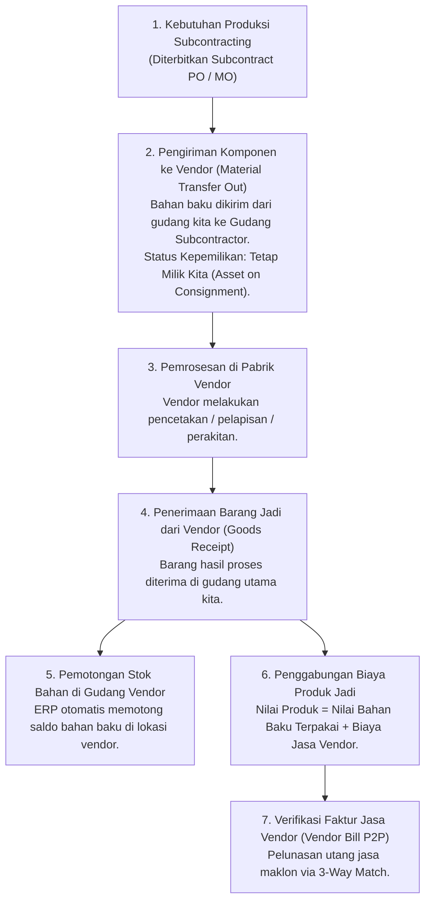

# Subcontracting and External Processing

## Definition

**Subcontracting and External Processing** (dikenal juga sebagai *Toll Manufacturing* atau Maklon) adalah arsitektur rantai pasok dalam ERP di mana organisasi menyerahkan sebagian atau seluruh tahapan manufaktur kepada vendor eksternal (*Subcontractor*). Dalam model ini, organisasi pembeli biasanya menyediakan dan mengirimkan bahan baku atau komponen setengah jadi kepada pemasok, dan pemasok menyediakan jasa pengolahan (*processing service*) untuk kemudian mengembalikan barang jadi atau sub-perakitan yang telah diproses.

Subcontracting merupakan titik temu unik antara **tiga pilar ERP utama**:
* **Modul Purchasing (P2P)**: Mengelola pesanan jasa pemrosesan eksternal melalui [[04-purchasing/purchase-order|Subcontract Purchase Order]] dan pembayaran biaya jasa (*Service Fee*).
* **Modul Inventory (Phase 6)**: Melacak saldo persediaan milik perusahaan yang berada secara fisik di lokasi gudang vendor (*Vendor-Held Stock / Subcontractor Location*).
* **Modul Manufacturing (Phase 7)**: Mengelola struktur resep bahan baku yang dikonsumsi oleh vendor untuk menghasilkan barang jadi.

---

## Alur Bisnis Subcontracting Terpadu (End-to-End Flow)

Proses maklon manufaktur diatur melalui tahapan siklus terstruktur:



---

## Aspek Kepemilikan dan Lokasi Persediaan (Ownership vs. Custody)

Prinsip tata kelola persediaan paling penting dalam proses maklon adalah pemisahan antara penguasaan fisik dan kepemilikan hukum:

> [!important]
> **Legal Ownership of Subcontracted Materials**:
> Ketika bahan baku dikirimkan ke pabrik maklon, barang fisik berada di bawah penguasaan fisik vendor (*Physical Custody*), namun **secara hukum dan akuntansi barang tersebut tetap merupakan Aset Persediaan milik perusahaan kita (*Legal Ownership*)**.
> 
> Pengiriman bahan baku ke vendor **DILARANG dicatat sebagai penjualan atau pembebanan biaya**. Pengiriman ini dicatat murni sebagai perpindahan lokasi internal (*Stock Transfer to Subcontractor Location*). Nilai aset bahan baku tetap berada di neraca keuangan kita.

---

## Dua Model Pengadaan Maklon dalam ERP

Sistem ERP enterprise mengklasifikasikan maklon ke dalam dua model arsitektur:

| Model Maklon | Cara Kerja Operasional | Kapan Digunakan? | Integrasi Modul ERP |
| :--- | :--- | :--- | :--- |
| **Full Subcontracting (Assembly Outsourcing)** | Perusahaan memesan seluruh perakitan produk jadi dari vendor. Perusahaan mengirimkan daftar lengkap komponen (BOM) ke vendor, dan menerima produk jadi Level 0. | Perusahaan bertindak sebagai perancang (*Fabless Designer*) yang tidak memiliki lini perakitan sendiri. | Purchase Order bertipe *Subcontracting* yang memiliki tabel lampiran komponen BOM. |
| **External Operation / Processing (Maklon Operasi Kerja)** | Produk dirakit di pabrik sendiri, namun ada satu tahapan operasi kerja spesifik yang harus dikirim ke luar pabrik (misal: Operasi 10: Pemotongan Sasis di pabrik sendiri $\to$ Operasi 20: *Anodizing & Pengecatan* di vendor maklon $\to$ Operasi 30: Perakitan Akhir di pabrik sendiri). | Proses khusus yang membutuhkan mesin berbiaya investasi sangat tinggi (seperti *Heat Treatment*, pelapisan krom, sterilisasi radiasi gamma). | Dokumen [[06-manufacturing/routing-and-work-center|Routing]] memiliki tahapan operasi yang ditandai sebagai *External Work Center*. Operasi ini otomatis memicu pembuatan Purchase Order jasa saat MO dirilis. |

---

## Dampak Akuntansi dan Akumulasi Biaya Maklon

Nilai perolehan persediaan barang yang diterima dari vendor maklon merupakan kombinasi dari nilai bahan baku ditambah biaya jasa:

### Skenario Transaksi Kanonikal:
* **Komponen yang Dikirim ke Vendor**:
  * 100 unit sasis aluminium mentah dengan biaya perolehan @ Rp400.000 = **Rp40.000.000**.
* **Biaya Jasa Maklon (*Subcontracting Service Fee*)**:
  * Vendor menagihkan jasa pengecatan dan pelapisan *powder coating* sebesar Rp100.000 per unit (Total = **Rp10.000.000** + PPN 11% Rp1.100.000).

---

### Alur Penjurnalan Akuntansi (Perpetual Inventory):

#### 1. Saat Pengiriman Bahan Baku ke Pabrik Vendor (Material Transfer):
Mutasi fisik memindahkan stok dari gudang reguler ke gudang virtual maklon:
* *Stock Ledger*: Mutasi keluar dari `Gudang Utama Raw Materials`, mutasi masuk ke `Gudang Subcontractor A`.
* *Buku Besar (GL)*: Perpindahan antar-rekening pembantu aset persediaan (tidak ada dampak laba rugi):
  * *(Dr)* Persediaan Bahan Baku di Pihak Ketiga (Subcontractor Stock): **Rp40.000.000**
  * *(Cr)* Persediaan Bahan Baku di Gudang Sendiri: **Rp40.000.000**

#### 2. Saat Penerimaan Barang Jadi yang Telah Dicat (Goods Receipt):
ERP menerima 100 unit sasis jadi dan mengeksekusi konsumsi bahan baku di lokasi vendor secara otomatis (*backflush*):
* *Kalkulasi Biaya Barang Jadi*: $\text{Rp}40.000.000 \text{ (Bahan)} + \text{Rp}10.000.000 \text{ (Jasa)} = \mathbf{\text{Rp}50.000.000}$ (@ Rp500.000/unit).
* *Jurnal Finansial Penerimaan Persediaan*:
  * *(Dr)* Persediaan Barang Jadi (Sasis Coated): **Rp50.000.000**
  * *(Cr)* Persediaan Bahan Baku di Pihak Ketiga: **Rp40.000.000**
  * *(Cr)* Utang Jasa Belum Ditagih (*Subcontracting GR/IR Accrual*): **Rp10.000.000**

#### 3. Saat Penerimaan Faktur Tagihan Vendor Maklon (Vendor Bill):
Bagian Accounts Payable memverifikasi tagihan jasa maklon:
* *(Dr)* Utang Jasa Belum Ditagih (*Subcontracting GR/IR Accrual*): **Rp10.000.000**
* *(Dr)* Pajak Masukan (PPN Masukan 11%): **Rp1.100.000**
* *(Cr)* Utang Usaha (Vendor Maklon): **Rp11.100.000**
* *(Cr/Dr)* Pemotongan PPh Pasal 23 Jasa Maklon (sesuai regulasi pajak jika berlaku): *(Dr Utang Usaha, Cr Utang PPh 23)*.

---

## ERP Implementation Comparison

| Aspek | Odoo Enterprise | ERPNext | Microsoft Dynamics 365 SCM |
| :--- | :--- | :--- | :--- |
| **Model Dokumen** | Tipe BOM khusus: *Subcontracting*. Purchase Order untuk barang jadi otomatis memicu dokumen transfer komponen (*Delivery Order to Subcontractor*). | Dokumen formal `Purchase Order` dengan checklist *Is Subcontracted*. Mengharuskan pemilihan *Supplied Items* dan dokumen *Subcontracting Receipt*. | Mendukung dua alur formal: **Subcontract Purchase Order** (untuk full subcontracting) dan **External Operation Routing** yang terhubung ke service PO. |
| **Pelacakan Saldo di Vendor** | Dikelola melalui tipe lokasi khusus: *Subcontracting Location* (bertindak sebagai lokasi internal milik perusahaan di alamat mitra). | Menggunakan gudang khusus tipe perantara: *Subcontractor Warehouse* yang dipilih pada Purchase Order. | Menggunakan dimensi inventaris: *Warehouse* terdedikasi vendor dengan kontrol persediaan konsinyasi milik sendiri. |
| **Konsumsi Bahan di Vendor** | Terjadi otomatis (*Backflush*) saat dokumen penerimaan barang jadi (*Stock Receipt*) dari vendor divalidasi. | Terjadi otomatis pada dokumen *Subcontracting Receipt* berdasarkan kuantitas bahan yang tertera pada tabel *Supplied Items*. | Mendukung fleksibilitas: pemotongan otomatis (*automatic flushing*) atau pelaporan manual kuantitas bahan riil yang terpakai oleh vendor. |

---

## Naventra Consideration

Untuk perancangan modul Subcontracting pada sistem ERP enterprise seperti **Naventra**:

1. **Skema Database Pesanan Maklon Terintegrasi**:
   ```sql
   CREATE TABLE subcontract_orders (
       id UUID PRIMARY KEY DEFAULT gen_random_uuid(),
       order_number VARCHAR(50) NOT NULL UNIQUE,
       vendor_id UUID NOT NULL REFERENCES partners(id),
       finished_item_id UUID NOT NULL REFERENCES items(id),
       ordered_quantity NUMERIC(15, 4) NOT NULL,
       received_quantity NUMERIC(15, 4) NOT NULL DEFAULT 0,
       service_unit_price NUMERIC(18, 4) NOT NULL,
       vendor_warehouse_id UUID NOT NULL REFERENCES warehouses(id), -- Gudang virtual vendor
       status VARCHAR(30) NOT NULL DEFAULT 'DRAFT',
       created_at TIMESTAMP WITH TIME ZONE DEFAULT NOW()
   );

   CREATE TABLE subcontract_order_supplied_materials (
       id UUID PRIMARY KEY DEFAULT gen_random_uuid(),
       subcontract_order_id UUID NOT NULL REFERENCES subcontract_orders(id) ON DELETE CASCADE,
       component_item_id UUID NOT NULL REFERENCES items(id),
       required_quantity NUMERIC(15, 4) NOT NULL,
       transferred_quantity NUMERIC(15, 4) NOT NULL DEFAULT 0,
       consumed_quantity NUMERIC(15, 4) NOT NULL DEFAULT 0
   );
   ```
2. **Otomasi Pemotongan Bahan Bersamaan dengan Penerimaan Jasa**:
   Saat API penerimaan barang jadi (`POST /api/v1/subcontract-receipts/post`) dipanggil, backend wajib mengeksekusi dua mutasi stok secara atomik dalam satu transaksi:
   1. Menambah kuantitas produk jadi di gudang utama.
   2. Memotong kuantitas bahan baku dari `vendor_warehouse_id`.
3. **Peringatan Defisit Bahan di Lokasi Vendor**:
   Sistem harus memblokir validasi penerimaan barang jadi jika saldo fisik bahan baku yang telah ditransfer ke `vendor_warehouse_id` tidak mencukupi untuk memenuhi kuantitas backflush resep BOM.

---

## References

- ASCM / APICS. *APICS Dictionary: Subcontracting, Toll Manufacturing, Outside Processing, and Consignment Stock*.
- IFRS Foundation. *IAS 2: Inventories (Cost of Conversion and Outside Processing Costs)*.
- Microsoft Learn. *Subcontracting Work and Outside Operations in Dynamics 365 Supply Chain Management*.
- Frappe ERPNext Documentation. *Subcontracting Workflow and Supplied Items Management*.
- Odoo 17 Documentation. *Subcontracting: Managing Outsourced Manufacturing in MRP*.
