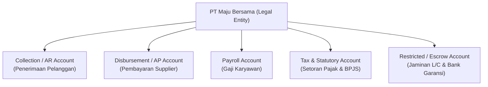
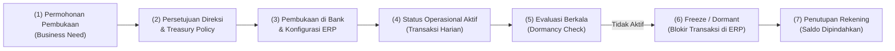

# Bank Account Management

## Definition

**Bank Account Management (BAM)** dalam ERP adalah domain tata kelola master data, otorisasi, dan siklus hidup seluruh rekening bank internal perusahaan (*Company Bank Accounts*). BAM mencakup konfigurasi konektivitas perbankan, penentuan tujuan operasional rekening, pengelolaan hierarki penandatangan yang berwenang (*authorized signatories*), serta pemantauan rekening aktif, tidak aktif (*dormant*), maupun rekening dana terbatas (*restricted cash*).

Dalam struktur ERP korporasi modern, satu entitas hukum (*legal entity*) dapat memiliki puluhan hingga ratusan rekening bank di berbagai institusi keuangan untuk melayani fungsi operasional yang terspesialisasi.

---

## Purpose

1. **Pemisahan Aliran Likuiditas Operasional**: Mencegah tercampurnya dana penerimaan piutang, pengeluaran kas, dan pembayaran gaji guna menyederhanakan rekonsiliasi serta membatasi eksposur risiko perbankan.
2. **Tata Kelola Mandat & Otorisasi Bank (*Signatory Governance*)**: Mengontrol secara sistemik pihak-pihak yang berhak mengotorisasi transfer dana berdasarkan batas nilai transaksi (*approval threshold*).
3. **Kepatuhan Pelaporan Keuangan (*Restricted Cash Segregation*)**: Memastikan pemisahan yang jelas antara kas bebas (*unrestricted cash*) dan kas yang dijaminkan atau dibatasi penggunaannya (*restricted cash*) sesuai standar akuntansi IFRS/IAS 7.
4. **Pencegahan Akun Terbengkalai (*Dormant Accounts*)**: Mendeteksi dan menutup rekening bank yang tidak lagi memiliki perputaran transaksi guna menekan biaya administrasi bulanan dan menutup celah penipuan (*fraud*).
5. **Standarisasi Integrasi Perbankan (*Host-to-Host / API*)**: Menyimpan parameter teknis konektivitas perbankan (*Corporate Identifier*, *Bank Code*, *Virtual Account Prefixes*) secara terpusat dan aman.

---

## Business Process

### 1. Siklus Hidup Rekening Bank (Account Lifecycle)
Siklus hidup rekening bank internal diatur melalui proses terstruktur:

### 2. Pengelolaan Matriks Penandatangan (Signatory Matrix)
Setiap rekening bank diatur oleh surat kuasa perbankan (*banking mandate*) yang dipetakan ke dalam ERP:
- **Kategori Penandatangan**:
  - **Group A (Eksekutif / Direksi)**: Direktur Utama, Direktur Keuangan (CFO).
  - **Group B (Manajemen Operasional)**: Finance Manager, Treasury Manager.
  - **Group C (Supervisor)**: Treasury Supervisor, Accounting Supervisor.
- **Aturan Otorisasi (*Signing Rules*)**:
  - Transaksi $\le$ Rp50.000.000: Cukup 1 tanda tangan Group B atau 2 tanda tangan Group C.
  - Transaksi Rp50.000.000 s.d. Rp500.000.000: Wajib 1 tanda tangan Group A dan 1 tanda tangan Group B (Dual Control A+B).
  - Transaksi $>$ Rp500.000.000: Wajib 2 tanda tangan Group A (Dual Control A+A).

### 3. Pemantauan Rekening Tidak Aktif (Dormant Account Monitoring)
ERP secara periodik (misal setiap 30 hari) memindai tanggal transaksi terakhir pada seluruh rekening:
- Jika tidak ada transaksi mutasi nasabah selama $\ge$ 90 hari, ERP memberikan peringatan status *Warning Dormancy*.
- Jika mencapai $\ge$ 180 hari tanpa mutasi nasabah, ERP secara otomatis mengunci rekening (*Freeze/Inactive*) sehingga tidak dapat dipilih pada modul Purchasing, Sales, atau Payment Run.

---

## Business Rules

1. **Mandatory 1-to-1 GL Account Mapping for Cash/Bank**: Setiap rekening bank perusahaan wajib dipetakan ke satu akun buku besar (*General Ledger Account*) tersendiri dengan mata uang yang identik (*currency constraint*).
2. **Dual Control Mandate for Master Data Changes**: Penambahan rekening baru, perubahan nomor rekening, atau pembaruan daftar penandatangan (*signatories*) wajib melalui persetujuan *Four-Eyes Principle* (dibuat oleh Treasury Analyst, disetujui oleh CFO/Treasury Director).
3. **No Direct User Access to Bank Keys**: Kredensial koneksi perbankan (kunci enkripsi API/SFTP host-to-host) disimpan dalam brankas digital (*secure vault / secret manager*) dan tidak boleh ditampilkan dalam teks terbuka di layar UI master data.
4. **Immediate Signatory Revocation**: Ketika karyawan yang memegang kuasa bank mengundurkan diri atau dimutasi, hak otorisasi rekening wajib dicabut seketika di sistem ERP dan perbankan sebelum tanggal efektif keluar (*effective termination date*).
5. **Segregation of Duties (SoD)**: Pemegang hak otorisasi penandatangan bank dilarang merangkap sebagai staf yang melakukan rekonsiliasi bank atas rekening tersebut (*reconciliation reconciler*).

---

## Accounting & Financial Impact

Struktur rekening bank menentukan penyajian aset lancar pada Laporan Posisi Keuangan (*Balance Sheet*).

### 1. Klasifikasi Kas dan Setara Kas vs Kas yang Dibatasi Penggunaannya
Sesuai **IAS 7** dan **PSAK 2**, dana yang dapat diklasifikasikan sebagai *Cash and Cash Equivalents* adalah kas yang dapat ditarik sewaktu-waktu tanpa hambatan legal maupun kontraktual.

| Jenis Rekening | Klasifikasi Laporan Keuangan | Akun Buku Besar (GL) | Perlakuan Akuntansi |
| :--- | :--- | :--- | :--- |
| **Rekening Operasional & Payroll** | Aset Lancar — Kas dan Setara Kas | `111200 - Bank Mandiri Operasional` | Likuid penuh, siap digunakan untuk transaksi harian |
| **Rekening Penampungan L/C (Letter of Credit)** | Aset Lancar — Kas yang Dibatasi Penggunaannya (*Restricted Cash*) | `111500 - Bank BCA Restricted Margin Deposit` | Terkunci sebagai jaminan bank garansi / L/C impor, tidak boleh dimasukkan dalam saldo likuiditas harian |
| **Rekening Escrow Jangka Panjang (> 1 tahun)** | Aset Tidak Lancar — Aset Lain-Lain | `181000 - Non-Current Restricted Escrow` | Disajikan di luar aset lancar karena terikat perjanjian hukum jangka panjang |

### 2. Reklasifikasi Dana Jaminan Bank (Restricted Cash Allocation)
Ketika PT Maju Bersama memindahkan dana operasional ke rekening khusus jaminan penerbitan Bank Garansi:

| Akun | Debit (IDR) | Kredit (IDR) | Keterangan |
| :--- | :--- | :--- | :--- |
| `111500 - Bank BCA Restricted Margin Deposit` | 50.000.000 | - | Pengikatan kas jaminan bank garansi proyek |
| `111210 - Bank BCA Collection` | - | 50.000.000 | Pengurangan saldo rekening bebas |

---

## Example: Struktur Rekening & Matriks Otorisasi PT Maju Bersama

PT Maju Bersama mengoperasikan struktur multi-rekening perbankan untuk mendukung kegiatan operasional manufaktur perakitan elektronik:

### 1. Master Data Rekening Bank Perusahaan

| Rekening ID | Nama Bank | Nomor Rekening | Mata Uang | Fungsi Operasional | Akun GL Terhubung | Status |
| :--- | :--- | :--- | :--- | :--- | :--- | :--- |
| `BNK-BCA-01` | Bank Central Asia | 883-091-2201 | IDR | Penerimaan Pelanggan (Collection & VA) | `111210` | Aktif |
| `BNK-MDR-01` | Bank Mandiri | 122-00-98711-2 | IDR | Pengeluaran Operasional & Vendor (Disbursement) | `111220` | Aktif |
| `BNK-BNI-01` | Bank Negara Indonesia | 044-887-1903 | IDR | Pembayaran Gaji Karyawan (Payroll Exclusive) | `111230` | Aktif |
| `BNK-MDR-02` | Bank Mandiri | 122-00-55410-8 | USD | Impor Komponen & Pembayaran Vendor Luar Negeri | `111240` | Aktif |
| `BNK-BCA-02` | Bank Central Asia | 883-091-9988 | IDR | Jaminan Collateral L/C Komponen Elektronik | `111500` | Restricted |

### 2. Implementasi Aturan Pengeluaran
Ketika Finance staff memproses proposal pembayaran supplier PT Sumber Teknologi sebesar Rp133.200.000 melalui rekening `BNK-MDR-01`:
1. Sistem mendeteksi nominal transaksi berada pada tier Rp50.000.000 s.d. Rp500.000.000.
2. ERP menugaskan alur persetujuan:
   - **Penyetuju 1 (Maker/Checker operasional)**: Treasury Manager (Group B).
   - **Penyetuju 2 (Final Release)**: Finance Director / CFO (Group A).
3. Transaksi pembayaran tidak dapat dieksekusi atau dikirim ke API perbankan sebelum kedua pihak tersebut membubuhkan persetujuan digital di ERP.

---

## ERP Implementation

Perbandingan kapabilitas Bank Account Management lintas platform:

| Fitur Tata Kelola | Odoo Enterprise | ERPNext | Microsoft Dynamics 365 | SAP S/4HANA Finance |
| :--- | :--- | :--- | :--- | :--- |
| **Hierarki Master Bank** | Bank $\rightarrow$ Bank Account terhubung ke *Journal* | Master *Bank* terpisah dari master *Bank Account* | *Bank groups* $\rightarrow$ *Bank accounts* dengan integrasi *Cash & Bank Management* | Hierarki *Bank Directory* $\rightarrow$ *House Bank* $\rightarrow$ *House Bank Account* (*BAM module*) |
| **Workflow Pembukaan / Penutupan** | Manual field boolean *Active* | Manual field status *Disabled* | Workflow status rekening (*Active, Inactive, Closed*) | Full workflow persetujuan pembukaan/penutupan via *SAP BAM (Bank Account Management)* |
| **Signatory Matrix & Signing Limits** | Memerlukan custom approval rule di module approval | Konfigurasi *Workflow Action* berbasis role dan kondisi nominal | Fitur native *Signing limits* dan *Approval policies* per dokumen perbankan | Modul terdedikasi *Signatory Management* dengan penanggalan validitas mandat |
| **Restricted Cash Tagging** | Pengaturan manual pada akun chart of accounts | Pengaturan manual klasifikasi aset lancar | Field klasifikasi rekening (*Restricted account*) | Dukungan native pengelompokan likuiditas pada *Liquidity Analysis* |

---

## Naventra Consideration

Rancangan modul Bank Account Management pada Naventra ERP menetapkan:

1. **Strict House Bank Entity Isolation**: Setiap rekening bank perusahaan terikat erat pada *Legal Entity / Company ID*. Rekening tidak boleh dibagikan (*shared*) antar-anak perusahaan secara langsung untuk mencegah kerancuan tanggung jawab hukum dan pelaporan pajak perbankan.
2. **Automated Dormancy Lockout**: Naventra menjalankan *background cron scheduler* mingguan. Rekening yang tidak mengalami aktivitas mutasi debit/kredit selama lebih dari 180 hari otomatis dialihkan ke status `DORMANT_LOCKED`, yang memblokir transaksi baru hingga dibuka kembali melalui proses re-aktivasi berjenjang.
3. **Audit Trail Mandat Penandatangan**: Setiap penambahan atau perubahan data pejabat penandatangan (*signatory master*) mencatat *snapshot* lengkap identitas pejabat, KTP/NPWP, nomor SK Direksi, tanggal mulai berlaku, dan tanggal berakhirnya wewenang ke dalam log audit yang tidak dapat dihapus (*immutable log*).

---

## References

- International Accounting Standards Board (IASB). *IAS 1: Presentation of Financial Statements* & *IAS 7: Statement of Cash Flows*. IFRS Foundation.
- International Organization for Standardization. *ISO 20022 Financial Services — Bank Account Management (BAM) Schema*.
- Association for Financial Professionals (AFP). *Essentials of Treasury Management*, 6th Edition.
- SAP SE. *Bank Account Management (BAM) in SAP S/4HANA Finance*. SAP Help Portal.
- Microsoft Corporation. *Set up bank accounts and bank groups in Dynamics 365 Finance*. Microsoft Learn.
