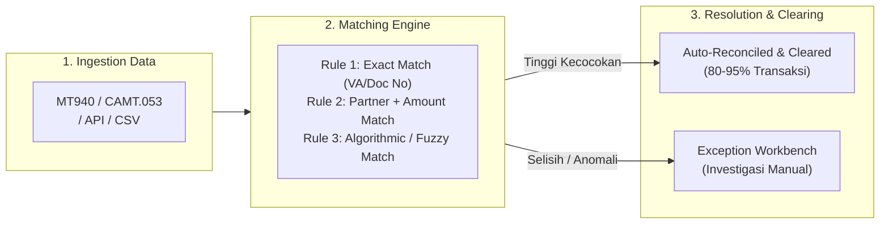
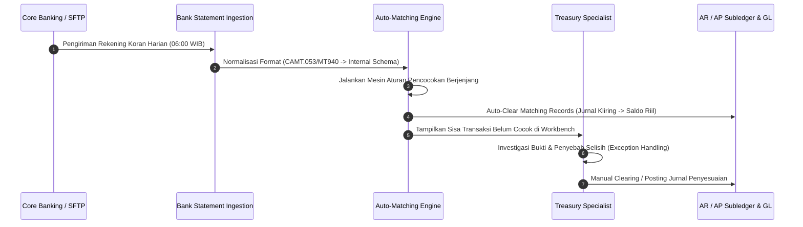

# Operational Bank Reconciliation

## Definition

**Operational Bank Reconciliation** dalam domain Finance dan Treasury ERP adalah proses operasional harian untuk membandingkan, mencocokkan (*matching*), dan menyelesaikan perbedaan antara transaksi mutasi rekening koran elektronik (*electronic bank statement*) dengan catatan transaksi pembayaran dan penerimaan kas di dalam ERP.

Berbeda dengan perspektif akuntansi murni (yang berfokus pada penyusunan lembar rekonsiliasi akhir bulan dan jurnal penyesuaian/adjusting entries sebagaimana dibahas pada [[02-accounting/bank-reconciliation|Bank Reconciliation di Phase 3]]), **Operational Bank Reconciliation di Phase 8 berfokus pada arsitektur pemrosesan data, otomatisasi pencocokan elektronik, tata kelola eksepsi, mitigasi risiko operasional, dan manajemen item yang belum terekonsiliasi (*unmatched items aging*)**.

---

## Purpose

1. **Memastikan Integritas Saldo Kas Real-Time**: Memberikan kepastian kepada manajemen likuiditas bahwa saldo kas yang tercermin pada sistem operasional adalah dana yang benar-benar telah efektif di bank (*settled funds*).
2. **Efisiensi Pemrosesan Bervolume Tinggi**: Mengotomatisasi pencocokan ribuan transaksi mutasi harian secara nir-sentuh (*straight-through processing / STP*) melalui pencocokan berbasis algoritma dan *Virtual Account*.
3. **Deteksi Dini Penipuan dan Kesalahan Transaksi (*Fraud & Error Detection*)**: Mengidentifikasi transaksi bank tanpa otorisasi internal, penarikan ganda (*duplicate charges*), atau manipulasi instrumen bayar secara harian, bukan di akhir bulan.
4. **Percepatan Siklus Pelunasan Piutang (AR Clearing)**: Mempercepat alokasi penerimaan kas dari pelanggan ke faktur penjualan yang terbuka, sehingga memulihkan limit kredit pelanggan (*credit limit release*) secara instan.
5. **Manajemen Penuaan Item Terbuka (*Aging of Unreconciled Items*)**: Memantau cek/giro yang kedaluwarsa (*stale-dated checks*) dan setoran dalam perjalanan yang macet (*stuck deposits in transit*).

---

## Business Process

Siklus operasional rekonsiliasi perbankan harian terdiri dari empat tahapan utama:

### 1. Ingestion dan Normalisasi Rekening Koran Elektronik
Rekening koran diekstraksi secara otomatis dari server bank (SFTP atau Host-to-Host API) setiap pagi dalam format standar industri perbankan:
- **SWIFT MT940**: Format pesan teks terstruktur tradisional untuk saldo dan mutasi rekening akhir hari (*End-of-Day Statement*).
- **ISO 20022 CAMT.053**: Standar format XML global masa depan untuk *Bank-to-Customer Statement* dengan detail metadata yang jauh lebih kaya (mengandung *End-to-End ID*, identitas *debtor/creditor*, kode biaya).
- **ISO 20022 CAMT.052**: Rekening koran intra-hari (*Intraday Report*) untuk pemantauan likuiditas *real-time*.
- **CSV / Fixed-Width Tabular**: Format proprietary perbankan lokal yang diurai menggunakan *custom parser*.

### 2. Mesin Pencocokan Otomatis (Automated Matching Engine)
ERP mengeksekusi aturan pencocokan secara sekuensial dari kriteria paling ketat ke yang paling fleksibel:
- **Tier 1 — Exact Reference Match (100% Confidence)**: Cocokkan nomor *Virtual Account* unik, nomor referensi transaksi bank (*End-to-End Reference*), atau nomor dokumen pembayaran internal dengan toleransi nominal selisih Rp0.
- **Tier 2 — Exact Amount & Counterparty Match (95% Confidence)**: Cocokkan tanggal transaksi ($\pm 2$ hari kerja), nominal persis sama, dan nomor rekening/nama lawan transaksi (*counterparty bank account*).
- **Tier 3 — One-to-Many / Many-to-One Match**: Menggabungkan beberapa pembayaran faktur dalam satu batch transfer (*consolidated disbursement*) dengan satu baris debit di rekening koran, atau satu transfer agregat *merchant aggregator/payment gateway* dengan ratusan order penjualan.
- **Tier 4 — Toleranced Match (Small Bank Fees / FX Difference)**: Pencocokan otomatis jika selisih nilai berada di bawah ambang batas toleransi (misal selisih $\le$ Rp10.000 otomatis dialokasikan ke akun *Bank Charges*, atau selisih kurs valas dialokasikan ke *Realized FX Gain/Loss*).

### 3. Workbench Pengelolaan Eksepsi (Exception Workbench)
Item yang tidak lolos pencocokan otomatis masuk ke antarmuka kerja operator (*workbench*):
- **Unidentified Inflows**: Dana masuk tanpa keterangan jelas (alokasikan sementara ke *Unallocated Collections / Suspense Account* sambil menunggu konfirmasi sales).
- **Unidentified Outflows**: Pendebitan tidak dikenal oleh bank (segera diteruskan ke unit investigasi penipuan dan diajukan klaim sengketa ke bank).
- **Disputed Amounts**: Terjadi pemotongan biaya transfer koresponden yang tidak sesuai kesepakatan (*OUR vs BEN vs SHA charges*).

---

## Business Rules

1. **Daily Operational Frequency**: Rekonsiliasi operasional wajib dijalankan setiap hari kerja untuk rekening dengan aktivitas transaksi menengah hingga tinggi.
2. **Segregation of Duties (SoD) in Reconciliation**: Karyawan yang memiliki hak memposting pembayaran atau menandatangani cek dilarang keras menjadi petugas yang menyetujui hasil rekonsiliasi bank (*independent reconciliation rule*).
3. **Stale-Dated Instrument Rule**: Cek atau bilyet giro yang belum dicairkan oleh pihak penerima setelah melampaui masa berlaku legal (di Indonesia 70 hari untuk Bilyet Giro sesuai aturan Bank Indonesia, atau 180 hari untuk Cek) wajib dibatalkan (*voided*) dan dikembalikan ke saldo kewajiban (*Accounts Payable*).
4. **Deposit-in-Transit Aging Threshold**: Setoran dalam perjalanan (*deposit in transit*) yang belum kliring dalam waktu lebih dari 3 hari kerja wajib diklasifikasikan sebagai *High-Risk Item* dan diinvestigasi ke bank terkait untuk mencegah kasus penggelapan uang tunai (*lapping*).
5. **No Blind Forcing**: Sistem dilarang menyediakan tombol "Force Reconcile" tanpa mencatatkan kode alasan, nomor dokumen pendukung, dan persetujuan supervisor berwenang.

---

## Accounting & Financial Impact

Operasional rekonsiliasi bank memindahkan saldo dari akun transit/kliring ke akun bank riil yang terverifikasi.

### 1. Kliring Pembayaran Vendor (AP Disbursement Clearing)
Saat cek atau bilyet giro diterbitkan ke supplier (PT Sumber Teknologi), akuntansi mencatat kredit ke akun kliring. Ketika mutasi debit muncul di rekening koran bank:

| Akun | Debit (IDR) | Kredit (IDR) | Keterangan |
| :--- | :--- | :--- | :--- |
| `111221 - Bank Mandiri Outgoing Clearing` | 133.200.000 | - | Menghapus saldo kewajiban kliring keluar |
| `111220 - Bank Mandiri Disbursement` | - | 133.200.000 | Pendebitan riil pada rekening koran bank |

### 2. Pengakuan Biaya Administrasi Bank Otomatis
Ketika sistem mendeteksi pendebitan biaya administrasi rekening koran bulanan:

| Akun | Debit (IDR) | Kredit (IDR) | Keterangan |
| :--- | :--- | :--- | :--- |
| `620100 - Bank Administrative Charges` | 50.000 | - | Beban administrasi bulanan bank |
| `111220 - Bank Mandiri Disbursement` | - | 50.000 | Pengurangan saldo bank riil |

### 3. Penampungan Dana Masuk Tanpa Identitas (Unallocated Receipt)
Ketika terdapat setoran dana masuk dari nasabah tanpa menyertakan nomor faktur atau nama yang jelas:

| Akun | Debit (IDR) | Kredit (IDR) | Keterangan |
| :--- | :--- | :--- | :--- |
| `111210 - Bank BCA Collection` | 15.000.000 | - | Penerimaan dana riil di rekening bank |
| `211900 - Unallocated Customer Collections (Suspense)` | - | 15.000.000 | Posisi kewajiban sementara menunggu klaim |

---

## Example: Alur Rekonsiliasi Otomatis Harian di PT Maju Bersama

Pada tanggal 19 Maret 2026, sistem ERP PT Maju Bersama mengimpor berkas CAMT.053 dari Bank Central Asia:

1. **Rekening Koran Bank BCA (`BNK-BCA-01`)**:
   - Total Transaksi: 4 baris mutasi.
   - Saldo Awal: Rp45.000.000.
   - Mutasi Masuk: Baris 1 (Rp25.000.000, Ref VA: `8830912201-INV-2026-0042`), Baris 2 (Rp15.000.000, Ref: "Setoran Tunai Cabang"), Baris 3 (Rp500.000, Bunga Tabungan).
   - Mutasi Keluar: Baris 4 (Rp25.000, Pajak Bunga).
   - Saldo Akhir: Rp65.475.000.

2. **Eksekusi Mesin Pencocokan Otomatis**:
   - **Baris 1 (Rp25.000.000)**: Mencocokkan faktur penjualan PT Mitra Niaga (`INV-2026-0042`) dengan presisi 100% via Virtual Account. Status: **Auto-Reconciled**. Faktur penjualan di-clear, status pembayaran menjadi *Paid*, limit kredit pelanggan kembali pulih.
   - **Baris 2 (Rp15.000.000)**: Tidak ada referensi faktur. Masuk ke **Exception Workbench**. Staf AR menghubungi cabang untuk identifikasi pelanggan.
   - **Baris 3 & 4 (Bunga Rp500.000 & Pajak Rp25.000)**: Terdeteksi kode transaksi bank *Interest* & *Withholding Tax*. Sistem otomatis mengeksekusi aturan *Bank Rule Template* untuk memposting pendapatan bunga dan beban pajak bunga.

3. **Hasil Akhir Rekonsiliasi Harian**:
   - 3 dari 4 baris transaksi (75% volume, 50% nominal) selesai terekonsiliasi otomatis tanpa intervensi manual (STP).
   - 1 item eksepsi masuk antrean investigasi dengan batas waktu penyelesaian maksimal $1 \times 24$ jam.

---

## ERP Implementation

Perbandingan kapabilitas rekonsiliasi operasional lintas platform:

| Parameter Rekonsiliasi | Odoo Enterprise | ERPNext | Microsoft Dynamics 365 | SAP S/4HANA Finance |
| :--- | :--- | :--- | :--- | :--- |
| **Dukungan Format Bank** | Native import CAMT.053, MT940, OFX, QIF, CSV; integrasi *Plaid/Yodlee* | Format CSV standar; integrasi *Plaid* (regional) | Modul *Advanced Bank Reconciliation* (ISO 20022 CAMT, MT940, BAI2) | *Electronic Bank Statement (EBS)* mendukung Multicash, SWIFT MT940, CAMT.053/054 |
| **Mesin Aturan Rekonsiliasi** | *Reconciliation Models* (cocokkan partner, label regex, nominal toleransi) | *Bank Reconciliation Tool* berbasis aturan pencocokan clearance date | *Reconciliation Matching Rules* berjenjang dengan toleransi dokumen | *Search String Interpretation* & *Automated Clearing Algorithms* |
| **Akun Kliring Antara (Interim Accounts)** | Akun *Outstanding Receipts* & *Outstanding Payments* per journal | Akun *Bank Clearance* sementara | Akun *Bridging Postings* pada bank posting profile | Akun *Bank Sub-account / Clearing Account* per metode pembayaran |
| **Aging & Unreconciled Reports** | Laporan rekonsiliasi bank standar | Laporan *Bank Clearance Summary* | *Unreconciled Bank Transactions Report* dengan filter umur | *Bank Ledger Open Items (FBL3N / FAGLL03)* komprehensif |

---

## Naventra Consideration

Rancangan arsitektur mesin rekonsiliasi bank pada Naventra ERP:

1. **Deterministic Multi-Stage Match Pipeline**: Naventra mengeksekusi pencocokan dalam pipa berurutan: (1) UUID / Payment Hash Match $\rightarrow$ (2) Virtual Account Match $\rightarrow$ (3) Document & Amount Match $\rightarrow$ (4) Tolerance Fuzzy Match. Setiap tahap mencatat kode algoritma pemenang (*match algorithm stamp*) untuk kemudahan audit forensik.
2. **Dynamic Exception Workbench**: Antarmuka rekonsiliasi Naventra mengelompokkan item yang belum cocok ke dalam tab prioritas: *Missing Payment Document*, *Difference in Bank Fee*, dan *Duplicate Suspicion*, lengkap dengan *Action Button* satu-klik untuk membuat jurnal penyesuaian biaya bank atau memo kredit selisih kurs.
3. **Automated Stale-Check Escalation**: Naventra menyediakan daemon terjadwal yang otomatis menandai cek gantung yang telah melampaui umur 60 hari dan mengirimkan pengingat kepada Treasury Officer untuk segera menghubungi supplier penerima.

---

## References

- International Organization for Standardization. *ISO 20022 Financial Services — Cash Management Messages (CAMT.052, CAMT.053, CAMT.054)*.
- SWIFT Standards. *SWIFT MT940 Customer Statement Message Format Guidelines*.
- SAP SE. *Electronic Bank Statement (FI-BL-PT-BS) in SAP S/4HANA*. SAP Help Portal.
- Microsoft Corporation. *Set up advanced bank reconciliation in Dynamics 365 Finance*. Microsoft Learn.
- Odoo S.A. *Bank Reconciliation and Reconciliation Models*. Odoo Documentation.
