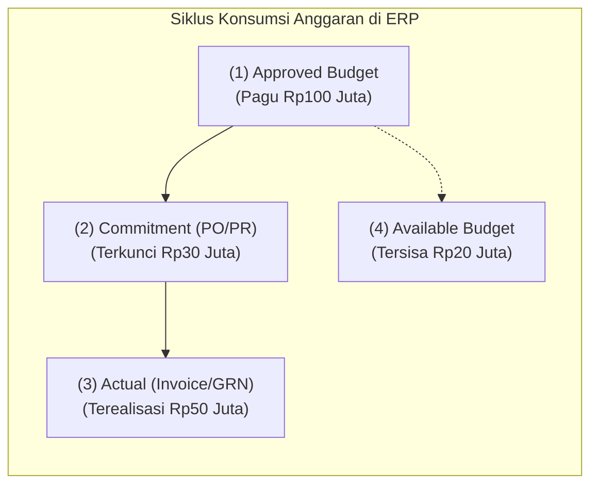
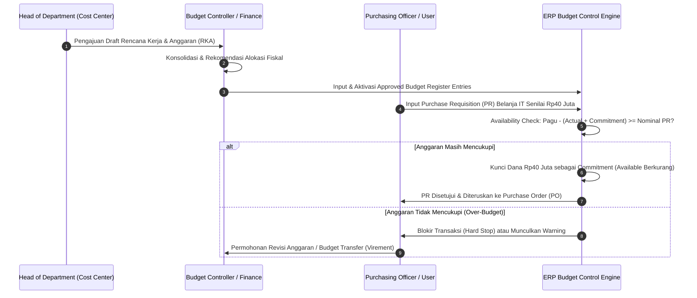

# Budget Management & Control

## Definition

**Budget Management & Control** dalam sistem ERP adalah modul tata kelola perencanaan keuangan kuantitatif yang menetapkan batas pagu pengeluaran (*spending limits*) dan target pendapatan untuk periode fiskal tertentu. Modul ini memantau dan mengontrol konsumsi anggaran secara *real-time* di setiap titik inisiasi transaksi operasional—mulai dari permintaan pembelian (*Purchase Requisition*), pemesanan barang (*Purchase Order*), hingga pengakuan beban (*Vendor Invoice / Expense*).

Secara konseptual, sistem kontrol anggaran ERP membedakan empat status nilai anggaran:

1. **Approved Budget (Anggaran Disetujui)**: Pagu dana resmi yang disahkan oleh manajemen puncak untuk periode tertentu.
2. **Commitment / Encumbrance (Komitmen / Keterikatan Dana)**: Porsi anggaran yang dicadangkan atau dikunci oleh dokumen operasional yang belum menjadi beban riil (misal PR atau PO yang belum diterbitkan fakturnya).
3. **Actual Expenditure (Realisasi Beban Riil)**: Beban akuntansi aktual yang telah dibukukan ke dalam buku besar (*General Ledger*) melalui faktur pembelian atau jurnal penyesuaian.
4. **Available Budget (Sisa Anggaran Tersedia)**: Kapasitas dana yang masih bebas untuk dibelanjakan sebelum mencapai plafon pagu.

Rumus baku ketersediaan anggaran pada ERP:

$$\text{Available Budget} = \text{Approved Budget} - \text{Actual Expenditure} - \text{Commitment / Encumbrance}$$

---

## Purpose

1. **Penegakan Disiplin Finansial (*Spending Discipline*)**: Mencegah pengeluaran liar atau pembelian berlebih yang melampaui kemampuan kas perusahaan.
2. **Deteksi Dini Pembengkakan Biaya (*Proactive Control*)**: Menghentikan atau memberi peringatan atas transaksi belanja di awal rantai pasok (pada saat PR atau PO dibuat), bukan menunggu setelah tagihan vendor tiba di akuntansi.
3. **Penyelarasan Strategis (*Strategic Alignment*)**: Memastikan alokasi sumber daya finansial terdistribusi sesuai prioritas korporat (membedakan anggaran *Operating Expenditure / OPEX* dan *Capital Expenditure / CAPEX*).
4. **Transparansi Akuntabilitas Departemen**: Menetapkan target dan batas tanggung jawab yang jelas kepada setiap manajer *Cost Center* atau manajer proyek.
5. **Pondasi Analisis Varian (*Variance Baseline*)**: Menyediakan angka pembanding standar untuk mengevaluasi efisiensi operasional pada laporan keuangan manajemen bulanan.

---

## Business Process

Siklus tata kelola dan kontrol anggaran dalam ERP mencakup alur berikut:

### 1. Formulasi dan Distribusi Anggaran (Preparation & Allocation)
- **Metode Penyusunan**: Dapat dilakukan secara *Top-Down* (manajemen menetapkan plafon per direktorat) atau *Bottom-Up* (tiap departemen mengajukan kebutuhan aktivitas dari bawah).
- **Dimensi Anggaran**: Anggaran dipetakan pada kombinasi dimensi akuntansi: `Tahun Fiskal` $\times$ `Cost Center` $\times$ `Financial Account` $\times$ `Project/Campaign`.
- **Distribusi Periode**: Anggaran tahunan dibagi ke dalam periode bulanan atau kuartalan secara merata (*even distribution*) atau berbasis pola musiman (*seasonality weights*).

### 2. Pemeriksaan Ketersediaan Anggaran (Budget Availability Check - AVC)
Ketika pengguna membuat transaksi operasional, mesin AVC ERP memvalidasi sisa anggaran:
- **Tingkat Kontrol (Control Severity)**:
  - **No Control**: Sistem hanya mencatat anggaran untuk kebutuhan pelaporan varian tanpa membatasi transaksi.
  - **Soft Control (Warning Only)**: Sistem menampilkan pesan peringatan bahwa transaksi melampaui pagu, namun tetap mengizinkan pengguna untuk memposting dokumen.
  - **Hard Control (Strict Blocking)**: Sistem menolak secara mutlak penyimpanan atau persetujuan dokumen jika sisa anggaran bernilai negatif.
- **Toleransi Anggaran (*Budget Tolerance*)**: Mengizinkan kelebihan belanja hingga persentase tertentu (misal toleransi 5% dengan persetujuan tambahan *Department Head*).

### 3. Pergeseran dan Revisi Anggaran (Budget Transfer & Revision)
- **Budget Transfer (Virement)**: Memindahkan alokasi pagu antar-akun atau antar-cost center dalam satu departemen tanpa mengubah total anggaran perusahaan.
- **Budget Revision / Supplement**: Penambahan pagu anggaran secara resmi yang disahkan oleh Direksi akibat perubahan target bisnis atau eskalasi biaya tak terduga.

---

## Business Rules

1. **Commitment Release Timing**: Komitmen anggaran (*commitment encumbrance*) pada Purchase Requisition wajib dilepas (*released*) saat PO diterbitkan, dan komitmen pada PO wajib ditransformasikan menjadi beban aktual (*actual expense*) saat penerimaan barang (*Goods Receipt*) atau penerimaan faktur (*Vendor Invoice*), agar tidak terjadi pencatatan komitmen ganda (*double commitment*).
2. **Non-Posting Budgetary Ledger**: Transaksi anggaran dan komitmen dicatat dalam buku besar statistik (*budgetary/statistical ledger*) yang terpisah dari buku besar umum (*General Ledger*), sehingga tidak mengubah angka pada neraca atau laporan laba rugi resmi.
3. **Strict Segregation on Budget Adjustments**: Manajer *Cost Center* dilarang menyetujui pemindahan atau penambahan anggaran (*budget revision*) untuk unit kerjanya sendiri tanpa persetujuan dari *Corporate Budget Committee* atau CFO.
4. **Year-End Budget Rollover Rule**: Sisa anggaran yang tidak terserap pada akhir tahun fiskal secara otomatis hangus (*lapsed*), kecuali untuk komitmen proyek modal (*CAPEX Commitment*) yang telah memiliki kontrak resmi dan disetujui untuk dialihkan ke tahun berikutnya (*budget carryforward*).
5. **Aggregation Level Control**: Kontrol anggaran dapat dikonfigurasikan pada tingkat akun individual (*Account Level*) atau pada tingkat kelompok akun ringkas (*Budget Category / Account Group*) untuk memberikan fleksibilitas manajerial.

---

## Accounting & Financial Impact

Meskipun transaksi anggaran tidak mengubah saldo buku besar komersial, pencatatan *Encumbrance Accounting* pada entitas korporasi tertentu atau instansi publik memiliki struktur jurnal statistik tersendiri.

### 1. Pembukuan Pagu Anggaran Resmi (Budget Register Entry)
Dicatat pada buku besar statistik:

| Buku / Ledger | Akun | Debit (IDR) | Kredit (IDR) | Keterangan |
| :--- | :--- | :--- | :--- | :--- |
| **Statistical Ledger** | `910100 - Budget Appropriation - IT Dept` | 200.000.000 | - | Hak pagu belanja IT tahun berjalan |
| **Statistical Ledger** | `910900 - Unallocated Budget Reserve` | - | 200.000.000 | Kontra akun alokasi anggaran |

### 2. Pencatatan Komitmen Saat Penerbitan Purchase Order (Encumbrance)
Ketika PO senilai Rp40.000.000 diterbitkan ke supplier:

| Buku / Ledger | Akun | Debit (IDR) | Kredit (IDR) | Keterangan |
| :--- | :--- | :--- | :--- | :--- |
| **Commitment Ledger** | `920100 - Encumbrance / PO Commitment` | 40.000.000 | - | Dana anggaran dikunci untuk pesanan IT |
| **Commitment Ledger** | `920900 - Reserve for Encumbrances` | - | 40.000.000 | Kontra komitmen keterikatan dana |

### 3. Pelepasan Komitmen & Pengakuan Beban Riil Saat Faktur Vendor Masuk
Saat tagihan vendor PT Sumber Teknologi diterima senilai Rp38.000.000:
1. **Commitment Ledger (Pelepasan Komitmen PO)**:
   - Debit: `Reserve for Encumbrances` Rp40.000.000
   - Kredit: `Encumbrance / PO Commitment` Rp40.000.000
2. **General Ledger (Pengakuan Beban Riil Akuntansi)**:
   - Debit: `610500 - IT Hardware & Software Expense` Rp38.000.000
   - Kredit: `211100 - Accounts Payable` Rp38.000.000

---

## Example: Siklus Kontrol Anggaran Departemen IT di PT Maju Bersama

Departemen IT PT Maju Bersama mengelola akun biaya `610500 - IT Maintenance & Hardware` pada Cost Center `CC-IT-01` untuk Tahun Fiskal 2026:

1. **Alokasi Pagu Anggaran Tahunan**:
   - Total Anggaran Disetujui (*Approved Budget*): **Rp200.000.000**.
   - Sistem menetapkan aturan: **Hard Control** dengan ambang batas peringatan pada 85% konsumsi.

2. **Perkembangan Transaksi Triwulan I**:
   - **Realisasi Aktual (*Actual Expenditure*)**: Pembelian server mikro dan lisensi software yang telah terbit fakturnya = **Rp110.000.000**.
   - **Komitmen Berjalan (*Commitment*)**: PO aktif untuk pengadaan kabel jaringan dan router yang belum dikirim supplier = **Rp40.000.000**.
   - **Total Konsumsi Anggaran**: Rp110.000.000 + Rp40.000.000 = **Rp150.000.000** (75% dari total pagu).
   - **Sisa Anggaran Tersedia (*Available Budget*)**: Rp200.000.000 - Rp150.000.000 = **Rp50.000.000**.

3. **Uji Kasus Transaksi Baru**:
   - Pada bulan April 2026, IT Manager mengajukan Purchase Requisition baru untuk pengadaan 10 unit UPS senilai **Rp65.000.000**.
   - **Eksekusi Mesin AVC ERP**:
     $$\text{Dibutuhkan: Rp65.000.000} > \text{Tersedia: Rp50.000.000} \implies \text{Defisit Anggaran: } -\text{Rp15.000.000}$$
   - Sistem secara otomatis menolak (*Hard Stop*) pengajuan PR tersebut dan memunculkan notifikasi kesalahan: *"Error: Budget Exceeded on Cost Center CC-IT-01 Account 610500. Available: Rp50.000.000, Requested: Rp65.000.000"*.
   - IT Manager harus mengajukan *Budget Transfer* dari pos anggaran pelatihan IT atau mengajukan revisi pagu ke CFO agar PR dapat diproses.

---

## ERP Implementation

Perbandingan kapabilitas kontrol anggaran pada berbagai software ERP:

| Parameter Kontrol | Odoo Enterprise | ERPNext | Microsoft Dynamics 365 | SAP S/4HANA Finance |
| :--- | :--- | :--- | :--- | :--- |
| **Struktur Master Data** | Menggunakan *Analytic Budget* & *Budgetary Positions* | Master *Budget* terhubung ke *Cost Center* / *Project* | Master *Budget models*, *Budget codes*, & *Register entries* | *Funds Management (PSM-FM)* & *Overhead Cost Controlling (CO-OM)* |
| **Tingkat Penegakan (Severity)** | Bersifat reporting analitis (memerlukan modul custom untuk hard stop) | Pilihan konfigurasi aksi: *Stop*, *Warn*, atau *Ignore* | Konfigurasi fleksibel: *Prevent transaction*, *Prevent with warning*, *Allow* | *Availability Control (AVC)* dengan matriks toleransi bertingkat |
| **Pelacakan Komitmen (Commitment)** | Terbatas pada modul PO analitis (versi standar tidak mengunci draft) | Melacak komitmen PO dan PR terbuka secara otomatis | *Purchase order encumbrance & pre-encumbrance accounting* | *Commitment Management* penuh pada tingkat PR, PO, dan Reservation |
| **Carryforward Akhir Tahun** | Duplikasi manual budget periode berikutnya | Pembuatan budget tahunan baru | Fitur otomatis *Process budget plan & Carryforward commitments* | Fitur standar *Closing Operations Carryforward (FMCA / KCFB)* |

---

## Naventra Consideration

Rancangan arsitektur modul Budget Management pada Naventra ERP:

1. **Inline Real-Time AVC Engine**: Pengecekan ketersediaan anggaran pada Naventra diintegrasikan langsung pada middleware transaksi (*transaction hook*) saat tombol *Submit* atau *Approve* ditekan pada formulir Purchase Requisition dan Purchase Order. Kueri ketersediaan dieksekusi secara instan dengan mengunci baris rekaman (*row-level locking*) untuk mencegah kondisi balapan (*race condition*) ketika dua staf memesan barang serentak pada pos anggaran yang sama.
2. **Encumbrance Lifecycle Table**: Naventra memelihara tabel relasional mandiri `budget_commitments` yang menyimpan status transisi saldo: `RESERVATION` (PR) $\rightarrow$ `COMMITTED` (PO) $\rightarrow$ `CONSUMED` (Vendor Invoice) $\rightarrow$ `RELEASED` (Pembatalan Dokumen).
3. **Configurable Tolerance Matrix**: Administrator sistem dapat menetapkan toleransi berbasis peran pengguna, misalnya: staf biasa memiliki toleransi 0% (hard stop mutlak), sedangkan Direktur Divisi dapat menyetujui toleransi pembengkakan hingga 10% dengan rekaman alasan bisnis yang wajib diisi.

---

## References

- Chartered Institute of Management Accountants (CIMA). *Official Terminology of Management Accounting*. CIMA Publishing.
- SAP SE. *Budget Management and Availability Control in SAP S/4HANA*. SAP Help Portal.
- Microsoft Corporation. *Budget control overview in Dynamics 365 Finance*. Microsoft Learn.
- Frappe Technologies. *Budgeting in ERPNext*. ERPNext Documentation.
- Odoo S.A. *Financial Budgets and Analytic Accounting*. Odoo Documentation.
