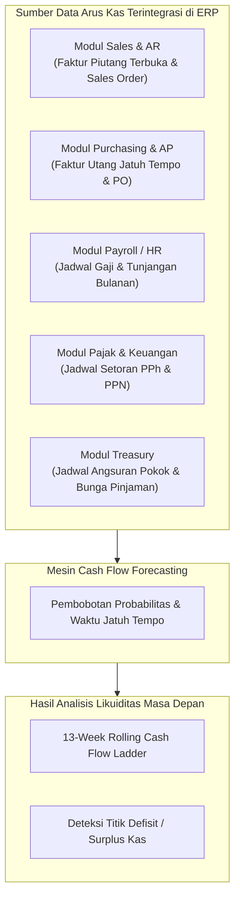
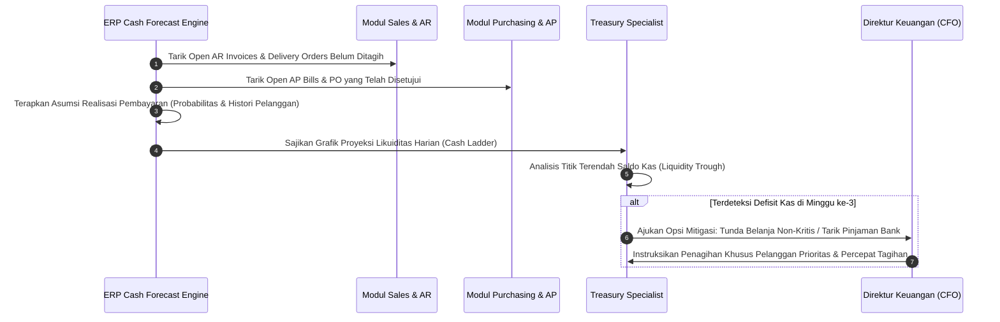
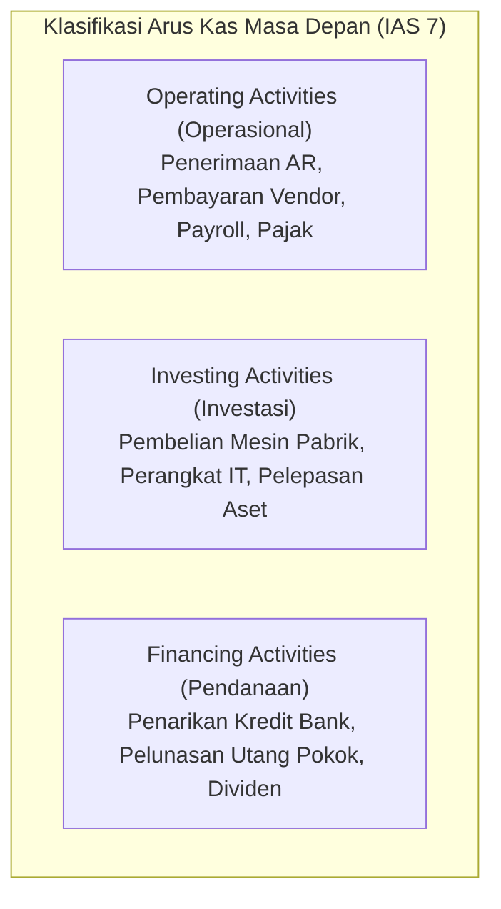

# Cash Flow Planning & Forecasting

## Definition

**Cash Flow Planning & Forecasting** dalam ERP adalah proses proyeksi dan pemantauan sistematis atas estimasi penerimaan kas (*cash inflows*) dan pengeluaran kas (*cash outflows*) organisasi pada rentang horizon waktu tertentu. Tujuannya adalah memprediksi posisi likuiditas masa depan, mengantisipasi defisit dana (*cash deficit/gap*), serta merencanakan penempatan kelebihan kas (*cash surplus*) sebelum peristiwa tersebut terjadi.

Berbeda dengan Laporan Arus Kas historis akuntansi yang disusun setelah periode berakhir ([[02-accounting/statement-of-cash-flows|Statement of Cash Flows di Phase 3]]), **Cash Flow Planning berorientasi ke masa depan (forward-looking)** dan mengintegrasikan data transaksi terbuka dari seluruh modul operasional ERP.

---

## Purpose

1. **Pencegahan Krisis Likuiditas (*Insolvency Prevention*)**: Mengidentifikasi potensi defisit kas mingguan berminggu-minggu sebelum terjadi, memberikan waktu bagi manajemen untuk menarik pinjaman jangka pendek atau menagih piutang macet.
2. **Optimalisasi Pengelolaan Modal Kerja (*Working Capital Optimization*)**: Menjadwalkan pengeluaran kas vendor secara presisi agar selaras dengan ritme penerimaan kas dari pelanggan.
3. **Penyusunan Rencana Investasi dan CAPEX**: Memastikan bahwa pembelian mesin pabrik atau ekspansi aset tetap hanya dieksekusi saat arus kas operasional mampu menopang pembayaran uang muka dan termin.
4. **Negosiasi Fasilitas Kredit Bank yang Kredibel**: Menyediakan laporan proyeksi arus kas formal (*13-Week Cash Flow Forecast*) yang menjadi prasyarat lembaga perbankan dalam menyetujui fasilitas cerukan (*overdraft*) atau *revolving credit*.
5. **Evaluasi Akurasi Peramalan (*Forecast Accuracy Tracking*)**: Mengukur deviasi antara proyeksi kas dan realisasi rekening koran bank guna meningkatkan kualitas estimasi manajemen.

---

## Business Process

Dalam praktiknya, peramalan arus kas di dalam ERP dikelola dalam tiga horizon waktu dengan tingkat granularitas yang berbeda:

| Parameter | Horizon Jangka Pendek (Short-Term) | Horizon Jangka Menengah (Medium-Term) | Horizon Jangka Panjang (Long-Term) |
| :--- | :--- | :--- | :--- |
| **Rentang Waktu** | 1 s.d. 30 Hari (atau *13-Week Cash Flow*) | 1 s.d. 12 Bulan Bergulir | 1 s.d. 5 Tahun |
| **Granularitas** | Harian atau Mingguan (*Daily/Weekly*) | Bulanan (*Monthly*) | Kuartalan atau Tahunan |
| **Metode Pendekatan** | **Metode Langsung (Direct Method)** berbasis dokumen transaksi terbuka | Campuran (*Direct & Indirect*) berbasis pipeline bisnis | **Metode Tidak Langsung (Indirect Method)** berbasis proyeksi P&L dan Neraca |
| **Sumber Data ERP** | Faktur AR/AP terbuka, jadwal payroll, jadwal pajak | Sales Order, PO komitmen, rencana produksi | Model strategis CAPEX, rencana pembiayaan modal |
| **Tingkat Kepastian** | Tinggi (Deterministik $\ge 90\%$) | Menengah (Probabilistik $60 - 80\%$) | Strategis / Estimasi Makro |

### 1. Metode Langsung (Direct Cash Forecasting)
Metode ini menjumlahkan secara langsung seluruh pos kas masuk dan kas keluar kasat mata:

$$\text{Projected Ending Cash} = \text{Opening Cash} + \sum (\text{Expected Inflows} \times P_{\text{in}}) - \sum (\text{Expected Outflows} \times P_{\text{out}})$$

Di mana $P$ adalah faktor probabilitas realisasi pembayaran:
- **Faktur Penjualan Terkonfirmasi**: Bobot 95% s.d. 100% pada tanggal jatuh tempo.
- **Sales Order Disetujui (Belum Kirim)**: Bobot 70% s.d. 80% pada estimasi tanggal faktur + syarat pembayaran.
- **Peluang Penjualan (CRM Pipeline)**: Bobot 20% s.d. 50% sesuai tahapan prospek.
- **Faktur Pembelian Vendor Terkonfirmasi**: Bobot 100% (komitmen pasti).
- **Gaji dan Beban Tetap**: Bobot 100% pada tanggal cut-off penggajian bulanan.

### 2. Evaluasi Varian Arus Kas (Variance Analysis)
Setiap akhir pekan, ERP membandingkan angka proyeksi minggu lalu dengan mutasi aktual rekening koran bank:

$$\text{Forecast Accuracy (\%)} = \left( 1 - \frac{|\text{Actual Cash Mutation} - \text{Forecasted Mutation}|}{\text{Actual Cash Mutation}} \right) \times 100\%$$

---

## Business Rules

1. **Safety Buffer Maintenance**: Proyeksi saldo kas akhir (*projected closing balance*) pada periode apa pun dilarang jatuh di bawah batas *Minimum Cash Reserve* yang ditetapkan oleh dewan komisaris/direksi.
2. **Behavioral Customer Payment Adjustment**: Tanggal arus kas masuk dari faktur penjualan tidak boleh hanya mengandalkan tanggal jatuh tempo formal (*due date*), melainkan wajib disesuaikan dengan rata-rata keterlambatan historis pelanggan (*Average Days Delinquent / Historic DSO Adjustment*).
3. **Mandatory Inclusion of Statutory Dates**: Seluruh tanggal pembayaran kewajiban regulasi (pembayaran PPN tanggal akhir bulan berikutnya, PPh 21 tanggal 15, BPJS Ketenagakerjaan tanggal 10) wajib dikunci secara otomatis sebagai arus kas keluar prioritas mutlak yang tidak dapat digeser tanggalnya.
4. **Intercompany Netting in Forecasting**: Dalam struktur multi-anak perusahaan, arus kas masuk dan keluar antar-entitas terafiliasi wajib dieliminasi (*netting*) pada konsolidasi kas grup untuk mencegah penggelembungan likuiditas semu.
5. **No Negative Cash Permitted**: Jika simulasi menghasilkan saldo kas negatif pada suatu hari, sistem wajib memunculkan peringatan kritis (*Critical Liquidity Deficit Alert*) dan menandai hari tersebut sebagai *Negative Cash Gap*.

---

## Accounting & Financial Impact

Sesuai klasifikasi standar **IAS 7**, perencanaan arus kas dikelompokkan ke dalam tiga pilar aktivitas:

Penyusunan proyeksi tidak mendebit atau mengkredit buku besar secara langsung, namun menjadi dasar eksekusi instrumen pembiayaan yang akan memicu pencatatan akuntansi.

---

## Example: Proyeksi Arus Kas 4 Minggu (13-Week Cash Ladder) di PT Maju Bersama

Treasury Specialist PT Maju Bersama menyusun prakiraan arus kas jangka pendek untuk 4 minggu ke depan (Maret - April 2026):

### 1. Posisi Kas Awal (Opening Cleared Cash): Rp100.000.000
Batas cadangan kas minimum yang ditetapkan manajemen: **Rp30.000.000**.

### 2. Matriks Proyeksi Arus Kas Mingguan (dalam Rupiah)

| Pos Arus Kas | Minggu 1 (24-28 Mar) | Minggu 2 (31 Mar - 4 Apr) | Minggu 3 (7-11 Apr) | Minggu 4 (14-18 Apr) |
| :--- | :--- | :--- | :--- | :--- |
| **Saldo Kas Awal** | **100.000.000** | **45.000.000** | **33.000.000** | **78.000.000** |
| **Arus Kas Masuk (Inflows)**: | | | | |
| Pelunasan AR PT Mitra Niaga (Faktur Laptop Pro) | 50.000.000 | 120.000.000 | 80.000.000 | 40.000.000 |
| Penerimaan Pelanggan Ritel Lainnya (Weighted) | 15.000.000 | 18.000.000 | 15.000.000 | 20.000.000 |
| **Total Inflows** | **65.000.000** | **138.000.000** | **95.000.000** | **60.000.000** |
| **Arus Kas Keluar (Outflows)**: | | | | |
| Pembayaran AP Vendor PT Sumber Teknologi | (70.000.000) | (85.000.000) | (20.000.000) | (35.000.000) |
| Pembayaran Vendor Logistik & Penunjang | (10.000.000) | (15.000.000) | (10.000.000) | (8.000.000) |
| Penggajian Karyawan & Upah Pabrik | (25.000.000) | 0 | 0 | 0 |
| Pembayaran Pajak Masa (PPN & PPh) | (15.000.000) | (50.000.000) | 0 | (12.000.000) |
| Cicilan Pokok Pinjaman Investasi Bank | 0 | 0 | (20.000.000) | 0 |
| **Total Outflows** | **(120.000.000)** | **(150.000.000)** | **(50.000.000)** | **(55.000.000)** |
| **Net Cash Movement** | **(55.000.000)** | **(12.000.000)** | **+45.000.000** | **+5.000.000** |
| **Saldo Kas Akhir Proyeksi** | **45.000.000** | **33.000.000** | **78.000.000** | **83.000.000** |

### 3. Analisis dan Tindakan Manajemen
- Pada **Minggu ke-2**, saldo kas akhir turun mendekati batas kritis pengaman (Rp33.000.000 vs batas minimum Rp30.000.000) akibat pembayaran pajak masa Rp50.000.000 dan tagihan supplier.
- Treasury Officer merekomendasikan:
  - Tim AR mengintensifkan tindak lanjut faktur PT Mitra Niaga agar pembayaran Rp120.000.000 di Minggu ke-2 tidak mengalami kemunduran kliring.
  - Jika terjadi keterlambatan dari PT Mitra Niaga, PT Maju Bersama telah menyiagakan fasilitas cerukan (*overdraft line*) sebesar Rp50.000.000 di Bank Mandiri untuk menjamin operasional tetap aman.

---

## ERP Implementation

Perbandingan fungsional modul Cash Flow Planning lintas sistem:

| Fitur Peramalan Kas | Odoo Enterprise | ERPNext | Microsoft Dynamics 365 | SAP S/4HANA Finance |
| :--- | :--- | :--- | :--- | :--- |
| **Metode Proyeksi** | Fitur *Cash Forecast* di modul Accounting (berbasis due date AR/AP) | Laporan *Cash Flow Forecast* berbasis transaksi dokumen terbuka | Modul *Cash flow forecasting* dengan dukungan *AI / Machine Learning* | *Cash Flow Analyzer* & *Liquidity Management (FSCM-CLM)* terpadu |
| **Pembobotan Probabilitas** | Tidak didukung secara native (asumsi 100% pada due date) | Field probabilitas pada transaksi peluang/pesanan | Parameter probabilitas penagihan berbasis histori pelanggan | *Planning Levels* & *Liquidity Certainty Classes* (pasti, terkonfirmasi, terencana) |
| **Horizon Waktu Fleksibel** | Tampilan harian/mingguan/bulanan interaktif | Filter rentang tanggal laporan tabel | Tampilan dinamis *13-Week Cash Flow Grid* | Pemodelan multidimensi fleksibel harian s.d. tahunan |
| **Integrasi Siklus Pembelian/Penjualan** | Menarik open invoice dan payment proposal | Menarik Sales Order, Purchase Order, dan Piutang/Utang | Menarik Purchase Requisition, PO, Sales Order, dan Invoice | Menarik seluruh rantai logistik (*MM/SD/PP/HR/TRM*) secara *real-time* |

---

## Naventra Consideration

Rancangan arsitektur mesin Cash Flow Planning pada Naventra ERP:

1. **Dynamic Cash Ladder Grid**: Antarmuka visual Naventra menyajikan *13-Week Rolling Cash Ladder* interaktif dengan kemampuan *drag-and-drop* penggeseran tanggal pembayaran tagihan untuk melihat simulasi dampak saldo akhir kas secara *real-time*.
2. **Machine-Learning Behavioral Due Date**: Sistem tidak hanya membaca tanggal *Due Date* statis pada faktur penjualan, melainkan menghitung *Predicted Collection Date* berdasarkan algoritma perilaku historis pembayaran masing-masing pelanggan (apakah pelanggan memiliki kebiasaan membayar tepat waktu, telat 7 hari, atau selalu menunggu batas akhir bulan).
3. **Threshold Breaching Webhook**: Jika proyeksi saldo kas pada hari kerja mana pun di masa depan diestimasi melanggar batas *Minimum Cash Policy*, Naventra secara otomatis memicu peringatan kritis via dashboard CFO dan mengirim notifikasi email ke komite likuiditas perusahaan.

---

## References

- International Accounting Standards Board (IASB). *IAS 7: Statement of Cash Flows*. IFRS Foundation.
- Association for Financial Professionals (AFP). *Treasury Management Body of Knowledge: Short-Term Cash Flow Forecasting*.
- SAP SE. *Cash Flow Analyzer in SAP S/4HANA Finance*. SAP Help Portal.
- Microsoft Corporation. *Cash flow forecasting overview in Dynamics 365 Finance*. Microsoft Learn.
- European Treasury Center. *Best Practices for 13-Week Cash Flow Forecasting*.
